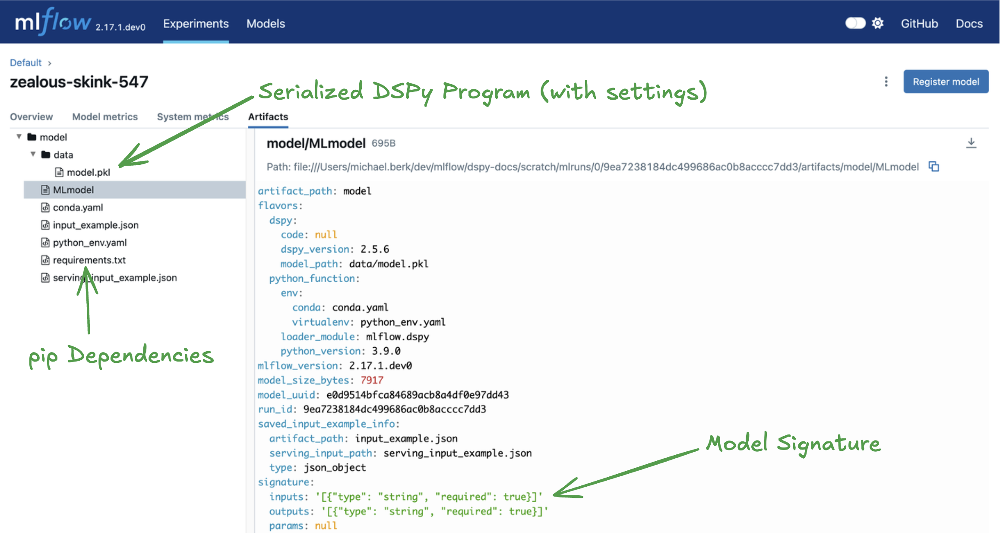

MLflow DSPy Flavor
========================

.. attention::
    The ``dspy`` flavor is under active development and is marked as Experimental. Public APIs are
    subject to change and new features may be added as the flavor evolves.

Introduction
------------

**DSPy** is a framework for algorithmically optimizing LM prompts and weights. It's designed to 
improve the process of prompt engineering by replacing hand-crafted prompt strings with modular 
components. These modules are concise, well-defined, and maintain high quality and expressive power, 
making prompt creation more efficient and scalable. By parameterizing these modules and treating 
prompting as an optimization problem, DSPy can adapt better to different language models, 
potentially outperforming prompts crafted by experts. This modularity also enables easier 
exploration of complex pipelines, allowing for fine-tuning performance based on specific tasks or 
nuanced metrics. 

.. figure:: ../../_static/images/llms/dspy/dspy-integration-architecture.png
    :alt: Overview of DSPy and MLflow integration
    :width: 70%
    :align: center

Why use DSPy with MLflow?
-------------------------------

The native integration of the DSPy library with MLflow helps users manage the development lifecycle with DSPy. The following are some of the key benefits of using DSPy with MLflow:

* `MLflow Tracking <../../tracking.html>`_ allows you to track your DSPy program's training and execution. With the MLflow APIs, you can log a variety of artifacts and organize training runs, thereby increasing visibility into your model performance.  
* `MLflow Model <../../models.html>`_ packages your compiled DSPy program with all its dependency versions, input and output interfaces, and other essential metadata. This allows you to deploy your compiled DSPy program with ease, knowing that the environment is consistent across different stages of the ML lifecycle.
* `MLflow Evaluate <../llm-evaluate/index.html>`_ provides native capabilities within MLflow to evaluate GenAI applications. This capability facilitates the efficient assessment of inference results from your DSPy compiled program, ensuring robust performance analytics and facilitating quick iterations.

Getting Started
---------------

In this introductory tutorial, you will learn the most fundamental components of DSPy and how to leverage the integration with MLflow to store, retrieve, and 
use an index. 

.. raw:: html

    <section>
        <article class="simple-grid">
            

                <a href="notebooks/dspy_quickstart.html">
                    

                        DSPy Quickstart
                    

                    

                        Get started with MLflow and DSPy by exploring the simplest possible configuration of a DSPy program.
                    

                </a>
            

        </article>
    </section>

.. toctree::
    :maxdepth: 2
    :hidden:

    notebooks/dspy_quickstart.ipynb

Concepts
--------

``Module``
^^^^^^^^^^
Components that handle specific text transformations, like answering questions or summarizing. They replace traditional hand-written prompts and can learn from examples, making them more adaptable.

``Signature``
^^^^^^^^^^^^^
A natural language description of a module's input and output behavior. For example, `"question -> answer"` specifies that the module should take a question as input and return an answer.

``Compiler`` 
^^^^^^^^^^^^
This is DSPy's optimization tool. It improves LM pipelines by adjusting modules to meet a performance metric, either by generating better prompts or fine-tuning models.

``Program``
^^^^^^^^^^^
A set of modules connected into a pipeline to perform complex tasks. DSPy programs are flexible, allowing you to optimize and adapt them using the compiler.

Usage
-----

.. toctree::
    :maxdepth: 2

Saving and Loading DSPy Program in MLflow Experiment
^^^^^^^^^^^^^^^^^^^^^^^^^^^^^^^^^^^^^^^^^^^^^^^^^^^^

Creating a DSPy Program
~~~~~~~~~~~~~~~~~~~~~~~

The [Module](https://dspy-docs.vercel.app/docs/building-blocks/modules) object is the centerpiece of
the DSPy and MLflow integration. With DSPy, you can create complex agentic logic via a module or 
set of modules.

.. code-block:: shell

    pip install mlflow dspy-ai -U
.. code-block:: python

    import dspy

    # Define our language model
    lm = dspy.LM(model="openai/gpt-4o-mini", max_tokens=250)
    dspy.settings.configure(lm=lm)

    # Define a Chain of Thought module
    class CoT(dspy.Module):
        def __init__(self):
            super().__init__()
            self.prog = dspy.ChainOfThought("question -> answer")

        def forward(self, question):
            return self.prog(question=question)

    dspy_model = CoT()

.. tip::

    Typically you'd want to leverage a compiled DSPy module. MLflow will natively supports logging
    both compiled and uncompiled DSPy modules. Above we show an uncompiled version for simplicity,
    but in production you'd want to leverage an [optimizer](https://dspy-docs.vercel.app/docs/building-blocks/optimizers)
    and log the outputted object instead.

Logging the Index to MLflow
~~~~~~~~~~~~~~~~~~~~~~~~~~~

You can log the ``dspy.Module`` object to the MLflow experiment using the 
:py:func:`mlflow.dspy.log_model` function.

We will also specify a model signature. An MLflow model signature defines the expected schema for 
model inputs and outputs, ensuring consistency and correctness during model inference. 

.. code-block:: python

    import mlflow
    from mlflow.models import ModelSignature
    from mlflow.types.schema import ColSpec, Schema

    # Define a model signature
    input_schema = Schema([ColSpec("string")])
    output_schema = Schema([ColSpec("string")])
    signature = ModelSignature(inputs=input_schema, outputs=output_schema)

    # Start an MLflow run
    with mlflow.start_run():
        # Log the model
        model_info = mlflow.dspy.log_model(
            dspy_model,
            artifact_path="model",
            input_example="what is 2 + 2?",
            signature=signature,
        )

Loading the Module for inference
~~~~~~~~~~~~~~~~~~~~~~~~~~~~~~~~
The saved module can be loaded back for inference using the :py:func:`mlflow.pyfunc.load_model` function. This function
gives an MLflow Python Model backed by the DSPy module.

.. code-block:: python

    import mlflow

    # Load the model as an MLflow PythonModel
    model = mlflow.pyfunc.load_model(model_info.model_uri)

    # Predict with the object
    response = model.predict("What kind of bear is best?")
    print(response)

.. code-block:: python 
    :caption: Output

    {
        'reasoning': '''The question "What kind of bear is best?" is often associated with a 
        humorous reference from the television show "The Office," where the character Jim 
        Halpert jokingly states, "Bears, beets, Battlestar Galactica." However, if we consider 
        the question seriously, it depends on the context. Different species of bears have 
        different characteristics and adaptations that make them "best" in various ways.
        For example, the American black bear is known for its adaptability, while the polar bear is 
        the largest land carnivore and is well adapted to its Arctic environment. Ultimately, the 
        answer can vary based on personal preference or specific criteria such as strength, 
        intelligence, or adaptability.''',
        'answer': '''There isn\'t a definitive answer, as it depends on the context. However, many 
        people humorously refer to the American black bear or the polar bear when discussing 
        "the best" kind of bear.'
    }

.. tip::

    To load the index itself back instead of the engine, use the :py:func:`mlflow.dspy.load_model` function.

    .. code-block:: python

        model = mlflow.dspy.load_model(model_uri)

FAQ
---

How can I save a compiled vs. uncompiled model?
^^^^^^^^^^^^^^^^^^^^^^^^^^^^^^^^^^^^^^^^^^^^^^^
TODO
* DSPy compiling effectively training the model, a variety of LLM parameters such as prompts, hyperparameters, and model weights are updated
* You can log both a compiled and uncompiled model - it doesn't matte to MLflow
* Pratically, you'll usually want to leverage a compiled model because it will theroetically perform better

What can be serialized by MLflow?
^^^^^^^^^^^^^^^^^^^^^^^^^^^^^^^^^
TODO
* When running a :py:func:`mlflow.dspy.log_model` or :py:func:`mlflow.dspy.save_model` command in MLflow, the DSPy program is serialized meaning it's saved to the tracking server as a file
* By wiritng to disk, we support easy productionzation
* On the backend, MLflow uses cloudpickle for the DSPy flavor
* Not all DSPy artifacts are seialiZABLE by MLflow
* Notable things that are serialized include: a pkl fil containing the DSPy program artifact, a MLflow model signature, pip dependencies, the DSPy settings (service context which is stored in the pkl file)
* Notable things that are not serialized include: API tokens (this should be set as environment variables and managed securely), the DSpy trace (it's only useful during training)

How is the DSPy ``settings`` object saved?
^^^^^^^^^^^^^^^^^^^^^^^^^^^^^^^^^^^^^^^^^^
TODO: check if tokens are dropped
* To ensure reproducibility of the program, we store the service context
* In short, we convert to a dict then pickle it with the model artifact
* All this is managed behind the scenes
