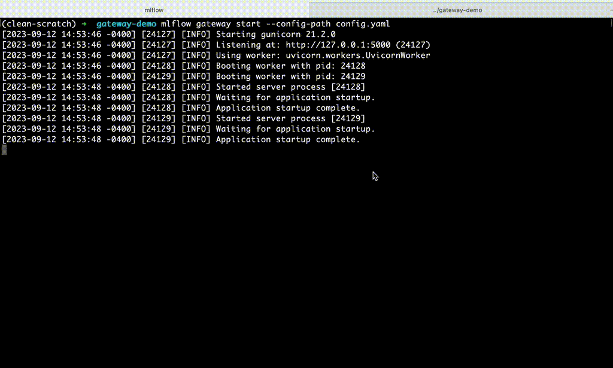

Querying routes in the AI Gateway
=================================
Now that the gateway is operational, it's time to send it some data. You can interact with the 
gateway using fluent APIs, the MLflowGatewayClient, or REST APIs. In this instance, we'll 
utilize the fluent APIs for simplicity.

Let's elaborate on the three types of supported models:

1. **Completions**: This type of model is used to generate predictions or suggestions based on the 
input provided, helping to "complete" a sequence or pattern.
   
2. **Chat**: These models facilitate interactive conversations, capable of understanding and responding 
to user inputs in a conversational manner.

3. **Embeddings**: Embedding models transform input data (like text or images) into a numerical vector 
space, where similar items are positioned closely in the space, facilitating various machine learning tasks.

In the following steps, we will explore how to query the gateway using these model types.

Setup
-----
First, import the necessary functions and define the gateway URI.

.. code-section::

    .. code-block:: python 
        :name: setup

        from mlflow.gateway import query, set_gateway_uri

        set_gateway_uri(gateway_uri="http://localhost:5000")

Example 1: Completions
----------------------
Completion models are designed to finish sentences or respond to prompts. 

To query these models via the MLflow AI Gateway, you need to provide a ``prompt`` parameter, 
which is the string the Language Model (LLM) will respond to. The gateway also accommodates 
various other parameters. For detailed information, please refer to the documentation.

.. code-section::

    .. code-block:: python 
        :name: completions

        route_name = "my_completions_route"
        data = dict(
            prompt="Name three potions or spells in harry potter that sound like an insult. Only show the names.",
            candidate_count=2,
            temperature=0.2,
            max_tokens=1000,
        )

        response = query(route_name, data)
        print(response)

.. figure:: ../../../_static/images/tutorials/gateway/creating-first-gateway/completions.gif
   :width: 60%
   :align: center
   :alt: Completions example.

Example 2: Chat
---------------
Chat models facilitate interactive conversations with users, gradually accumulating context over time.

Creating a chat payload is slightly more complex compared to the other model types since it accommodates an 
unlimited number of messages from three distinct personas: ``system``, ``user``, and ``assistant``. To set up 
a chat payload through the MLflow AI Gateway, you'll need to specify a ``messages`` parameter. This parameter 
takes a list of dictionaries formatted as follows:
   
   ``{"role": "system/user/assistant", "content": "user-specified content"}``

For further details, please consult the documentation.

.. code-section::

    .. code-block:: python 
        :name: chat

        route_name = "my_chat_route_gpt_3.5_turbo" 
        data = dict(
             messages=[
                {"role": "system", "content": "You are the sorting hat from harry potter."},
                {"role": "user", "content": "I am brave, hard-working, wise, and backstabbing."},
                {"role": "user", "content": "Which harry potter house am I most likely to belong to?"}
            ],
            candidate_count=3,
            temperature=.5,
        )

        response = query(route_name, data)
        print(response)

.. figure:: ../../../_static/images/tutorials/gateway/creating-first-gateway/chat.gif
   :width: 60%
   :align: center
   :alt: Chat example.

Example 3: Embeddings 
---------------------
Embedding models transform tokens into numerical vectors. 

To use embedding models via the MLflow AI Gateway, supply a `text` parameter, which can be a 
string or a list of strings. The gateway then processes these strings and returns their 
respective numerical vectors. Let's proceed with an example...

.. code-section::

    .. code-block:: python 
        :name: embeddings

        route_name = "my_embeddings_route"
        data = dict(
            text=[
               "Gryffindor: Values bravery, courage, and leadership.",
               "Hufflepuff: Known for loyalty, a strong work ethic, and a grounded nature.",
               "Ravenclaw: A house for individuals who value wisdom, intellect, and curiosity.",
               "Slytherin: Appreciates ambition, cunning, and resourcefulness."
            ],
        )

        response = chat_gateway_client.query(route_name, data)
        print(response)

And there you have it! You've successfully set up your first AI Gateway and served three OpenAI models.