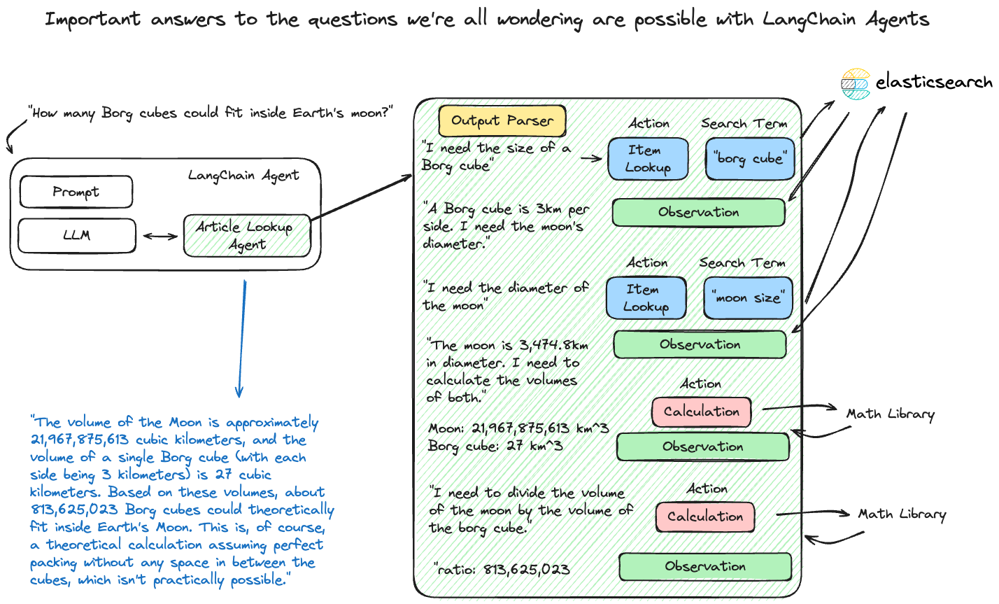

MLflow LangChain Flavor
=======================

.. attention::
    The ``langchain`` flavor is under active development and is marked as Experimental. Public APIs are 
    subject to change, and new features may be added as the flavor evolves.

Welcome to the developer guide for the integration of `LangChain <https://www.langchain.com/>`_ with MLflow. This guide serves as a comprehensive 
resource for understanding and leveraging the combined capabilities of LangChain and MLflow in developing advanced language model applications.

What is LangChain?
------------------
LangChain is a versatile framework designed for building applications powered by language models. It excels in creating context-aware applications 
that utilize language models for reasoning and generating responses, enabling the development of sophisticated NLP applications.

Supported Elements in MLflow LangChain Integration
--------------------------------------------------
- `LLMChain <https://python.langchain.com/docs/modules/chains/foundational/llm_chain>`_
- `Agents <https://python.langchain.com/docs/modules/agents/>`_
- `RetrievalQA <https://js.langchain.com/docs/modules/chains/popular/vector_db_qa>`_
- `Retrievers <https://python.langchain.com/docs/modules/data_connection/retrievers/>`_

.. warning::

   The Langchain's new chat interfaces such as `ChatOpenAI <https://python.langchain.com/docs/integrations/chat/openai>`_, `AzureChatOpenAI <https://python.langchain.com/docs/integrations/chat/azure_chat_openai>`_, are not supported in MLflow due to `a limitation <https://github.com/langchain-ai/langchain/issues/18420>`_ in deserialization. Please use the legacy counterparts for these models such as `langchain.llms.OpenAI <https://python.langchain.com/docs/integrations/llms/openai>`_, `langchain.llms.AzureOpenAI <https://python.langchain.com/docs/integrations/llms/azure_openai>`_, or create `a custom Pyfunc model <../custom-pyfunc-for-llms/index.html>`_.

Why use MLflow with LangChain?
------------------------------
Aside from the benefits of using MLflow for managing and deploying machine learning models, the integration of LangChain with MLflow provides a number of 
benefits that are associated with using LangChain within the broader MLflow ecosystem. 

- **MLflow Evaluate**: With the native capabilities within MLflow to evaluate language models, you can easily utilize automated evaluation algorithms on the results of your LangChain application's inference results. This integration facilitates the efficient assessment of inference results from your LangChain application, ensuring robust performance analytics.
- **Simplified Experimentation**: LangChain's flexibility in experimenting with various agents, tools, and retrievers becomes even more powerful when paired with MLflow. This combination allows for rapid experimentation and iteration. You can effortlessly compare runs, making it easier to refine models and accelerate the journey from development to production deployment.
- **Robust Dependency Management**: Deploy your LangChain application with confidence, leveraging MLflow's ability to manage and record all external dependencies. This ensures consistency between development and deployment environments, reducing deployment risks and simplifying the process.

Capabilities of LangChain and MLflow
------------------------------------
- **Efficient Development**: Streamline the development of NLP applications with LangChain's modular components and MLflow's robust tracking features.
- **Flexible Integration**: Leverage the versatility of LangChain within the MLflow ecosystem for a range of NLP tasks, from simple text generation to complex data retrieval and analysis.
- **Advanced Functionality**: Utilize LangChain's advanced features like context-aware reasoning and dynamic action selection in agents, all within MLflow's scalable platform.

Overview of Chains, Agents, and Retrievers
------------------------------------------
- **Chains**: Sequences of actions or steps hardcoded in code. Chains in LangChain combine various components like prompts, models, and output parsers to create a flow of processing steps.

The figure below shows an example of interfacing directly with a SaaS LLM via API calls with no context to the history of the conversation in the top portion. The 
bottom portion shows the same queries being submitted to a LangChain chain that incorporates a conversation history state such that the entire conversation's history 
is included with each subsequent input. Preserving conversational context in this manner is key to creating a "chat bot".

.. figure:: ../../_static/images/tutorials/llms/stateful-chains.png
    :alt: The importance of stateful storage of conversation history for chat applications
    :width: 90%
    :align: center

- **Agents**: Dynamic constructs that use language models to choose a sequence of actions. Unlike chains, agents decide the order of actions based on inputs, tools available, and intermediate outcomes.

- **Retrievers**: Components in RetrievalQA chains responsible for sourcing relevant documents or data. Retrievers are key in applications where LLMs need to reference specific external information for accurate responses.

.. figure:: ../../_static/images/tutorials/llms/langchain-retrievalqa.png
   :alt: MLflow LangChain RetrievalQA architecture
   :width: 80%
   :align: center

Getting Started with the MLflow LangChain Flavor - Tutorials and Guides
-----------------------------------------------------------------------

Introductory Tutorial
^^^^^^^^^^^^^^^^^^^^^

In this introductory tutorial, you will learn the most fundamental components of LangChain and how to leverage the integration with MLflow to store, retrieve, and 
use a chain. 

.. raw:: html

    <section>
        <article class="simple-grid">
            

                <a href="notebooks/langchain-quickstart.html">
                    

                        LangChain Quickstart
                    

                    

                        Get started with MLflow and LangChain by exploring the simplest possible chain configuration of a prompt and model chained to create 
                        a single-purpose utility application.
                    

                </a>
            

        </article>
    </section>

.. raw:: html

    <a href="https://raw.githubusercontent.com/mlflow/mlflow/master/docs/source/llms/langchain/notebooks/langchain-quickstart.ipynb" class="notebook-download-btn">Download the Introductory Notebook</a> 

Advanced Tutorials
^^^^^^^^^^^^^^^^^^

In these tutorials, you can learn about more complex usages of LangChain with MLflow. It is highly advised to read through the introductory tutorial prior to 
exploring these more advanced use cases. 

.. raw:: html

    <section>
        <article class="simple-grid">
            

                <a href="notebooks/langchain-agent.html">
                    

                        LangChain Agents
                    

                    

                        Learn how to build a LangChain agent that can query a web search engine and perform calculations based on complex questions using MLflow.
                    

                </a>
            

            

                <a href="notebooks/langchain-retriever.html">
                    

                        RAG tutorial with LangChain
                    

                    

                        Learn how to build a LangChain RAG with MLflow integration to answer highly specific questions about the legality of business ventures.
                    

                </a>
            

        </article>
    </section>

.. raw:: html

    <a href="https://raw.githubusercontent.com/mlflow/mlflow/master/docs/source/llms/langchain/notebooks/langchain-agent.ipynb" class="notebook-download-btn">Download the LangChain Agents Notebook</a> 
    <a href="https://raw.githubusercontent.com/mlflow/mlflow/master/docs/source/llms/langchain/notebooks/langchain-retriever.ipynb" class="notebook-download-btn">Download the LangChain Retriever Notebook</a> 

.. toctree::
    :maxdepth: 2
    :hidden:

    notebooks/langchain-quickstart.ipynb
    notebooks/langchain-agent.ipynb
    notebooks/langchain-retriever.ipynb

`Detailed Documentation <guide/index.html>`_
--------------------------------------------

To learn more about the details of the MLflow LangChain flavor, read the detailed guide below.

.. raw:: html

    <a href="guide/index.html" class="download-btn">View the Comprehensive Guide</a>

.. toctree::
    :maxdepth: 1
    :hidden:

    guide/index.rst

FAQ
---

I can't save my chain, agent, or retriever with MLflow.
^^^^^^^^^^^^^^^^^^^^^^^^^^^^^^^^^^^^^^^^^^^^^^^^^^^^^^^

- **Serialization Challenges with Cloudpickle**: Serialization with cloudpickle can encounter limitations depending on the complexity of the objects. 

    Some objects, especially those with intricate internal states or dependencies on external system resources, are not inherently pickleable. This limitation 
    arises because serialization essentially requires converting an object to a byte stream, which can be complex for objects tightly coupled with system states 
    or those having external I/O operations. Try upgrading PyDantic to 2.x version to resolve this issue.

- **Verifying Native Serialization Support**: Ensure that the langchain object (chain, agent, or retriever) is serializable natively using langchain APIs if saving or logging with MLflow doesn't work. 

    Due to their complex structures, not all langchain components are readily serializable. If native serialization 
    is not supported and MLflow doesn't support saving the model, you can file an issue `in the LangChain repository <https://github.com/langchain-ai/langchain/issues>`_ or 
    ask for guidance in the `LangChain Discussions board <https://github.com/langchain-ai/langchain/discussions>`_.

- **Keeping Up with New Features in MLflow**: MLflow might not immediately support the latest LangChain features immediately. 

    If a new feature is not supported in MLflow, consider `filing a feature request on the MLflow GitHub issues page <https://github.com/mlflow/mlflow/issues>`_. 

I'm getting an AttributeError when saving my model
^^^^^^^^^^^^^^^^^^^^^^^^^^^^^^^^^^^^^^^^^^^^^^^^^^

- **Handling Dependency Installation in LangChain and MLflow**: LangChain and MLflow do not automatically install all dependencies. 

    Other packages that might be required for specific agents, retrievers, or tools may need to be explicitly defined when saving or logging your model. 
    If your model relies on these external component libraries (particularly for tools) that not included in the standard LangChain package, these dependencies 
    will not be automatically logged as part of the model at all times (see below for guidance on how to include them).

- **Declaring Extra Dependencies**: Use the ``extra_pip_requirements`` parameter when saving and logging. 

    When saving or logging your model that contains external dependencies that are not part of the core langchain installation, you will need these additional 
    dependencies. The model flavor contains two options for declaring these dependencies: ``extra_pip_requirements`` and ``pip_requirements``. While specifying 
    ``pip_requirements`` is entirely valid, we recommend using ``extra_pip_requirements`` as it does not rely on defining all of the core dependent packages that 
    are required to use the langchain model for inference (the other core dependencies will be inferred automatically).

I can't load the model logged by mlflow langchain autologging
^^^^^^^^^^^^^^^^^^^^^^^^^^^^^^^^^^^^^^^^^^^^^^^^^^^^^^^^^^^^^

- **Model contains langchain retrievers**: LangChain retrievers are not supported by MLflow autologging. 

    If your model contains a retriever, you will need to manually log the model using the ``mlflow.langchain.log_model`` API.
    As loading those models requires specifying `loader_fn` and `persist_dir` parameters, please check examples in 
    `retriever_chain <https://github.com/mlflow/mlflow/blob/master/examples/langchain/retriever_chain.py>`_

- **Can't pickle certain objects**: Try manually log the model.

    For certain models that langchain does not support native saving/loading, we pickle the object and save it, while it requires cloudpickle version to be 
    consistent when saving/loading the model, as well as PyDantic version to be 2.x. Try manually log the model with ``mlflow.langchain.log_model`` API.
