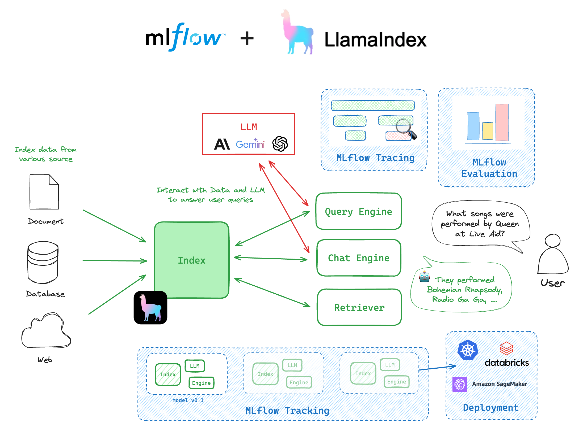
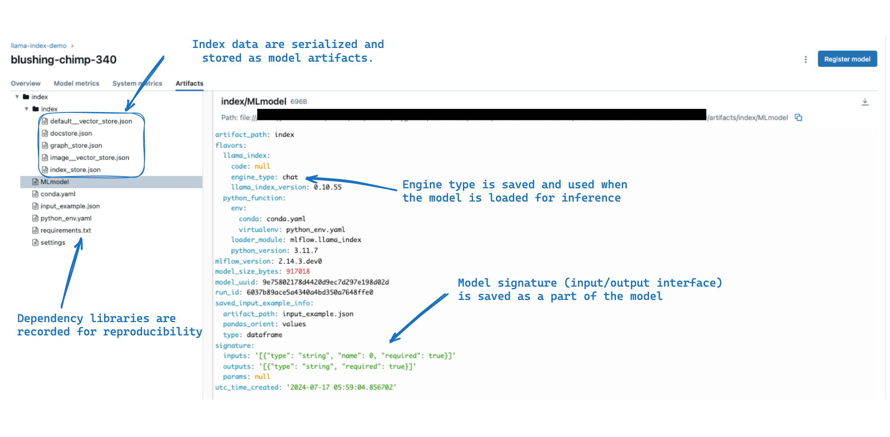
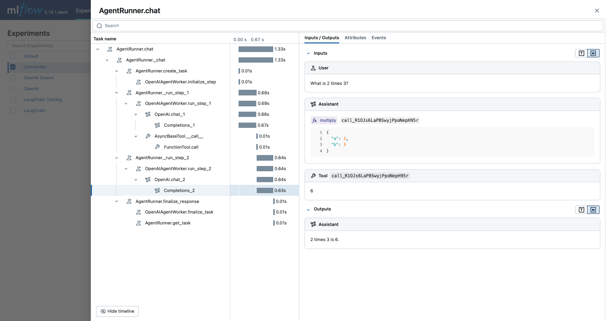

MLflow LlamaIndex Flavor
========================

.. attention::
    The ``llama_index`` flavor is under active development and is marked as Experimental. Public APIs are
    subject to change and new features may be added as the flavor evolves.

Introduction
------------

**LlamaIndex** 🦙 is a powerful data-centric framework designed to seamlessly connect custom data sources to large language models (LLMs).
It offers a comprehensive suite of data structures and tools that simplify the process of ingesting, structuring, and
accessing private or domain-specific data for use with LLMs. LlamaIndex excels in enabling context-aware AI applications
by providing efficient indexing and retrieval mechanisms, making it easier to build advanced QA systems, chatbots,
and other AI-driven applications that require integration of external knowledge.

Why use LlamaIndex with MLflow?
-------------------------------

The integration of the LlamaIndex library with MLflow provides a seamless experience for managing and deploying LlamaIndex engines. The following are some of the key benefits of using LlamaIndex with MLflow:

* `MLflow Tracking <../../tracking.html>`_ allows you to track your indices within MLflow and manage the many moving parts that comprise your LlamaIndex project, such as prompts, LLMs, retrievers, tools, global configurations, and more.

* `MLflow Model <../../models.html>`_ packages your LlamaIndex engine with all its dependency versions, input and output interfaces, and other essential metadata. This allows you to deploy your LlamaIndex engine with ease, knowing that the environment is consistent across different stages of the ML lifecycle.

* `MLflow Evaluate <../llm-evaluate/index.html>`_ provides native capabilities within MLflow to evaluate GenAI applications. This capability facilitates the efficient assessment of inference results from your LlamaIndex engine, ensuring robust performance analytics and facilitating quick iterations.

* `MLflow Tracing <../tracing/index.html>`_ is a powerful observability tool for monitoring and debugging what happens inside the LlamaIndex models, helping you identify potential bottlenecks or issues quickly. With its powerful automatic logging capability, you can instrument your LlamaIndex application without needing to add any code apart from running a single command.

Getting Started
---------------

In this introductory tutorial, you will learn the most fundamental components of LlamaIndex and how to leverage the integration with MLflow to store, retrieve, and 
use an index. 

.. raw:: html

    <section>
        <article class="simple-grid">
            

                <a href="notebooks/llama_index_quickstart.html">
                    

                        LlamaIndex Quickstart
                    

                    

                        Get started with MLflow and LlamaIndex by exploring the simplest possible index configuration of a VectorStoreIndex.
                    

                </a>
            

        </article>
    </section>

.. toctree::
    :maxdepth: 2
    :hidden:

    notebooks/llama_index_quickstart.ipynb

Concepts
--------

``Index``
^^^^^^^^^

The ``Index`` object is the core foundation in LlamaIndex. This object is a collection of documents that are indexed for fast information retrieval, providing capabilities for applications such as Retrieval-Augmented Generation (RAG) and Agents. The ``Index`` object can be logged directly to an MLflow run and loaded back for use as an inference engine.

``Engine``
^^^^^^^^^^

The ``Engine`` is a generic interface built on top of the ``Index`` object, which provides a set of APIs to interact with the index. LlamaIndex provides two types of engines: ``QueryEngine`` and ``ChatEngine``. The ``QueryEngine`` simply takes a single
query and returns a response based on the index. The ``ChatEngine`` is designed for conversational agents, which keeps track of the conversation history as well.

``Retriever``
^^^^^^^^^^^^^

The ``Retriever`` is a lower-level component built on top of the ``Index`` object. It is responsible for fetching the most relevant context given a user query (or chat message), and used as a building block for the ``ChatEngine`` and ``QueryEngine``. MLflow supports ``Retriever`` as a third engine type, which is useful for scenarios where you need more fine-grained control over the retrieval process in your application.

Usage
-----

.. toctree::
    :maxdepth: 2

Saving and Loading Index in MLflow Experiment
^^^^^^^^^^^^^^^^^^^^^^^^^^^^^^^^^^^^^^^^^^^^^

Creating an Index
~~~~~~~~~~~~~~~~~

The ``index`` object is the centerpiece of the LlamaIndex and MLflow integration. With LlamaIndex, you can create an index from a collection of documents or external vector stores. The following code creates a sample index from Paul Graham's essay data available within the LlamaIndex repository.

.. code-block:: shell

    mkdir -p data
    curl -L https://raw.githubusercontent.com/run-llama/llama_index/main/docs/docs/examples/data/paul_graham/paul_graham_essay.txt -o ./data/paul_graham_essay.txt

.. code-block:: python

    from llama_index.core import VectorStoreIndex, SimpleDirectoryReader

    documents = SimpleDirectoryReader("data").load_data()
    index = VectorStoreIndex.from_documents(documents)

.. note::

    Currently, MLflow LlamaIndex flavor only support logging and loading the index with the default in-memory vector store. The support for external vector stores such as ``FaissVectorStore`` and ``DatabricksVectorSearch`` will be added in future releases.

Logging the Index to MLflow
~~~~~~~~~~~~~~~~~~~~~~~~~~~

You can log the ``index`` object to the MLflow experiment using the :py:func:`mlflow.llama_index.log_model` function.

One key step here is to specify the ``engine_type`` parameter. The choice of engine type does not affect the index itself,
but dictates the interface of how you query the index when you load it back for inference.

1. QueryEngine (``engine_type="query"``) is designed for a simple query-response system that takes a single query string and returns a response.
2. ChatEngine (``engine_type="chat"``) is designed for a conversational agent that keeps track of the conversation history and responds to a user message.
3. Retriever (``engine_type="retriever"``) is a lower-level component that returns the top-k relevant documents matching the query.

The following code is an example of logging an index to MLflow with the ``chat`` engine type.

.. code-block:: python

    import mlflow

    mlflow.set_experiment("llama-index-demo")

    with mlflow.start_run():
        model_info = mlflow.llama_index.log_model(
            index,
            artifact_path="index",
            engine_type="chat",
            input_example="What did the author do growing up?",
        )

.. tip::

    Under the hood, MLflow calls ``as_query_engine()`` / ``as_chat_engine()`` / ``as_retriever()`` method on the index object to convert it to the respective engine instance.

Loading the Index Back for inference
~~~~~~~~~~~~~~~~~~~~~~~~~~~~~~~~~~~~

The saved index can be loaded back for inference using the :py:func:`mlflow.pyfunc.load_model` function. This function
gives an MLflow Python Model backed by the LlamaIndex engine, with the engine type specified during logging.

.. code-block:: python

    import mlflow

    model = mlflow.pyfunc.load_model(model_info.model_uri)

    response = model.predict("What was the first program the author wrote?")
    print(response)
    # >> The first program the author wrote was on the IBM 1401 ...

    # The chat engine keeps track of the conversation history
    response = model.predict("How did the author feel about it?")
    print(response)
    # >> The author felt puzzled by the first program ...

.. tip::

    To load the index itself back instead of the engine, use the :py:func:`mlflow.llama_index.load_model` function.

    .. code-block:: python

        index = mlflow.llama_index.load_model("runs:/<run_id>/index")

Enable Tracing
^^^^^^^^^^^^^^

You can enable tracing for your LlamaIndex code by calling the :py:func:`mlflow.llama_index.autolog` function. MLflow automatically logs the input and output of the LlamaIndex execution to the active MLflow experiment, providing you with a detailed view of the model's behavior.

.. code-block:: python

    import mlflow

    mlflow.llama_index.autolog()

    chat_engine = index.as_chat_engine()
    response = chat_engine.chat("What was the first program the author wrote?")

Then you can navigate to the MLflow UI, select the experiment, and open the "Traces" tab to find the logged trace for the prediction made by the engine. It is impressive to see how the chat engine coordinates and executes a number of tasks to answer your question!

You can disable tracing by running the same function with the ``disable`` parameter set to ``True``:

.. code-block:: python

    mlflow.llama_index.autolog(disable=True)

.. note::

    The tracing supports async prediction and streaming response, however, it does not
    support the combination of async and streaming, such as the ``astream_chat`` method.

FAQ
---

I have an index logged with ``query`` engine type. Can I load it back a ``chat`` engine?
^^^^^^^^^^^^^^^^^^^^^^^^^^^^^^^^^^^^^^^^^^^^^^^^^^^^^^^^^^^^^^^^^^^^^^^^^^^^^^^^^^^^^^^^

While it is not possible to update the engine type of the logged model in-place,
you can always load the index back and re-log it with the desired engine type. This process
does **not require re-creating the index**, so it is an efficient way to switch between
different engine types.

.. code-block:: python

    import mlflow

    # Log the index with the query engine type first
    with mlflow.start_run():
        model_info = mlflow.llama_index.log_model(
            index,
            artifact_path="index-query",
            engine_type="query",
        )

    # Load the index back and re-log it with the chat engine type
    index = mlflow.llama_index.load_model(model_info.model_uri)
    with mlflow.start_run():
        model_info = mlflow.llama_index.log_model(
            index,
            artifact_path="index-chat",
            # Specify the chat engine type this time
            engine_type="chat",
        )

Alternatively, you can leverage their standard inference APIs on the loaded LlamaIndex native index object, specifically:

* ``index.as_chat_engine().chat("hi")``
* ``index.as_query_engine().query("hi")``
* ``index.as_retriever().retrieve("hi")``

How to use different LLMs for inference with the loaded engine?
^^^^^^^^^^^^^^^^^^^^^^^^^^^^^^^^^^^^^^^^^^^^^^^^^^^^^^^^^^^^^^^

When saving the index to MLflow, it persists the global `Settings <https://docs.llamaindex.ai/en/stable/module_guides/supporting_modules/settings/>`_ object as a part of the model. This object contains settings such as LLM and embedding
models to be used by engines.

.. code-block:: python

    import mlflow
    from llama_index.core import Settings
    from llama_index.llms.openai import OpenAI

    Settings.llm = OpenAI("gpt-4o-mini")

    # MLflow saves GPT-4o-Mini as the LLM to use for inference
    with mlflow.start_run():
        model_info = mlflow.llama_index.log_model(
            index, artifact_path="index", engine_type="chat"
        )

Then later when you load the index back, the persisted settings are also applied globally. This means that the loaded engine will use the same LLM as when it was logged.

However, sometimes you may want to use a different LLM for inference. In such cases, you can update the global ``Settings`` object directly after loading the index.

.. code-block:: python

    import mlflow

    # Load the index back
    loaded_index = mlflow.llama_index.load_model(model_info.model_uri)

    assert Settings.llm.model == "gpt-4o-mini"

    # Update the settings to use GPT-4 instead
    Settings.llm = OpenAI("gpt-4")
    query_engine = loaded_index.as_query_engine()
    response = query_engine.query("What is the capital of France?")
