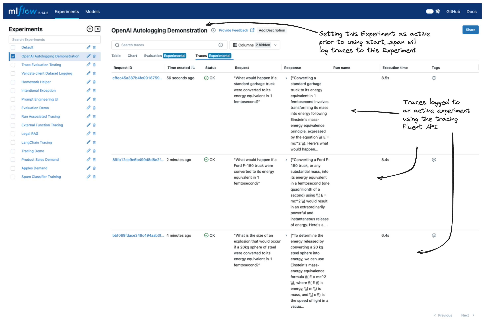

MLflow OpenAI Autologging
=========================

The OpenAI flavor for MLflow supports autologging to ensure that experimentation, testing, and validation of your ideas can be captured dynamically without 
having to wrap your code with logging boilerplate. 

In this guide, we'll discuss some of the key features that are available in the autologging feature. 

.. contents:: Table of Contents
    :local:
    :depth: 1

Quickstart
----------
To get started with MLflow's OpenAI autologging, you simply need to call :py:func:`mlflow.openai.autolog` at the beginning of your script or notebook. 
Enabling autologging with no argument overrides will behave as the ``default`` configuration in the table in the next section. Overriding any of these settings 
will allow you to log additional elements. 

.. tip::
    The only element that is **enabled by default** when autologging is activated is the recording of trace information. You can read more about MLflow tracing 
    `here <../tracing/index.html>`_. 

.. code-block:: python

    import os
    import openai
    import mlflow

    mlflow.openai.autolog()

    openai_client = openai.OpenAI(api_key=os.environ.get("OPENAI_API_KEY"))

    # Use the openai_client and traces will be logged to the active experiment
    ...

Configuration of OpenAI Autologging
-----------------------------------

MLflow OpenAI autologging can log various information about the model and its inference. **By default, only trace logging is enabled**, but you can enable 
autologging of other information by setting the corresponding parameters when calling :py:func:`mlflow.openai.autolog()`. 

The available options and their default values are shown below. To learn more about additional parameters, see the API documentation.

.. list-table::
    :widths: 20 20 30 30
    :header-rows: 1

    * - Target
      - Default
      - Parameter
      - Description
    * - Traces
      - ``true``
      - ``log_traces``
      - Whether to generate and log traces for the model. See `MLflow Tracing <../tracing/index.html>`_ for more details about the tracing feature.
    * - Model Artifacts
      - ``false``
      - ``log_models``
      - If set to ``True``, the OpenAI model will be logged when it is invoked. 
    * - Model Signatures
      - ``false``
      - ``log_model_signatures``
      - If set to ``True``, :py:class:`ModelSignatures <mlflow.models.ModelSignature>` describing model inputs and outputs are collected and logged along with OpenAI model artifacts during inference. This option is only available when ``log_models`` is enabled.
    * - Input Example
      - ``false``
      - ``log_input_examples``
      - If set to ``True``, input examples from inference data are collected and logged along with OpenAI model artifacts during inference. This option is only available when ``log_models`` is enabled.
    * - Datasets
      - ``false``
      - ``log_datasets``
      - If set to ``True`` and a dataset is used with interacting with the OpenAI model, information about the dataset will be logged.

For example, to disable logging of traces, and instead enable model logging, run the following code:

.. code-block:: python

    import mlflow

    mlflow.openai.autolog(
        log_traces=False,
        log_models=True,
    )

Example of using OpenAI Autologging
-----------------------------------

.. code-block:: python

    import os

    import mlflow
    import openai

    OPENAI_MODEL = "gpt-4o"
    TEMP = 0.95
    API_KEY = os.environ.get("OPENAI_API_KEY")
    EXPERIMENT_NAME = "OpenAI Autologging Demonstration"
    REGISTERED_MODEL_NAME = "openai-auto"
    MODEL_VERSION = 1

    mlflow.openai.autolog(
        log_input_examples=True,
        log_model_signatures=True,
        log_models=True,
        log_traces=True,
        registered_model_name=REGISTERED_MODEL_NAME,
    )

    mlflow.set_experiment(EXPERIMENT_NAME)

    openai_client = openai.OpenAI(api_key=API_KEY)

    messages = [
        {
            "role": "user",
            "content": "State that you are responding to a test and that you are alive.",
        }
    ]

    openai_client.chat.completions.create(
        model=OPENAI_MODEL,
        messages=messages,
        temperature=TEMP,
    )

Viewing the logged model and the trace used when invoking the OpenAI client within the UI can be seen in the image below:

.. figure:: ../../_static/images/tutorials/llms/openai-autolog.gif
    :alt: OpenAI Autologging artifacts and traces
    :width: 100%
    :align: center

The model can be loaded by using the ``models`` uri via the model that was logged and registered and interfaced with via the pyfunc API as shown below:

.. code-block:: python

    loaded_autologged_model = mlflow.pyfunc.load_model(f"models:/{REGISTERED_MODEL_NAME}/{MODEL_VERSION}")

    loaded_autologged_model.predict("How much relative time difference would occur between an astronaut travelling at 0.98c for 14 years "
                                    "as measured by an on-board clock on the spacecraft and humans on Earth, assuming constant speed?")

FAQ
---

How can I log all of my traces while developing?
^^^^^^^^^^^^^^^^^^^^^^^^^^^^^^^^^^^^^^^^^^^^^^^^

By setting an active experiment (it is not recommended to use the Default Experiment for this), you can use the high-level tracing fluent API
when working on an interface to OpenAI with a simple wrapper function:

.. code-block:: python

    def invoke_and_trace(content: str):
        with mlflow.start_span(name="Completions", span_type="LLM") as span:
            span.set_inputs(content)
            result = loaded_autologged_model.predict(content)
            span.set_outputs(result)
            return result

Using this function to pass in test inputs and have them logged to the Experiment is an effective means of keeping track of a history of 
development testing.

.. code-block:: python

    invoke_and_trace("What would happen if a standard trash truck were converted to its energy equivalent in 1 femtosecond?")

    invoke_and_trace("What would a space-based optical telescope be capable of with a primary mirror 200 meters in diameter?")

These additional logged traces to the active experiment can be seen in the MLflow UI, as shown below:

