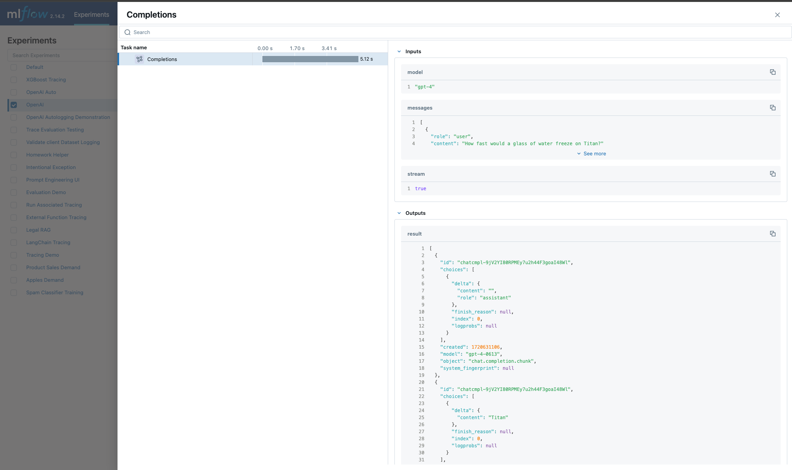

MLflow OpenAI Autologging
=========================

The OpenAI flavor for MLflow supports autologging to ensure that experimentation, testing, and validation of your ideas can be captured dynamically without 
having to wrap your code with logging boilerplate. 

.. attention::
    Autologging is **only supported** for versions of the OpenAI SDK that are 1.17 and higher.

MLflow autologging for the OpenAI SDK supports the following interfaces:

- **Chat Completions** via ``client.chat.completions.create()``
- **Completions** (legacy) via ``client.completions.create()``
- **Embeddings** via ``client.embeddings.create()``

Where ``client`` is an instance of ``openai.OpenAI()``.

In this guide, we'll discuss some of the key features that are available in the autologging feature. 

.. contents:: Table of Contents
    :local:
    :depth: 1

Quickstart
----------
To get started with MLflow's OpenAI autologging, you simply need to call :py:func:`mlflow.openai.autolog` at the beginning of your script or notebook. 
Enabling autologging with no argument overrides will behave as the ``default`` configuration in the table in the next section. Overriding any of these settings 
will allow you to log additional elements. 

.. tip::
    The only element that is **enabled by default** when autologging is activated is the recording of trace information. You can read more about MLflow tracing 
    `here <../tracing/index.html>`_. 

.. code-block:: python

    import os
    import openai
    import mlflow

    # Enables trace logging by default
    mlflow.openai.autolog()

    openai_client = openai.OpenAI()

    messages = [
        {
            "role": "user",
            "content": "What does turning something up to 11 refer to?",
        }
    ]

    # The input messages and the response will be logged as a trace to the active experiment
    answer = openai_client.chat.completions.create(
        model="gpt-4o",
        messages=messages,
        temperature=0.99,
    )

.. note::
    When using the OpenAI SDK, ensure that your access token is assigned to the environment variable ``OPENAI_API_KEY``.

Configuration of OpenAI Autologging
-----------------------------------

MLflow OpenAI autologging can log various information about the model and its inference. **By default, only trace logging is enabled**, but you can enable 
autologging of other information by setting the corresponding parameters when calling :py:func:`mlflow.openai.autolog()`. 

The available options and their default values are shown below. To learn more about additional parameters, see the API documentation.

.. list-table::
    :widths: 20 20 30 30
    :header-rows: 1

    * - Target
      - Default
      - Parameter
      - Description
    * - Traces
      - ``true``
      - ``log_traces``
      - Whether to generate and log traces for the model. See `MLflow Tracing <../tracing/index.html>`_ for more details about the tracing feature.
    * - Model Artifacts
      - ``false``
      - ``log_models``
      - If set to ``True``, the OpenAI model will be logged when it is invoked. 
    * - Model Signatures
      - ``false``
      - ``log_model_signatures``
      - If set to ``True``, :py:class:`ModelSignatures <mlflow.models.ModelSignature>` describing model inputs and outputs are collected and logged along with OpenAI model artifacts during inference. This option is only available when ``log_models`` is enabled.
    * - Input Example
      - ``false``
      - ``log_input_examples``
      - If set to ``True``, input examples from inference data are collected and logged along with OpenAI model artifacts during inference. This option is only available when ``log_models`` is enabled.

For example, to disable logging of traces, and instead enable model logging, run the following code:

.. code-block:: python

    import mlflow

    mlflow.openai.autolog(
        log_traces=False,
        log_models=True,
    )

Example of using OpenAI Autologging
-----------------------------------

.. code-block:: python

    import os

    import mlflow
    import openai

    API_KEY = os.environ.get("OPENAI_API_KEY")
    EXPERIMENT_NAME = "OpenAI Autologging Demonstration"
    REGISTERED_MODEL_NAME = "openai-auto"
    MODEL_VERSION = 1

    mlflow.openai.autolog(
        log_input_examples=True,
        log_model_signatures=True,
        log_models=True,
        log_traces=True,
        registered_model_name=REGISTERED_MODEL_NAME,
    )

    mlflow.set_experiment(EXPERIMENT_NAME)

    openai_client = openai.OpenAI(api_key=API_KEY)

    messages = [
        {
            "role": "user",
            "content": "State that you are responding to a test and that you are alive.",
        }
    ]

    openai_client.chat.completions.create(
        model="gpt-4o",
        messages=messages,
        temperature=0.95,
    )

Viewing the logged model and the trace used when invoking the OpenAI client within the UI can be seen in the image below:

.. figure:: ../../_static/images/tutorials/llms/openai-autolog.gif
    :alt: OpenAI Autologging artifacts and traces
    :width: 100%
    :align: center

The model can be loaded by using the ``models`` uri via the model that was logged and registered and interfaced with via the pyfunc API as shown below:

.. code-block:: python

    loaded_autologged_model = mlflow.pyfunc.load_model(
        f"models:/{REGISTERED_MODEL_NAME}/{MODEL_VERSION}"
    )

    loaded_autologged_model.predict(
        "How much relative time difference would occur between an astronaut travelling at 0.98c for 14 years "
        "as measured by an on-board clock on the spacecraft and humans on Earth, assuming constant speed?"
    )

FAQ
---

How can I manually log traces for the OpenAI SDK with MLflow?
^^^^^^^^^^^^^^^^^^^^^^^^^^^^^^^^^^^^^^^^^^^^^^^^^^^^^^^^^^^^^

By setting an active experiment (it is not recommended to use the Default Experiment for this), you can use the high-level tracing fluent API
when working on an interface to your model (whether you log the model or not) by utilizing the MLflow tracing fluent API. 

You can discover how to use the `fluent API here <../tracing/index.html#tracing-fluent-apis>`_.

If I'm using streaming for my OpenAI model, will autologging log the trace data correctly?
^^^^^^^^^^^^^^^^^^^^^^^^^^^^^^^^^^^^^^^^^^^^^^^^^^^^^^^^^^^^^^^^^^^^^^^^^^^^^^^^^^^^^^^^^^

Yes. For each of the MLflow-supported client interface types that have the ability to stream responses from OpenAI, autologging will record the 
iterator response chunks in the output. 

As an example:

.. code-block:: python

    import openai
    import mlflow

    mlflow.set_experiment("OpenAI")

    # Enable trace logging
    mlflow.openai.autolog()

    client = openai.OpenAI()

    stream = client.chat.completions.create(
        model="gpt-4o",
        messages=[
            {"role": "user", "content": "How fast would a glass of water freeze on Titan?"}
        ],
        stream=True,  # Stream response
    )
    for chunk in stream:
        print(chunk.choices[0].delta.content or "", end="")

Within the MLflow UI, the traces for a streaming model will be displayed as shown below:

.. note::

    OpenAI configurations that specify streaming responses are **not yet supported** for using the ``predict_stream()`` pyfunc invocation API in MLflow.
    However, you can still record streaming traces. When loading a the logged openai model as pyfunc via :py:func:`mlflow.pyfunc.load_model`, the only 
    available interface for inference is the synchronous blocking ``predict()`` API. 

Are asynchronous APIs supported in autologging?
^^^^^^^^^^^^^^^^^^^^^^^^^^^^^^^^^^^^^^^^^^^^^^^

The MLflow OpenAI autologging feature **does not support asynchronous APIs** for logging models or traces.

Saving your async implementation is best done by using the `models from code feature <../../models.html#models-from-code>`_.

If you would like to log trace events for an async OpenAI API, below is a simplified example of logging the trace for a streaming async request:

.. code-block:: python

    import openai
    import mlflow
    import asyncio

    # Activate an experiment for logging traces to
    mlflow.set_experiment("OpenAI")

    async def fetch_openai_response(messages, model="gpt-4o", temperature=0.99):
        """
        Asynchronously gets a response from the OpenAI API using the provided messages and streams the response.

        Args:
            messages (list): List of message dictionaries for the OpenAI API.
            model (str): The model to use for the OpenAI API. Default is "gpt-4o".
            temperature (float): The temperature to use for the OpenAI API. Default is 0.99.

        Returns:
            None
        """
        client = openai.AsyncOpenAI()

        # Create the response stream
        response_stream = await client.chat.completions.create(
            model=model,
            messages=messages,
            temperature=temperature,
            stream=True,
        )

        # Manually log traces using the tracing fluent API
        with mlflow.start_span() as trace:
            trace.set_inputs(messages)
            full_response = []

            async for chunk in response_stream:
                content = chunk.choices[0].delta.content
                if content is not None:
                    print(content, end="")
                    full_response.append(content)

            trace.set_outputs("".join(full_response))

    messages = [
        {
            "role": "user",
            "content": "How much additional hydrogen mass would Jupiter require to ignite a sustainable fusion cycle?",
        }
    ]

    await fetch_openai_response(messages)
