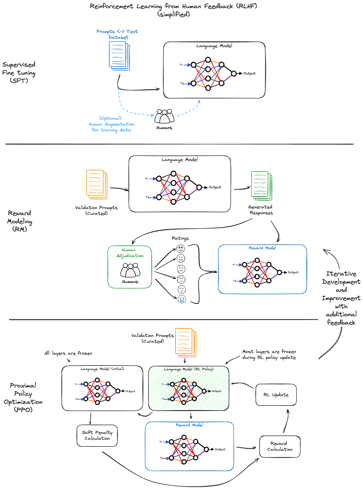

OpenAI within MLflow
====================

.. attention::
    The ``openai`` flavor is under active development and is marked as Experimental. Public APIs may change and new features are
    subject to be added as additional functionality is brought to the flavor.

Overview
--------
The integration of OpenAI's advanced language models within MLflow opens up new frontiers in creating and using NLP-based applications. It enables users to harness 
the cutting-edge capabilities of models like GPT-4 for varied tasks, ranging from conversational AI to complex text analysis 
and embeddings generation. This integration is a leap forward in making advanced NLP accessible and manageable within a robust framework like MLflow.

Beyond Simple Deployment: Building Powerful NLP Applications with OpenAI and MLflow
-----------------------------------------------------------------------------------
While the openai flavor within MLflow simplifies the logging and deployment of OpenAI models, its true potential lies in unlocking the full power of NLP 
applications. By seamlessly integrating with MLflow, you can:

Craft Task-Specific Services
^^^^^^^^^^^^^^^^^^^^^^^^^^^^

Raw access to a large language model doesn't guarantee a valuable service. While powerful, unprompted models can be overly general, leading to unintended 
outputs or inappropriate responses for the intent of the application. MLflow enables users to tailor models for specific tasks, achieving desired functionalities 
while ensuring context and control. 

This allows you to:

- **Define prompts and parameters**: Instead of relying on open-ended inputs, you can define specific prompts and parameters that guide the model's responses, focusing its capabilities on the desired task.
- **Save and deploy customized models**: The saved models, along with their prompts and parameters, can be easily deployed and shared, ensuring consistent behavior and performance.
- **Perform champion/challenger evaluations**: MLflow allows users to easily compare different prompts, parameters, and deployment configurations, facilitating the selection of the most effective model for a specific task.

Simplify Deployment and Comparison
^^^^^^^^^^^^^^^^^^^^^^^^^^^^^^^^^^

MLflow streamlines the deployment process, enabling you to:

- **Package and deploy models as applications**: The openai flavor simplifies model packaging, including prompts, configuration parameters, and inference parameters, into a single, portable artifact.
- **Compare different approaches**: With consistent packaging, you can easily compare different models, prompts, configurations, and deployment options, facilitating informed decision-making.
- **Leverage MLflow's ecosystem**: MLflow integrates with various tools and platforms, allowing users to deploy models on diverse environments, from cloud platforms to local servers.

Advanced Prompt Engineering and Version Tracking with MLflow and OpenAI: Unleashing the True Potential of LLMs
--------------------------------------------------------------------------------------------------------------

The integration of MLflow and OpenAI marks a paradigm shift in the field of prompt engineering for large language models (LLMs). While basic prompts can 
enable rudimentary functionalities, this powerful combination unlocks the full potential of LLMs, empowering developers and data scientists to meticulously 
craft and refine prompts, ushering in a new era of targeted and impactful applications.

Beyond the Basics: Embracing Iterative Experimentation
^^^^^^^^^^^^^^^^^^^^^^^^^^^^^^^^^^^^^^^^^^^^^^^^^^^^^^

Forget static prompts and limited applications! MLflow and OpenAI revolutionize the process by facilitating iterative experimentation through:

- **Tracking and Comparison**: MLflow logs and meticulously tracks every iteration of a prompt alongside its performance metrics. This allows for a granular comparison of different versions, enabling informed decisions and identification of the most effective prompts.
- **Version Control for Reproducible Experimentation**: Each prompt iteration is safely stored and version-controlled within MLflow. This allows for easy rollback and comparison, fostering experimentation and refinement while ensuring reproducibility, a crucial aspect of scientific advancement.
- **Flexible Parameterization**: MLflow enables control over which parameters are permitted to be modified at inference time, giving you the power to control creativity (temperature) and maximum token length (for cost).

Refining for Optimum Results: A/B Testing and Fine-Tuning
^^^^^^^^^^^^^^^^^^^^^^^^^^^^^^^^^^^^^^^^^^^^^^^^^^^^^^^^^

MLflow and OpenAI empower you to push the boundaries of LLM performance by:

- **A/B Testing for Optimal Prompt Selection**: Perform efficient A/B testing of different prompt variations and parameter configurations. This allows for the identification of the most effective combination for specific tasks and user profiles, leading to remarkable performance gains.
- **Tailoring Prompts for Desired Outcomes**: Iterative and organized experimentation allows you to focus on what makes the most sense for your applications. Whether you prioritize factual accuracy, creative expression, or conversational fluency, MLflow and OpenAI empower you to tailor prompts to optimize specific performance metrics. This ensures that your LLM applications deliver the desired results, time and time again.

Collaboration and Sharing: Fueling Innovation and Progress
^^^^^^^^^^^^^^^^^^^^^^^^^^^^^^^^^^^^^^^^^^^^^^^^^^^^^^^^^^

The power of MLflow and OpenAI extends beyond individual projects. By facilitating collaboration and sharing, they accelerate the advancement of LLM applications:

- **Shareable Artifacts for Collaborative Innovation**: MLflow packages prompts, parameters, model versions, and performance metrics into shareable artifacts. This enables researchers and developers to collaborate seamlessly, leveraging each other's insights and refined prompts to accelerate progress.

Leveraging MLflow for Optimized Prompt Engineering
^^^^^^^^^^^^^^^^^^^^^^^^^^^^^^^^^^^^^^^^^^^^^^^^^^
- **Iterative Improvement**: MLflow's tracking system supports an iterative approach to prompt engineering. By logging each experiment, users can incrementally refine their prompts, driving towards the most effective model interaction.
- **Collaborative Experimentation**: MLflow's collaborative features enable teams to share and discuss prompt versions and experiment results, fostering a collaborative environment for prompt development.

Real-World Impact
^^^^^^^^^^^^^^^^^
In real-world applications, the ability to track and refine prompts using MLflow and OpenAI leads to more accurate, reliable, and efficient language model 
implementations. Whether in customer service chatbots, content generation, or complex decision support systems, the meticulous management of prompts 
and model versions directly translates to enhanced performance and user experience.

This integration not only simplifies the complexities of working with advanced LLMs but also opens up new avenues for innovation in NLP applications, 
ensuring that each prompt-driven interaction is as effective and impactful as possible.

Direct OpenAI Service Usage
---------------------------
Direct usage of OpenAI's service through MLflow allows for seamless interaction with the latest GPT models for a variety of NLP tasks.

.. literalinclude:: ../../../../../examples/openai/chat_completions.py
    :language: python

Azure OpenAI Service Integration
--------------------------------
The ``openai`` flavor supports logging models that use the `Azure OpenAI Service <https://azure.microsoft.com/en-us/products/ai-services/openai-service>`_. 
There are a few notable differences between the Azure OpenAI Service and the OpenAI Service that need to be considered when logging models that target Azure endpoints. 

Environment Configuration for Azure Integration
^^^^^^^^^^^^^^^^^^^^^^^^^^^^^^^^^^^^^^^^^^^^^^^
To successfully log a model targeting Azure OpenAI Service, specific environment variables are essential for authentication and functionality.

.. note::
    The following environment variables contain **highly sensitive access keys**. Ensure that you do not commit these values to source control or declare them in an interactive 
    environment. Environment variables should be set from within your terminal via an ``export`` command, an addition to your user profile configurations (i.e., .bashrc or .zshrc), 
    or set through your IDE's environment variable configuration. Please do not leak your credentials.

- **OPENAI_API_KEY**: The API key for the Azure OpenAI Service. This can be found in the Azure Portal under the "Keys and Endpoint" section of the "Keys and Endpoint" tab. You can use either ``KEY1`` or ``KEY2``.
- **OPENAI_API_BASE**: The base endpoint for your Azure OpenAI resource (e.g., ``https://<your-service-name>.openai.azure.com/``). Within the Azure OpenAI documentation and guides, this key is referred to as ``AZURE_OPENAI_ENDPOINT`` or simply ``ENDPOINT``.
- **OPENAI_API_VERSION**: The API version to use for the Azure OpenAI Service. More information can be found in the `Azure OpenAI documentation <https://learn.microsoft.com/en-us/azure/ai-services/openai/reference>`_, including up-to-date lists of supported versions.
- **OPENAI_API_TYPE**: If using Azure OpenAI endpoints, this value should be set to ``"azure"``.
- **OPENAI_DEPLOYMENT_NAME**: The deployment name that you chose when you deployed the model in Azure. To learn more, visit the `Azure OpenAI deployment documentation <https://learn.microsoft.com/en-us/azure/ai-services/openai/how-to/create-resource?pivots=web-portal>`_.

Azure OpenAI Service in MLflow
^^^^^^^^^^^^^^^^^^^^^^^^^^^^^^
Integrating Azure OpenAI models within MLflow follows similar procedures to direct OpenAI service usage, with additional Azure-specific configurations.

.. literalinclude:: ../../../../../examples/openai/azure_openai.py
    :language: python

OpenAI Autologging
------------------

.. attention::
    Autologging is only supported for OpenAI >= 1.17.

To learn more about autologging support for the OpenAI flavor, please `see the autologging guide <../autologging.html>`_.

For more examples, please click `here <https://github.com/mlflow/mlflow/blob/master/examples/openai/autologging>`_.

Next Steps in Your NLP Journey
------------------------------
We invite you to harness the combined power of MLflow and OpenAI for developing innovative NLP applications. Whether it's creating interactive 
AI-driven platforms, enhancing data analysis with deep NLP insights, or exploring new frontiers in AI, this integration serves as a robust foundation 
for your explorations

Supplementary Learnings
-----------------------
If you're a bit curious about what really sets apart OpenAI's GPT models from other language models, we've included a brief (and heavily simplified) overview of 
their training process below.
This is but one small aspect of why they're so good and capable of responding in such a human-like manner, but it's a fascintating insight into how different the 
fine-tuning process is for these models as compared to the more familiar process of traditional supervised machine learning.

RLHF in GPT Models
^^^^^^^^^^^^^^^^^^
One of the defining features of OpenAI's GPT models is their training process, particularly the use of Reinforcement Learning from Human Feedback 
(RLHF). This methodology sets GPT models apart from traditional language models in several ways (although they are not the only organization to use this 
strategy, it is a key process component that greatly helps to enhance the quality of their services).

The RLHF Process
""""""""""""""""
1. **Supervised Fine-Tuning (SFT)**: Initially, GPT models undergo supervised fine-tuning using a large dataset of text. This process imparts the basic understanding of language and context.

2. **Reward Modeling (RM)**: Human trainers review the model's outputs and rate them based on criteria such as relevance, accuracy, and safety. This feedback is used to create a 'reward model'—a system that evaluates the quality of the model's responses.

3. **Proximal Policy Optimization (PPO)**: In this stage, the model is trained using reinforcement learning techniques, guided by the reward model. The model learns to generate responses that are more aligned with the values and preferences as judged by human trainers.

4. **Iterative Improvement**: The model undergoes continuous refinement through human feedback, ensuring that it evolves and adapts to produce responses that are aligned with the feedback preferences provided by the human reviewers.

Why RLHF Matters
""""""""""""""""
- **Human-Like Responses**: RLHF enables GPT models to generate responses that closely mimic human thought processes, making them more relatable and effective in practical applications.
- **Safety and Relevance**: Through human feedback, GPT models learn to avoid generating harmful or irrelevant content, thereby increasing their reliability and applicability.
- **Cost-Effective Training**: RLHF allows for more efficient and cost-effective training compared to extensively curating the training dataset to ensure that only desired outputs are generated.

   Simplified overview of RLHF
