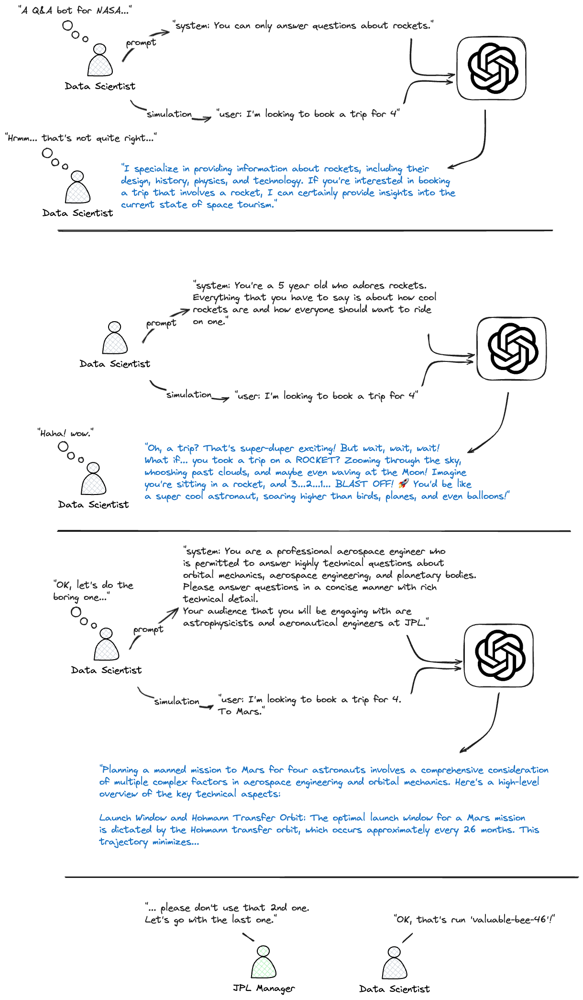
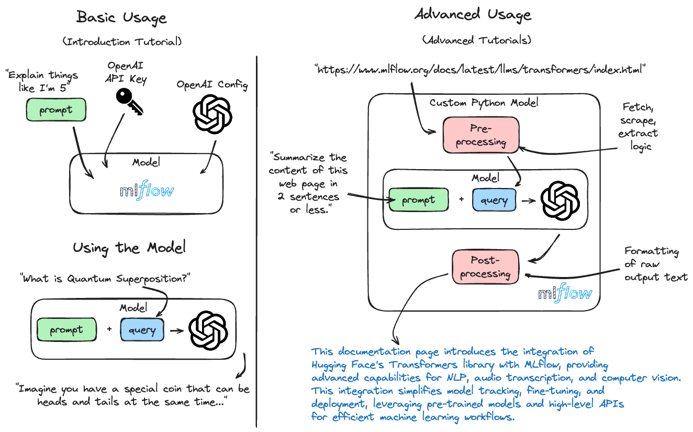

MLflow OpenAI Flavor
====================

.. attention::
    The ``openai`` flavor is under active development and is marked as Experimental. Public APIs are 
    subject to change, and new features may be added as the flavor evolves.

Introduction
------------

**OpenAI's GPT Models** represent a significant leap in natural language processing (NLP) capabilities. 
The Generative Pre-trained Transformer (GPT) models are renowned for 
their ability to generate human-like text, comprehend complex queries, summarize extensive documents, 
and much more. `OpenAI <https://openai.com/>`_ has been at the forefront of NLP technology, offering models that are 
versatile and widely applicable in various domains.

Leveraging MLflow's robust experiment tracking and model management framework, the integration with 
OpenAI's `GPT-based models <https://platform.openai.com/docs/models>`_ enables practitioners to efficiently utilize these advanced NLP tools in their 
projects. From simple text generation to complex conversational AI applications, the MLflow-OpenAI 
integration brings a new level of ease and effectiveness to managing these powerful models.

The integration includes:

- **Text Analysis and Generation**: Utilizing models like GPT-3.5 and GPT-4 for diverse text-related tasks.
- **Conversational AI**: Exploring the capabilities of the Chat Completions API for interactive, context-aware applications.
- **Embeddings Generation**: Corpus and text embeddings generation capabilities for advanced document retrieval use cases.

Autologging Support for the OpenAI integration
----------------------------------------------

.. toctree::
    :maxdepth: 2
    :hidden:

    ./autologging

If you'd like to learn more about autologging support for OpenAI within MLflow, please visit the `OpenAI Autologging <autologging.html>`_ page.

Tracing with the OpenAI flavor
------------------------------

MLflow's OpenAI flavor includes an integrated automated tracing feature with the use of the :py:func:`mlflow.openai.autolog` API. To learn more about 
how to log your development usage of the OpenAI SDK, please visit the `guide to autologging tracing <../tracing/index.html#automatic-tracing>`_ for this flavor.

What makes this Integration so Special?
---------------------------------------
The combination of MLflow's experiment tracking and model management with OpenAI's cutting-edge NLP models unlocks new potential for AI applications. 
This MLflow flavor for OpenAI simplifies the process of:

- **Developing** an application that leverages the power of OpenAI's models. By simplifying the process of keeping track of the highly iterative and creative process of prompt engineering, `MLflow prompt engineering <../prompt-engineering/index.html>`_ makes sure that you never lose track of a great idea.
- **Auditing and Reviewing** your most promising experiments. The `MLflow tracking service <../../tracking.html>`_ means that you can easily share the results of your work and get peer review of your work.
- **Customizing** the interface to your application. Whether you want to allow creative control with exposing parameters such as `temperature` or to relax cost controls by exposing `max_tokens`, MLflow allows you to configure default values and restrict the ability to modify the parameters used for inference.
- **Tagging and annotating** particular runs with `tags <../../tracking/tracking-api.html#adding-tags-to-runs>`_ during the iterative prompt engineering phase to flag particularly promising ideas that you and others can revisit later for inspiration, further testing, or deployment.

The Elephant in the Room: Prompt Engineering
^^^^^^^^^^^^^^^^^^^^^^^^^^^^^^^^^^^^^^^^^^^^

In other fields of applied ML, the process of iterating over hypotheses is time-consuming, tedious, and lends itself to developing habits of meticulously 
recording every step of the feature refinement and training process. With the advent of generative AI and the latent power of state-of-the-art LLMs such as 
those offered by OpenAI, the process of refining the performance of a solution is much shorter. In the span of an hour, you could easily craft and test 
a dozen prompts. 

While this speed and ease of use is remarkably empowering, it generally leads to the dreaded realization after a few hours of experimentation that you can't 
remember which of the dozens of prompts that you created hours ago was the one that created the best results that you remember seeing.

This is where MLflow comes in. With MLflow, you can easily track the prompts that you use, the results that you get, and the artifacts that you generate. 

The figure below shows a fun take on this problem that MLflow helps to solve.

   Prompt Engineering for space flight with MLflow

By logging each of the prompts that are used throughout testing, not only can you easily reproduce the results that you get, but you can also share those 
results with others so that they can evaluate the subjective quality of the results. Without tracking in place, you're forced to come up with a solution for 
recording the various parameters, prompts, test inputs, and results. 

You could save all of that time and effort by using MLflow with OpenAI, giving you more time to come up with fun prompts. 

Features
--------

With the MLflow OpenAI flavor, users can:

- **Save** and **log** applications using OpenAI models within MLflow using :py:func:`mlflow.openai.save_model` and :py:func:`mlflow.openai.log_model`.
- Seamlessly track detailed experiments, including **parameters**, **prompts**, and **artifacts** associated with model runs.
- `Deploy <../../deployment/index.html>`_ OpenAI models for various NLP applications with ease.
- Utilize :py:class:`mlflow.pyfunc.PythonModel` for flexible Python function inference, enabling custom and innovative ML solutions.

What can you do with OpenAI and MLflow?
^^^^^^^^^^^^^^^^^^^^^^^^^^^^^^^^^^^^^^^

The integration of OpenAI's advanced NLP models with MLflow's robust model management capabilities opens up a vast array of potential real-world applications. Here are some powerful and impactful use cases:

- **Automated Customer Support**: Develop sophisticated chatbots that understand and respond to customer inquiries in a human-like manner, significantly improving customer service efficiency and satisfaction.
  
- **Content Generation and Curation**: Automatically generate high-quality, contextually relevant content for articles, blogs, or social media posts. Curate content by summarizing and categorizing large volumes of text data, enhancing content management strategies.
  
- **Language Translation Services**: Create advanced translation tools that not only convert text from one language to another but also capture nuances, idioms, and cultural context, bridging communication gaps more effectively.
  
- **Sentiment Analysis for Market Research**: Analyze customer feedback, social media posts, or product reviews to gauge public sentiment about brands, products, or services, providing valuable insights for marketing and product development teams.
  
- **Personalized Education and Training Tools**: Develop AI-driven educational platforms that can adapt content and teaching styles to individual learning preferences, making education more engaging and effective.
  
- **Legal and Compliance Document Analysis**: Automate the review and analysis of legal documents, contracts, and compliance materials, increasing accuracy and reducing the time and resources required for legal workflows.
  
- **Healthcare Assistance and Research**: Assist in medical research by summarizing and analyzing medical literature, patient records, or clinical trial data, contributing to faster and more informed decision-making in healthcare.
  
- **Financial Analysis and Forecasting**: Leverage NLP models to analyze financial reports, market trends, and news articles, providing deeper insights and predictions for investment strategies and economic forecasting.

With MLflow's integration, these applications not only benefit from the linguistic prowess of OpenAI's models but also gain from streamlined `tracking <../../tracking.html>`_, `version control <../../model-registry.html>`_, and `deployment <../../deployment/index.html>`_ processes. This synergy empowers developers and businesses to build sophisticated, AI-driven solutions that address complex challenges and create new opportunities in various industries.

Deployment Made Easy
^^^^^^^^^^^^^^^^^^^^

Deploying OpenAI models becomes a breeze with MLflow. Functions like :py:func:`mlflow.openai.load_model` and :py:func:`mlflow.pyfunc.load_model` facilitate easy model serving. 
Discover more about `deploying models with MLflow <../../deployment/index.html>`_, explore the `deployments API <../../cli.html#mlflow-deployments>`_, 
and learn about `starting a local model serving endpoint <../../cli.html#mlflow-models-serve>`_ to fully leverage the deployment capabilities of MLflow.

Getting Started with the MLflow OpenAI Flavor - Tutorials and Guides
--------------------------------------------------------------------

Below, you will find a number of guides that focus on different ways that you can leverage the power of the `openai` library, leveraging MLflow's 
APIs for tracking and inference capabilities. 

The diagram below shows the basic scope of the level of complexity that the tutorials cover. 

   The range of content within the tutorials for the OpenAI flavor

.. toctree::
    :maxdepth: 2
    :hidden:

    notebooks/openai-quickstart.ipynb
    notebooks/openai-chat-completions.ipynb
    notebooks/openai-code-helper.ipynb
    notebooks/openai-embeddings-generation.ipynb

Introductory Tutorial
^^^^^^^^^^^^^^^^^^^^^

.. raw:: html

    <section>
        <article class="simple-grid">
            

                <a href="notebooks/openai-quickstart.html">
                    

                        OpenAI Quickstart
                    

                    

                        Learn the very basics of using the OpenAI package with MLflow with some simple prompt engineering and a fun use case to get 
                        started with this powerful integration.
                    

                </a>
            

        </article>
    </section>

Advanced Tutorials
^^^^^^^^^^^^^^^^^^

In these tutorials, the topics cover applied interactions with OpenAI models, leveraging custom Python Models to enhance the functionality beyond what is 
possible with the basic prompt-based interaction from the introductory tutorial.
If you're new to this flavor, please start with the Introductory Tutorial above, as it has information about environment configurations that you'll need 
to understand in order to get the notebooks in this section to work.

.. raw:: html

    <section>
        <article class="simple-grid">
            

                <a href="notebooks/openai-chat-completions.html">
                    

                        OpenAI ChatCompletions
                    

                    

                        Learn how to leverage the ChatCompletions endpoint in the OpenAI flavor to create a useful text messaging screening tool within MLflow.
                    

                </a>
            

            

                <a href="notebooks/openai-code-helper.html">
                    

                        OpenAI Custom Python Model - Code Helper
                    

                    

                        Learn how to leverage Custom Python Models with a useful Code Helper application that leverages OpenAI Models and MLflow.
                    

                </a>
            

            

                <a href="notebooks/openai-embeddings-generation.html">
                    

                        OpenAI Embeddings - Document Comparison
                    

                    

                        Explore the application of embeddings with document comparison using an OpenAI model with MLflow.
                    

                </a>
            

        </article>
    </section>

`Detailed Documentation <guide/index.html>`_
--------------------------------------------

To learn more about the details of the MLflow flavor for OpenAI, delve into the comprehensive guide below.

.. raw:: html

    <a href="guide/index.html" class="download-btn">View the Comprehensive Guide</a>

.. toctree::
   :maxdepth: 1
   :hidden:

   guide/index.rst
