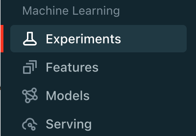
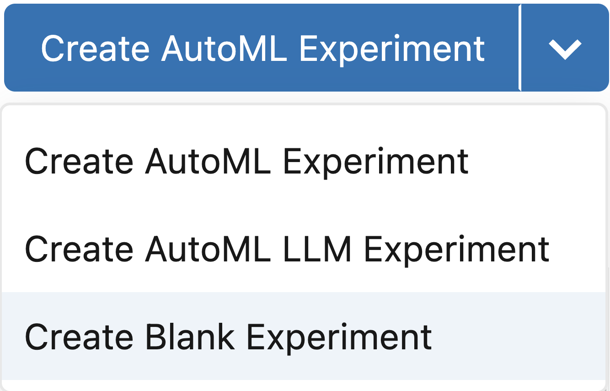
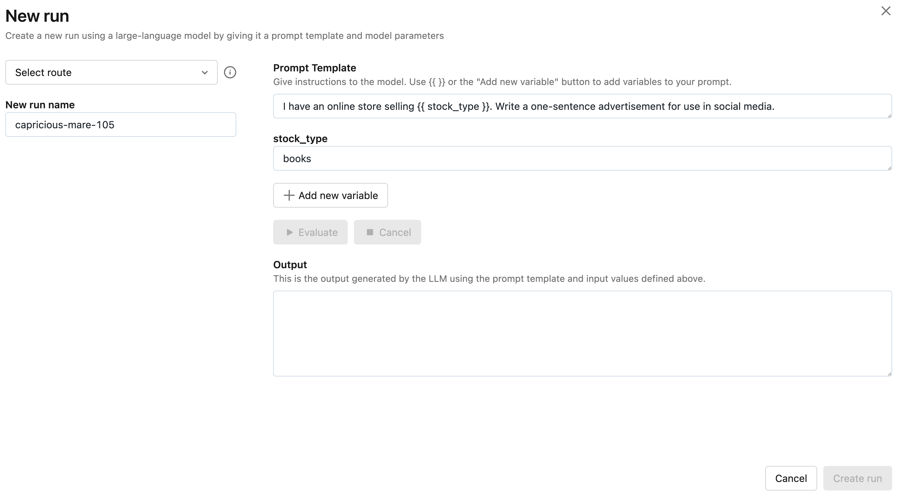
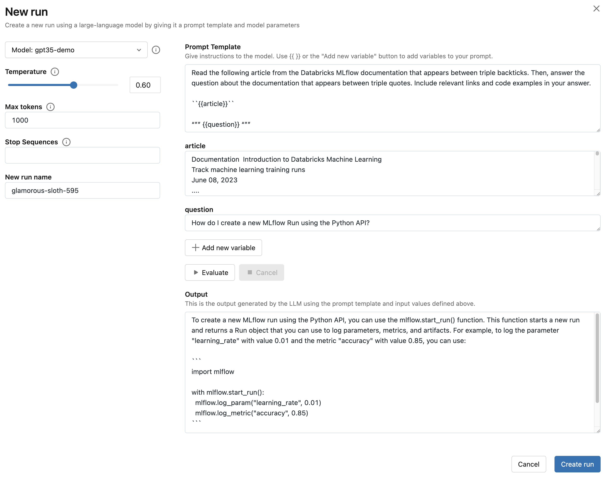
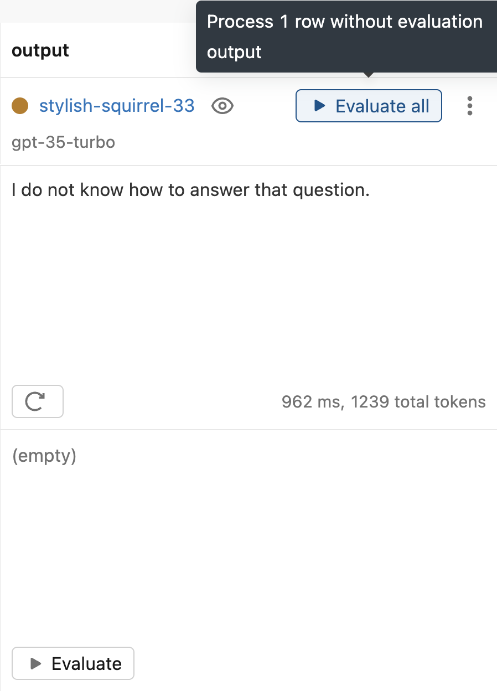
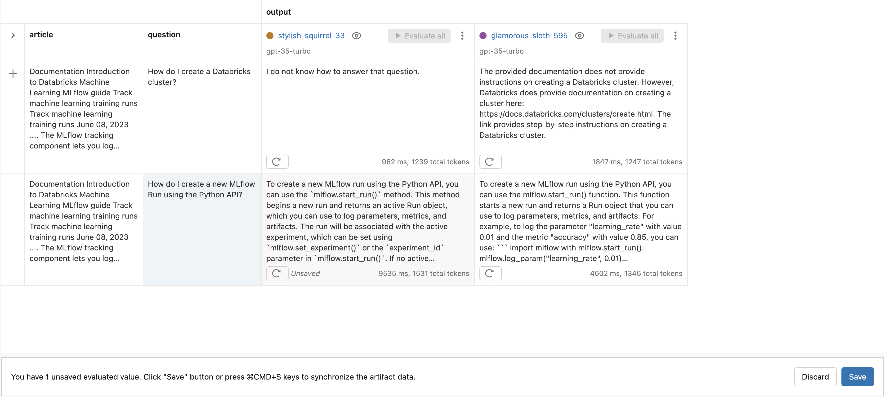
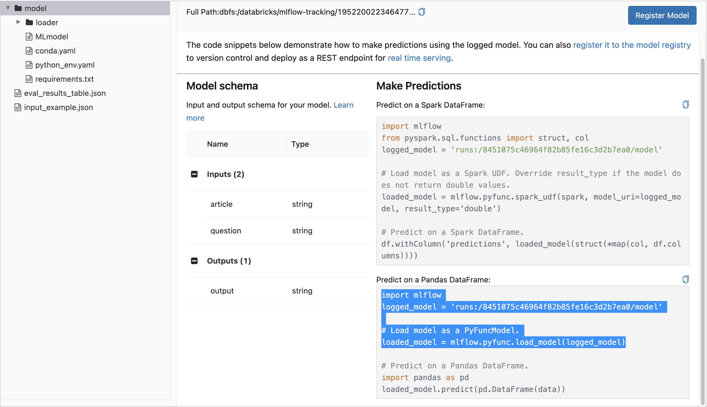
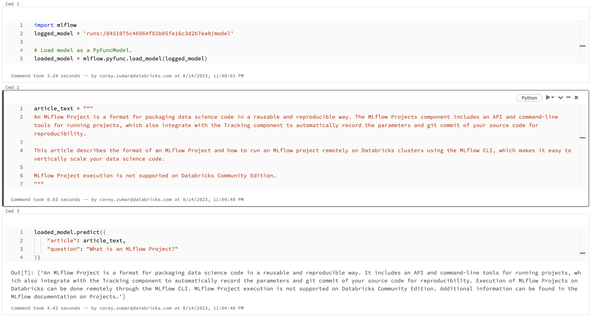

.. _prompt-engineering:

============================
MLflow Prompt Engineering UI
============================

.. warning::

    - **Support for using the MLflow Prompt Engineering UI is in private preview.**
    - Operability and support channels might be insufficient for production use. Support is best
      effort and informal—please reach out to your account or external Slack channel for best
      effort support.
    - This private preview will be free of charge at this time. We may charge for it in the future.
    - You will still incur charges for DBUs.
    - This product may change or may never be released.
    - We may terminate the preview or your access to it with 2 weeks of notice.
    - There may be API changes before Public Preview or General Availability. We will give you at
      least 2 weeks notice before any significant changes so that you have time to update your
      projects.
    - Non-public information about the preview (including the fact that there is a preview for the
      feature/product itself) is confidential.


The MLflow Tracking UI provides a best-in-class experience for prompt engineering. With no code required,
you can try out multiple LLMs from the :ref:`AI Gateway <gateway>`, parameter configurations, and prompts
to build a variety of models for question answering, document summarization, and beyond. Using the
embedded Evaluation UI, you can also evaluate multiple models on a set of inputs and compare the
responses to select the best one. Every model created with the prompt engineering UI is stored in the
:ref:`MLflow Model <models>` format and can be deployed for batch or real time inference. All
configurations (prompt templates, choice of LLM, parameters, etc.) are tracked as
:ref:`MLflow Runs <tracking>`.

.. _prompt-engineering-quickstart:

Quickstart
==========

The following guide will get you started with MLflow's UI for prompt engineering.

Step 1: Create an AI Gateway Completions Route
----------------------------------------------
To use the prompt engineering UI, you need to create one or more :ref:`AI Gateway <gateway>`
completions :ref:`Routes <routes>`. Follow the
:ref:`AI Gateway Quickstart guide <gateway-quickstart>` to easily create a Route in less than five
minutes. If you already have access to an AI Gateway Route of type ``llm/v1/completions``, you can
skip this step.

Step 2: Create or find an MLflow Experiment
-------------------------------------------
Next, locate an existing MLflow Experiment by accessing the **Experiments** page from the Databricks
Workspace sidebar and opening the experiment of your choosing. Alternatively, you can create a new
blank experiment by selecting *Create Blank Experiment* from the **Experiments** page.

|experiments_tab| |new_experiment|





Step 3: Create a run with prompt engineering
--------------------------------------------
Once you have opened the Experiment, click the **New Run** button and select
*using Prompt Engineering*. This will open the prompt engineering playground where you can try
out different LLMs, parameters, and prompts.

|new_run| |prompt_modal_1|

.. |new_run| image:: ../_static/images/new_run.png
   :width: 25%



Step 4: Select your Route and evaluate the example prompt
---------------------------------------------------------
Next, click the *Select route* dropdown and select the AI Gateway completions Route you created in
Step 1. Then, click the **Evaluate** button to test out an example prompt engineering use case
for generating product advertisements.

MLflow will embed the specified *stock_type* input
variable value - ``"books"`` - into the specfied *prompt  template* and send it to the LLM
associated with the AI Gateway route with the configured *temperature* (currently ``0.01``)
and *max_tokens* (currently empty). The LLM response will appear in the *Output* section.

.. figure:: ../_static/images/prompt_modal_2.png
   :scale: 25%
   :align: center

   The prompt engineering playground enables you to try out multiple LLMs, prompt templates,
   parameter configurations, and example inputs. Click the image to expand.


Step 5: Try a prompt of your choosing
-------------------------------------
Replace the prompt template from the previous step with a prompt template of your choosing.
Prompts can define multiple variables. For example, you can use the following prompt template
to instruct the LLM to answer questions about the Databricks MLflow documentation:

*Read the following article from the Databricks MLflow documentation that appears between triple
backticks. Then, answer the question about the documentation that appears between triple quotes.
Include relevant links and code examples in your answer.*

*```{{article}}```*

*"""*
*{{question}}*
*"""*

Then, fill in the input variables. For example, in the Databricks MLflow documentation
use case, the *article* input variable can be set to the contents of
https://docs.databricks.com/en/mlflow/tracking.html and the *question* input variable
can be set to ``"How do I create a new MLflow Run using the Python API?"``.

Finally, click the **Evaluate** button to see the new output. You can also try choosing a larger
value of *temperature* to observe how the LLM's output changes.



   The prompt engineering playground enables you to try out multiple LLMs, prompt templates,
   parameter configurations, and example inputs. Click the image to expand.

Step 6: Capture your choice of LLM, prompt template, and parameters as an MLflow Run
------------------------------------------------------------------------------------
Once you're satisfied with your chosen prompt template and parameters, click the **Create Run**
button to store this information, along with your choice of LLM, as an MLflow Run. This will
create a new Run with the prompt template, parameters, and choice of LLM stored as Run params.
It will also automatically create an MLflow Model with this information that can be used for batch
or real-time inference.

1. To view this information, click the Run name to open the **Run** page:

    .. figure:: ../_static/images/prompt_eng_run_page.png
       :scale: 25%
       :align: center

       Every Run contains the prompt template, choice of LLM, parameters, and more. An MLflow Model
       is also logged. Click the image to expand.

2. You can also see the parameters and compare them with other configurations by opening the **Table**
   view tab:

    .. figure:: ../_static/images/prompt_eng_table_view.png
       :scale: 25%
       :align: center

       The prompt template, choice of LLM, and parameters is also displayed in the Table view,
       where you can compare multiple configurations. Click the image to expand.

3. After your Run is created, MLflow will open the **Evaluation** tab where you can see your latest
   playground input & output and try out additional inputs:

    .. figure:: ../_static/images/eval_view_1.png
       :scale: 25%
       :align: center

       The Evaluation view displays inputs and outputs across multiple configurations. You can add
       and evaluate additional inputs. Click the image to expand.


Step 7: Try new inputs
----------------------
To test the behavior of your chosen LLM, prompt template, and parameters on a new inputs:

1. Click the *Add Row* button and fill in a value(s) your prompt template's input variable(s).
   For example, in the Databricks MLflow documentation use case, you can try asking a question
   unrelated to MLflow to see how the LLM responds. This is important to ensure that the application
   is robust to irrelevant inputs.

    |add_row| |add_row_modal|

    .. |add_row| image:: ../_static/images/add_row.png
       :width: 10%

    .. |add_row_modal| image:: ../_static/images/add_row_modal.png
       :width: 50%

2. Then, click the **Evaluate** button to see the output.

    .. figure:: ../_static/images/evaluate_new_input.png
        :align: center
        :scale: 30%

3. Finally, click the **Save** button to store the new inputs and output.

    .. figure:: ../_static/images/save_new_input.png
        :align: center
        :scale: 30%

Step 8: Adjust your prompt template and create a new Run
--------------------------------------------------------
As you try additional inputs, you might discover scenarios where your choice of LLM, prompt
template, and parameters doesn't perform as well as you would like. For example, in the
Databricks MLflow documentation use case, the LLM still attempts to answer irrelevant
questions about Databricks clusters even if the answer does not appear in the specified article.

1. To improve performance, create a new Run by selecting the *Duplicate run* option from the context
   menu. For example, in the Databricks MLflow documentation use case, adding the following text to
   the prompt template helps improve robustness to irrelevant questions:

    *If the question does not relate to the article, respond exactly with the phrase*
    *"I do not know how to answer that question." Do not include any additional text in your response.*

    .. figure:: ../_static/images/duplicate_run.png
       :scale: 25%
       :align: center

2. Then, from the prompt engineering playground, adjust the prompt template (and / or choice of
   LLM and parameters), evaluate an input, and click the *Create Run* button to create a new Run.

    .. figure:: ../_static/images/prompt_modal_4.png
           :scale: 30%
           :align: center

Step 9: Evalute the new prompt template on previous inputs
----------------------------------------------------------
Now that you've made an adjustment to your prompt template, it's important to make sure that
the new template performs well on the previous inputs and compare the outputs with older
configurations.

1. From the **Evaluation** tab, click the **Evaluate all** button next to the new Run to evaluate
   all of the previous inputs.



2. Click the **Save** button to store the results.



.. _quickstart-score:

Step 10: Score or deploy the best configuration programmatically
----------------------------------------------------------------
Once you have found a configuration of LLM, prompt template, and parameters that performs well, you
can score the corresponding MLflow Model in a notebook or
:ref:`deploy it to Databricks Model Serving <deploy-prompt-serving>`.

To load the MLflow Model in a notebook for batch inference, click on the Run's name to open the
**Run Page** and select the *model* directory in the **Artifact Viewer**. Then, copy the first few
lines of code from the *Predict on a Pandas DataFrame* section and run them in a Databricks
Notebook. For example:



.. code-block:: python

    import mlflow
    logged_model = 'runs:/8451075c46964f82b85fe16c3d2b7ea0/model'

    # Load model as a PyFuncModel.
    loaded_model = mlflow.pyfunc.load_model(logged_model)

Then, to score the model, call the :py:func:`predict() <mlflow.pyfunc.PyFuncModel.predict>` method
and pass in a dictionary of input variables. For example:

.. code-block:: python

    article_text = """
    An MLflow Project is a format for packaging data science code in a reusable and reproducible way.
    The MLflow Projects component includes an API and command-line tools for running projects, which
    also integrate with the Tracking component to automatically record the parameters and git commit
    of your source code for reproducibility.

    This article describes the format of an MLflow Project and how to run an MLflow project remotely
    on Databricks clusters using the MLflow CLI, which makes it easy to vertically scale your data
    science code.
    """
    question = "What is an MLflow project?"

    loaded_model.predict({
        "article": article_text,
        "question": question
    })



For more information about deployment to
`Databricks Model Serving <https://docs.databricks.com/en/machine-learning/model-serving/index.html>`_,
see the :ref:`instructions below <deploy-prompt-serving>`.

.. _deploy-prompt-serving:

Deployment to Databricks Model Serving
======================================
Once you have found a configuration of LLM, prompt template, and parameters that performs well, you
can deploy the corresponding MLflow Model to
`Databricks Model Serving <https://docs.databricks.com/en/machine-learning/model-serving/index.html>`_
for real-time inference as follows:

1. Register your model with the MLflow Model Registry. The following example registers
   an MLflow Model created from the :ref:`Quickstart <quickstart-score>` as Version 1 of the
   Registered Model named ``"mlflow_docs_qa_model"``.

   .. code-block:: python

       mlflow.register_model(
           model_uri="runs:/8451075c46964f82b85fe16c3d2b7ea0/model",
           name="mlflow_docs_qa_model",
       )

2. Follow the guide at https://docs.databricks.com/machine-learning/model-serving/store-env-variable-model-serving.html
to create a Databricks Model Serving endpoint for your MLflow Registered Model with the following
environment variables set:

   * ``DATABRICKS_HOST``: The URL of the Databricks workspace containing the AI Gateway route
     that you used to create the MLflow Model during prompt engineering.
   * ``DATABRICKS_TOKEN``: A Databricks access token corresponding to a user or service principal
     with permission to query the AI Gateway route referenced by the MLflow Model.

   For example:

   .. code-block:: bash

       PUT /api/2.0/serving-endpoints/mlflow_docs_qa/config

       {
           "served_models": [{
               "model_name": "mlflow_docs_qa_model",
               "model_version": "1",
               "workload_size": "Small",
               "scale_to_zero_enabled": true,
               "env_vars": [
                   {
                       "env_var_name": "DATABRICKS_HOST"
                       "secret_scope": "my_secret_scope",
                       "secret_key": "my_databricks_host_secret_key"
                   },
                   {
                       "env_var_name": "DATABRICKS_TOKEN"
                       "secret_scope": "my_secret_scope",
                       "secret_key": "my_databricks_token_secret_key"
                   }
               ]
           }]
        }

3. Once the endpoint has been created, query it using the following syntax:

    .. code-block:: bash

      input='
      {
          "dataframe_records": [
              {
                  "article": "An MLflow Project is a format for packaging data science code...",
                  "question": "What is an MLflow Project?"
              }
          ]
      }'

      echo $sample_input | curl \
        -s \
        -X POST \
        https://your.databricks.workspace.url.com/serving-endpoints/mlflow_docs_qa/invocations \
        -H 'Content-Type: application/json' \
        -u token:$DATABRICKS_TOKEN \
        -d @-


    where ``article`` and ``question`` are replaced with the input variable(s) from your
    prompt template.
