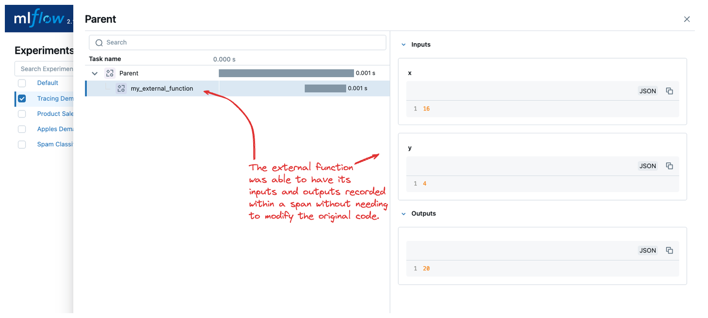

MLflow Tracing
==============

.. note::
    MLflow Tracing is currently in **Experimental Status** and is subject to change without deprecation warning or notification. 

MLflow offers a number of different options to enable tracing of your GenAI applications. 

- **Automated tracing with LangChain**: MLflow provides a fully automated integration with LangChain that uses a custom callback to collect trace data when your chains are invoked.
- **Manual trace instrumentation with high-level fluent APIs**: Decorators, function wrappers and context managers via the fluent API allow you to add tracing functionality with minor code modifications.
- **Low-level client APIs for tracing**: The MLflow client API provides a thread-safe way to handle trace implementations, even in aysnchronous modes of operation.

To learn more about what tracing is, see our `Tracing Concepts Overview <./overview.html>`_ guide. 

LangChain Automatic Tracing
---------------------------

TODO: Show a langchain RAG example

Tracing Fluent APIs
-------------------

MLflow's fluent APIs provide a straightforward way to add tracing to your functions and code blocks. By using decorators, function wrappers, 
and context managers, you can easily capture detailed trace data with minimal code changes. This section will cover how to initiate traces 
using these fluent APIs.

Initiating a Trace
^^^^^^^^^^^^^^^^^^

In this section, we will explore different methods to initiate a trace using MLflow's fluent APIs. These methods allow you to add tracing 
functionality to your code with minimal modifications, enabling you to capture detailed information about the execution of your functions and workflows.

Trace Decorator
###############

The trace decorator allows you to automatically capture the inputs and outputs of a function by simply adding the `@mlflow.trace` decorator 
to its definition. This approach is ideal for quickly adding tracing to individual functions without significant changes to your existing code.

.. code-block:: python

    import mlflow

    # Create a new experiment to log the trace to
    mlflow.set_experiment("Tracing Demo")

    # Mark any function with the trace decorator to automatically capture input(s) and output(s)
    @mlflow.trace
    def some_function(x, y, z=2):
        return x + (y - z)

    # Invoking the function will generate a trace that is logged to the active experiment
    some_function(2, 4)

You can add additional metadata to the tracing decorator as follows:

.. code-block:: python

    @mlflow.trace(name="My Span", span_type="func", attributes={"a": 1, "b": 2})
    def my_func(x, y):
        return x + y

When adding additional metadata to the trace decorator constructor, these additional components will be logged along with the span entry within 
the trace that is stored within the active MLflow experiment.

**What is captured?**

If we navigate to the MLflow UI, we can see that the trace decorator captures the following information:

- **Inputs**: In the case of our decorated function, this includes the state of all input arguments (including the default `z` value that is applied).
- **Response**: The output of the function is also captured, in this case the result of the addition and subtraction operations.
- **Trace Name**: The name of the decorated function.

.. figure:: ../../_static/images/llms/tracing/trace-demo-1.png
    :alt: Trace UI - simple use case
    :width: 100%
    :align: center

Context Handler
###############

The context handler provides a way to create nested traces or spans, which can be useful for capturing complex interactions within your code. 
By using the `mlflow.start_span` context manager, you can group multiple traced functions under a single parent span, making it easier to understand 
the relationships between different parts of your code.

.. code-block:: python

    import mlflow

    @mlflow.trace
    def first_func(x, y=2):
        return x + y

    @mlflow.trace
    def second_func(a, b=3):
        return a * b

    def do_math(a, x, operation="add"):
            
        # Use the fluent API context handler to create a new span
        with mlflow.start_span(name="Math") as span:
            
            # Specify the inputs and attributes that will be associated with the span
            span.set_inputs({"a": a, "x": x})
            span.set_attributes({"mode": operation})
            
            # Both of these functions are decorated for tracing and will be associated
            # as 'children' of the parent 'span' defined with the context handler
            first = first_func(x)
            second = second_func(a)
            
            result = None
            
            if operation == "add":
                result = first + second
            elif operation == "subtract":
                result = first - second
            else:
                raise AttributeError(f"Unsupported Operation Mode: {operation}")
            
            # Specify the output result to the span
            span.set_outputs({"result": result})
            
            return result

When calling the ``do_math`` function, a trace will be generated that has the root span (parent) defined as the 
context handler ``with mlflow.start_span():`` call. The ``first_func`` and ``second_func`` calls will be associated as child spans
to this parent span due to the fact that they are both decorated functions (having ``@mlflow.trace`` decorated on the function definition). 

Running the following code will generate a trace. 

.. code-block:: python

    do_math(8, 3, "add")

This trace can be seen within the MLflow UI:

.. figure:: ../../_static/images/llms/tracing/trace-view.png
    :alt: Trace within the MLflow UI 
    :width: 100%
    :align: center

If an `Exception` is raised during processing of a trace-instrumented operation, an indication will be shown within the UI that the invocation was not 
successful and a partial capture of data will be available to aid in debugging, as shown below:

.. code-block:: python

    # This will raise an AttributeError exception
    do_math(3, 2, "multiply")

.. figure:: ../../_static/images/llms/tracing/trace-error.png
    :alt: Trace Error
    :width: 100%
    :align: center

Function wrapping
#################

Function wrapping provides a flexible way to add tracing to existing functions without modifying their definitions. This is particularly useful when 
you want to add tracing to third-party functions or functions defined outside of your control. By wrapping a function with ``mlflow.trace``, you can
capture its inputs, outputs, and execution context.

.. code-block:: python

    import mlflow

    def my_external_function(x, y):
        return x + y

    def invocation(x, y=4):
        
        # Initiate a context handler for parent logging
        with mlflow.start_span(name="Parent") as span:
            
            span.set_attributes({"level": "parent", "override": y==4})
            span.set_inputs({"x": x, "y": y})
            
            # Wrap an external function instead of modifying
            traced_external = mlflow.trace(my_external_function)
            
            # Call the wrapped function as you would call it directly
            response = traced_external(x, y)
            
            # Set the outputs to the parent span prior to returning
            span.set_outputs({"result": response})
            
            return response
        
    invocation(16)

The screenshot below shows the wrapped function call having its inputs and output captured from within a span.

Tracing Client APIs
-------------------

TODO: explain the concept of how request_id and parent_id is curried to instances to create hierarchical relationships between spans
and how a trace must be ended explicitly when using the client API, as opposed to the automatic closure that occurs with the fluent APIs.

- Start trace
- Start Span
- get_trace
- search_traces
- delete_traces

