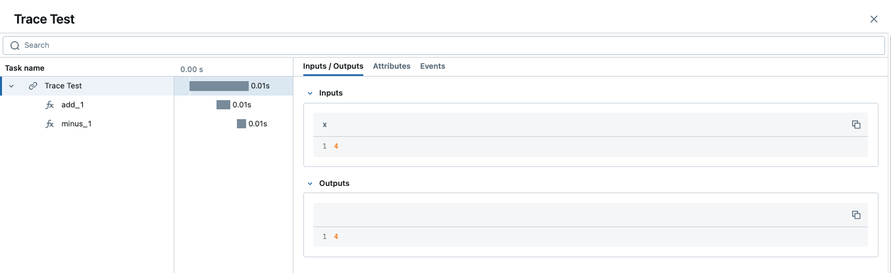

.. meta::
  :description: MLflow Tracing is a feature that enables LLM observability in your apps. MLflow automatically logs traces for LangChain, LlamaIndex, and more.

MLflow Tracing for LLM Observability
====================================

**MLflow Tracing** is a feature that enhances LLM observability in your Generative AI (GenAI) applications by capturing detailed information about the execution of your application's services.
Tracing provides a way to record the inputs, outputs, and metadata associated with each intermediate step of a request, enabling you to easily pinpoint the source of bugs and unexpected behaviors.

.. figure:: ../../_static/images/llms/tracing/tracing-top.gif
    :alt: Tracing Gateway Video
    :width: 95%
    :align: center

.. raw:: html

    <section>
        

            <a href="../langchain/autologging.html">
                

                    
                

            </a>
            <a href="../langchain/autologging.html">
                

                    
                

            </a>
            <a href="../llama-index/index.html##enable-tracing">
                

                    
                

            </a>
            <a href="#automatic-tracing">
                

                    
                

            </a>
            <a href="../openai/autologging.html">
                

                    
                

            </a>
            <a href="../openai/autologging.html#auto-tracing-for-openai-swarm">
                

                    
                

            </a>
            <a href="#automatic-tracing">
                

                    
                

            </a>
            <a href="#automatic-tracing">
                

                    
                

            </a>
            <a href="#automatic-tracing">
                

                    
                

            </a>
            <a href="#automatic-tracing">
                

                    
                

            </a>
            <a href="#automatic-tracing">
                

                    
                

            </a>
            <a href="#automatic-tracing">
                

                    
                

            </a>
            <a href="#automatic-tracing">
                

                    
                

            </a>
    </section>

MLflow offers a number of different options to enable tracing of your GenAI applications. 

- **Automated tracing**: MLflow provides fully automated integrations with various GenAI libraries such as LangChain, OpenAI, LlamaIndex, DSPy, AutoGen, and more that can be activated by simply enabling ``mlflow.<library>.autolog()``.
- **Manual trace instrumentation with high-level fluent APIs**: Decorators, function wrappers and context managers via the fluent API allow you to add tracing functionality with minor code modifications.
- **Low-level client APIs for tracing**: The MLflow client API provides a thread-safe way to handle trace implementations, even in aysnchronous modes of operation.

If you are new to the tracing or observability concepts, we recommend starting with the `Tracing Concepts Overview <./overview.html>`_ guide.

.. note::
    MLflow Tracing support is available with the **MLflow 2.14.0** release.

.. contents:: Table of Contents
    :local:
    :depth: 1

Automatic Tracing
-----------------

.. hint::

    Is your favorite library missing from the list? Consider `contributing to MLflow Tracing <contribute.html>`_ or `submitting a feature request <https://github.com/mlflow/mlflow/issues/new?assignees=&labels=enhancement&projects=&template=feature_request_template.yaml&title=%5BFR%5D>`_ to our Github repository.

The easiest way to get started with MLflow Tracing is to leverage the built-in capabilities with MLflow's integrated libraries. MLflow provides automatic tracing capabilities for some of the integrated libraries such as
LangChain, OpenAI, LlamaIndex, and AutoGen. For these libraries, you can instrument your code with
just a single command ``mlflow.<library>.autolog()`` and MLflow will automatically log traces
for model/API invocations to the active MLflow Experiment.

.. tabs::

    .. tab::  LangChain / LangGraph

        .. raw:: html

            <h3>LangChain Automatic Tracing</h3>

        |

        As part of the LangChain autologging integration, traces are logged to the active MLflow Experiment when calling invocation APIs on chains. You can enable tracing
        for LangChain by calling the :py:func:`mlflow.langchain.autolog` function.

        .. code-block:: python

            import mlflow

            mlflow.langchain.autolog()

        In the full example below, the model and its associated metadata will be logged as a run, while the traces are logged separately to the active experiment. To learn more, please visit `LangChain Autologging documentation <../langchain/autologging.html>`_.

        .. note::
            This example has been confirmed working with the following requirement versions:

            .. code-block:: shell

                pip install mlflow==2.18.0 langchain==0.3.0 langchain-openai==0.2.9

        .. code-block:: python

            import mlflow
            import os

            from langchain.prompts import PromptTemplate
            from langchain_core.output_parsers import StrOutputParser
            from langchain_openai import ChatOpenAI

            mlflow.set_experiment("LangChain Tracing")

            # Enabling autolog for LangChain will enable trace logging.
            mlflow.langchain.autolog()

            llm = ChatOpenAI(model="gpt-4o-mini", temperature=0.7, max_tokens=1000)

            prompt_template = PromptTemplate.from_template(
                "Answer the question as if you are {person}, fully embodying their style, wit, personality, and habits of speech. "
                "Emulate their quirks and mannerisms to the best of your ability, embracing their traits—even if they aren't entirely "
                "constructive or inoffensive. The question is: {question}"
            )

            chain = prompt_template | llm | StrOutputParser()

            # Let's test another call
            chain.invoke(
                {
                    "person": "Linus Torvalds",
                    "question": "Can I just set everyone's access to sudo to make things easier?",
                }
            )

        If we navigate to the MLflow UI, we can see not only the model that has been auto-logged, but the traces as well, as shown in the video above.

        .. figure:: ../../_static/images/llms/tracing/langchain-tracing.png
            :alt: LangChain Tracing via autolog
            :width: 100%
            :align: center

    .. tab:: OpenAI

        .. raw:: html

            <h3>OpenAI Automatic Tracing</h3>

        |

        The `MLflow OpenAI flavor <../openai/index.html>`_'s autologging feature has a direct integration with MLflow tracing. When OpenAI autologging is enabled with :py:func:`mlflow.openai.autolog`, 
        usage of the OpenAI SDK will automatically record generated traces during interactive development. 

        .. code-block:: python

            import mlflow

            mlflow.openai.autolog()

        For example, the code below will log traces to the currently active experiment (in this case, the activated experiment ``"OpenAI"``, set through the use 
        of the :py:func:`mlflow.set_experiment` API).
        To learn more about OpenAI autologging, you can `view the documentation here <../openai/autologging.html>`_.

        .. code-block:: python

            import os
            import openai
            import mlflow

            # Calling the autolog API will enable trace logging by default.
            mlflow.openai.autolog()

            mlflow.set_experiment("OpenAI")

            openai_client = openai.OpenAI(api_key=os.environ.get("OPENAI_API_KEY"))

            messages = [
                {
                    "role": "user",
                    "content": "How can I improve my resting metabolic rate most effectively?",
                }
            ]

            response = openai_client.chat.completions.create(
                model="gpt-4o",
                messages=messages,
                temperature=0.99,
            )

            print(response)

        The logged trace, associated with the ``OpenAI`` experiment, can be seen in the MLflow UI, as shown below:

        .. figure:: ../../_static/images/llms/tracing/openai-tracing.png
            :alt: OpenAI Tracing
            :width: 100%
            :align: center

    .. tab:: Swarm

        .. raw:: html

            <h3>OpenAI Swarm Automatic Tracing</h3>

        |

        The `MLflow OpenAI flavor <../openai/index.html>`_ supports automatic tracing for `Swarm <https://github.com/openai/swarm>`_, a multi-agent orchestration
        framework from OpenAI. To enable tracing for **Swarm**, just call :py:func:`mlflow.openai.autolog`
        before running your multi-agent interactions. MLflow will trace all LLM interactions,
        tool calls, and agent operations automatically.

        .. code-block:: python

            import mlflow

            mlflow.openai.autolog()

        For example, the code below will run the simplest example of multi-agent interaction using OpenAI Swarm.

        .. code-block:: python

            import mlflow
            from swarm import Swarm, Agent

            # Calling the autolog API will enable trace logging by default.
            mlflow.openai.autolog()

            mlflow.set_experiment("OpenAI Swarm")

            client = Swarm()

            def transfer_to_agent_b():
                return agent_b

            agent_a = Agent(
                name="Agent A",
                instructions="You are a helpful agent.",
                functions=[transfer_to_agent_b],
            )

            agent_b = Agent(
                name="Agent B",
                instructions="Only speak in Haikus.",
            )

            response = client.run(
                agent=agent_a,
                messages=[{"role": "user", "content": "I want to talk to agent B."}],
            )
            print(response)

        The logged trace, associated with the ``OpenAI Swarm`` experiment, can be seen in the MLflow UI, as shown below:

        .. figure:: ../../_static/images/llms/tracing/openai-swarm-tracing.png
            :alt: OpenAI Swarm Tracing
            :width: 100%
            :align: center

    .. tab:: Ollama

        .. raw:: html

            <h3>Ollama Automatic Tracing</h3>

        |

        `Ollama <https://github.com/ollama/ollama>`_ is an open-source platform that enables users to run large language models (LLMs) locally on their devices, such as Llama 3.2, Gemma 2, Mistral, Code Llama, and more.

        Since the local LLM endpoint served by Ollama is compatible with the OpenAI API, you can query it via OpenAI SDK and enable tracing for Ollama with :py:func:`mlflow.openai.autolog`. Any LLM interactions via Ollama will be recorded to the active MLflow Experiment.

        1. Run the Ollama server with the desired LLM model.

        .. code-block:: bash

            ollama run llama3.2:1b

        2. Enable auto-tracing for OpenAI SDK.

        .. code-block:: python

            import mlflow

            mlflow.openai.autolog()

            # Optional, create an experiment to store traces
            mlflow.set_experiment("Ollama")

        3. Query the LLM and see the traces in the MLflow UI.

        .. code-block:: python

            from openai import OpenAI

            client = OpenAI(
                base_url="http://localhost:11434/v1",  # The local Ollama REST endpoint
                api_key="dummy",  # Required to instantiate OpenAI client, it can be a random string
            )

            response = client.chat.completions.create(
                model="llama3.2:1b",
                messages=[
                    {"role": "system", "content": "You are a science teacher."},
                    {"role": "user", "content": "Why is the sky blue?"},
                ],
            )

        .. figure:: ../../_static/images/llms/tracing/ollama-tracing.png
            :alt: Ollama Tracing
            :width: 100%
            :align: center

    .. tab:: Instructor

        .. raw:: html

            <h3>Instructor Automatic Tracing</h3>

        |

        `Instructor <https://python.useinstructor.com>`_ is an open-source Python library built on top of Pydantic, simplifying structured LLM outputs with validation, retries, and streaming.

        MLflow Tracing works with Instructor by enabling auto-tracing for the underlying LLM libraries.
        For example, if you use Instructor for OpenAI LLMs, you can enable tracing with :py:func:`mlflow.openai.autolog` and the generated traces will capture the structured outputs from Instructor.

        Similarly, you can also trace Instructor with other LLM providers, such as Anthropic, Gemini, and LiteLLM, by enabling the corresponding autologging in MLflow.

        .. code-block:: python

            import instructor
            from pydantic import BaseModel
            from openai import OpenAI

            # Use other autologging function e.g., mlflow.anthropic.autolog() if you are using Instructor with different LLM providers
            mlflow.openai.autolog()

            # Optional, create an experiment to store traces
            mlflow.set_experiment("Instructor")

            # Use Instructor as usual
            class ExtractUser(BaseModel):
                name: str
                age: int

            client = instructor.from_openai(OpenAI())

            res = client.chat.completions.create(
                model="gpt-4o-mini",
                response_model=ExtractUser,
                messages=[{"role": "user", "content": "John Doe is 30 years old."}],
            )
            print(f"Name: {res.name}, Age:{res.age}")

        .. figure:: ../../_static/images/llms/tracing/instructor-tracing.png

    .. tab:: LlamaIndex

        .. raw:: html

            <h3>LlamaIndex Automatic Tracing</h3>

        |

        The `MLflow LlamaIndex flavor <../llama-index/index.html>`_'s autologging feature has a direct integration with MLflow tracing. When LlamaIndex autologging is enabled with :py:func:`mlflow.llama_index.autolog`, invocation of components
        such as LLMs, agents, and query/chat engines will automatically record generated traces during interactive development.

        .. code-block:: python

            import mlflow

            mlflow.llama_index.autolog()

        To see the full example of tracing LlamaIndex, please visit `LLamaIndex Tracing documentation <../llama-index/index.html##enable-tracing>`_.

        .. figure:: ../../_static/images/llms/llama-index/llama-index-trace.png
            :alt: LlamaIndex Tracing
            :width: 100%
            :align: center

    .. tab:: DSPy

        .. raw:: html

            <h3>DSPy Automatic Tracing</h3>

        |

        The `MLflow DSPy flavor <../dspy/index.html>`_'s autologging feature has a direct integration with MLflow tracing. When DSPy autologging is enabled with :py:func:`mlflow.dspy.autolog`, invocation of components
        such as LMs, Adapters and Modules, will automatically record generated traces during interactive development.

        .. code-block:: python

            import mlflow
            import dspy

            # Enable tracing for DSPy
            mlflow.dspy.autolog()

            # Set an experiment to log the traces to
            mlflow.set_experiment("DSPy Tracing")

            # Define a simple ChainOfThought model and run it
            lm = dspy.LM("openai/gpt-4o-mini")
            dspy.configure(lm=lm)

            # Define a simple summarizer model and run it
            class SummarizeSignature(dspy.Signature):
                """Given a passage, generate a summary."""

                passage: str = dspy.InputField(desc="a passage to summarize")
                summary: str = dspy.OutputField(desc="a one-line summary of the passage")

            class Summarize(dspy.Module):
                def __init__(self):
                    self.summarize = dspy.ChainOfThought(SummarizeSignature)

                def forward(self, passage: str):
                    return self.summarize(passage=passage)

            summarizer = Summarize()
            summarizer(
                passage=(
                    "MLflow Tracing is a feature that enhances LLM observability in your Generative AI (GenAI) applications "
                    "by capturing detailed information about the execution of your application's services. Tracing provides "
                    "a way to record the inputs, outputs, and metadata associated with each intermediate step of a request, "
                    "enabling you to easily pinpoint the source of bugs and unexpected behaviors."
                )
            )

        .. figure:: ../../_static/images/llms/tracing/dspy-tracing.png
            :alt: DSPy Tracing
            :width: 100%
            :align: center

    .. tab:: AutoGen

        .. raw:: html

            <h3>AutoGen Automatic Tracing</h3>

        |

        MLflow Tracing ensures observability for your AutoGen application that involves complex multi-agent interactions. You can enable auto-tracing by calling :py:func:`mlflow.autogen.autolog`, then the internal steps of the agents chat session will be logged to the active MLflow Experiment.

        .. code-block:: python

            import mlflow

            mlflow.autogen.autolog()

        To see the full example of tracing AutoGen, please refer to the `AutoGen Tracing example <https://github.com/mlflow/mlflow/tree/master/examples/autogen/tracing.py>`_.

        .. figure:: ../../_static/images/llms/autogen/autogen-trace.png
            :alt: AutoGen Tracing
            :width: 100%
            :align: center

    .. tab:: Gemini

        .. raw:: html

            <h3>Gemini Automatic Tracing</h3>

        |

        MLflow Tracing ensures observability for your interactions with Gemini AI models.
        When Gemini autologging is enabled with :py:func:`mlflow.gemini.autolog`, 
        usage of the Gemini SDK will automatically record generated traces during interactive development.
        Note that only synchronous calls for text interactions are supported. Asynchronous API is not traced, and full inputs cannnot be recorded for multi-modal inputs.

        .. code-block:: python

            import mlflow

            mlflow.gemini.autolog()

        To see the full example of tracing Gemini, please refer to the `Gemini Tracing example <https://github.com/mlflow/mlflow/tree/master/examples/gemini/tracing.py>`_.

        .. figure:: ../../_static/images/llms/gemini/gemini-tracing.png
            :alt: Gemini Tracing
            :width: 100%
            :align: center

    .. tab:: LiteLLM

        .. raw:: html

            <h3>LiteLLM Automatic Tracing</h3>

        |

        LiteLLM allows developers to call all LLM APIs using the OpenAI format. MLflow support auto-tracing for LiteLLM. You can enable it by calling :py:func:`mlflow.litellm.autolog`, then any LLM interactions via LiteLLM will be recorded to the active MLflow Experiment, including various metadata such as token usage, cost, cache hit, and more.

        .. code-block:: python

            import mlflow

            mlflow.litellm.autolog()

            # Call Anthropic API via LiteLLM
            response = litellm.completion(
                model="claude-3-opus-20240229",
                messages=[{"role": "system", "content": "Hey! how's it going?"}],
            )

        .. figure:: ../../_static/images/llms/litellm/litellm-tracing.png
            :alt: LiteLLM Tracing
            :width: 100%
            :align: center

    .. tab:: Anthropic

        .. raw:: html

            <h3>Anthropic Automatic Tracing</h3>

        |

        MLflow Tracing ensures observability for your interactions with Anthropic AI models.
        When Anthropic autologging is enabled with :py:func:`mlflow.anthropic.autolog`,
        usage of the Anthropic SDK will automatically record generated traces during interactive development.
        Note that only synchronous calls for text interactions are supported.
        Asynchronous API and streaming methods are not traced.

        .. code-block:: python

            import mlflow

            mlflow.anthropic.autolog()

        To see the full example of tracing Anthropic, please refer to the `Anthropic Tracing example <https://github.com/mlflow/mlflow/tree/master/examples/anthropic/tracing.py>`_.

        .. figure:: ../../_static/images/llms/anthropic/anthropic-tracing.png
            :alt: Anthropic Tracing
            :width: 100%
            :align: center

    .. tab:: CrewAI

        .. raw:: html

            <h3>CrewAI Automatic Tracing</h3>

        |

        MLflow Tracing ensures observability for the interactions of CrewAI agents.
        When CrewAI autologging is enabled with :py:func:`mlflow.crewai.autolog`, 
        traces are generated for the usage of the CrewAI framework.
        Note that asynchronous task and kickoff are not supported now.

        .. code-block:: python

            import mlflow

            mlflow.crewai.autolog()

        To see the full example of tracing CrewAI, please refer to the `CrewAI Tracing example <https://github.com/mlflow/mlflow/tree/master/examples/crewai/tracing.py>`_.

        .. figure:: ../../_static/images/llms/crewai/crewai-trace.png
            :alt: CrewAI Tracing
            :width: 100%
            :align: center

Tracing Fluent APIs
-------------------

MLflow's :py:func:`fluent APIs <mlflow.start_span>` provide a straightforward way to add tracing to your functions and code blocks. 
By using decorators, function wrappers, and context managers, you can easily capture detailed trace data with minimal code changes. 

As a comparison between the fluent and the client APIs for tracing, the figure below illustrates the differences in complexity between the two APIs, 
with the fluent API being more concise and the recommended approach if your tracing use case can support using the higher-level APIs.

This section will cover how to initiate traces using these fluent APIs.

Initiating a Trace
^^^^^^^^^^^^^^^^^^

In this section, we will explore different methods to initiate a trace using MLflow's fluent APIs. These methods allow you to add tracing 
functionality to your code with minimal modifications, enabling you to capture detailed information about the execution of your functions and workflows.

Trace Decorator
###############

The trace decorator allows you to automatically capture the inputs and outputs of a function by simply adding the :py:func:`@mlflow.trace <mlflow.trace>` decorator 
to its definition. This approach is ideal for quickly adding tracing to individual functions without significant changes to your existing code.

.. code-block:: python

    import mlflow

    # Create a new experiment to log the trace to
    mlflow.set_experiment("Tracing Demo")

    # Mark any function with the trace decorator to automatically capture input(s) and output(s)
    @mlflow.trace
    def some_function(x, y, z=2):
        return x + (y - z)

    # Invoking the function will generate a trace that is logged to the active experiment
    some_function(2, 4)

You can add additional metadata to the tracing decorator as follows:

.. code-block:: python

    @mlflow.trace(name="My Span", span_type="func", attributes={"a": 1, "b": 2})
    def my_func(x, y):
        return x + y

When adding additional metadata to the trace decorator constructor, these additional components will be logged along with the span entry within 
the trace that is stored within the active MLflow experiment.

Since MLflow 2.16.0, the trace decorator also supports async functions:

.. code-block:: python

    from openai import AsyncOpenAI

    client = AsyncOpenAI()

    @mlflow.trace
    async def async_func(message: str):
        return await client.chat.completion.create(
            model="gpt-4o", messages=[{"role": "user", "content": message}]
        )

    await async_func("What is MLflow Tracing?")

What is captured?
#################

If we navigate to the MLflow UI, we can see that the trace decorator automatically captured the following information, in addition to the basic
metadata associated with any span (start time, end time, status, etc):

- **Inputs**: In the case of our decorated function, this includes the state of all input arguments (including the default `z` value that is applied).
- **Response**: The output of the function is also captured, in this case the result of the addition and subtraction operations.
- **Trace Name**: The name of the decorated function.

Error Handling with Traces
##########################

If an `Exception` is raised during processing of a trace-instrumented operation, an indication will be shown within the UI that the invocation was not 
successful and a partial capture of data will be available to aid in debugging. Additionally, details about the Exception that was raised will be included 
within ``Events`` of the partially completed span, further aiding the identification of where issues are occurring within your code. 

.. figure:: ../../_static/images/llms/tracing/trace-exception.gif
    :alt: Trace Error
    :width: 100%
    :align: center

Parent-child relationships
##########################

When using the trace decorator, each decorated function will be treated as a separate span within the trace. The relationship between dependent function calls 
is handled directly through the native call excecution order within Python. For example, the following code will introduce two "child" spans to the main 
parent span, all using decorators. 

.. code-block:: python

    import mlflow

    @mlflow.trace(span_type="func", attributes={"key": "value"})
    def add_1(x):
        return x + 1

    @mlflow.trace(span_type="func", attributes={"key1": "value1"})
    def minus_1(x):
        return x - 1

    @mlflow.trace(name="Trace Test")
    def trace_test(x):
        step1 = add_1(x)
        return minus_1(step1)

    trace_test(4)

If we look at this trace from within the MLflow UI, we can see the relationship of the call order shown in the structure of the trace. 

Span Type
#########

Span types are a way to categorize spans within a trace. By default, the span type is set to ``"UNKNOWN"`` when using the trace decorator. MLflow provides a set of predefined span types for common use cases, while also allowing you to setting custom span types.

The following span types are available:

.. list-table::
    :header-rows: 1

    * - Span Type
      - Description
    * - ``"LLM"``
      - Represents a call to an LLM endpoint or a local model.
    * - ``"CHAT_MODEL"``
      - Represents a query to a chat model. This is a special case of an LLM interaction.
    * - ``"CHAIN"``
      - Represents a chain of operations.
    * - ``"AGENT"``
      - Represents an autonomous agent operation.
    * - ``"TOOL"``
      - Represents a tool execution (typically by an agent), such as querying a search engine.
    * - ``"EMBEDDING"``
      - Represents a text embedding operation.
    * - ``"RETRIEVER"``
      - Represents a context retrieval operation, such as querying a vector database.
    * - ``"PARSER"``
      - Represents a parsing operation, transforming text into a structured format.
    * - ``"RERANKER"``
      - Represents a re-ranking operation, ordering the retrieved contexts based on relevance.
    * - ``"UNKNOWN"``
      - A default span type that is used when no other span type is specified.

To set a span type, you can pass the ``span_type`` parameter to the :py:func:`@mlflow.trace <mlflow.trace>` decorator or :py:func:`mlflow.start_span <mlflow.start_span>` context manager. When you are using `automatic tracing <#automatic-tracing>`_, the span type is automatically set by MLflow.

.. code-block:: python

    import mlflow
    from mlflow.entities import SpanType

    # Using a built-in span type
    @mlflow.trace(span_type=SpanType.RETRIEVER)
    def retrieve_documents(query: str):
        ...

    # Setting a custom span type
    with mlflow.start_span(name="add", span_type="MATH") as span:
        span.set_inputs({"x": z, "y": y})
        z = x + y
        span.set_outputs({"z": z})

        print(span.span_type)
        # Output: MATH

Context Handler
###############

The context handler provides a way to create nested traces or spans, which can be useful for capturing complex interactions within your code. 
By using the :py:func:`mlflow.start_span` context manager, you can group multiple traced functions under a single parent span, making it easier to understand 
the relationships between different parts of your code.

The context handler is recommended when you need to refine the scope of data capture for a given span. If your code is logically constructed such that 
individual calls to services or models are contained within functions or methods, on the other hand, using the decorator approach is more straight-forward 
and less complex.

.. code-block:: python

    import mlflow

    @mlflow.trace
    def first_func(x, y=2):
        return x + y

    @mlflow.trace
    def second_func(a, b=3):
        return a * b

    def do_math(a, x, operation="add"):
        # Use the fluent API context handler to create a new span
        with mlflow.start_span(name="Math") as span:
            # Specify the inputs and attributes that will be associated with the span
            span.set_inputs({"a": a, "x": x})
            span.set_attributes({"mode": operation})

            # Both of these functions are decorated for tracing and will be associated
            # as 'children' of the parent 'span' defined with the context handler
            first = first_func(x)
            second = second_func(a)

            result = None

            if operation == "add":
                result = first + second
            elif operation == "subtract":
                result = first - second
            else:
                raise ValueError(f"Unsupported Operation Mode: {operation}")

            # Specify the output result to the span
            span.set_outputs({"result": result})

            return result

When calling the ``do_math`` function, a trace will be generated that has the root span (parent) defined as the 
context handler ``with mlflow.start_span():`` call. The ``first_func`` and ``second_func`` calls will be associated as child spans
to this parent span due to the fact that they are both decorated functions (having ``@mlflow.trace`` decorated on the function definition). 

Running the following code will generate a trace. 

.. code-block:: python

    do_math(8, 3, "add")

This trace can be seen within the MLflow UI:

.. figure:: ../../_static/images/llms/tracing/trace-view.png
    :alt: Trace within the MLflow UI 
    :width: 100%
    :align: center

Function wrapping
#################

Function wrapping provides a flexible way to add tracing to existing functions without modifying their definitions. This is particularly useful when 
you want to add tracing to third-party functions or functions defined outside of your control. By wrapping an external function with :py:func:`mlflow.trace`, you can
capture its inputs, outputs, and execution context.

.. code-block:: python

    import math

    import mlflow

    mlflow.set_experiment("External Function Tracing")

    def invocation(x, y=4, exp=2):
        # Initiate a context handler for parent logging
        with mlflow.start_span(name="Parent") as span:
            span.set_attributes({"level": "parent", "override": y == 4})
            span.set_inputs({"x": x, "y": y, "exp": exp})

            # Wrap an external function instead of modifying
            traced_pow = mlflow.trace(math.pow)

            # Call the wrapped function as you would call it directly
            raised = traced_pow(x, exp)

            # Wrap another external function
            traced_factorial = mlflow.trace(math.factorial)

            factorial = traced_factorial(int(raised))

            # Wrap another and call it directly
            response = mlflow.trace(math.sqrt)(factorial)

            # Set the outputs to the parent span prior to returning
            span.set_outputs({"result": response})

            return response

    for i in range(8):
        invocation(i)

The screenshot below shows our external function wrapping runs within the MLflow UI. 

.. figure:: ../../_static/images/llms/tracing/external-trace.png
    :alt: External Function tracing
    :width: 100%
    :align: center

Tracing Client APIs
-------------------

The MLflow client API provides a comprehensive set of thread-safe methods for manually managing traces. These APIs allow for fine-grained 
control over tracing, enabling you to create, manipulate, and retrieve traces programmatically. This section will cover how to use these APIs 
to manually trace a model, providing step-by-step instructions and examples.

Starting a Trace
^^^^^^^^^^^^^^^^

Unlike with the fluent API, the MLflow Trace Client API requires that you explicitly start a trace before adding child spans. This initial API call 
starts the root span for the trace, providing a context request_id that is used for associating subsequent spans to the root span. 

To start a new trace, use the :py:meth:`mlflow.client.MlflowClient.start_trace` method. This method creates a new trace and returns the root span object.

.. code-block:: python

    from mlflow import MlflowClient

    client = MlflowClient()

    # Start a new trace
    root_span = client.start_trace("my_trace")

    # The request_id is used for creating additional spans that have a hierarchical association to this root span
    request_id = root_span.request_id

Adding a Child Span
^^^^^^^^^^^^^^^^^^^

Once a trace is started, you can add child spans to it with the :py:meth:`mlflow.client.MlflowClient.start_span` API. Child spans allow you to break down the trace into smaller, more manageable segments, 
each representing a specific operation or step within the overall process.

.. code-block:: python

    # Create a child span
    child_span = client.start_span(
        name="child_span",
        request_id=request_id,
        parent_id=root_span.span_id,
        inputs={"input_key": "input_value"},
        attributes={"attribute_key": "attribute_value"},
    )

Ending a Span
^^^^^^^^^^^^^

After performing the operations associated with a span, you must end the span explicitly using the :py:meth:`mlflow.client.MlflowClient.end_span` method. Make note of the two required fields 
that are in the API signature:

- **request_id**: The identifier associated with the root span
- **span_id**: The identifier associated with the span that is being ended

In order to effectively end a particular span, both the root span (returned from calling ``start_trace``) and the targeted span (returned from calling ``start_span``)
need to be identified when calling the ``end_span`` API.
The initiating ``request_id`` can be accessed from any parent span object's properties. 

.. note::
    Spans created via the Client API will need to be terminated manually. Ensure that all spans that have been started with the ``start_span`` API 
    have been ended with the ``end_span`` API.

.. code-block:: python

    # End the child span
    client.end_span(
        request_id=child_span.request_id,
        span_id=child_span.span_id,
        outputs={"output_key": "output_value"},
        attributes={"custom_attribute": "value"},
    )

Ending a Trace
^^^^^^^^^^^^^^

To complete the trace, end the root span using the :py:meth:`mlflow.client.MlflowClient.end_trace` method. This will also ensure that all associated child 
spans are properly ended.

.. code-block:: python

    # End the root span (trace)
    client.end_trace(
        request_id=request_id,
        outputs={"final_output_key": "final_output_value"},
        attributes={"token_usage": "1174"},
    )

.. _search_traces:

Searching and Retrieving Traces
-------------------------------

Searching for Traces
^^^^^^^^^^^^^^^^^^^^

You can search for traces based on various criteria using the :py:meth:`mlflow.client.MlflowClient.search_traces` method. This method allows you to filter traces by experiment IDs, 
filter strings, and other parameters.

.. code-block:: python

    # Search for traces in specific experiments
    traces = client.search_traces(
        experiment_ids=["1", "2"],
        filter_string="attributes.status = 'OK'",
        max_results=5,
    )

Alternatively, you can use fluent API :py:func:`mlflow.search_traces` to search for traces, which returns a pandas DataFrame with each row containing a trace. 
This method allows you to specify fields to extract from traces using the format ``"span_name.[inputs|outputs]"`` or ``"span_name.[inputs|outputs].field_name"``.
The extracted fields are included as extra columns in the pandas DataFrame. This feature can be used to build evaluation datasets to further improve model and agent performance.

.. code-block:: python

    import mlflow

    with mlflow.start_span(name="span1") as span:
        span.set_inputs({"a": 1, "b": 2})
        span.set_outputs({"c": 3, "d": 4})

    # Search for traces with specific fields extracted
    traces = mlflow.search_traces(
        extract_fields=["span1.inputs", "span1.outputs.c"],
    )

    print(traces)

This outputs:

.. code-block:: text

        request_id                              ...     span1.inputs        span1.outputs.c
    0   tr-97c4ef97c21f4348a5698f069c1320f1     ...     {'a': 1, 'b': 2}    3.0
    1   tr-4dc3cd5567764499b5532e3af61b9f78     ...     {'a': 1, 'b': 2}    3.0

Retrieving a Specific Trace
^^^^^^^^^^^^^^^^^^^^^^^^^^^

To retrieve a specific trace by its request ID, use the :py:meth:`mlflow.client.MlflowClient.get_trace` method. This method returns the trace object corresponding to the given request ID.

.. code-block:: python

    # Retrieve a trace by request ID
    trace = client.get_trace(request_id="12345678")

Deleting Traces
---------------

You can delete traces based on specific criteria using the :py:meth:`mlflow.client.MlflowClient.delete_traces` method. This method allows you to delete traces by **experiment ID**,
**maximum timestamp**, or **request IDs**.

.. tip::

    Deleting a trace is an irreversible process. Ensure that the setting provided within the ``delete_traces`` API meet the intended range for deletion. 

.. code-block:: python

    import time

    # Get the current timestamp in milliseconds
    current_time = int(time.time() * 1000)

    # Delete traces older than a specific timestamp
    deleted_count = client.delete_traces(
        experiment_id="1", max_timestamp_millis=current_time, max_traces=10
    )

Data Model and Schema
---------------------

To explore the structure and schema of MLflow Tracing, please see the `Tracing Schema <./tracing-schema.html>`_ guide.

Trace Tags
----------

Tags can be added to traces to provide additional metadata at the trace level. For example, you can attach a session ID to a trace to group traces by a conversation session. MLflow provides APIs to set and delete tags on traces. Select the right API based on whether you want to set tags on an active trace or on an already finished trace.

.. list-table::
    :header-rows: 1

    * - API / Method
      - Use Case

    * - :py:func:`mlflow.update_current_trace` API.
      - Setting tags on an **active** trace during the code execution.
    * - :py:meth:`mlflow.client.MlflowClient.set_trace_tag` API
      - Programmatically setting tags on a finished trace.
    * - MLflow UI
      - Setting tags on a finished trace conveniently.

Setting Tags on an Active Trace
^^^^^^^^^^^^^^^^^^^^^^^^^^^^^^^

If you are using automatic tracing or fluent APIs to create traces and want to add tags to the trace during its execution, you can use the :py:func:`mlflow.update_current_trace` function.

For example, the following code example adds the ``"fruit": "apple"`` tag to the trace created for the ``my_func`` function:

.. code-block:: python

    @mlflow.trace
    def my_func(x):
        mlflow.update_current_trace(tags={"fruit": "apple"})
        return x + 1

.. note::

    The ::py:func:`mlflow.update_current_trace` function adds the specified tag(s) to the current trace when the key is not already present. If the key is already present, it updates the key with the new value.

Setting Tags on a Finished Trace
^^^^^^^^^^^^^^^^^^^^^^^^^^^^^^^^

To set tags on a trace that has already been completed and logged in the backend store, use the :py:meth:`mlflow.client.MlflowClient.set_trace_tag` method to set a tag on a trace, 
and the :py:meth:`mlflow.client.MlflowClient.delete_trace_tag` method to remove a tag from a trace.

.. code-block:: python

    # Get the request ID fof the most recently created trace
    trace = mlflow.get_last_active_trace()
    request_id = trace.info.request_id

    # Set a tag on a trace
    client.set_trace_tag(request_id=request_id, key="tag_key", value="tag_value")

    # Delete a tag from a trace
    client.delete_trace_tag(request_id=request_id, key="tag_key")

Setting Tags via the MLflow UI
^^^^^^^^^^^^^^^^^^^^^^^^^^^^^^^

Alternatively, you can update or delete tags on a trace from the MLflow UI. To do this, navigate to the trace tab, then click on the pencil icon next to the tag you want to update.

.. figure:: ../../_static/images/llms/tracing/trace-set-tag.gif
    :alt: Traces tag update
    :width: 80%
    :align: center

Async Logging
-------------

By default, MLflow Traces are logged synchronously. This may introduce a performance overhead when logging Traces, especially when your MLflow Tracking Server is running on a remote server. If the performance overhead is a concern for you, you can enable **asynchronous logging** for tracing in MLflow 2.16.0 and later.

To enable async logging for tracing, call :py:func:`mlflow.config.enable_async_logging` in your code. This will make the trace logging operation non-blocking and reduce the performance overhead.

.. code-block:: python

    import mlflow

    mlflow.config.enable_async_logging()

    # Traces will be logged asynchronously
    with mlflow.start_span(name="foo") as span:
        span.set_inputs({"a": 1})
        span.set_outputs({"b": 2})

    # If you don't see the traces in the UI after waiting for a while, you can manually flush the traces
    # mlflow.flush_trace_async_logging()

Note that the async logging does not fully eliminate the performance overhead. Some backend calls still need to be made synchronously and there are other factors such as data serialization. However, async logging can significantly reduce the overall overhead of logging traces, empirically about ~80% for typical workloads.

Using OpenTelemetry Collector for Exporting Traces
--------------------------------------------------

Traces generated by MLflow are compatible with the `OpenTelemetry trace specs <https://opentelemetry.io/docs/specs/otel/trace/api/#span>`_.
Therefore, MLflow Tracing supports exporting traces to an OpenTelemetry Collector, which can then be used to export traces to various backends such as Jaeger, Zipkin, and AWS X-Ray.

By default, MLflow exports traces to the MLflow Tracking Server. To enable exporting traces to an OpenTelemetry Collector, set the ``OTEL_EXPORTER_OTLP_ENDPOINT`` environment variable (or ``OTEL_EXPORTER_OTLP_TRACES_ENDPOINT``) to the target URL of the OpenTelemetry Collector **before starting any trace**.

.. code-block:: python

    import mlflow
    import os

    # Set the endpoint of the OpenTelemetry Collector
    os.environ["OTEL_EXPORTER_OTLP_TRACES_ENDPOINT"] = "http://localhost:4317/v1/traces"
    # Optionally, set the service name to group traces
    os.environ["OTEL_SERVICE_NAME"] = "<your-service-name>"

    # Trace will be exported to the OTel collector at http://localhost:4317/v1/traces
    with mlflow.start_span(name="foo") as span:
        span.set_inputs({"a": 1})
        span.set_outputs({"b": 2})

.. warning::

    MLflow only exports traces to a single destination. When  the ``OTEL_EXPORTER_OTLP_ENDPOINT`` environment variable is configured, MLflow will **not** export traces to the MLflow Tracking Server and you will not see traces in the MLflow UI.

    Similarly, if you deploy the model to the `Databricks Model Serving with tracing enabled <https://docs.databricks.com/en/mlflow/mlflow-tracing.html#use-mlflow-tracing-in-production>`_, using the OpenTelemetry Collector will result in traces not being recorded in the Inference Table.

Configurations
^^^^^^^^^^^^^^

MLflow uses the standard OTLP Exporter for exporting traces to OpenTelemetry Collector instances. Thereby, you can use `all of the configurations <https://opentelemetry.io/docs/languages/sdk-configuration/otlp-exporter/>`_ supported by OpenTelemetry. The following example configures the OTLP Exporter to use HTTP protocol instead of the default gRPC and sets custom headers:

.. code-block:: bash

    export OTEL_EXPORTER_OTLP_TRACES_ENDPOINT="http://localhost:4317/v1/traces"
    export OTEL_EXPORTER_OTLP_TRACES_PROTOCOL="http/protobuf"
    export OTEL_EXPORTER_OTLP_TRACES_HEADERS="api_key=12345"

FAQ
---

Q: Can I disable and re-enable tracing globally?
^^^^^^^^^^^^^^^^^^^^^^^^^^^^^^^^^^^^^^^^^^^^^^^^

Yes. 

There are two fluent APIs that are used for blanket enablement or disablement of the MLflow Tracing feature in order to support 
users who may not wish to record interactions with their trace-enabled models for a brief period, or if they have concerns about long-term storage 
of data that was sent along with a request payload to a model in interactive mode. 

To **disable** tracing, the :py:func:`mlflow.tracing.disable` API will cease the collection of trace data from within MLflow and will not log 
any data to the MLflow Tracking service regarding traces. 

To **enable** tracing (if it had been temporarily disabled), the :py:func:`mlflow.tracing.enable` API will re-enable tracing functionality for instrumented models 
that are invoked. 

Q: How can I associate a trace with an MLflow Run?
^^^^^^^^^^^^^^^^^^^^^^^^^^^^^^^^^^^^^^^^^^^^^^^^^^

If a trace is generated within a run context, the recorded traces to an active Experiment will be associated with the active Run. 

For example, in the following code, the traces are generated within the ``start_run`` context. 

.. code-block:: python

    import mlflow

    # Create and activate an Experiment
    mlflow.set_experiment("Run Associated Tracing")

    # Start a new MLflow Run
    with mlflow.start_run() as run:
        # Initiate a trace by starting a Span context from within the Run context
        with mlflow.start_span(name="Run Span") as parent_span:
            parent_span.set_inputs({"input": "a"})
            parent_span.set_outputs({"response": "b"})
            parent_span.set_attribute("a", "b")
            # Initiate a child span from within the parent Span's context
            with mlflow.start_span(name="Child Span") as child_span:
                child_span.set_inputs({"input": "b"})
                child_span.set_outputs({"response": "c"})
                child_span.set_attributes({"b": "c", "c": "d"})

When navigating to the MLflow UI and selecting the active Experiment, the trace display view will show the run that is associated with the trace, as 
well as providing a link to navigate to the run within the MLflow UI. See the below video for an example of this in action.

.. figure:: ../../_static/images/llms/tracing/run-trace.gif
    :alt: Tracing within a Run Context
    :width: 100%
    :align: center

You can also programmatically retrieve the traces associated to a particular Run by using the :py:meth:`mlflow.client.MlflowClient.search_traces` method.

.. code-block:: python

    from mlflow import MlflowClient

    client = MlflowClient()

    # Retrieve traces associated with a specific Run
    traces = client.search_traces(run_id=run.info.run_id)

    print(traces)

Q: Can I use the fluent API and the client API together?
^^^^^^^^^^^^^^^^^^^^^^^^^^^^^^^^^^^^^^^^^^^^^^^^^^^^^^^^

You definitely can. However, the Client API is much more verbose than the fluent API and is designed for more complex use cases where you need 
to control asynchronous tasks for which a context manager will not have the ability to handle an appropriate closure over the context. 

Mixing the two, while entirely possible, is not generally recommended. 

For example, the following will work:

.. code-block:: python

    import mlflow

    # Initiate a fluent span creation context
    with mlflow.start_span(name="Testing!") as span:
        # Use the client API to start a child span
        child_span = client.start_span(
            name="Child Span From Client",
            request_id=span.request_id,
            parent_id=span.span_id,
            inputs={"request": "test input"},
            attributes={"attribute1": "value1"},
        )

        # End the child span
        client.end_span(
            request_id=span.request_id,
            span_id=child_span.span_id,
            outputs={"response": "test output"},
            attributes={"attribute2": "value2"},
        )

.. warning::
    Using the fluent API to manage a child span of a client-initiated root span or child span is not possible. 
    Attempting to start a ``start_span`` context handler while using the client API will result in two traces being created,
    one for the fluent API and one for the client API.

Q: How can I add custom metadata to a span?
^^^^^^^^^^^^^^^^^^^^^^^^^^^^^^^^^^^^^^^^^^^

There are several ways. 

Fluent API
##########

1. Within the :py:func:`mlflow.start_span` constructor itself. 

.. code-block:: python

    with mlflow.start_span(
        name="Parent", attributes={"attribute1": "value1", "attribute2": "value2"}
    ) as span:
        span.set_inputs({"input1": "value1", "input2": "value2"})
        span.set_outputs({"output1": "value1", "output2": "value2"})

2. Using the ``set_attribute`` or ``set_attributes`` methods on the ``span`` object returned from the ``start_span`` returned object.

.. code-block:: python

    with mlflow.start_span(name="Parent") as span:
        # Set multiple attributes
        span.set_attributes({"attribute1": "value1", "attribute2": "value2"})
        # Set a single attribute
        span.set_attribute("attribute3", "value3")

Client API
##########

1. When starting a span, you can pass in the attributes as part of the ``start_trace`` and ``start_span`` method calls.

.. code-block:: python 

    parent_span = client.start_trace(
        name="Parent Span", 
        attributes={"attribute1": "value1", "attribute2": "value2"}
    )

    child_span = client.start_span(
        name="Child Span",
        request_id=parent_span.request_id,
        parent_id=parent_span.span_id,
        attributes={"attribute1": "value1", "attribute2": "value2"}
    )

2. Utilize the ``set_attribute`` or ``set_attributes`` APIs directly on the ``Span`` objects.

.. code-block:: python

    parent_span = client.start_trace(
        name="Parent Span", attributes={"attribute1": "value1", "attribute2": "value2"}
    )

    # Set a single attribute
    parent_span.set_attribute("attribute3", "value3")
    # Set multiple attributes
    parent_span.set_attributes({"attribute4": "value4", "attribute5": "value5"})

3. Set attributes when ending a span or the entire trace. 

.. code-block:: python

    client.end_span(
        request_id=parent_span.request_id,
        span_id=child_span.span_id,
        attributes={"attribute1": "value1", "attribute2": "value2"},
    )

    client.end_trace(
        request_id=parent_span.request_id,
        attributes={"attribute3": "value3", "attribute4": "value4"},
    )

Q: I cannot open my trace in the MLflow UI. What should I do?
^^^^^^^^^^^^^^^^^^^^^^^^^^^^^^^^^^^^^^^^^^^^^^^^^^^^^^^^^^^^^

There are multiple possible reasons why a trace may not be viewable in the MLflow UI.

1. **The trace is not completed yet**: If the trace is still being collected, MLflow cannot display spans in the UI. Ensure that all spans are properly ended with either "OK" or "ERROR" status.

2. **The browser cache is outdated**: When you upgrade MLflow to a new version, the browser cache may contain outdated data and prevent the UI from displaying traces correctly. Clear your browser cache (Shift+F5) and refresh the page.

Q. How to group multiple traces within a single conversation session?
^^^^^^^^^^^^^^^^^^^^^^^^^^^^^^^^^^^^^^^^^^^^^^^^^^^^^^^^^^^^^^^^^^^^^

In conversational AI applications, it is common that users interact with the model multiple times within a single conversation session. Since each interaction generates a trace in the typical MLflow setup, it is useful to group these traces together to analyze the conversation as a whole. You can achieve this by attaching the session ID as a **tag** to each trace.

The following example shows how to use session ID in a chat model that has been implemented using the :py:class:`mlflow.pyfunc.ChatModel` class. Refer to the `Trace Tags <#trace-tags>`_ section for more information on how to set tags on traces.

.. code-block:: python

    import mlflow
    from mlflow.entities import SpanType
    from mlflow.types.llm import ChatMessage, ChatParams, ChatCompletionResponse

    import openai
    from typing import Optional

    mlflow.set_experiment("Tracing Session ID Demo")

    class ChatModelWithSession(mlflow.pyfunc.ChatModel):
        @mlflow.trace(span_type=SpanType.CHAT_MODEL)
        def predict(
            self, context, messages: list[ChatMessage], params: Optional[ChatParams] = None
        ) -> ChatCompletionResponse:
            if session_id := (params.custom_inputs or {}).get("session_id"):
                # Set session ID tag on the current trace
                mlflow.update_current_trace(tags={"session_id": session_id})

            response = openai.OpenAI().chat.completions.create(
                messages=[m.to_dict() for m in messages],
                model="gpt-4o-mini",
            )

            return ChatCompletionResponse.from_dict(response.to_dict())

    model = ChatModelWithSession()

    # Invoke the chat model multiple times with the same session ID
    session_id = "123"
    messages = [ChatMessage(role="user", content="What is MLflow Tracing?")]
    response = model.predict(
        None, messages, ChatParams(custom_inputs={"session_id": session_id})
    )

    # Invoke again with the same session ID
    messages.append(
        ChatMessage(role="assistant", content=response.choices[0].message.content)
    )
    messages.append(ChatMessage(role="user", content="How to get started?"))
    response = model.predict(
        None, messages, ChatParams(custom_inputs={"session_id": session_id})
    )

The above code creates two new traces with the same session ID tag. Within the MLflow UI, you can search for these traces that have this defined session ID using ``tag.session_id = '123'``.

.. figure:: ../../_static/images/llms/tracing/trace-session-id.gif
    :alt: Traces with session IDs
    :width: 80%
    :align: center

Alternatively, you can use the :py:func:`mlflow.search_traces` function to get these traces programmatically.

.. code-block:: python

    traces = mlflow.search_traces(filter_string="tag.session_id = '123456'")
