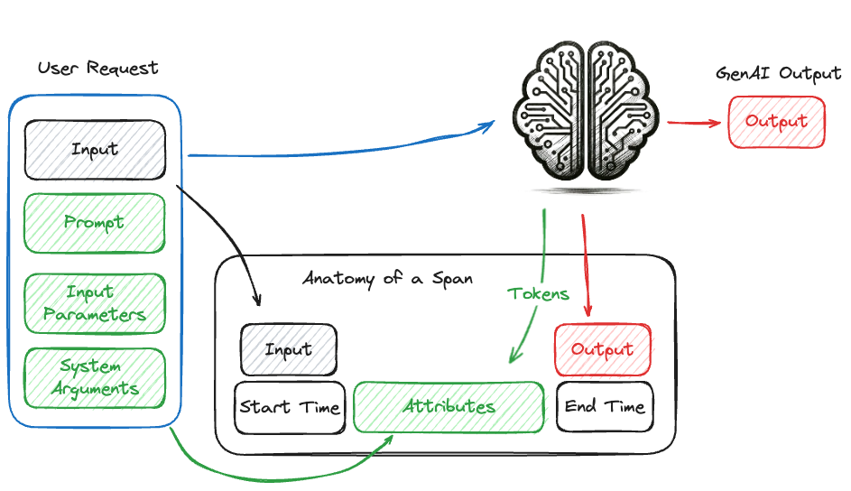

Tracing Concepts
================

In this guide, you can learn about what tracing is as it applies to Generative AI (GenAI) applications and what the main components of tracing are. 

.. figure:: ../../_static/images/intro/tracing-ui.gif
    :alt: MLflow Tracing
    :width: 80%
    :align: center

A good companion to the explanations in this guide is the `Tracing Schema <./tracing-schema.html>`_ guide which will show how MLflow Tracing constructs the 
concepts discussed here.

What is tracing?
----------------

Tracing in the context of machine learning (ML) refers to the detailed tracking and recording of the data flow and processing steps during the execution of an ML model.
It provides transparency and insights into each stage of the model's operation, from data input to prediction output. This detailed tracking is crucial for debugging, 
optimizing, and understanding the performance of ML models.

Traditional Machine Learning
^^^^^^^^^^^^^^^^^^^^^^^^^^^^

In traditional ML, the inference process is relatively straightforward. When a request is made, the input data is fed into the model, which processes the data and generates a prediction. 

The diagram below illustrates the relationship between the input data, the model serving interface, and the model itself.

This process is wholly visible, meaning both the input and output are clearly defined and understandable to the end-user. For example, in a spam detection model, the input is an email, 
and the output is a binary label indicating whether the email is spam or not. The entire inference process is transparent, making it easy to determine what data was sent and what prediction was returned, 
rendering full tracing a largely irrelevant process within the context of qualitative model performance.

However, tracing might be included as part of a deployment configuration to provide additional insights into the nature of processing the requests made to the server, the latency of the model's prediction, 
and for logging API access to the system.  For this classical form of trace logging, in which metadata associated with the inference requests from a latency and performance perspective are monitored and logged, these logs 
are not typically used by model developers or data scientists to understand the model's operation. 

Concept of a Span
^^^^^^^^^^^^^^^^^

In the context of tracing, a span represents a single operation within the system. It captures metadata such as the start time, end time, and other contextual information about the operation. Along with the metadata, the
inputs that are provided to a unit of work (such as a call to a GenAI model, a retrieval query from a vector store, or a function call), as well as the output from the operation, are recorded. 

The diagram below illustrates a call to a GenAI model and the collection of relevant information within a span. The span includes metadata such as the start time, end time, and the request arguments, as well as the input and output of the invocation call.

Concept of a Trace
^^^^^^^^^^^^^^^^^^

A trace in the context of GenAI tracing is a collection of Directed Acyclic Graph (DAG)-like Span events that are asynchronously called and recorded in a processor. Each span represents a single operation within
the system and includes metadata such as start time, end time, and other contextual information. These spans are linked together to form a trace, which provides a comprehensive view of the end-to-end process.

- **DAG-like Structure**: The DAG structure ensures that there are no cycles in the sequence of operations, making it easier to understand the flow of execution.
- **Span Information**: Each span captures a discrete unit of work, such as a function call, a database query, or an API request. Spans include metadata that provides context about the operation.
- **Hierarchical Association**: Spans mirror the structure of your applications, allowing you to see how different components interact and depend on each other.

By collecting and analyzing these spans, one can trace the execution path, identify bottlenecks, and understand the dependencies and interactions between different components of the system. This level of
visibility is crucial for diagnosing issues, optimizing performance, and ensuring the robustness of GenAI applications.

To illustrate what an entire trace can capture in a RAG application, see the illustration below. 

The subsystems that are involved in this application are critical to the quality and relevancy of the system. Having no visibility into the paths that data will follow when interacting with the final stage LLM 
creates an application whose quality could only be achieved by a high degree of monotonouos, tedious, and expensive manual validation of each piece in isolation. 

GenAI ChatCompletions Use Case
^^^^^^^^^^^^^^^^^^^^^^^^^^^^^^

In Generative AI (GenAI) applications, such as chat completions, tracing becomes far more important for the developers of models and GenAI-powered applications. These use cases involve generating human-like text
based on input prompts. While not nearly as complex as GenAI applications that involve agents or informational retrieval to augment a GenAI model, a chat interface can benefit from tracing. Enabling tracing on per-interaction interfaces
with a GenAI model via a chat session allows for evaluating the entire contextual history, prompt, input, and configuration parameters along with the output, enacpasulating the full context of the request payload that has been 
submitted to the GenAI model. 

As an example, the illustration below shows the nature of a ChatCompletions interface used for connecting a model, hosted in a deployment server, to an external GenAI service. 

Additional metadata surrounding the inference process is useful for various reasons, including billing, performance evaluation, relevance, evaluation of hallucinations, and general debugging. Key metadata includes:

- **Token Counts**: The number of tokens processed, which affects billing.
- **Model Name**: The specific model used for inference.
- **Provider Type**: The service or platform providing the model.
- **Query Parameters**: Settings such as temperature and top-k that influence the generation process.
- **Query Input**: The request input (user question).
- **Query Response**: The system-generated response to the input query, utilizing the query parameters to adjust generation.

This metadata helps in understanding how different settings affect the quality and performance of the generated responses, aiding in fine-tuning and optimization.

Advanced Retrieval-Augmented Generation (RAG) Applications
^^^^^^^^^^^^^^^^^^^^^^^^^^^^^^^^^^^^^^^^^^^^^^^^^^^^^^^^^^

In more complex applications like Retrieval-Augmented Generation (RAG), tracing is essential for effective debugging and optimization. RAG involves multiple stages, including document retrieval and interaction with GenAI models. 
When only the input and output are visible, it becomes challenging to identify the source of issues or opportunities for improvement.

For example, if a GenAI system generates an unsatisfactory response, the problem might lie in:

- **Vector Store Optimization**: The efficiency and accuracy of the document retrieval process.
- **Embedding Model**: The quality of the model used to encode and search for relevant documents.
- **Reference Material**: The content and quality of the documents being queried.

Tracing allows each step within the RAG pipeline to be investigated and adjudicated for quality. By providing visibility into every stage, tracing helps pinpoint where adjustments are needed, whether in the
retrieval process, the embedding model, or the content of the reference material.

For example, the diagram below illustrates the complex interactions that form a simple RAG application, wherein the GenAI model is called repeatedly with additional retrieved data that guides the final output generation response. 

Without tracing enabled on such a complex system, it is challenging to identify the root cause of issues or bottlenecks. The following steps would effectively be a "black box":

1. **Embedding of the input query**
2. **The return of the encoded query vector**
3. **The vector search input**
4. **The retrieved document chunks from the Vector Database**
5. **The final input to the GenAI model**

Diagnosing correctness issues with responses in such a system without these 5 critical steps having instrumentation configured to capture the inputs, outputs, and metadata associated with each request
creates a challenging scenario to debug, improve, or refine such an application. When considering performance tuning for responsiveness or cost, not having the visibility into latencies for each of these 
steps presents an entirely different challenge that would require the configuration and manual instrumentation of each of these services. 

Getting Started with Tracing in MLflow
--------------------------------------

To learn how to utilize tracing in MLflow, see the `MLflow Tracing Guide <./index.html>`_.
