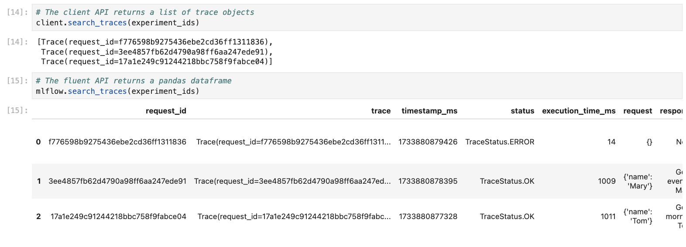

Searching and Retrieving Traces
===============================

This page describes various ways to search and retrieve traces in MLflow. MLflow provides two methods for this purpose: 
:py:meth:`MlflowClient.search_traces() <mlflow.client.MlflowClient.search_traces>` and :py:func:`mlflow.search_traces`.

- :py:meth:`MlflowClient.search_traces() <mlflow.client.MlflowClient.search_traces>`: This method allows you to filter traces using experiment IDs, 
  filter strings, and other parameters.

- :py:func:`mlflow.search_traces`: A higher-level fluent API that returns a pandas DataFrame, with each row representing 
  a trace. It supports the same filtering capabilities as `MlflowClient.search_traces` and additionally allows you to specify 
  fields to extract from traces. See :ref:`extract_fields` for details. 

The pandas Dataframe returned by the :py:func:`mlflow.search_traces` API consists of the following columns by default:

- request_id: A primary identifier of a trace
- trace: A trace object.
- timestamp_ms: The start time of the trace in milliseconds.
- status: The status of the trace.
- execution_time_ms: The duration of the trace in milliseconds.
- request: The input to the traced logic.
- response: The output of the traced logic.
- request_metadata: Key-value pairs associated with the trace.
- spans: Spans in the trace.
- tags: Tags associated with the trace.

Basic Usage of Search Traces
----------------------------

First, create several traces using the following code:

.. code-block:: python

    import time
    import mlflow
    from mlflow.entities import SpanType

    # Define methods to be traced
    @mlflow.trace(span_type=SpanType.TOOL, attributes={"time": "morning"})
    def morning_greeting(name: str):
        time.sleep(1)
        mlflow.update_current_trace(tags={"person": name})
        return f"Good morning {name}."

    @mlflow.trace(span_type=SpanType.TOOL, attributes={"time": "evening"})
    def evening_greeting(name: str):
        time.sleep(1)
        mlflow.update_current_trace(tags={"person": name})
        return f"Good evening {name}."

    @mlflow.trace(span_type=SpanType.TOOL)
    def goodbye():
        raise Exception("Cannot say goodbye")

    # Execute the methods within different experiments
    morning_experiment = mlflow.set_experiment("Morning Experiment")
    morning_greeting("Tom")

    # Get the timestamp in milliseconds
    morning_time = int(time.time() * 1000)

    evening_experiment = mlflow.set_experiment("Evening Experiment")
    experiment_ids = [morning_experiment.experiment_id, evening_experiment.experiment_id]
    evening_greeting("Mary")
    goodbye()

The code above creates the following traces:

.. list-table::
   :header-rows: 1

   * - Experiment
     - Name
     - Tags.person
     - Status
   * - Morning Experiment
     - ``morning_greeting``
     - ``Tom``
     - ``OK``
   * - Evening Experiment
     - ``evening_greeting``
     - ``Mary``
     - ``OK``
   * - Evening Experiment
     - ``goodbye``
     - ``N/A``
     - ``ERROR``

Then, you can search traces by ``experiment_ids`` using either :py:func:`mlflow.search_traces` or 
:py:meth:`MlflowClient.search_traces() <mlflow.client.MlflowClient.search_traces>`.

.. note::

    The ``experiment_ids`` parameter is **required** for :py:meth:`MlflowClient.search_traces() <mlflow.client.MlflowClient.search_traces>`, 
    while it is **optional** for :py:func:`mlflow.search_traces` and it defaults to the currently active experiment.

.. code-block:: python

    from mlflow import MlflowClient

    client = MlflowClient()

    client.search_traces(experiment_ids=[morning_experiment.experiment_id])
    # [Trace #1]

    mlflow.search_traces(experiment_ids=[morning_experiment.experiment_id])
    #     request_id     status          ...    response
    # 0   [trace #1 ID]  TraceStatus.OK  ...    Good morning Tom.

Search Traces with **filter_string**
------------------------------------

The ``filter_string`` argument provides a flexible way to query traces using a SQL-like **Domain-Specific Language (DSL)**.
The syntax supports searching traces with various metadata and allows for combining multiple conditions.

Filter Traces by Name
^^^^^^^^^^^^^^^^^^^^^

Search for traces by the ``attributes.name`` keyword:

.. code-block:: python

    client.search_traces(
        experiment_ids=experiment_ids,
        filter_string="attributes.name = 'morning_greeting'",
    )
    # [Trace #1]

Filter Traces by Timestamp
^^^^^^^^^^^^^^^^^^^^^^^^^^

Search traces created after a specific timestamp:

.. code-block:: python

    client.search_traces(
        experiment_ids=experiment_ids,
        filter_string=f"attributes.timestamp > {morning_time}",
    )
    # [Trace #2, Trace #3]

Filter Traces by Tags
^^^^^^^^^^^^^^^^^^^^^

Filter traces by specific tag values using ``tag.[tag name]``:

.. code-block:: python

    client.search_traces(
        experiment_ids=experiment_ids,
        filter_string="tag.person = 'Tom'",
    )
    # [Trace #1]

Filter Traces by Status
^^^^^^^^^^^^^^^^^^^^^^^

Search for traces by their status:

.. code-block:: python

    client.search_traces(
        experiment_ids=experiment_ids,
        filter_string="attributes.status = 'OK'",
    )
    # [Trace #1, Trace #2]

Combine Multiple Conditions
^^^^^^^^^^^^^^^^^^^^^^^^^^^

The `filter_string` DSL allows you to combine multiple filters together by using ``AND``.

.. code-block:: python

    client.search_traces(
        experiment_ids=experiment_ids,
        filter_string=f"attributes.status = 'OK' AND attributes.timestamp > {morning_time}",
    )
    # [Trace #2]

Order Traces
------------

The ``order_by`` argument allows you to sort traces based on one or more fields. Each ``order_by`` clause follows 
the format ``[attribute name] [ASC or DESC]``.

.. code-block:: python

    client.search_traces(
        experiment_ids=experiment_ids,
        order_by=["timestamp DESC"],
    )
    # [Trace #3, Trace #2, Trace #1]

.. _extract_fields:

Extract Specific Fields
-----------------------

In addition to the search functionalities mentioned above, the fluent API :py:func:`mlflow.search_traces` enables you 
to extract specific fields from traces using the format ``"span_name.[inputs|outputs]"`` or 
``"span_name.[inputs|outputs].field_name"``. This feature is useful for generating evaluation datasets or analyzing 
model performance. Refer to `MLFlow LLM Evaluation <https://mlflow.org/docs/latest/llms/llm-evaluate/index.html>`_ for more details.

.. code-block:: python

    traces = mlflow.search_traces(
        extract_fields=["morning_greeting.inputs", "morning_greeting.outputs"],
        experiment_ids=[morning_experiment.experiment_id],
    )

    print(traces)

The output Pandas DataFrame contains the additional columns for the extracted span fields:

.. code-block:: text

        request_id                              ...     morning_greeting.inputs        morning_greeting.outputs
    0   053adf2f5f5e4ad68d432e06e254c8a4        ...     {'name': 'Tom'}                'Good morning Tom.'

Lastly, you can convert the pandas DataFrame to the MLflow LLM evaluation dataset format and evaluate your language model.

.. code-block:: python

    eval_data = traces.rename(
        columns={
            "morning_greeting.inputs": "inputs",
            "morning_greeting.outputs": "ground_truth",
        }
    )
    results = mlflow.evaluate(
        model,
        eval_data,
        targets="ground_truth",
        model_type="question-answering",
    )
