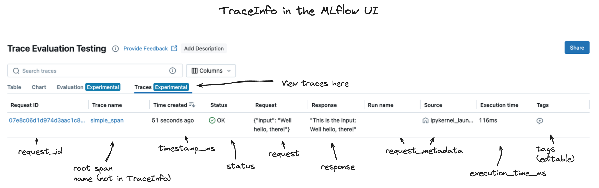
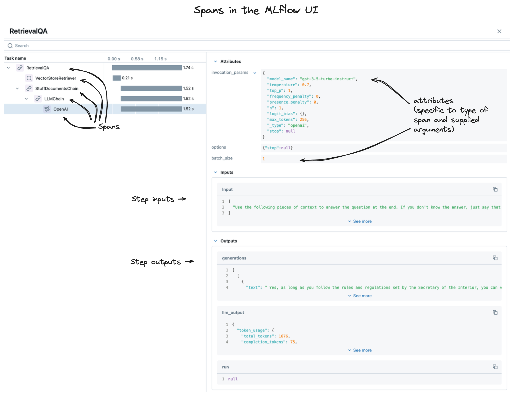

MLflow Tracing Schema
=====================

Structure of Traces
-------------------

.. |trace-architecture| raw:: html

        

            

                <h4>Trace Architecture</h4>
                
A <a href="../../python_api/mlflow.entities.html#mlflow.entities.Trace">Trace</a> in MLflow consists of two components: 
                   <a href="../../python_api/mlflow.entities.html#mlflow.entities.TraceInfo">Trace Info</a> and 
                   <a href="../../python_api/mlflow.entities.html#mlflow.entities.TraceData">Trace Data</a>. 
                

                
The metadata that aids in explaining the origination
                   of the trace, the status of the trace, and the information about the total execution time is stored within the Trace Info. The Trace 
                   Data is comprised entirely of the instrumented <a href="../../python_api/mlflow.entities.html#mlflow.entities.Span">Span</a> 
                   objects that make up the core of the trace.
                

            

            

                
            

        

.. |trace-info| raw:: html

        

            

              <h4>Trace Info Structure</h4>
              
 The Trace Info within MLflow's tracing feature aims to provide a lightweight snapshot of critical data about the overall trace. 
                This includes the logistical information about the trace, such as the experiment_id, providing the storage location for the trace, 
                as well as trace-level data such as start time and total execution time. The Trace Info also includes tags and status information for 
                the trace as a whole.
              

            

            

                
            

        

.. |trace-data| raw:: html

        

            

              <h4>Trace Data Structure</h4>
              
 The Trace Data within MLflow's tracing feature provides the core of the trace information. Within this object is a list of 
                <a href="../../python_api/mlflow.entities.html#mlflow.entities.Span">Span</a> objects that represent the individual steps of the trace. 
                These spans are associated with one another in a hierarchical relationship, providing a clear order-of-operations linkage of what 
                happened within your application during the trace.
              

            

            

                
            

        

.. |span-architecture| raw:: html

        

            

              <h4>Span Structure</h4>
              
 The Span object within MLflow's tracing feature provides detailed information about the individual steps of the trace. 
                Each Span object contains information about the step being instrumented, including the span_id, name, start_time, parent_id, status, 
                inputs, outputs, attributes, and events.
              

            

            

                
            

        

.. container:: tracing-responsive-tabs

    .. tabs::

        .. tab:: Trace Architecture

            |trace-architecture|

        .. tab:: Trace Info

            |trace-info|

        .. tab:: Trace Data

            |trace-data|

        .. tab:: Span Architecture

            |span-architecture|

Trace Schema
------------

A trace is composed of two components:

- :py:func:`mlflow.entities.trace_info.TraceInfo`

- :py:func:`mlflow.entities.trace_data.TraceData`

.. tip::
    Check the API documentation for helper methods on these dataclass objects for more information on how to convert or extract data from them.

Trace Info
----------

Trace Info is a dataclass object that contains metadata about the trace. This metadata includes information about the trace's origin, status, and 
various other data that aids in retrieving and filtering traces when used with :py:meth:`mlflow.client.MlflowClient.search_traces` and for 
navigation of traces within the MLflow UI.

To learn more about how ``TraceInfo`` metadata is used for searching, you can see examples :ref:`here <search_traces>`.

The data that is contained in the ``TraceInfo`` object is used to populate the trace view page within the MLflow tracking UI, as shown below.

The primary components of MLflow :py:class:`TraceInfo <mlflow.entities.trace_info.TraceInfo>` objects are listed below.

.. list-table::
    :widths: 20 40 40
    :header-rows: 1
    :class: wrap-table

    * - **Property**
      - **Description**
      - **Note**

    * - **request_id**
      - A unique identifier for the trace. The identifier is used within MLflow and integrated system to resolve the event being captured and to provide associations for external systems to map the logged trace to the originating caller.
      - This value is generated by the tracing backend and is immutable. Within the tracing client APIs, you will need to deliberately pass this value to the :py:meth:`span creation API<mlflow.client.MlflowClient.start_span>` to ensure that a given span is associated with a trace.

    * - **experiment_id**
      - The ID of the experiment in which the trace was logged. All logged traces are associated with the current active experiment when the trace is generated (during invocation of an instrumented object).
      - This value is immutable and is set by the tracing backend. It is a system-controlled value that is very useful when using the :py:meth:`Search Traces <mlflow.client.MlflowClient.search_traces>` API.

    * - **timestamp_ms**
      - The time that marks the moment when the root span of the trace was created. This is a Unix timestamp in milliseconds.
      - The time reflected in this property is the time at with the trace was created, not the time at which a request to your application was made. As such, it does not factor into account the time it took to process the request to the environment in which your application is being served, which may introduce additional latency to the total round trip time, depending on network configurations. 

    * - **execution_time_ms**
      - The time that marks the moment when the call to end the trace is made. This is a Unix timestamp in milliseconds.
      - This time does not include the networking time associated with sending the response from the environment that generates the trace to the environment that is consuming the application's invocation result.

    * - **status**
      - An enumerated value that denotes the status of the trace. 
      - ``TraceStatus`` values are one of: 
      
        * **OK** - The trace and the instrumented call were successful.
        * **ERROR** - An error occurred while an application was being instrumented. The error can be seen within the span data for the trace.
        * **IN_PROGRESS** - The trace has started and is currently running. Temporary state that will update while spans are being logged to a trace.
        * **TRACE_STATUS_UNSPECIFIED** - internal default state that should not be seen in logged traces.

    * - **request_metadata**
      - The request metadata are additional key-value pairs of information that are associated with the Trace, set and modified by the tracing backend. 
      - These are not open for addition or modification by the user, but can provide additional context about the trace, such as an MLflow ``run_id`` that is associated with the trace. 

    * - **tags**
      - User-defined key-value pairs that can be applied to a trace for applying additional context, aid in :ref:`search functionality <search_traces>`, or to provide additional information during the creation or after the successful logging of a trace. 
      - These tags are fully mutable and can be changed at any time, even long after a trace has been logged to an experiment.

Trace Data
----------

The MLflow :py:class:`TraceData <mlflow.entities.trace_data.TraceData>` object is a dataclass object that holds the core of the trace data. This object contains
the following elements:

.. list-table::
    :widths: 20 40 40
    :header-rows: 1
    :class: wrap-table

    * - **Property**
      - **Description**
      - **Note**

    * - **request**
      - The ``request`` property is the input data for the entire trace. The input ``str`` is a JSON-serialized string that contains the input data for the trace, typically the end-user request that was submitted as a call to the application.
      - Due to the varied structures of inputs that could go to a given application that is being instrumented by MLflow Tracing, all inputs are JSON serialized for compatibility's sake. This allows for the input data to be stored in a consistent format, regardless of the input data's structure.
    
    * - **spans**
      - This property is a list of :py:class:`Span <mlflow.entities.span.Span>` objects that represent the individual steps of the trace.
      - For further information on the structure of Span objects, see the section below.

    * - **response**
      - The ``response`` property is the final output data that will be returned to the caller of the invocation of the application. 
      - Similar to the request property, this value is a JSON-serialized string to maximize compatibility of disparate formats.

Span Schema
-----------

Spans are the core of the trace data. They record key, critical data about each of the steps within your genai application. 

When you view your traces within the MLflow UI, you're looking at a collection of spans, as shown below. 

The sections below provide a detailed view of the structure of a span.

.. list-table::
    :widths: 20 40 40
    :header-rows: 1
    :class: wrap-table

    * - **Property**
      - **Description**
      - **Note**

    * - **inputs**
      - The inputs are stored as JSON-serialized strings, representing the input data that is passed into the particular stage (step) of your application. Due to the wide variety of input data that can be passed between specific stages of a GenAI application, this data may be extremely large (such as when using the output of a vector store retrieval step).
      - Reviewing the Inputs, along with the Outputs, of individual stages can dramatically increase the ability to diagnose and debug issues that exist with responses coming from your application.
    
    * - **outputs**
      - The outputs are stored as JSON-serialized strings, representing the output data that is passed out of the particular stage (step) of your application.
      - Just as with the Inputs, the Outputs can be quite large, depending on the complexity of the data that is being passed between stages.
    
    * - **attributes**
      - Attributes are metadata that are associated with a given step within your application. These attributes are key-value pairs that can be used to provide insight into behavioral modifications for function and method calls, giving insight into how modification of them can affect the performance of your application.
      - Common examples of attributes that could be associated with a given span include:
          
          * **model**
          * **temperature**
          * **document_count**
        
        These attributes provide additional context and insight into the results that are present in the ``outputs`` property for the span.
    
    * - **events**
      - Events are a system-level property that is optionally applied to a span only if there was an issue during the execution of the span. These events contain information about exceptions that were thrown in the instrumented call, as well as the stack trace.
      - This data is structured within a :py:class:`SpanEvent <mlflow.entities.SpanEvent>` object, containing the properties:
          
          * **name**
          * **timestamp**
          * **attributes**
        
        The **attributes** property contains the stack trace of the exception that was thrown during the execution of the span if such an error occurred during execution.

    * - **parent_id**
      - The ``parent_id`` property is an identifier that establishes the hierarchical association of a given span with its parent span. This is used to establish an event chain for the spans, helping to determine which step followed another step in the execution of the application.
      - A span **must** have a ``parent_id`` set. 
    
    * - **span_id**
      - The ``span_id`` is a unique identifier that is generated for each span within a trace. This identifier is used to disambiguate spans from one another and allow for proper association of the span within the sequential execution of other spans within a trace.
      - A ``span_id`` is set when a span is created and is immutable.
    
    * - **request_id**
      - The ``request_id`` property is a unique identifier that is generated for each **trace** and is propogated to each span that is a member of that trace. 
      - The ``request_id`` is a system-generated propoerty and is immutable.
    
    * - **name**
      - The ``name`` of the trace is either user-defined (optionally when using the fluent and client APIs) or is automatically generated through CallBack integrations or when omitting the ``name`` argument when calling the fluent or client APIs. If the name is not overridden, the name will be generated based on the name of the function or method that is being instrumented.
      - It is recommended to provide a name for your span that is unique and relevant to the functionality that is being executed when using manual instumentation via the client or fluent APIs. Generic names for spans or confusing names can make it difficult to diagnose issues when reviewing traces.

    * - **status**
      - The status of a span is reflected in a value from the enumeration object ``SpanStatusCode``. The span status object contains an optional description if the ``status_code`` is reflecting an error that occured. The values that the status may have are:

          * **OK** - The span and the underlying instrumented call were successful.
          * **UNSET** - The status of the span hasn't been set yet (this is the default value and should not be seen in logged trace events).
          * **ERROR** - An issue happened within the call being instrumented. The ``description`` property will contain additional information about the error that occurred.
      
      - Evaluating the status of spans can greatly reduce the amount of time and effort required to diagnose issues with your applications. 
    
    * - **start_time_ns**
      - The unix timestamp (in nanoseconds) when the span was started.
      - The precision of this property is higher than that of the trace start time, allowing for more granular analysis of the execution time of very short-lived spans.

    * - **end_time_ns**
      - The unix timestamp (in nanoseconds) when the span was ended.
      - This precision is higher than the trace timestamps, similar to the ``start_time_ns`` timestamp above.
