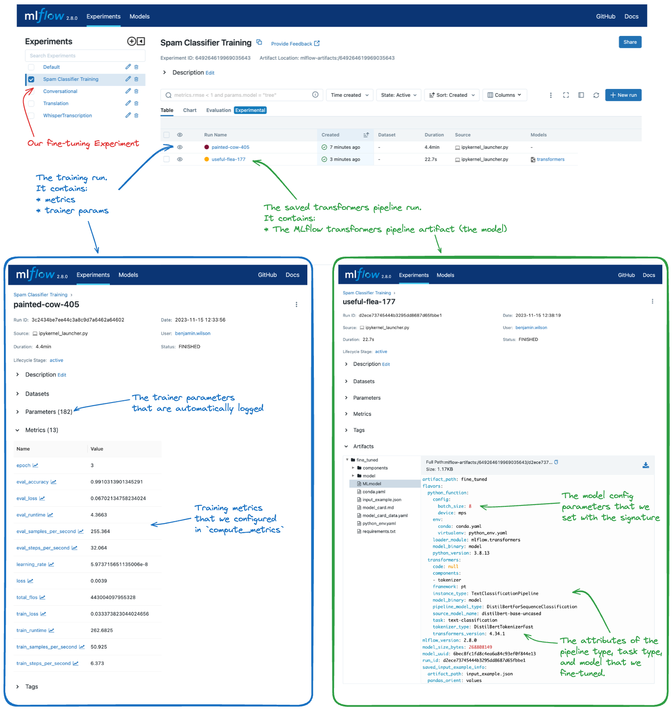

MLflow Transformers Flavor
==========================

.. attention::
    The ``transformers`` flavor is in active development and is marked as Experimental. Public APIs may change and new features are
    subject to be added as additional functionality is brought to the flavor.

Introduction
------------

**Transformers** by 🤗 `Hugging Face <https://huggingface.co/docs/transformers/index>`_ represents a cornerstone in the realm of 
machine learning, offering state-of-the-art capabilities for a multitude of frameworks including `PyTorch <https://pytorch.org/>`_, 
`TensorFlow <https://www.tensorflow.org/>`_, and `JAX <https://jax.readthedocs.io/en/latest/notebooks/quickstart.html>`_. 
This library has become the de facto standard for natural language processing (NLP) and audio transcription processing. 
It also provides a compelling and advanced set of options for computer vision and multimodal AI tasks. 
Transformers achieves all of this by providing pre-trained models and accessible high-level APIs that are not only powerful 
but also versatile and easy to implement.

For instance, one of the cornerstones of the simplicity of the transformers library is the `pipeline API <https://huggingface.co/transformers/main_classes/pipelines.html>`_, 
an encapsulation of the most common NLP tasks into a single API call. This API allows users to perform a variety of tasks based on the specified task without 
having to worry about the underlying model or the preprocessing steps. 

.. figure:: ../../_static/images/tutorials/llms/transformers-pipeline-architecture.png
   :alt: Transformers Pipeline Architecture
   :width: 80%
   :align: center

   Transformers Pipeline Architecture for the Whisper Model

The integration of the Transformers library with MLflow enhances the management of machine learning workflows, from experiment 
tracking to model deployment. This combination offers a robust and efficient pathway for incorporating advanced NLP and AI capabilities 
into your applications.

**Key Features of the Transformers Library**:

- **Access to Pre-trained Models**: A vast collection of `pre-trained models <https://huggingface.co/models>`_ for various tasks, minimizing training time and resources.
- **Task Versatility**: Support for multiple modalities including text, image, and speech processing tasks.
- **Framework Interoperability**: Compatibility with PyTorch, TensorFlow, JAX, ONNX, and TorchScript.
- **Community Support**: An active community for collaboration and support, accessible via forums and the Hugging Face Hub.

**MLflow's Transformers Flavor**: 

MLflow supports the use of the Transformers package by providing:

- **Simplified Experiment Tracking**: Efficient logging of parameters, metrics, and models during the `fine-tuning process <https://huggingface.co/docs/transformers/main_classes/trainer>`_.
- **Effortless Model Deployment**: Streamlined deployment to various production environments.
- **Library Integration**: Integration with HuggingFace libraries like `Accelerate <https://huggingface.co/docs/accelerate/index>`_, `PEFT <https://huggingface.co/docs/peft/en/index>`_ for model optimization.
- **Prompt Management**: `Save prompt templates <guide/index.html#saving-prompt-templates-with-transformer-pipelines>`_ with transformers pipelines to optimize inference with less boilerplate.

**Example Use Case:**

For an illustration of fine-tuning a model and logging the results with MLflow, refer to the :ref:`fine-tuning tutorials <transformers-finetuning-tutorials>`. These tutorial demonstrate the process of fine-tuning a pretrained foundational model into the application-specific model such as a spam classifier, SQL generator. MLflow plays a pivotal role in tracking the fine-tuning process, including datasets, hyperparameters, performance metrics, and the final model artifacts. The image below shows the result of the tutorial within the MLflow UI.

   Fine-tuning a Transformers Model with MLflow

Deployment Made Easy
^^^^^^^^^^^^^^^^^^^^

Once a model is trained, it needs to be `deployed for inference <guide/index.html#example-of-loading-a-transformers-model-as-a-python-function>`_. 
MLflow's integration with Transformers simplifies this by providing functions such as :py:func:`mlflow.transformers.load_model` and 
:py:func:`mlflow.pyfunc.load_model`, which allow for easy model serving.
As part of the feature support for enhanced inference with transformers, MLflow provides mechanisms to enable the use of `inference 
arguments <guide/index.html#scalability-for-inference>`_ that can reduce the computational overhead and lower the memory requirements 
for deployment. 

Getting Started with the MLflow Transformers Flavor - Tutorials and Guides
--------------------------------------------------------------------------

Below, you will find a number of guides that focus on different use cases using `transformers`  that leverage MLflow's 
APIs for tracking and inference capabilities. 

.. toctree::
    :maxdepth: 2
    :hidden:

    tutorials/text-generation/text-generation.ipynb
    tutorials/audio-transcription/whisper.ipynb
    tutorials/translation/component-translation.ipynb
    tutorials/conversational/conversational-model.ipynb
    tutorials/conversational/pyfunc-chat-model.ipynb
    tutorials/fine-tuning/transformers-fine-tuning.ipynb
    tutorials/fine-tuning/transformers-peft.ipynb
    tutorials/prompt-templating/prompt-templating.ipynb

Introductory Quickstart to using Transformers with MLflow
^^^^^^^^^^^^^^^^^^^^^^^^^^^^^^^^^^^^^^^^^^^^^^^^^^^^^^^^^

If this is your first exposure to transformers or use transformers extensively but are new to MLflow, this is a great place to start.

.. raw:: html

    <section>
        <article class="simple-grid">
            

                <a href="tutorials/text-generation/text-generation.html">
                    

                        Quickstart: Text Generation with Transformers
                    

                    

                        Learn how to leverage the transformers integration with MLflow in this <strong>introductory quickstart</strong>.
                    

                </a>
            

        </article>
    </section>

.. _transformers-finetuning-tutorials:

Transformers Fine-Tuning Tutorials with MLflow
^^^^^^^^^^^^^^^^^^^^^^^^^^^^^^^^^^^^^^^^^^^^^^

Fine-tuning a model is a common task in machine learning workflows. These tutorials are designed to showcase how to fine-tune a model using the transformers library with harnessing MLflow's APIs for tracking experiment configurations and results.

.. raw:: html

    <section>
        <article class="simple-grid">
            

                <a href="tutorials/fine-tuning/transformers-fine-tuning.html">
                    

                        Fine tuning a transformers Foundation Model
                    

                    

                        Learn how to fine-tune a transformers model using MLflow to keep track of the training process and to log a use-case-specific tuned pipeline.
                    

                </a>
            

            

                <a href="tutorials/fine-tuning/transformers-peft.html">
                    

                        Fine tuning LLMs efficiently using PEFT and MLflow
                    

                    

                        Learn how to fine-tune a large foundational models with significantly reduced memory usage using PEFT (QLoRA) and MLflow.
                    

                </a>
            

    </section>

Use Case Tutorials for Transformers with MLflow
^^^^^^^^^^^^^^^^^^^^^^^^^^^^^^^^^^^^^^^^^^^^^^^

Interested in learning about how to leverage transformers for tasks other than basic text generation? Want to learn more about the breadth of problems that you can solve with transformers and MLflow? 

These more advanced tutorials are designed to showcase different applications of the transformers model architecture and how to leverage MLflow to track and deploy these models.

.. raw:: html

    <section>
        <article class="simple-grid">
            

                <a href="tutorials/audio-transcription/whisper.html">
                    

                        Audio Transcription with Transformers
                    

                    

                        Learn how to leverage the Whisper Model with MLflow to generate accurate audio transcriptions.
                    

                </a>
            

            

                <a href="tutorials/translation/component-translation.html">
                    

                        Translation with Transformers
                    

                    

                        Learn about the options for saving and loading transformers models in MLflow for customization of your workflows with a fun translation example!
                    

                </a>
            

            

                <a href="tutorials/conversational/conversational-model.html">
                    

                        Chat with Transformers
                    

                    

                        Learn the basics of stateful chat Conversational Pipelines with Transformers and MLflow.
                    

                </a>
            

            

                <a href="tutorials/conversational/pyfunc-chat-model.html">
                    

                        Building and Serving an OpenAI-Compatible Chatbot
                    

                    

                        Learn how to build an OpenAI-compatible chatbot using a local Transformers 
                        model and MLflow, and serve it with minimal configuration.
                    

                </a>
            

            

                <a href="tutorials/prompt-templating/prompt-templating.html">
                    

                        Prompt templating with Transformers Pipelines
                    

                    

                        Learn how to set prompt templates on Transformers Pipelines to optimize your LLM's outputs, and simplify the end-user experience.
                    

                </a>
            

            

                <a href="../custom-pyfunc-for-llms/notebooks/custom-pyfunc-advanced-llm.html">
                    

                        Custom PyFunc for Transformers
                    

                    

                        Learn how to define a custom PyFunc using transformers for advanced, state-of-the-art new models.
                    

                </a>
            

        </article>
    </section>

Important Details to be aware of with the transformers flavor
-------------------------------------------------------------

When working with the transformers flavor in MLflow, there are several important considerations to keep in mind:

- **Experimental Status**: The Transformers flavor in MLflow is marked as experimental, which means that APIs are subject to change, and new features may be added over time with potentially breaking changes.
- **PyFunc Limitations**: Not all output from a Transformers pipeline may be captured when using the python_function flavor. For example, if additional references or scores are required from the output, the native implementation should be used instead. Also not all the pipeline types are supported for pyfunc. Please refer to `Loading a Transformers Model as a Python Function <guide/index.html#loading-a-transformers-model-as-a-python-function>`_ for the supported pipeline types and their input and output format.
- **Supported Pipeline Types**: Not all Transformers pipeline types are currently supported for use with the python_function flavor. In particular, new model architectures may not be supported until the transformers library has a designated pipeline type in its supported pipeline implementations.
- **Input and Output Types**: The input and output types for the python_function implementation may differ from those expected from the native pipeline. Users need to ensure compatibility with their data processing workflows.
- **Model Configuration**: When saving or logging models, the `model_config` can be used to set certain parameters. However, if both model_config and a `ModelSignature` with parameters are saved, the default parameters in ModelSignature will override those in `model_config`.
- **Audio and Vision Models**: Audio and text-based large language models are supported for use with pyfunc, while other types like computer vision and multi-modal models are only supported for native type loading.
- **Prompt Templates**: Prompt templating is currently supported for a few pipeline types. For a full list of supported pipelines, and more information about the feature, see `this link <guide/index.html#saving-prompt-templates-with-transformer-pipelines>`_.

Working with ``tasks`` for Transformer Pipelines
------------------------------------------------

In MLflow Transformers flavor, ``task`` plays a crucial role in determining the input and output format of the model. Please refer to the `Tasks in MLflow Transformers <task.html>`_ guide on how to use the native Transformers task types, and leverage the advanced tasks such as ``llm/v1/chat`` and ``llm/v1/completions`` for OpenAI-compatible inference.

.. toctree::
    :maxdepth: 1
    :hidden:

    task

`Detailed Documentation <guide/index.html>`_
--------------------------------------------

To learn more about the nuances of the `transformers` flavor in MLflow, delve into `the comprehensive guide <guide/index.html>`_, which covers:

- `Pipelines vs. Component Logging <guide/index.html#pipelines-vs-component-logging>`_: Explore the different approaches for saving model components or complete pipelines and understand the nuances of loading these models for various use cases.

- `Transformers Model as a Python Function <guide/index.html#loading-a-transformers-model-as-a-python-function>`_ : Familiarize yourself with the various ``transformers`` pipeline types compatible with the pyfunc model flavor. Understand the standardization of input and output formats in the pyfunc model implementation for the flavor, ensuring seamless integration with JSON and Pandas DataFrames.

- `Prompt Template <guide/index.html#saving-prompt-templates-with-transformer-pipelines>`_: Learn how to save a prompt template with transformers pipelines to optimize inference with less boilerplate.

- `Model Config and Model Signature Params for Inference <guide/index.html#using-model-config-and-model-signature-params-for-inference>`_: Learn how to leverage ``model_config`` and ``ModelSignature`` for flexible and customized model loading and inference.

- `Automatic Metadata and ModelCard Logging <guide/index.html#automatic-metadata-and-modelcard-logging>`_: Discover the automatic logging features for model cards and other metadata, enhancing model documentation and transparency.

- `Model Signature Inference <guide/index.html#automatic-signature-inference>`_ : Learn about MLflow's capability within the ``transformers`` flavor to automatically infer and attach model signatures, facilitating easier model deployment.

- `Overriding Pytorch dtype <guide/index.html#scale-inference-with-overriding-pytorch-dtype>`_ : Gain insights into optimizing ``transformers`` models for inference, focusing on memory optimization and data type configurations.

- `Input Data Types for Audio Pipelines <guide/index.html#input-data-types-for-audio-pipelines>`_: Understand the specific requirements for handling audio data in transformers pipelines, including the handling of different input types like str, bytes, and np.ndarray.

- `Storage-Efficient Model Logging with save_pretrained Option <guide/index.html#storage-efficient-model-logging-with-save-pretrained-option>`_: Learn how to leverage the new ``save_pretrained`` option to speed up model saving and loading for large foundational models without consuming excessive storage space.

- `PEFT Models in MLflow Transformers flavor <guide/index.html#peft-models-in-mlflow-transformers-flavor>`_: PEFT (Parameter-Efficient Fine-Tuning) is natively supported in MLflow, enabling various optimization techniques like LoRA, QLoRA, and more for reducing fine-tuning cost significantly. Check out the guide and tutorials to learn more about how to leverage PEFT with MLflow.

.. toctree::
    :maxdepth: 1
    :hidden:

    guide/index

Learn more about Transformers
-----------------------------

Interested in learning more about how to leverage transformers for your machine learning workflows? 

🤗 Hugging Face has a fantastic NLP course. Check it out and see how to leverage `Transformers, Datasets, Tokenizers, and Accelerate <https://huggingface.co/learn/nlp-course/chapter1/1>`_.
