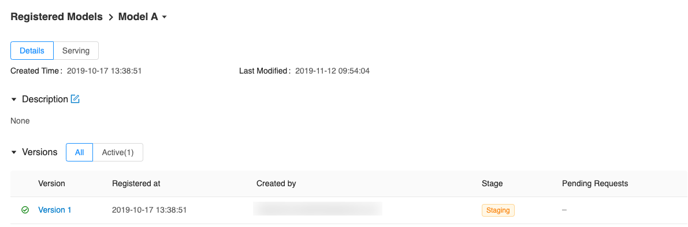
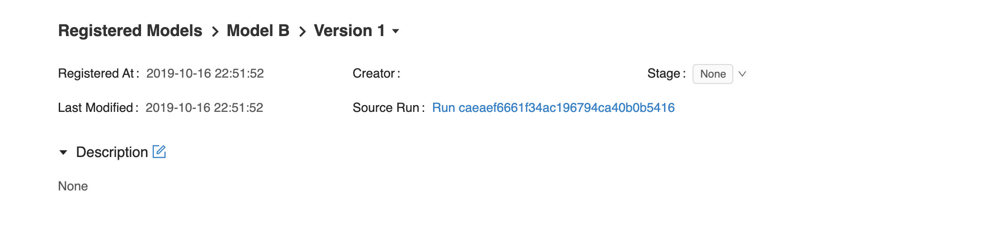
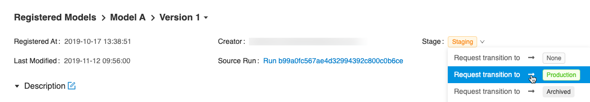

.. _registry:

=====================
MLflow Model Registry
=====================

The MLflow Model Registry component is a centralized model store, set of APIs, and UI, to
collaboratively manage the full lifecycle of an MLflow Model. It provides model lineage (which
MLflow experiment and run produced the model), model versioning, stage transitions (for example from
staging to production), and annotations.

.. contents:: Table of Contents
  :local:
  :depth: 3

Concepts
========

The Model Registry introduces a few concepts that describe and facilitate the full lifecycle of an MLflow Model.

Model
    An MLflow Model is created from an experiment or run that is logged with one of the model flavor’s ``mlflow.<model_flavor>.log_model()`` methods. Once logged, this model can then be registered with the Model Registry.

Registered Model
    An MLflow Model can be registered with the  Model Registry. A registered model has a unique name, contains versions, associated transitional stages, model lineage, and other metadata.

Model Version
    Each registered model can have one or many versions. When a new model is added to the Model Registry, it is added as version 1. Each new model registered to the same model name increments the version number.

Model Stage
    Each distinct model version can be assigned one stage at any given time. Model stages can be configured using the MLflow config file. By default, available stages are *Staging* and *Production*, as well es *Archived* and *None*. You can transition a model version from one stage to another stage.

Annotations and Descriptions
    You can annotate the top-level model and each version individually using Markdown, including description and any relevant information useful for the team such as algorithm descriptions, dataset employed or methodology.

Model Registry Workflows
========================
If running your own MLflow server, you must use a database-backed backend store in order to access
the model registry via the UI or API. `See here <tracking.html#backend-stores>`_ for more information.

Before you can add a model to the Model Registry, you must log it using the ``log_model`` methods
of the corresponding model flavors. Once a model has been logged, you can add, modify, update, transition,
or delete model in the Model Registry through the UI or the API.

UI Workflow
-----------

Registering a Model
^^^^^^^^^^^^^^^^^^^

#. From the MLflow Runs detail page, select a logged MLflow Model in the **Artifacts** section.

#. Click the **Register Model** button.

   .. figure:: _static/images/oss_registry_1_register.png

#. In the **Model Name** field, if you are adding a new model, specify a unique name to identify the model. If you are registering a new version to an existing model, pick the existing model name from the dropdown.

  .. figure:: _static/images/oss_registry_2_dialog.png

Using the Model Registry
^^^^^^^^^^^^^^^^^^^^^^^^

- Navigate to the **Registered Models** page and view the model properties.

  .. figure:: _static/images/oss_registry_3_overview.png

- Go to the **Artifacts** section of the run detail page, click the model, and then click the model version at the top right to view the version you just created.

  .. figure:: _static/images/oss_registry_3b_version.png

Each model has an overview page that shows the active versions.

Click a version to navigate to the version detail page.

On the version detail page you can see model version details and the current stage of the model
version. Click the **Stage** drop-down at the top right, to transition the model
version to one of the other valid stages.

API Workflow
------------

An alternative way to interact with Model Registry is using the :ref:`MLflow model flavor <python-api>` or :ref:`MLflow Client Tracking API <mlflow.tracking>` interface.
In particular, you can register a model during an MLflow experiment run or after all your experiment runs.

Adding an MLflow Model to the Model Registry
^^^^^^^^^^^^^^^^^^^^^^^^^^^^^^^^^^^^^^^^^^^^

There are three programmatic ways to add a model to the registry. First, you can use the ``mlflow.<model_flavor>.log_model()`` method. For example, in your code:

.. code-block:: py

    from random import random, randint
    from sklearn.ensemble import RandomForestRegressor

    import mlflow
    import mlflow.sklearn

    with mlflow.start_run(run_name="YOUR_RUN_NAME") as run:
        params = {"n_estimators": 5, "random_state": 42}
        sk_learn_rfr = RandomForestRegressor(**params)

        # Log parameters and metrics using the MLflow APIs
        mlflow.log_params(params)
        mlflow.log_param("param_1", randint(0, 100))
        mlflow.log_metrics({"metric_1": random(), "metric_2": random() + 1})

        # Log the sklearn model and register as version 1
        mlflow.sklearn.log_model(
            sk_model=sk_learn_rfr,
            artifact_path="sklearn-model",
            registered_model_name="sk-learn-random-forest-reg-model"
        )

In the above code snippet, if a registered model with the name doesn’t exist, the method registers a new model and creates Version 1.
If a registered model with the name exists, the method creates a new model version.

The second way is to use the :func:`mlflow.register_model` method, after all your experiment runs complete and when you have decided which model is most suitable to add to the registry.
For this method, you will need the ``run_id`` as part of the ``runs:URI`` argument.

.. code-block:: py

    result = mlflow.register_model(
        "runs:/d16076a3ec534311817565e6527539c0/sklearn-model",
        "sk-learn-random-forest-reg"
    )

If a registered model with the name doesn’t exist, the method registers a new model, creates Version 1, and returns a ModelVersion MLflow object.
If a registered model with the name exists, the method creates a new model version and returns the version object.

And finally, you can use the :meth:`~mlflow.tracking.MlflowClient.create_registered_model` to create a new registered model. If the model name exists,
this method will throw an :class:`~mlflow.exceptions.MlflowException` because creating a new registered model requires a unique name.

.. code-block:: py

   from mlflow.tracking import MlflowClient

   client = MlflowClient()
   client.create_registered_model("sk-learn-random-forest-reg-model")

While the method above creates an empty registered model with no version associated, the method below creates a new version of the model.

.. code-block:: py

    client = MlflowClient()
    result = client.create_model_version(
        name="sk-learn-random-forest-reg-model",
        source="mlruns/0/d16076a3ec534311817565e6527539c0/artifacts/sklearn-model",
        run_id="d16076a3ec534311817565e6527539c0"
    )

Fetching an MLflow Model from the Model Registry
^^^^^^^^^^^^^^^^^^^^^^^^^^^^^^^^^^^^^^^^^^^^^^^^

After you have registered an MLflow model, you can fetch that model using ``mlflow.<model_flavor>.load_model()``, or more generally, :meth:`~mlflow.pyfunc.load_model`.

**Fetch a specific model version**

To fetch a specific model version, just supply that version number as part of the model URI.

.. code-block:: py

    import mlflow.pyfunc

    model_name = "sk-learn-random-forest-reg-model"
    model_version = 1

    model = mlflow.pyfunc.load_model(
        model_uri=f"models:/{model_name}/{model_version}"
    )

    model.predict(data)

**Fetch the latest model version in a specific stage**

To fetch a model version by stage, simply provide the model stage as part of the model URI, and it will fetch the most recent version of the model in that stage.

.. code-block:: py

    import mlflow.pyfunc

    model_name = "sk-learn-random-forest-reg-model"
    stage = 'Staging'

    model = mlflow.pyfunc.load_model(
        model_uri=f"models:/{model_name}/{stage}"
    )

    model.predict(data)

Serving an MLflow Model from Model Registry
^^^^^^^^^^^^^^^^^^^^^^^^^^^^^^^^^^^^^^^^^^^

After you have registered an MLflow model, you can serve the model as a service on your host.

.. code-block:: bash

    #!/usr/bin/env sh

    # Set environment variable for the tracking URL where the Model Registry resides
    export MLFLOW_TRACKING_URI=http://localhost:5000

    # Serve the production model from the model registry
    mlflow models serve -m "models:/sk-learn-random-forest-reg-model/Production"

Adding or Updating an MLflow Model Descriptions
^^^^^^^^^^^^^^^^^^^^^^^^^^^^^^^^^^^^^^^^^^^^^^^

At any point in a model’s lifecycle development, you can update a model version's description using :meth:`~mlflow.tracking.MlflowClient.update_model_version`.

.. code-block:: py

    client = MlflowClient()
    client.update_model_version(
        name="sk-learn-random-forest-reg-model",
        version=1,
        description="This model version is a scikit-learn random forest containing 100 decision trees"
    )

Renaming an MLflow Model
^^^^^^^^^^^^^^^^^^^^^^^^

As well as adding or updating a description of a specific version of the model, you can rename an existing registered model using :meth:`~mlflow.tracking.MlflowClient.rename_registered_model`.

.. code-block:: py

    client = MlflowClient()
    client.rename_registered_model(
        name="sk-learn-random-forest-reg-model",
        new_name="sk-learn-random-forest-reg-model-100"
    )

Transitioning an MLflow Model’s Stage
^^^^^^^^^^^^^^^^^^^^^^^^^^^^^^^^^^^^^
Over the course of the model’s lifecycle, a model evolves—from development to staging to production.
You can transition a registered model to one of the stages: **Staging**, **Production** or **Archived**.

.. code-block:: py

    client = MlflowClient()
    client.transition_model_version_stage(
        name="sk-learn-random-forest-reg-model",
        version=3,
        stage="Production"
    )

The accepted values for <stage> are: Staging|Archived|Production|None.

Listing and Searching MLflow Models
^^^^^^^^^^^^^^^^^^^^^^^^^^^^^^^^^^^
You can fetch a list of all registered models in the registry with a simple method.

.. code-block:: py

    from pprint import pprint

    client = MlflowClient()
    for rm in client.list_registered_models():
        pprint(dict(rm), indent=4)

This outputs:

.. code-block:: python

    {   'creation_timestamp': 1582671933216,
        'description': None,
        'last_updated_timestamp': 1582671960712,
        'latest_versions': [<ModelVersion: creation_timestamp=1582671933246, current_stage='Production', description='A random forest model containing 100 decision trees trained in scikit-learn', last_updated_timestamp=1582671960712, name='sk-learn-random-forest-reg-model', run_id='ae2cc01346de45f79a44a320aab1797b', source='./mlruns/0/ae2cc01346de45f79a44a320aab1797b/artifacts/sklearn-model', status='READY', status_message=None, user_id=None, version=1>,
                            <ModelVersion: creation_timestamp=1582671960628, current_stage='None', description=None, last_updated_timestamp=1582671960628, name='sk-learn-random-forest-reg-model', run_id='d994f18d09c64c148e62a785052e6723', source='./mlruns/0/d994f18d09c64c148e62a785052e6723/artifacts/sklearn-model', status='READY', status_message=None, user_id=None, version=2>],
        'name': 'sk-learn-random-forest-reg-model'}

With hundreds of models, it can be cumbersome to peruse the results returned from this call. A more efficient approach would be to search for a specific model name and list its version
details using :meth:`~mlflow.tracking.MlflowClient.search_model_versions` method
and provide a filter string such as ``"name='sk-learn-random-forest-reg-model'"``

.. code-block:: py

    client = MlflowClient()
    for mv in client.search_model_versions("name='sk-learn-random-forest-reg-model'"):
        pprint(dict(mv), indent=4)

This outputs:

.. code-block:: python

    {   'creation_timestamp': 1582671933246,
        'current_stage': 'Production',
        'description': 'A random forest model containing 100 decision trees '
                       'trained in scikit-learn',
        'last_updated_timestamp': 1582671960712,
        'name': 'sk-learn-random-forest-reg-model',
        'run_id': 'ae2cc01346de45f79a44a320aab1797b',
        'source': './mlruns/0/ae2cc01346de45f79a44a320aab1797b/artifacts/sklearn-model',
        'status': 'READY',
        'status_message': None,
        'user_id': None,
        'version': 1}

    {   'creation_timestamp': 1582671960628,
        'current_stage': 'None',
        'description': None,
        'last_updated_timestamp': 1582671960628,
        'name': 'sk-learn-random-forest-reg-model',
        'run_id': 'd994f18d09c64c148e62a785052e6723',
        'source': './mlruns/0/d994f18d09c64c148e62a785052e6723/artifacts/sklearn-model',
        'status': 'READY',
        'status_message': None,
        'user_id': None,
        'version': 2 }

Archiving an MLflow Model
^^^^^^^^^^^^^^^^^^^^^^^^^
You can move models versions out of a **Production** stage into an **Archived** stage.
At a later point, if that archived model is not needed, you can delete it.

.. code-block:: py

    # Archive models version 3 from Production into Archived
    client = MlflowClient()
    client.transition_model_version_stage(
        name="sk-learn-random-forest-reg-model",
        version=3,
        stage="Archived"
    )

Deleting MLflow Models
^^^^^^^^^^^^^^^^^^^^^^

.. note::
    Deleting registered models or model versions is irrevocable, so use it judiciously.

You can either delete specific versions of a registered model or you can delete a registered model and all its versions.

.. code-block:: py

    # Delete versions 1,2, and 3 of the model
    client = MlflowClient()
    versions=[1, 2, 3]
    for version in versions:
        client.delete_model_version(name="sk-learn-random-forest-reg-model", version=version)

    # Delete a registered model along with all its versions
    client.delete_registered_model(name="sk-learn-random-forest-reg-model")

While the above workflow API demonstrates interactions with the Model Registry, two exceptional cases require attention.
One is when you have existing ML models saved from training without the use of MLflow. Serialized and persisted on disk
in sklearn's pickled format, you want to register this model with the Model Registry. The second is when you use
an ML framework without a built-in MLflow model flavor support, for instance, `vaderSentiment,` and want to register the model.

Registering a Saved Model
^^^^^^^^^^^^^^^^^^^^^^^^^
Not everyone will start their model training with MLflow. So you may have some models trained before the use of MLflow.
Instead of retraining the models, all you want to do is register your saved models with the Model Registry.

This code snippet creates a sklearn model, which we assume that you had created and saved in native pickle format.

.. note::
    The sklearn library and pickle versions with which the model was saved should be compatible with the
    current MLflow supported built-in sklearn model flavor.

.. code-block:: py

    import numpy as np
    import pickle

    from sklearn import datasets, linear_model
    from sklearn.metrics import mean_squared_error, r2_score

    # source: https://scikit-learn.org/stable/auto_examples/linear_model/plot_ols.html

    # Load the diabetes dataset
    diabetes_X, diabetes_y = datasets.load_diabetes(return_X_y=True)

    # Use only one feature
    diabetes_X = diabetes_X[:, np.newaxis, 2]

    # Split the data into training/testing sets
    diabetes_X_train = diabetes_X[:-20]
    diabetes_X_test = diabetes_X[-20:]

    # Split the targets into training/testing sets
    diabetes_y_train = diabetes_y[:-20]
    diabetes_y_test = diabetes_y[-20:]

    def print_predictions(m, y_pred):

        # The coefficients
        print('Coefficients: \n', m.coef_)
        # The mean squared error
        print('Mean squared error: %.2f'
              % mean_squared_error(diabetes_y_test, y_pred))
        # The coefficient of determination: 1 is perfect prediction
        print('Coefficient of determination: %.2f'
              % r2_score(diabetes_y_test, y_pred))

    # Create linear regression object
    lr_model = linear_model.LinearRegression()

    # Train the model using the training sets
    lr_model.fit(diabetes_X_train, diabetes_y_train)

    # Make predictions using the testing set
    diabetes_y_pred = lr_model.predict(diabetes_X_test)
    print_predictions(lr_model, diabetes_y_pred)

    # save the model in the native sklearn format
    filename = 'lr_model.pkl'
    pickle.dump(lr_model, open(filename, 'wb'))

.. code-block:: text

    Coefficients:
    [938.23786125]
    Mean squared error: 2548.07
    Coefficient of determination: 0.47

Once saved in pickled format, we can load the sklearn model into memory using pickle API and
register the loaded model with the Model Registry.

.. code-block:: py

    import mlflow

    # load the model into memory
    loaded_model = pickle.load(open(filename, 'rb'))

    # log and register the model using MLflow scikit-learn API
    mlflow.set_tracking_uri("sqlite:///mlruns.db")
    reg_model_name = "SklearnLinearRegression"
    print("--")
    mlflow.sklearn.log_model(loaded_model, "sk_learn",
                                 serialization_format="cloudpickle",
                                 registered_model_name=reg_model_name)

.. code-block:: text

    --
    Successfully registered model 'SklearnLinearRegression'.
    2021/04/02 16:30:57 INFO mlflow.tracking._model_registry.client: Waiting up to 300 seconds for model version to finish creation.
    Model name: SklearnLinearRegression, version 1
    Created version '1' of model 'SklearnLinearRegression'.

Now, using MLflow fluent APIs, we reload the model from the Model Registry and score.

.. code-block:: py

    # load the model from the Model Registry and score
    model_uri = f"models:/{reg_model_name}/1"
    loaded_model = mlflow.sklearn.load_model(model_uri)
    print("--")

    # Make predictions using the testing set
    diabetes_y_pred = loaded_model.predict(diabetes_X_test)
    print_predictions(loaded_model, diabetes_y_pred)

.. code-block:: text

    --
    Coefficients:
    [938.23786125]
    Mean squared error: 2548.07
    Coefficient of determination: 0.47

Registering an Unsupported Machine Learning Model
^^^^^^^^^^^^^^^^^^^^^^^^^^^^^^^^^^^^^^^^^^^^^^^^^
In some cases, you might use a machine learning framework without its built-in MLflow Model flavor support.
For instance, the `vaderSentiment` library is a standard Natural Language Processing (NLP) library used
for sentiment analysis. Since it lacks a built-in MLflow Model flavor, you cannot log or register the model
using MLflow Model fluent APIs.

To work around this problem, you can create an instance of a :py:mod:`mlflow.pyfunc` model flavor and embed your NLP model
inside it, allowing you to save, log or register the model. Once registered, load the model from the Model Registry
and score using the :py:func:`predict <mlflow.pyfunc.PyFuncModel.predict>` function.

The code sections below demonstrate how to create a ``PythonFuncModel`` class with a ``vaderSentiment`` model embedded in it,
save, log, register, and load from the Model Registry and score.

.. note::
    To use this example, you will need to ``pip install vaderSentiment``.

.. code-block:: py

    from sys import version_info
    import cloudpickle
    import pandas as pd

    import mlflow.pyfunc
    from vaderSentiment.vaderSentiment import SentimentIntensityAnalyzer

    #
    # Good and readable paper from the authors of this package
    # http://comp.social.gatech.edu/papers/icwsm14.vader.hutto.pdf
    #

    INPUT_TEXTS = [{'text': "This is a bad movie. You don't want to see it! :-)"},
               {'text': "Ricky Gervais is smart, witty, and creative!!!!!! :D"},
               {'text': "LOL, this guy fell off a chair while sleeping and snoring in a meeting"},
               {'text': "Men shoots himself while trying to steal a dog, OMG"},
               {'text': "Yay!! Another good phone interview. I nailed it!!"},
               {'text': "This is INSANE! I can't believe it. How could you do such a horrible thing?"}]

    PYTHON_VERSION = "{major}.{minor}.{micro}".format(major=version_info.major,
                                                  minor=version_info.minor,
                                                  micro=version_info.micro)
    def score_model(model):
    # Use inference to predict output from the customized PyFunc model
    for i, text in enumerate(INPUT_TEXTS):
        text = INPUT_TEXTS[i]['text']
        m_input = pd.DataFrame([text])
        scores = loaded_model.predict(m_input)
        print(f"<{text}> -- {str(scores[0])}")

    # Define a class and extend from PythonModel
    class SocialMediaAnalyserModel(mlflow.pyfunc.PythonModel):

        def __init__(self):
          super().__init__()
          # embed your vader model instance
          self._analyser = SentimentIntensityAnalyzer()

       # preprocess the input with prediction from the vader sentiment model
       def _score(self, txt):
          prediction_scores = self._analyser.polarity_scores(txt)
          return prediction_scores

       def predict(self, context, model_input):

          # Apply the preprocess function from the vader model to score
          model_output = model_input.apply(lambda col: self._score(col))
          return model_output

    model_path = "vader"
    reg_model_name = "PyFuncVaderSentiments"
    vader_model = SocialMediaAnalyserModel()

    # Set the tracking URI to use local SQLAlchemy db file and start the run
    # Log MLflow entities and save the model
    mlflow.set_tracking_uri("sqlite:///mlruns.db")

    # Save the conda environment for this model.
    conda_env = {
        'channels': ['defaults', 'conda-forge'],
        'dependencies': [
            'python={}'.format(PYTHON_VERSION),
            'pip'],
        'pip': [
            'mlflow',
            'cloudpickle=={}'.format(cloudpickle.__version__),
            'vaderSentiment==3.3.2'
        ],
        'name': 'mlflow-env'
    }

    # Save the model
    with mlflow.start_run(run_name="Vader Sentiment Analysis") as run:
        model_path = f"{model_path}-{run.info.run_uuid}"
        mlflow.log_param("algorithm", "VADER")
        mlflow.log_param("total_sentiments", len(INPUT_TEXTS))
        mlflow.pyfunc.save_model(path=model_path, python_model=vader_model, conda_env=conda_env)

    # Use the saved model path to log and register into the model registry
    mlflow.pyfunc.log_model(artifact_path=model_path,
                            python_model=vader_model,
                            registered_model_name=reg_model_name,
                            conda_env=conda_env)

    # Load the model from the model registry and score
    model_uri = f"models:/{reg_model_name}/1"
    loaded_model = mlflow.pyfunc.load_model(model_uri)
    score_model(loaded_model)

.. code-block:: text

    Successfully registered model 'PyFuncVaderSentiments'.
    2021/04/05 10:34:15 INFO mlflow.tracking._model_registry.client: Waiting up to 300 seconds for model version to finish creation.
    Created version '1' of model 'PyFuncVaderSentiments'.

    <This is a bad movie. You don't want to see it! :-)> -- {'neg': 0.307, 'neu': 0.552, 'pos': 0.141, 'compound': -0.4047}
    <Ricky Gervais is smart, witty, and creative!!!!!! :D> -- {'neg': 0.0, 'neu': 0.316, 'pos': 0.684, 'compound': 0.8957}
    <LOL, this guy fell off a chair while sleeping and snoring in a meeting> -- {'neg': 0.0, 'neu': 0.786, 'pos': 0.214, 'compound': 0.5473}
    <Men shoots himself while trying to steal a dog, OMG> -- {'neg': 0.262, 'neu': 0.738, 'pos': 0.0, 'compound': -0.4939}
    <Yay!! Another good phone interview. I nailed it!!> -- {'neg': 0.0, 'neu': 0.446, 'pos': 0.554, 'compound': 0.816}
    <This is INSANE! I can't believe it. How could you do such a horrible thing?> -- {'neg': 0.357, 'neu': 0.643, 'pos': 0.0, 'compound': -0.8034}

