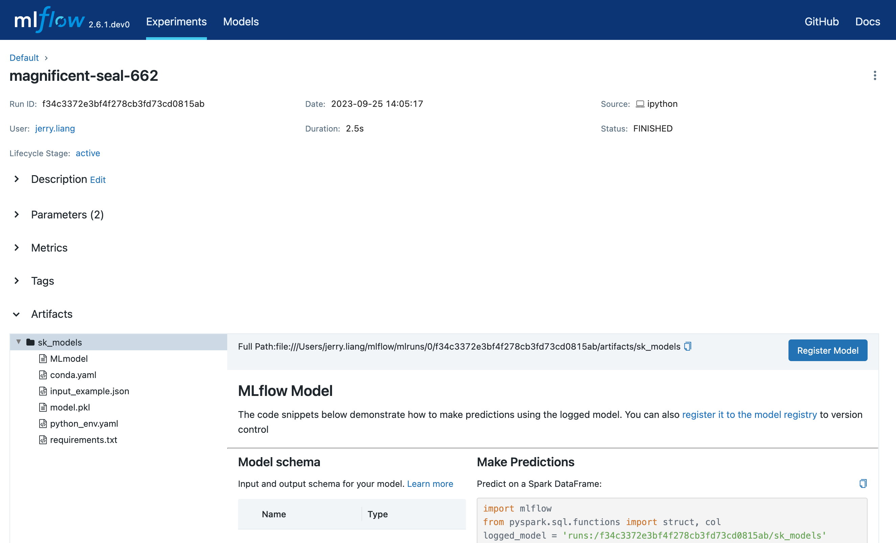
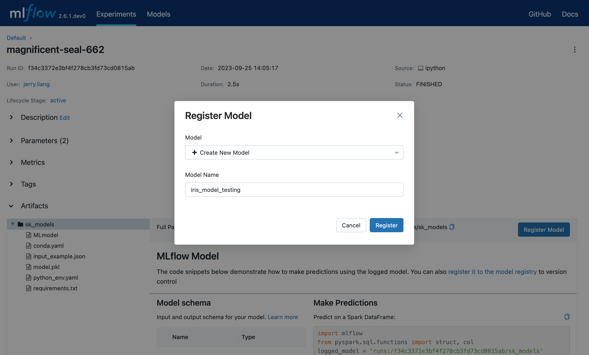

.. _registry:

=====================
MLflow Model Registry
=====================

The MLflow Model Registry component is a centralized model store, set of APIs, and UI, to
collaboratively manage the full lifecycle of an MLflow Model. It provides model lineage (which
MLflow experiment and run produced the model), model versioning, stage transitions (for example from
staging to production), and annotations.

.. contents:: Table of Contents
  :local:
  :depth: 1

Concepts
========

The MLflow Model Registry is a standalone component that introduces several concepts that
describe the full lifecycle of an MLflow Model.

Model
    An MLflow Model logged with one of the model flavor’s ``log_model`` methods.

Registered Model
    An MLflow Model registered with the MLflow Model Registry. A registered model has a unique name, contains versions, and other metadata.

Model Version
    Each registered model can have one or many versions. When a new model is added to the Model Registry, it is added as version 1. Each new model registered to the same model name increments the version number.

Model Stage
    Each model version can be assigned one or many stages. MLflow provides predefined stages for
    common use-cases such as *Staging* and *Production*.

Adding an MLflow Model to the Model Registry
============================================

Before a model can be added to the Model Registry you must log it using the ``log_model`` methods
of the corresponding model flavors. Once a model has been logged, you can add it to the registry
either through a UI workflow or through APIs.

UI Workflow
-----------

From the MLflow Runs detail page, select a logged MLflow Model in the **Artifacts** section. Click the **Register Model** button.

In the **Model Name** field, if you are adding a new model, specify a unique name to identify the model. If you are registering a new version to an existing model, pick the existing model name from the dropdown.

Once the model is added to the Model Registry you can:

- Navigate to the **Registered Models** page and view the model properties.

  .. figure:: _static/images/oss_registry_3_overview.png

- Go to the **Artifacts** section of the run detail page, click the model, and then click the model version at the top right to view the version you just created.

  .. figure:: _static/images/oss_registry_3b_version.png

Each model has an overview page that shows the active versions. Click a version to navigate to the version detail page.

.. figure:: _static/images/oss_registry_4_version.png

On the version detail page you can see model version details and the current stage of the model
version. If you click on the stage in the top right, you can transition the model
version to one of the other valid stages.

.. figure:: _static/images/oss_registry_5_transition.png

API Workflow
------------

Once a model is logged using ``log_model`` you can add it to the registry, referencing the model by its URI.

Call the ``register_model`` API to add it to the registry.

.. code-block:: py

   mlflow.register_model("runs:/e148278107274..832/artifacts/model",
                         "EmailMarketingCampaign")

Alternatively, you can pass ``registered_model_name`` to ``log_model`` to log the model under the
specified registered model.

.. code-block:: py

   mlflow.tensorflow.log_model(tf_saved_model_dir=saved_estimator_path,
                               tf_meta_graph_tags=[tag_constants.SERVING],
                               tf_signature_def_key="predict",
                               artifact_path="model",
                               registered_model_name="EmailMarketingCampaign")

.. note:: If the registered model does not already exist, the registry will create one before creating a new model version.

With the ``get_model_version_details`` API you can confirm that the model has successfully been
registered.

.. code-block:: py

   client = mlflow.tracking.MlflowClient()
   client.get_model_version_details(name = "EmailMarketingCampaign",
                                    version = 12)

You can ask for the latest version of each registered model by a particular stage.

.. code-block:: py

   client.get_latest_versions(name = "EmailMarketingCampaign",
                              stages = ["Staging"])

Newly-registered model versions are added to the registry with stage **None**. You can update its
stage.

.. code-block:: py

   client.update_model_version(name = "EmailMarketingCampaign",
                               version = 12
                               stage = "Production")
