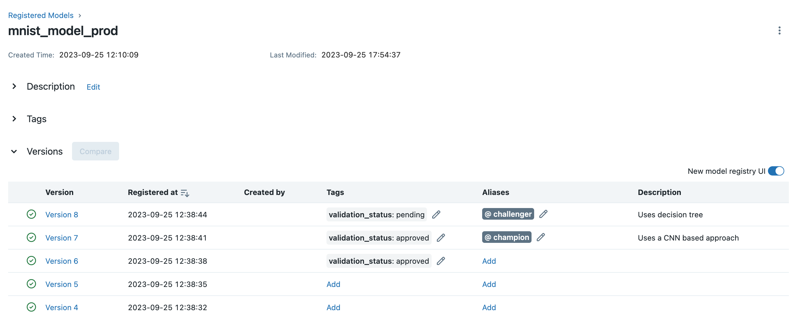
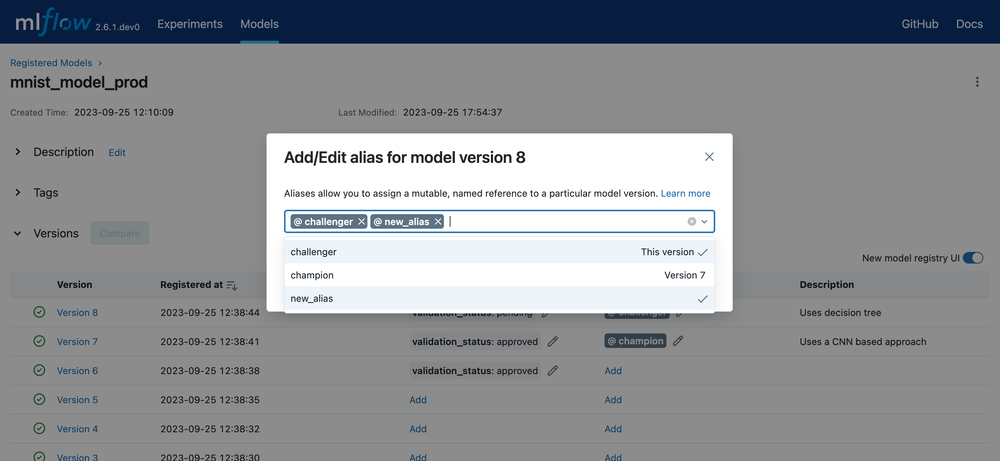
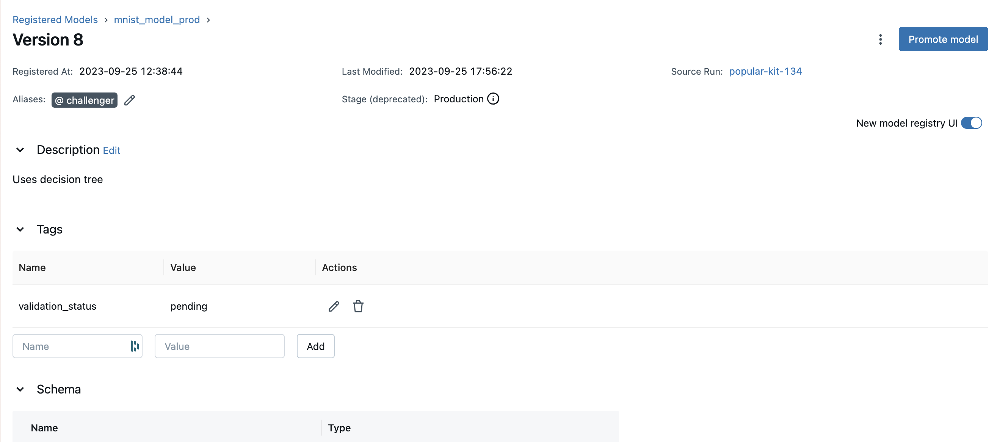
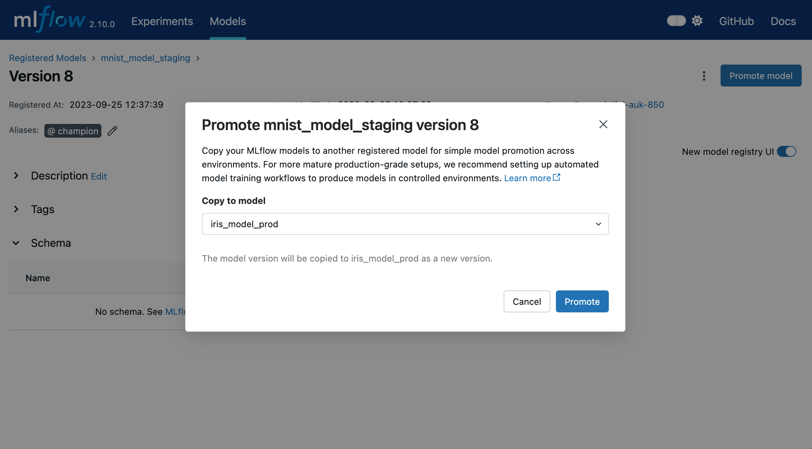

.. _registry:

=====================
MLflow Model Registry
=====================

The MLflow Model Registry component is a centralized model store, set of APIs, and UI, to
collaboratively manage the full lifecycle of an MLflow Model. It provides model lineage (which
MLflow experiment and run produced the model), model versioning, model aliasing, model tagging, and
annotations.

.. contents:: Table of Contents
  :local:
  :depth: 3

Concepts
========

The Model Registry introduces a few concepts that describe and facilitate the full lifecycle of an MLflow Model.

Model
    An MLflow Model is created from an experiment or run that is logged with one of the model flavor’s ``mlflow.<model_flavor>.log_model()`` methods. Once logged, this model can then be registered with the Model Registry.

Registered Model
    An MLflow Model can be registered with the Model Registry. A registered model has a unique name, contains versions, aliases, tags, and other metadata.

Model Version
    Each registered model can have one or many versions. When a new model is added to the Model Registry, it is added as version 1. Each new model registered to the same model name increments the version number. Model versions have tags, which can be useful for tracking attributes of the model version (e.g. `pre_deploy_checks: "PASSED"`)

.. _using-registered-model-aliases:

Model Alias
    Model aliases allow you to assign a mutable, named reference to a particular version of a registered model. By assigning an alias to a specific model version, you can use the alias to refer that model version via a model URI or the model registry API. For example, you can create an alias named ``champion`` that points to version 1 of a model named ``MyModel``. You can then refer to version 1 of ``MyModel`` by using the URI ``models:/MyModel@champion``.

    Aliases are especially useful for deploying models. For example, you could assign a ``champion`` alias to the model version intended for production traffic and target this alias in production workloads. You can then update the model serving production traffic by reassigning the ``champion`` alias to a different model version.

Tags
    Tags are key-value pairs that you associate with registered models and model versions, allowing you to label and categorize them by function or status. For example, you could apply a tag with key ``"task"`` and value ``"question-answering"`` (displayed in the UI as ``task:question-answering``) to registered models intended for question answering tasks. At the model version level, you could tag versions undergoing pre-deployment validation with ``validation_status:pending`` and those cleared for deployment with ``validation_status:approved``.

Annotations and Descriptions
    You can annotate the top-level model and each version individually using Markdown, including description and any relevant information useful for the team such as algorithm descriptions, dataset employed or methodology.

Model Registry Workflows
========================
If running your own MLflow server, you must use a database-backed backend store in order to access
the model registry via the UI or API. `See here <tracking/backend-stores.html>`_ for more information.

Before you can add a model to the Model Registry, you must log it using the ``log_model`` methods
of the corresponding model flavors. Once a model has been logged, you can add, modify, update,
or delete the model in the Model Registry through the UI or the API.

UI Workflow
-----------

This section demonstrates how to use the MLflow Model Registry UI to manage your MLflow models.

Register a Model
^^^^^^^^^^^^^^^^

Follow the steps below to register your MLflow model in the Model Registry.

1. Open the details page for the MLflow Run containing the logged MLflow model you'd like to register. Select the model folder containing the intended MLflow model in the **Artifacts** section.

  .. figure:: _static/images/oss_registry_1_register.png

2. Click the **Register Model** button, which will trigger a form to pop up.

3. In the **Model** dropdown menu on the form, you can either select "Create New Model", which creates a new registered model with your MLflow model as its initial version, or select an existing registered model, which registers your model under it as a new version. The screenshot below demonstrates registering the MLflow model to a new registered model named ``"iris_model_testing"``.
 
  .. figure:: _static/images/oss_registry_2_dialog.png

Find Registered Models
^^^^^^^^^^^^^^^^^^^^^^

After you've registered your models in the Model Registry, you can navigate to them in the following ways.

- Navigate to the **Registered Models** page, which links to your registered models and correponding model versions.

  .. figure:: _static/images/oss_registry_3_overview.png

- Go to the **Artifacts** section of your MLflow Runs details page, click the model folder, and then click the model version at the top right to view the version created from that model.

  .. figure:: _static/images/oss_registry_3b_version.png

Deploy and Organize Models
^^^^^^^^^^^^^^^^^^^^^^^^^^

You can deploy and organize your models in the Model Registry using model aliases and tags. To set aliases and tags for model versions in your registered model, navigate to the overview page of your registered model, such as the one below.

You can add or edit aliases and tags for a specific model version by clicking on the corresponding ``Add`` link or pencil icon in the model verison table.

To learn more about a specific model version, navigate to the details page for that model version.

In this page, you can inspect model version details like the model signature, MLflow source run, and creation timestamp. You can also view and configure the verion's aliases, tags, and description.

API Workflow
------------

An alternative way to interact with Model Registry is using the :ref:`MLflow model flavor <python-api>` or :ref:`MLflow Client Tracking API <mlflow.tracking>` interface.
In particular, you can register a model during an MLflow experiment run or after all your experiment runs.

Adding an MLflow Model to the Model Registry
^^^^^^^^^^^^^^^^^^^^^^^^^^^^^^^^^^^^^^^^^^^^

There are three programmatic ways to add a model to the registry. First, you can use the ``mlflow.<model_flavor>.log_model()`` method. For example, in your code:

.. code-block:: python

    from sklearn.datasets import make_regression
    from sklearn.ensemble import RandomForestRegressor
    from sklearn.metrics import mean_squared_error
    from sklearn.model_selection import train_test_split

    import mlflow
    import mlflow.sklearn
    from mlflow.models import infer_signature

    with mlflow.start_run() as run:
        X, y = make_regression(n_features=4, n_informative=2, random_state=0, shuffle=False)
        X_train, X_test, y_train, y_test = train_test_split(
            X, y, test_size=0.2, random_state=42
        )
        params = {"max_depth": 2, "random_state": 42}
        model = RandomForestRegressor(**params)
        model.fit(X_train, y_train)

        # Infer the model signature
        y_pred = model.predict(X_test)
        signature = infer_signature(X_test, y_pred)

        # Log parameters and metrics using the MLflow APIs
        mlflow.log_params(params)
        mlflow.log_metrics({"mse": mean_squared_error(y_test, y_pred)})

        # Log the sklearn model and register as version 1
        mlflow.sklearn.log_model(
            sk_model=model,
            artifact_path="sklearn-model",
            signature=signature,
            registered_model_name="sk-learn-random-forest-reg-model",
        )

In the above code snippet, if a registered model with the name doesn’t exist, the method registers a new model and creates Version 1.
If a registered model with the name exists, the method creates a new model version.

The second way is to use the :func:`mlflow.register_model` method, after all your experiment runs complete and when you have decided which model is most suitable to add to the registry.
For this method, you will need the ``run_id`` as part of the ``runs:URI`` argument.

.. code-block:: python

    result = mlflow.register_model(
        "runs:/d16076a3ec534311817565e6527539c0/sklearn-model", "sk-learn-random-forest-reg"
    )

If a registered model with the name doesn’t exist, the method registers a new model, creates Version 1, and returns a ModelVersion MLflow object.
If a registered model with the name exists, the method creates a new model version and returns the version object.

And finally, you can use the :meth:`~mlflow.client.MlflowClient.create_registered_model` to create a new registered model. If the model name exists,
this method will throw an :class:`~mlflow.exceptions.MlflowException` because creating a new registered model requires a unique name.

.. code-block:: python

   from mlflow import MlflowClient

   client = MlflowClient()
   client.create_registered_model("sk-learn-random-forest-reg-model")

The method above creates an empty registered model with no version associated. You can use :meth:`~mlflow.client.MlflowClient.create_model_version`
as shown below to create a new version of the model.

.. code-block:: python

    client = MlflowClient()
    result = client.create_model_version(
        name="sk-learn-random-forest-reg-model",
        source="mlruns/0/d16076a3ec534311817565e6527539c0/artifacts/sklearn-model",
        run_id="d16076a3ec534311817565e6527539c0",
    )

Databricks Unity Catalog Model Registry
^^^^^^^^^^^^^^^^^^^^^^^^^^^^^^^^^^^^^^^

To use Databricks unity catalog model registry, set MLflow registry URI to ``"databricks-uc"``, and set the two environmental variables ``"DATABRICKS_HOST"`` and ``"DATABRICKS_TOKEN"``. If you are using Databricks OAuth authentication, set the three environmental variables ``"DATABRICKS_HOST"``, ``"DATABRICKS_CLIENT_ID"`` and ``"DATABRICKS_CLIENT_SECRET"``. If you have configured your access auth within the ``'~/.databrickscfg'`` file, then you don't need to set above environmental variables. Instead, you can set the MLflow registry URI to ``"databricks-uc://{profile}"``, the ``'{profile}'`` part being the profile name in your ``'~/.databrickscfg'`` configuration file. For details of Databricks authentication types, please refer to `this document <https://docs.databricks.com/en/dev-tools/auth/index.html#unified-auth>`.

**Use Databricks unity catalog model registry by Databricks shard token**

.. code-block:: python

    import mlflow
    import os

    mlflow.set_registry_uri("databricks-uc")
    os.environ["DATABRICKS_HOST"] = "<your Databricks shard URI>"
    os.environ["DATABRICKS_TOKEN"] = "<your Databricks shard access token>"

**Use Databricks unity catalog model registry by Databricks OAuth authentication**

.. code-block:: python

    import mlflow
    import os

    mlflow.set_registry_uri("databricks-uc")
    os.environ["DATABRICKS_HOST"] = "<your Databricks shard URI>"
    os.environ["DATABRICKS_CLIENT_ID"] = "<your Databricks oauth client ID>"
    os.environ["DATABRICKS_CLIENT_SECRET"] = "<your Databricks oauth client secret>"

**Use Databricks unity catalog model registry with '~/.databrickscfg' configuration file**

Assuming you have configured local '~/.databrickscfg' file with a section like:

[my-databricks-shard1]
host = <your Databricks shard URI>
token = <your Databricks shard access token>

.. code-block:: python

    import mlflow
    import os

    mlflow.set_registry_uri("databricks-uc://my-databricks-shard1")

Deploy and Organize Models with Aliases and Tags
^^^^^^^^^^^^^^^^^^^^^^^^^^^^^^^^^^^^^^^^^^^^^^^^

Model aliases and tags help you deploy and organize your models in the Model Registry.

**Set and delete aliases on models**

To set, update, and delete aliases using the MLflow Client API, see the examples below:

.. code-block:: python

    from mlflow import MlflowClient

    client = MlflowClient()

    # create "champion" alias for version 1 of model "example-model"
    client.set_registered_model_alias("example-model", "champion", 1)

    # reassign the "Champion" alias to version 2
    client.set_registered_model_alias("example-model", "Champion", 2)

    # get a model version by alias
    client.get_model_version_by_alias("example-model", "Champion")

    # delete the alias
    client.delete_registered_model_alias("example-model", "Champion")

**Set and delete tags on models**

To set and delete tags using the MLflow Client API, see the examples below:

.. code-block:: python

    from mlflow import MlflowClient

    client = MlflowClient()

    # Set registered model tag
    client.set_registered_model_tag("example-model", "task", "classification")

    # Delete registered model tag
    client.delete_registered_model_tag("example-model", "task")

    # Set model version tag
    client.set_model_version_tag("example-model", "1", "validation_status", "approved")

    # Delete model version tag
    client.delete_model_version_tag("example-model", "1", "validation_status")

For more details on alias and tag client APIs, see the :py:mod:`mlflow.client` API documentation.

Fetching an MLflow Model from the Model Registry
^^^^^^^^^^^^^^^^^^^^^^^^^^^^^^^^^^^^^^^^^^^^^^^^

After you have registered an MLflow model, you can fetch that model using ``mlflow.<model_flavor>.load_model()``, or more generally, :meth:`~mlflow.pyfunc.load_model`.
You can use the loaded model for one off predictions or in inference workloads such as batch inference.

**Fetch a specific model version**

To fetch a specific model version, just supply that version number as part of the model URI.

.. code-block:: python

    import mlflow.pyfunc

    model_name = "sk-learn-random-forest-reg-model"
    model_version = 1

    model = mlflow.pyfunc.load_model(model_uri=f"models:/{model_name}/{model_version}")

    model.predict(data)

**Fetch a model version by alias**

To fetch a model version by alias, specify the model alias in the model URI, and it will fetch the model version currently under it.

.. code-block:: python

    import mlflow.pyfunc

    model_name = "sk-learn-random-forest-reg-model"
    alias = "champion"

    champion_version = mlflow.pyfunc.load_model(f"models:/{model_name}@{alias}")

    champion_version.predict(data)

Note that model alias assignments can be updated independently of your production code. If the ``champion`` alias in the snippet above is reassigned to a new model version in the Model Registry, the next execution of this snippet will automatically pick up the new model version. This allows you to decouple model deployments from your inference workloads.

Serving an MLflow Model from Model Registry
^^^^^^^^^^^^^^^^^^^^^^^^^^^^^^^^^^^^^^^^^^^

After you have registered an MLflow model, you can serve the model as a service on your host.

.. code-block:: bash

    #!/usr/bin/env sh

    # Set environment variable for the tracking URL where the Model Registry resides
    export MLFLOW_TRACKING_URI=http://localhost:5000

    # Serve the production model from the model registry
    mlflow models serve -m "models:/sk-learn-random-forest-reg-model@champion"

Promoting an MLflow Model across environments
^^^^^^^^^^^^^^^^^^^^^^^^^^^^^^^^^^^^^^^^^^^^^

In mature DevOps and MLOps workflows, organizations use separate environments (typically, dev,
staging, and prod) with access controls to enable quick development without compromising stability
in production. In MLflow, you can use registered models and :ref:`MLflow Authentication <auth>` to
express access-controlled environments for your MLflow models. For example, you can create registered
models corresponding to each combination of environment and business problem (e.g.
``prod.ml_team.revenue_forecasting``, ``dev.ml_team.revenue_forecasting``) and configure permissions
accordingly. As you iterate on MLflow models for your business problem, you can promote them
through the various environments for continuous integration and deployment.

For mature production-grade setups, we recommend setting up automated workflows that train and register
models in each environment. To productionize the latest iteration on a business problem, promote your
machine learning code across environments via source control and CI/CD systems.

For simple model deployment use cases, you can register your trained MLflow Model to a dev environment
registered model as the latest model version and then use :meth:`~mlflow.client.MlflowClient.copy_model_version`
to promote it across registered models.

.. code-block:: python

    from mlflow import MlflowClient

    client = MlflowClient()
    client.copy_model_version(
        src_model_uri="models:/regression-model-staging@candidate",
        dst_name="regression-model-production",
    )

This code snippet copies the model version with the ``candidate`` alias in the ``regression-model-staging``
model to the ``regression-model-production`` model as the latest version.

You can also promote model versions in the UI. To do this, navigate to the model version details page
and select the ``Promote model`` button. This opens a modal where you can choose a registered model
to which the current model version will be copied.

Adding or Updating an MLflow Model Descriptions
^^^^^^^^^^^^^^^^^^^^^^^^^^^^^^^^^^^^^^^^^^^^^^^

At any point in a model’s lifecycle development, you can update a model version's description using :meth:`~mlflow.client.MlflowClient.update_model_version`.

.. code-block:: python

    client = MlflowClient()
    client.update_model_version(
        name="sk-learn-random-forest-reg-model",
        version=1,
        description="This model version is a scikit-learn random forest containing 100 decision trees",
    )

Renaming an MLflow Model
^^^^^^^^^^^^^^^^^^^^^^^^

As well as adding or updating a description of a specific version of the model, you can rename an existing registered model using :meth:`~mlflow.client.MlflowClient.rename_registered_model`.

.. code-block:: python

    client = MlflowClient()
    client.rename_registered_model(
        name="sk-learn-random-forest-reg-model",
        new_name="sk-learn-random-forest-reg-model-100",
    )

Listing and Searching MLflow Models
^^^^^^^^^^^^^^^^^^^^^^^^^^^^^^^^^^^
You can fetch a list of registered models in the registry with a simple method.

.. code-block:: python

    from pprint import pprint

    client = MlflowClient()
    for rm in client.search_registered_models():
        pprint(dict(rm), indent=4)

This outputs:

.. code-block:: text

    {   'creation_timestamp': 1582671933216,
        'description': None,
        'last_updated_timestamp': 1582671960712,
        'latest_versions': [<ModelVersion: creation_timestamp=1582671933246, current_stage='Production', description='A random forest model containing 100 decision trees trained in scikit-learn', last_updated_timestamp=1582671960712, name='sk-learn-random-forest-reg-model', run_id='ae2cc01346de45f79a44a320aab1797b', source='./mlruns/0/ae2cc01346de45f79a44a320aab1797b/artifacts/sklearn-model', status='READY', status_message=None, user_id=None, version=1>,
                            <ModelVersion: creation_timestamp=1582671960628, current_stage='None', description=None, last_updated_timestamp=1582671960628, name='sk-learn-random-forest-reg-model', run_id='d994f18d09c64c148e62a785052e6723', source='./mlruns/0/d994f18d09c64c148e62a785052e6723/artifacts/sklearn-model', status='READY', status_message=None, user_id=None, version=2>],
        'name': 'sk-learn-random-forest-reg-model'}

With hundreds of models, it can be cumbersome to peruse the results returned from this call. A more efficient approach would be to search for a specific model name and list its version
details using :meth:`~mlflow.client.MlflowClient.search_model_versions` method
and provide a filter string such as ``"name='sk-learn-random-forest-reg-model'"``

.. code-block:: python

    client = MlflowClient()
    for mv in client.search_model_versions("name='sk-learn-random-forest-reg-model'"):
        pprint(dict(mv), indent=4)

This outputs:

.. code-block:: python

    {
        "creation_timestamp": 1582671933246,
        "current_stage": "Production",
        "description": "A random forest model containing 100 decision trees "
        "trained in scikit-learn",
        "last_updated_timestamp": 1582671960712,
        "name": "sk-learn-random-forest-reg-model",
        "run_id": "ae2cc01346de45f79a44a320aab1797b",
        "source": "./mlruns/0/ae2cc01346de45f79a44a320aab1797b/artifacts/sklearn-model",
        "status": "READY",
        "status_message": None,
        "user_id": None,
        "version": 1,
    }

    {
        "creation_timestamp": 1582671960628,
        "current_stage": "None",
        "description": None,
        "last_updated_timestamp": 1582671960628,
        "name": "sk-learn-random-forest-reg-model",
        "run_id": "d994f18d09c64c148e62a785052e6723",
        "source": "./mlruns/0/d994f18d09c64c148e62a785052e6723/artifacts/sklearn-model",
        "status": "READY",
        "status_message": None,
        "user_id": None,
        "version": 2,
    }

Deleting MLflow Models
^^^^^^^^^^^^^^^^^^^^^^

.. note::
    Deleting registered models or model versions is irrevocable, so use it judiciously.

You can either delete specific versions of a registered model or you can delete a registered model and all its versions.

.. code-block:: python

    # Delete versions 1,2, and 3 of the model
    client = MlflowClient()
    versions = [1, 2, 3]
    for version in versions:
        client.delete_model_version(
            name="sk-learn-random-forest-reg-model", version=version
        )

    # Delete a registered model along with all its versions
    client.delete_registered_model(name="sk-learn-random-forest-reg-model")

While the above workflow API demonstrates interactions with the Model Registry, two exceptional cases require attention.
One is when you have existing ML models saved from training without the use of MLflow. Serialized and persisted on disk
in sklearn's pickled format, you want to register this model with the Model Registry. The second is when you use
an ML framework without a built-in MLflow model flavor support, for instance, `vaderSentiment,` and want to register the model.

Registering a Model Saved Outside MLflow
^^^^^^^^^^^^^^^^^^^^^^^^^^^^^^^^^^^^^^^^
Not everyone will start their model training with MLflow. So you may have some models trained before the use of MLflow.
Instead of retraining the models, all you want to do is register your saved models with the Model Registry.

This code snippet creates a sklearn model, which we assume that you had created and saved in native pickle format.

.. note::
    The sklearn library and pickle versions with which the model was saved should be compatible with the
    current MLflow supported built-in sklearn model flavor.

.. code-block:: python

    import numpy as np
    import pickle

    from sklearn import datasets, linear_model
    from sklearn.metrics import mean_squared_error, r2_score

    # source: https://scikit-learn.org/stable/auto_examples/linear_model/plot_ols.html

    # Load the diabetes dataset
    diabetes_X, diabetes_y = datasets.load_diabetes(return_X_y=True)

    # Use only one feature
    diabetes_X = diabetes_X[:, np.newaxis, 2]

    # Split the data into training/testing sets
    diabetes_X_train = diabetes_X[:-20]
    diabetes_X_test = diabetes_X[-20:]

    # Split the targets into training/testing sets
    diabetes_y_train = diabetes_y[:-20]
    diabetes_y_test = diabetes_y[-20:]

    def print_predictions(m, y_pred):
        # The coefficients
        print("Coefficients: \n", m.coef_)
        # The mean squared error
        print("Mean squared error: %.2f" % mean_squared_error(diabetes_y_test, y_pred))
        # The coefficient of determination: 1 is perfect prediction
        print("Coefficient of determination: %.2f" % r2_score(diabetes_y_test, y_pred))

    # Create linear regression object
    lr_model = linear_model.LinearRegression()

    # Train the model using the training sets
    lr_model.fit(diabetes_X_train, diabetes_y_train)

    # Make predictions using the testing set
    diabetes_y_pred = lr_model.predict(diabetes_X_test)
    print_predictions(lr_model, diabetes_y_pred)

    # save the model in the native sklearn format
    filename = "lr_model.pkl"
    pickle.dump(lr_model, open(filename, "wb"))

.. code-block:: text

    Coefficients:
    [938.23786125]
    Mean squared error: 2548.07
    Coefficient of determination: 0.47

Once saved in pickled format, you can load the sklearn model into memory using pickle API and
register the loaded model with the Model Registry.

.. code-block:: python

    import mlflow
    from mlflow.models import infer_signature
    import numpy as np
    from sklearn import datasets

    # load the model into memory
    loaded_model = pickle.load(open(filename, "rb"))

    # create a signature for the model based on the input and output data
    diabetes_X, diabetes_y = datasets.load_diabetes(return_X_y=True)
    diabetes_X = diabetes_X[:, np.newaxis, 2]
    signature = infer_signature(diabetes_X, diabetes_y)

    # log and register the model using MLflow scikit-learn API
    mlflow.set_tracking_uri("sqlite:///mlruns.db")
    reg_model_name = "SklearnLinearRegression"
    print("--")
    mlflow.sklearn.log_model(
        loaded_model,
        "sk_learn",
        serialization_format="cloudpickle",
        signature=signature,
        registered_model_name=reg_model_name,
    )

.. code-block:: text

    --
    Successfully registered model 'SklearnLinearRegression'.
    2021/04/02 16:30:57 INFO mlflow.tracking._model_registry.client: Waiting up to 300 seconds for model version to finish creation.
    Model name: SklearnLinearRegression, version 1
    Created version '1' of model 'SklearnLinearRegression'.

Now, using MLflow fluent APIs, you reload the model from the Model Registry and score.

.. code-block:: python

    # load the model from the Model Registry and score
    model_uri = f"models:/{reg_model_name}/1"
    loaded_model = mlflow.sklearn.load_model(model_uri)
    print("--")

    # Make predictions using the testing set
    diabetes_y_pred = loaded_model.predict(diabetes_X_test)
    print_predictions(loaded_model, diabetes_y_pred)

.. code-block:: text

    --
    Coefficients:
    [938.23786125]
    Mean squared error: 2548.07
    Coefficient of determination: 0.47

Registering an Unsupported Machine Learning Model
^^^^^^^^^^^^^^^^^^^^^^^^^^^^^^^^^^^^^^^^^^^^^^^^^
In some cases, you might use a machine learning framework without its built-in MLflow Model flavor support.
For instance, the `vaderSentiment` library is a standard Natural Language Processing (NLP) library used
for sentiment analysis. Since it lacks a built-in MLflow Model flavor, you cannot log or register the model
using MLflow Model fluent APIs.

To work around this problem, you can create an instance of a :py:mod:`mlflow.pyfunc` model flavor and embed your NLP model
inside it, allowing you to save, log or register the model. Once registered, load the model from the Model Registry
and score using the :py:func:`predict <mlflow.pyfunc.PyFuncModel.predict>` function.

The code sections below demonstrate how to create a ``PythonFuncModel`` class with a ``vaderSentiment`` model embedded in it,
save, log, register, and load from the Model Registry and score.

.. note::
    To use this example, you will need to ``pip install vaderSentiment``.

.. code-block:: python

    from sys import version_info
    import cloudpickle
    import pandas as pd

    import mlflow.pyfunc
    from vaderSentiment.vaderSentiment import SentimentIntensityAnalyzer

    #
    # Good and readable paper from the authors of this package
    # http://comp.social.gatech.edu/papers/icwsm14.vader.hutto.pdf
    #

    INPUT_TEXTS = [
        {"text": "This is a bad movie. You don't want to see it! :-)"},
        {"text": "Ricky Gervais is smart, witty, and creative!!!!!! :D"},
        {"text": "LOL, this guy fell off a chair while sleeping and snoring in a meeting"},
        {"text": "Men shoots himself while trying to steal a dog, OMG"},
        {"text": "Yay!! Another good phone interview. I nailed it!!"},
        {
            "text": "This is INSANE! I can't believe it. How could you do such a horrible thing?"
        },
    ]

    PYTHON_VERSION = f"{version_info.major}.{version_info.minor}.{version_info.micro}"

    def score_model(model):
        # Use inference to predict output from the customized PyFunc model
        for i, text in enumerate(INPUT_TEXTS):
            text = INPUT_TEXTS[i]["text"]
            m_input = pd.DataFrame([text])
            scores = loaded_model.predict(m_input)
            print(f"<{text}> -- {str(scores[0])}")

    # Define a class and extend from PythonModel
    class SocialMediaAnalyserModel(mlflow.pyfunc.PythonModel):
        def __init__(self):
            super().__init__()
            # embed your vader model instance
            self._analyser = SentimentIntensityAnalyzer()

        # preprocess the input with prediction from the vader sentiment model
        def _score(self, txt):
            prediction_scores = self._analyser.polarity_scores(txt)
            return prediction_scores

        def predict(self, context, model_input, params=None):
            # Apply the preprocess function from the vader model to score
            model_output = model_input.apply(lambda col: self._score(col))
            return model_output

    model_path = "vader"
    reg_model_name = "PyFuncVaderSentiments"
    vader_model = SocialMediaAnalyserModel()

    # Set the tracking URI to use local SQLAlchemy db file and start the run
    # Log MLflow entities and save the model
    mlflow.set_tracking_uri("sqlite:///mlruns.db")

    # Save the conda environment for this model.
    conda_env = {
        "channels": ["defaults", "conda-forge"],
        "dependencies": [f"python={PYTHON_VERSION}", "pip"],
        "pip": [
            "mlflow",
            f"cloudpickle=={cloudpickle.__version__}",
            "vaderSentiment==3.3.2",
        ],
        "name": "mlflow-env",
    }

    # Save the model
    with mlflow.start_run(run_name="Vader Sentiment Analysis") as run:
        model_path = f"{model_path}-{run.info.run_uuid}"
        mlflow.log_param("algorithm", "VADER")
        mlflow.log_param("total_sentiments", len(INPUT_TEXTS))
        mlflow.pyfunc.save_model(
            path=model_path, python_model=vader_model, conda_env=conda_env
        )

    # Use the saved model path to log and register into the model registry
    mlflow.pyfunc.log_model(
        artifact_path=model_path,
        python_model=vader_model,
        registered_model_name=reg_model_name,
        conda_env=conda_env,
    )

    # Load the model from the model registry and score
    model_uri = f"models:/{reg_model_name}/1"
    loaded_model = mlflow.pyfunc.load_model(model_uri)
    score_model(loaded_model)

.. code-block:: text

    Successfully registered model 'PyFuncVaderSentiments'.
    2021/04/05 10:34:15 INFO mlflow.tracking._model_registry.client: Waiting up to 300 seconds for model version to finish creation.
    Created version '1' of model 'PyFuncVaderSentiments'.

    <This is a bad movie. You don't want to see it! :-)> -- {'neg': 0.307, 'neu': 0.552, 'pos': 0.141, 'compound': -0.4047}
    <Ricky Gervais is smart, witty, and creative!!!!!! :D> -- {'neg': 0.0, 'neu': 0.316, 'pos': 0.684, 'compound': 0.8957}
    <LOL, this guy fell off a chair while sleeping and snoring in a meeting> -- {'neg': 0.0, 'neu': 0.786, 'pos': 0.214, 'compound': 0.5473}
    <Men shoots himself while trying to steal a dog, OMG> -- {'neg': 0.262, 'neu': 0.738, 'pos': 0.0, 'compound': -0.4939}
    <Yay!! Another good phone interview. I nailed it!!> -- {'neg': 0.0, 'neu': 0.446, 'pos': 0.554, 'compound': 0.816}
    <This is INSANE! I can't believe it. How could you do such a horrible thing?> -- {'neg': 0.357, 'neu': 0.643, 'pos': 0.0, 'compound': -0.8034}

Deprecated: Using Model Stages
^^^^^^^^^^^^^^^^^^^^^^^^^^^^^^

.. warning:: Model Stages are deprecated and will be removed in a future major release. To learn more about this deprecation, see our :ref:`migration guide<migrating-from-stages>` below.

See the sections below on using Model Stages in the MLflow Model Registry.

**Transitioning an MLflow Model’s Stage**

Over the course of the model’s lifecycle, a model evolves—from development to staging to production.
You can transition a registered model to one of the stages: **Staging**, **Production** or **Archived**.

.. code-block:: python

    client = MlflowClient()
    client.transition_model_version_stage(
        name="sk-learn-random-forest-reg-model", version=3, stage="Production"
    )

The accepted values for <stage> are: Staging|Archived|Production|None.

**Fetch the latest model version in a specific stage**

To fetch a model version by stage, simply provide the model stage as part of the model URI, and it will fetch the most recent version of the model in that stage.

.. code-block:: python

    import mlflow.pyfunc

    model_name = "sk-learn-random-forest-reg-model"
    stage = "Staging"

    model = mlflow.pyfunc.load_model(model_uri=f"models:/{model_name}/{stage}")

    model.predict(data)

**Archiving an MLflow Model**

You can move models versions out of a **Production** stage into an **Archived** stage.
At a later point, if that archived model is not needed, you can delete it.

.. code-block:: python

    # Archive models version 3 from Production into Archived
    client = MlflowClient()
    client.transition_model_version_stage(
        name="sk-learn-random-forest-reg-model", version=3, stage="Archived"
    )

.. _migrating-from-stages:

Migrating from Stages
=====================

As of MLflow 2.9.0, Model Stages have been deprecated and will be removed in a future major release. This is the culmination of extensive feedback on the inflexibility of model stages for expressing MLOps workflows, from which we developed and introduced of new tools for managing and deploying models in the MLflow Model Registry. Learn more below.

New model deployment tools
--------------------------

Model stages were used to express the lifecycle of MLflow Models for productionization and deployment. Users transitioned model versions through four fixed stages (from **none**, to **staging**, to **production**, and then to **archived**) as they proposed, validated, deployed, and deprecated models for their ML use-cases. In doing so, model registry stages provided labeling and aliasing functionality for the model versions, by denoting the status of a model version in the UI and providing named references to model versions in the code (e.g. ``/Staging`` in the model URI). Model registry stages were also used to denote the environment that the model is in, though it was not possible to set up access controls for them.

To replace and improve upon stages, we elevated **model version tags** in the UI and introduced **model version aliases** to provide flexible and powerful ways to label and alias MLflow models in the Model Registry. We also made it possible to **set up separate environments** for your models and configure access controls for each environment.

**Model version tags**

Model version tags can be used to annotate model versions with their status. For example, you could apply a tag of key ``validation_status`` and value ``pending`` to a model version while it is being validated and then update the tag value to ``passed`` when it has passed smoke tests and performance tests.

**Model version aliases**

Model version aliases provide a flexible way to create named references for particular model versions, and are useful for identifying which model version(s) are deployed within an environment. For example, setting a **champion** alias on a model version enables you to fetch the model version by that alias via the :meth:`~mlflow.client.MlflowClient.get_model_version_by_alias` client API or the model URI ``models:/<registered model name>@champion``. Aliases can be reassigned to new model versions via the UI and client API. Unlike model registry stages, more than one alias can be applied to any given model version, allowing for easier A/B testing and model rollout.

**Set up separate environments for models**

In mature DevOps and MLOps workflows, organizations use separate environments (typically, dev, staging, and prod) with access controls to enable quick development without compromising stability in production. With :ref:`MLflow Authentication <auth>`, you can use registered models to express access-controlled environments for your MLflow models. For example, you can create registered models corresponding to each combination of environment and business problem (e.g. ``prod.ml_team.revenue_forecasting``, ``dev.ml_team.revenue_forecasting``) and configure permissions accordingly. Automate model retraining against your production registered models, or for simple model deployment use cases, use :meth:`~mlflow.client.MlflowClient.copy_model_version` to promote model versions across registered models.

Migrating models away from stages
---------------------------------

See the information below to learn how to use the new tools for your legacy Model Stage use-cases.

**Model environments**

To set up separate environments and permissions for your model versions, create separate registered models:

* Given a base name for your model’s use-case, e.g. ``revenue_forecasting``, set up various registered models corresponding to your environments with different prefixes.
* For example, if you want three separate dev, staging, and production environments, you can set up ``dev.ml_team.revenue_forecasting``, ``staging.ml_team.revenue_forecasting``, and ``prod.ml_team.revenue_forecasting`` registered models.
* Use :ref:`MLflow Authentication <auth>` to grant appropriate permissions on these models.

**Transition models across environments**

Once you have registered models set up for each environment, you can build your MLOps workflows on top of them.

* For simple model promotion use cases, you can first register your MLflow models under the dev registered model and then promote models across environments using the :meth:`~mlflow.client.MlflowClient.copy_model_version` client API.
* For more mature production-grade setups, we recommend promoting your ML code (including model training code, inference code, and ML infrastructure as code) across environments. This eliminates the need to transition models across environments. Dev ML code is experimental and in a dev environment, hence targeting the dev registered model. Before merging developed ML code into your source code repository, your CI stages the code in a staging environment for integration testing (targeting the staging registered model). Post-merge, the ML code is deployed to production for automated retraining (targeting the prod registered model). Such setups enable safe and robust CI/CD of ML systems - including not just model training, but also feature engineering, model monitoring, and automated retraining.

**Model aliasing**

To specify (via named references) which model version to deploy to serve traffic within an environment (e.g. production), use **model aliases**:

1. Decide on an equivalent model alias for each model registry stage (e.g., **champion** for the **Production** stage, to specify the model intended to serve the majority of traffic)
2. Assign the chosen alias to the latest model version under each stage. You can use the helper function below for this.
3. Update ML workflows to target the alias rather than the stage. For example, the model URI ``models:/regression_model/Production`` will be replaced by the model URI ``models:/prod.ml_team.regression_model@champion`` in the production code.

.. code-block:: python

    from mlflow import MlflowClient

    # Initialize an MLflow Client
    client = MlflowClient()

    def assign_alias_to_stage(model_name, stage, alias):
        """
        Assign an alias to the latest version of a registered model within a specified stage.

        :param model_name: The name of the registered model.
        :param stage: The stage of the model version for which the alias is to be assigned. Can be
                    "Production", "Staging", "Archived", or "None".
        :param alias: The alias to assign to the model version.
        :return: None
        """
        latest_mv = client.get_latest_versions(model_name, stages=[stage])[0]
        client.set_registered_model_alias(model_name, alias, latest_mv.version)

**Model status**

To represent and communicate the status of your model versions, use model version tags:

* Set tags on model versions to indicate the status of the model.
* For example, to indicate the review status of a model version, you can set a tag with key ``validation_status`` and value ``pending`` or ``passed``.
