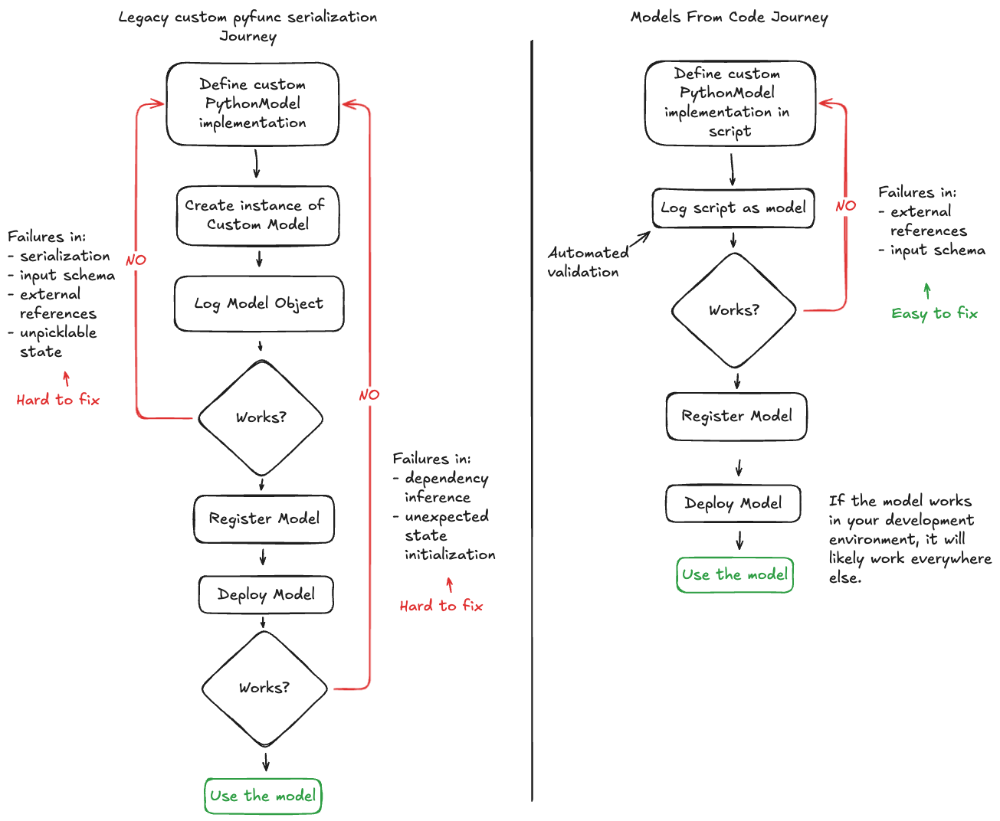

Models From Code Guide
======================

.. attention::
    Models from Code is available in MLflow 2.12.2 and above. If you are using a version earlier than what supports this feature, 
    you are required to use the legacy serialization methods outlined in the `Custom Python Model <../models.html#custom-python-models>`_ documentation.

.. note::
    Models from code is only available for `LangChain <../llms/langchain/index.html>`_ and custom ``pyfunc`` (PythonModel instances) models. If you are 
    using other libraries directly, using the provided saving and logging functionality within specific model flavors is recommended.

The models from code feature is a comprehensive overhaul of the process of defining, storing, and loading both custom models and specific flavor
implementations that do not depend on serialized model weights (such as `LangChain <../llms/langchain/index.html>`_ and
`LlamaIndex <../llms/llama-index/index.html>`_). 

The key difference between legacy serialization of these models and the Models from Code approach is in how a model is represented during serialization. 

In the legacy approach, serialization is done on the model object using either ``cloudpickle`` (custom pyfunc and LangChain) or a custom serializer that has incomplete coverage 
(in the case of LlamaIndex) of all functionality within the underlying package. For custom pyfunc, the usage of ``cloudpickle`` to serialize object instances creates a binary file that is used to reconstruct the object when loaded. 

In models from code, for the model types that are supported, a simple script is saved with the definition of either the custom pyfunc or the flavor's 
interface (i.e., in the case of LangChain, we can define and mark an LCEL chain directly as a model within a script).

The greatest gain associated with using models from code for custom ``pyfunc`` and supported library implementations is in the reduction of repetitive trial-and-error debugging 
that can occur when working on an implementation. The workflow shown below illustrates how these two methdologies compare when working on a solution for a custom model:

Differences with Legacy serialization
-------------------------------------

In the legacy mode for custom models, an instance of your subclassed :py:class:`mlflow.pyfunc.PythonModel` is submitted in the call to ``log_model``. When called via an object
reference, MLflow will utilize ``cloudpickle`` to attempt to serialize your object.

In the native flavor serialization for ``LangChain``, ``cloudpickle`` is used to store object references. However, only a subset of all object types that can be
used within ``LangChain`` are available for serializing due to external state references or the use of lambda functions within the APIs. ``LlamaIndex``, on the 
other hand, utilizes a custom serializer in the native implementation of the flavor that does not cover all possible uses of the library due to the need for
excessively complex implementations to support edge case features within the library.

In models from code, instead of passing an object reference to an instance of your custom model, you will simply pass a path reference to a script that 
contains your model definition. When this mode is employed, MLflow will simply execute this script (along with any ``code_paths`` dependencies prior to running 
the main script) in the execution environment and instantiating whichever object you define in the call to :py:func:`mlflow.models.set_model`, assigning that 
object as the inference target. 

At no point in this process are there dependencies on serialization libraries such as `pickle <https://docs.python.org/3/library/pickle.html>`_ or 
`cloudpickle <https://pypi.org/project/cloudpickle/1.1.1/>`_, removing the broad limitations that these serialization packages have, such as:

- **Portability and Compatiblility**: Loading a pickle or cloudpickle file in a Python version that was different than the one used to serialize the object does not guarantee compatiblity.
- **Complex Object Serialization**: File handles, sockets, external connections, dynamic references, lambda functions and system resources are unavailable for pickling.
- **Readability**: Pickle and CloudPickle both store their serialized objects in a binary format that is impossible to read by humans.
- **Performance**: Object serialization and dependency inspection can be very slow, particularly for complex implementations with many code reference dependencies.

Core requirements for using Models From Code
--------------------------------------------

There are some important concepts to be aware of when using the models from code feature, as there are operations that are performed when logging a model
via a script that may not be immediately apparent.

- **Imports**: Models from code does not capture external references for non-pip installable packages, just as the legacy ``cloudpickle`` implementation does not. If you have external references (see the examples below), you must define these dependencies via ``code_paths`` arguments.
- **Execution during logging**: In order to validate that the script file that you're logging is valid, the code will be executed before being written to disk, exactly as other methods of model logging.
- **Requirements inference**: Packages that are imported at the top of your defined model script will be inferred as requirements if they are installable from PyPI, regardless of whether you use them in the model execution logic or not.

.. tip::
    If you define import statements that are never used within your script, these will still be included in the requirements listing. It is recommended to use a linter
    that is capable of determining unused import statements while writing your implementation so that you are not including irrelevant package dependencies.

Using Models From Code in a Jupyter Notebook
--------------------------------------------

`Jupyter <https://jupyter.org/>`_ (IPython Notebooks) are a very convenient way to work with AI applications and modeling in general. One slight limitation that they 
have is in their cell-based execution model. Due to the nature of how they are defined and run, the models from code feature does not directly support defining 
a notebook as a model. Rather, this feature requires that models are defined as Python scripts (the file extension **must end in '.py'**). 

Fortunately, the folks that maintain the core kernel that Jupyter uses (`IPython <https://ipython.readthedocs.io/en/stable/interactive/magics.html>`_) have created a 
number of magic commands that are usable within notebooks to enhance the usability of notebooks as a development environment for AI practitioners. One of the most 
useful magic commands that can be used within any notebook environment that is based upon IPython (``Jupyter``, ``Databricks Notebooks``, etc.) is the ``%%writefile`` command.

The `%%writefile <https://ipython.readthedocs.io/en/stable/interactive/magics.html#cellmagic-writefile>`_ magic command, when written as the first line of a notebook 
cell, will capture the contents of the cell (not the entire notebook, mind you, only the current cell scope) with the exception of the magic command itself and write 
those contents to the file that you define. 

For example, running the following in a notebook:

.. code-block:: none

    %%writefile "./hello.py"

    print("hello!")

Will result in a file being created, located in the same directory as your notebook, that contains:

.. code-block:: python

    print("hello!")

.. note::
    There is an optional ``-a`` append command that can be used with the ``%%writefile`` magic command. This option will **append** the cell contents to the file 
    being targeted for saving the cell contents to. It is **not recommended** to use this option due to the chances of creating difficult-to-debug overrides within 
    a script that could contain multiple copies of your model definition logic. It is recommended to use the default behavior of ``%%writefile``, which is to overwrite 
    the local file each time that the cell is executed to ensure that the state of your cell's contents are always reflected in the saved script file.

Examples of Using Models From Code
----------------------------------
Each of these examples will show usage of the ``%%writefile`` magic command at the top of the script definition cell block in order to simulate defining the model code or other 
dependencies from within a single notebook. If you are writing your implementations within an IDE or a text editor, do not place this magic command at the top of your 
script.

.. tabs::

    .. tab:: Simple Example

        .. raw:: html

            <h3>Building a simple Models From Code model</h3>
        
        |

        In this example, we will define a very basic  model that, when called via ``predict()``, will utilize the input float value as an exponent to the number ``2``.
        The first code block, repesenting a discrete notebook cell, will create a file named ``basic.py`` in the same directory as the notebook. The contents of this 
        file will be the model definition ``BasicModel``, as well as the import statements and the MLflow function ``set_model`` that will instantiate an instance of 
        this model to be used for inference.

        .. code-block:: python

            # If running in a Jupyter or Databricks notebook cell, uncomment the following line:
            # %%writefile "./basic.py"

            import pandas as pd
            from typing import List, Dict
            from mlflow.pyfunc import PythonModel
            from mlflow.models import set_model

            class BasicModel(PythonModel):
                def exponential(self, numbers):
                    return {f"{x}": 2**x for x in numbers}

                def predict(self, context, model_input) -> Dict[str, float]:
                    if isinstance(model_input, pd.DataFrame):
                        model_input = model_input.to_dict()[0].values()
                    return self.exponential(model_input)

            # Specify which definition in this script represents the model instance
            set_model(BasicModel())

        The next section shows another cell that contains the logging logic. 

        .. code-block:: python

            import mlflow

            mlflow.set_experiment("Basic Model From Code")

            model_path = "basic.py"

            with mlflow.start_run():
                model_info = mlflow.pyfunc.log_model(
                    python_model=model_path,  # Define the model as the path to the script that was just saved
                    artifact_path="arithemtic_model",
                    input_example=[42.0, 24.0],
                )

        Looking at this stored model within the MLflow UI, we can see that the script in the first cell was recorded as an artifact to the run. 
        
        .. figure:: ../_static/images/models/basic_model_from_code_ui.png
            :alt: The MLflow UI showing the stored model code as a serialized python script
            :width: 80%
            :align: center

        When we load this model via ``mlflow.pyfunc.load_model()``, this script will be executed and an instance of ``BasicModel`` will be constructed, exposing the ``predict`` 
        method as our entry point for inference, just as with the alternative legacy mode of logging a custom model.

        .. code-block:: python
            
            my_model = mlflow.pyfunc.load_model(model_info.model_uri)
            my_model.predict([2.2, 3.1, 4.7])

            # or, with a Pandas DataFrame input
            my_model.predict(pd.DataFrame([5.0, 6.0, 7.0]))
    
    .. tab:: Models with Code Paths dependencies

        .. raw:: html

            <h3>Using Models from Code with code_paths dependencies</h3>
        
        |

        In this example, we will explore a more complex scenario that demonstrates how to work with multiple Python scripts and leverage the ``code_paths`` 
        feature in MLflow for model management. Specifically, we will define a simple script that contains a function that performs basic arithmetic 
        operations, and then use this function within an ``AddModel`` custom ``PythonModel`` that we will define in a separate script. 
        This model will be logged with MLflow, allowing us to perform predictions using the stored model.

         To learn more about the ``code_paths`` feature in MLflow, see the `guidelines on usage here <../model/dependencies.html#caveats-of-code-paths-option>`_.

        This tutorial will show you how to:

        - Create multiple Python files from within a Jupyter notebook.
        - Log a custom model with MLflow that relies on external code defined in another file.
        - Use the ``code_paths`` feature to include additional scripts when logging the model, ensuring that all dependencies are available when the model is loaded for inference.

        .. raw:: html
            
            <h4>Defining a dependent code script</h4>
        
        |

        In the first step, we define our ``add`` function in a file named ``calculator.py``, including the magic ``%%writefile`` command if we're running in a notebook cell:

        
        .. code-block:: python

            # If running in a Jupyter or Databricks notebook cell, uncomment the following line:
            # %%writefile "./calculator.py"

            def add(x, y):
                return x + y

        .. raw:: html
            
            <h4>Defining the model as a Python file</h4>
        
        |

        Next, we create a new file, ``math_model.py``, which contains the ``AddModel`` class. This script will be responsible for importing the ``add`` function from our external script, defining our model, 
        performing predictions, and validating the input data types. The predict method will leverage the ``add`` function to perform the addition of two numbers provided as input.

        The following code block writes the ``AddModel`` class definition to ``math_model.py``:

        .. code-block:: python

            # If running in a Jupyter or Databricks notebook cell, uncomment the following line:
            # %%writefile "./math_model.py"

            from mlflow.pyfunc import PythonModel
            from mlflow.models import set_model

            from calculator import add

            class AddModel(PythonModel):
                def predict(self, context, model_input, params=None):
                    return add(model_input["x"], model_input["y"])

            set_model(AddModel())

        This model introduces error handling by checking the existence and types of the inputs, ensuring robustness. It serves as a practical example of 
        how custom logic can be encapsulated within an MLflow model while leveraging external dependencies.

        .. raw:: html
            
            <h4>Logging the Model from Code</h4>
        
        |

        Once the ``AddModel`` custom Python model is defined, we can proceed to log it with MLflow. This process involves specifying the path to the ``math_model.py`` 
        script and using the ``code_paths`` parameter to include ``calculator.py`` as a dependency. This ensures that when the model is loaded in 
        a different environment or on another machine, all necessary code files are available for proper execution.

        The following code block demonstrates how to log the model using MLflow:

        .. code-block:: python

            import mlflow

            mlflow.set_experiment("Arithemtic Model From Code")

            model_path = "math_model.py"

            with mlflow.start_run():
                model_info = mlflow.pyfunc.log_model(
                    python_model=model_path,  # The model is defined as the path to the script containing the model definition
                    artifact_path="arithemtic_model",
                    code_paths=[
                        "calculator.py"
                    ],  # dependency definition included for the model to successfully import the implementation
                )

        This step registers the ``AddModel`` model with MLflow, ensuring that both the primary model script and its dependencies are stored as 
        artifacts. By including ``calculator.py`` in the ``code_paths`` argument, we ensure that the model can be reliably reloaded and used for 
        predictions, regardless of the environment in which it is deployed.

        .. raw:: html
            
            <h4>Loading and Viewing the model</h4>
        
        |

        After logging the model, it can be loaded back into the notebook or any other environment that has access to the MLflow tracking server. 
        When the model is loaded, the ``calculator.py`` script will be executed along with the ``math_model.py`` script, ensuring that the 
        ``add`` function is available for use by the ``ArithmeticModel``'s script's import statement.

        The following code block demonstrates how to load the model and make predictions:

        .. code-block:: python

            my_model_from_code = mlflow.pyfunc.load_model(model_info.model_uri)
            my_model_from_code.predict({"x": 42, "y": 9001})

        This example showcases the model's ability to handle different numerical inputs, perform addition, and maintain a history of calculations. 
        The output of these predictions includes both the result of the arithmetic operation and the history log, which can be useful for auditing and 
        tracing the computations performed by the model.

        Looking at the stored model within the MLflow UI, you can see that both the ``math_model.py`` and ``calculator.py`` scripts are recorded as 
        artifacts in the run. This comprehensive logging allows you to track not just the model's parameters and metrics but also the code that 
        defines its behavior, making it visible and debuggable directly from within the UI.

        .. figure:: ../_static/images/models/model_from_code_code_paths.png
            :alt: The MLflow UI showing models from code usage along with dependent code_paths script stored in the model artifacts
            :width: 80%
            :align: center

    .. tab:: Models From Code with LangChain

        .. raw:: html
    
            <h3>MLflow's native LangChain Models from Code support</h3>
        
        |

        In this slightly more advanced example, we will explore how to use the `MLflow LangChain integration <../llms/langchain/index.html>`_ to define 
        and manage a chain of operations for an AI model. This chain will help generate landscape design recommendations based on specific regional 
        and area-based inputs. The example showcases how to define a custom prompt, use a large language model (LLM) for generating responses, and 
        log the entire setup as a model using MLflow's tracking features.

        This tutorial will guide you through:

        - Writing a script to define a custom LangChain model that processes input data to generate landscape design recommendations.
        - Logging the model with MLflow using the langchain integration, ensuring the entire chain of operations is captured.
        - Loading and using the logged model for making predictions in different contexts.

        .. raw:: html

            <h4>Defining the Model with LCEL</h4>
        
        |

        First, we will create a Python script named ``mfc.py``, which defines the chain of operations for generating landscape design recommendations. 
        This script utilizes the LangChain library along with MLflow's ``autolog`` feature for enabling the `capture of traces <../llms/tracing/index.html>`_.

        In this script:

        - **Custom Functions** (get_region and get_area): These functions extract specific pieces of information (region and area) from the input data.
        - **Prompt Template**: A ``PromptTemplate`` is defined to structure the input for the language model, specifying the task and context in which the model will operate.
        - **Model Definition**: We use the ``ChatOpenAI`` model to generate responses based on the structured prompt.
        - **Chain Creation**: The chain is created by connecting the input processing, prompt template, model invocation, and output parsing steps.
        
        The following code block writes this chain definition to the mfc.py file:
        
        .. code-block:: python

            # If running in a Jupyter or Databricks notebook cell, uncomment the following line:
            # %%writefile "./mfc.py"

            import os
            from operator import itemgetter

            from langchain_core.output_parsers import StrOutputParser
            from langchain_core.prompts import PromptTemplate
            from langchain_core.runnables import RunnableLambda
            from langchain_openai import ChatOpenAI

            import mlflow

            def get_region(input_data):
                default = "Virginia, USA"
                if isinstance(input_data[0], dict):
                    return input_data[0].get("content").get("region", default)
                return default

            def get_area(input_data):
                default = "5000 square feet"
                if isinstance(input_data[0], dict):
                    return input_data[0].get("content").get("area", default)
                return default

            prompt = PromptTemplate(
                template="You are a highly accomplished landscape designer that provides suggestions for landscape design decisions in a particular"
                " geographic region. Your goal is to suggest low-maintenance hardscape and landscape options that involve the use of materials and"
                " plants that are native to the region mentioned. As part of the recommendations, a general estimate for the job of creating the"
                " project should be provided based on the square footage estimate. The region is: {region} and the square footage estimate is:"
                " {area}. Recommendations should be for a moderately sophisticated suburban housing community within the region.",
                input_variables=["region", "area"],
            )

            model = ChatOpenAI(model="gpt-4o", temperature=0.95, max_tokens=4096)

            chain = (
                {
                    "region": itemgetter("messages") | RunnableLambda(get_region),
                    "area": itemgetter("messages") | RunnableLambda(get_area),
                }
                | prompt
                | model
                | StrOutputParser()
            )

            mlflow.models.set_model(chain)

        This script encapsulates the logic required to construct the full chain using the 
        `LangChain Expression Language (LCEL) <https://python.langchain.com/v0.1/docs/expression_language/>`_, as well as the custom default logic 
        that the chain will use for input processing. The defined chain is then specified as the model's interface object using the ``set_model`` function.

        .. raw:: html

            <h4>Logging the model using Models from Code</h4>
        
        |

        Once the chain is defined in ``mfc.py``, we log it using MLflow. This step involves specifying the path to the script that contains the chain 
        definition and using MLflow's ``langchain`` integration to ensure that all aspects of the chain are captured.

        The ``input_example`` provided to the logging function serves as a template to demonstrate how the model should be invoked. This example is 
        also stored as part of the logged model, making it easier to understand and replicate the model's use case.

        The following code block demonstrates how to log the LangChain model using MLflow:

        .. code-block:: python

            import mlflow

            mlflow.set_experiment("Landscaping")

            chain_path = "./mfc.py"

            input_example = {
                "messages": [
                    {
                        "role": "user",
                        "content": {
                            "region": "Austin, TX, USA",
                            "area": "1750 square feet",
                        },
                    }
                ]
            }

            with mlflow.start_run():
                info = mlflow.langchain.log_model(
                    lc_model=chain_path,  # Defining the model as the script containing the chain definition and the set_model call
                    artifact_path="chain",
                    input_example=input_example,
                )

        In this step, the entire chain of operations, from input processing to AI model inference, is logged as a single, cohesive model. Avoiding the 
        potential complexities associated with object serialization of the defined chain components, using the models from code feature ensures that 
        the exact code and logic that were used to develop and test a chain is what is executed when deploying the application without the risk of 
        incomplete or non-existent serialization capabilities.

        .. raw:: html

            <h4>Loading and Viewing the Model</h4>

        |

        After logging the model, it can be loaded back into your environment for inference. This step demonstrates how to load the chain and 
        use it to generate landscape design recommendations based on new input data.

        The following code block shows how to load the model and run predictions:

        .. code-block:: python

            # Load the model and run inference
            landscape_chain = mlflow.langchain.load_model(model_uri=info.model_uri)

            question = {
                "messages": [
                    {
                        "role": "user",
                        "content": {
                            "region": "Raleigh, North Carolina USA",
                            "area": "3850 square feet",
                        },
                    },
                ]
            }

            response = landscape_chain.invoke(question)

        This code block demonstrates how to invoke the loaded chain with new data, generating a response that provides landscape design suggestions 
        tailored to the specified region and area. 

        Once the model is logged, you can explore its details in the MLflow UI. The interface will show the script ``mfc.py`` as an artifact of the 
        logged model, along with the chain definition and associated metadata. This allows you to easily review the model's components, 
        input examples, and other key information.

        .. figure:: ../_static/images/models/langchain_model_from_code.png
            :alt: The MLflow UI showing models from code usage and the mfc.py script that defines the LangChain LCEL chain definition
            :width: 80%
            :align: center

        When you load this model using :py:func:`mlflow.langchain.load_model`, the entire chain defined in ``mfc.py`` is executed, and the model
        behaves as expected, generating AI-driven recommendations for landscape design. 

FAQ for Models from Code
------------------------

There are several aspects of using the models from code feature for logging models that you should be aware of. While the behavior is similar to that of 
using legacy model serialization, there are a few notable differences that you will need to make to your development workflow and code architecture.

Dependency Management and Requirements
^^^^^^^^^^^^^^^^^^^^^^^^^^^^^^^^^^^^^^

Proper management of dependencies and requirements is crucial for ensuring that your model can be loaded or deployed in new environments. 

Why did I get a NameError when loading my model from a saved script?
####################################################################

When defining the script (or cell, if developing in a notebook), ensure that all of the required import statements are defined within the script. 
Failing to include the import dependencies will not only result in a name resolution error, but the requirement dependencies will not be included 
in the model's ``requirements.txt`` file. 

Loading my model is giving me an ImportError.
#############################################

If you have external dependencies to your model definition script that are not available on PyPI, you must include these references using the 
``code_paths`` argument when logging or saving your model. You may need to manually add import dependencies from these external scripts to the 
``extra_pip_requirements`` argument when logging your model to ensure that all required dependencies are available to your model during loading.

Why is my requirements.txt file filled with packages that my model isn't using?
###############################################################################

MLflow will build the list of requirements from a models from code script based on the module-level import statements. There isn't an inspection 
process that runs to validate whether your model's logic requires everything that is stated as an import. It is highly recommended to prune your 
imports within these scripts to only include the minimal required import statements that your model requires to function. Having excessive imports 
of large packages will introduce installation delays when loading or deploying your model as well as increased memory pressure in your deployed 
inference environment.

Logging using Models From Code
^^^^^^^^^^^^^^^^^^^^^^^^^^^^^^

When logging models from a defined Python file, you will encounter some slight differences between the legacy model serialization process of 
supplying an object reference. 

I accidentally included an API Key in my script. What do I do?
##############################################################

Due to the fact that the models from code feature stores your script definition in plain text, completely visible within the MLflow UI's artifact viewer, 
including sensitive data such as access keys or other authorization-based secrets is a security risk. If you have accidentally left a sensitive 
key defined directly in your script when logging your model, it is advisable to:

1. Delete the MLflow run that contains the leaked key. You can do this via the UI or through `the delete_run API <../python_api/mlflow.client.html#mlflow.client.MlflowClient.delete_run>`_.
2. Delete the artifacts associated with the run. You can do this via the `mlflow gc <../cli.html#mlflow-gc>`_ cli command.
3. Rotate your sensitive keys by generating a new key and deleting the leaked secret from the source system administration interface.
4. Re-log the model to a new run, making sure to not set sensitive keys in your model definition script.

Why is my model getting executed when I log it?
###############################################

In order to validate that the code is executable within the python file that defines a model, MLflow will instantiate the object that is defined as a model within 
the ``set_model`` API. If you have external calls that are made during the initialization of your model, these will be made to ensure that your code is executable
prior to logging. If such calls require authenticated access to services, please ensure that the environment that you are logging your model from has the 
appropriate authentication configured so that your code can run.

Additional Resources
--------------------
For additional related context topics that can enhance your understanding of MLflow's "Models From Code" feature, consider exploring the following sections in the MLflow documentation:

- `Model API Documentation <../models.html#model-api>`_
- `Managing Dependencies in MLflow Models <../model/dependencies.html>`_
