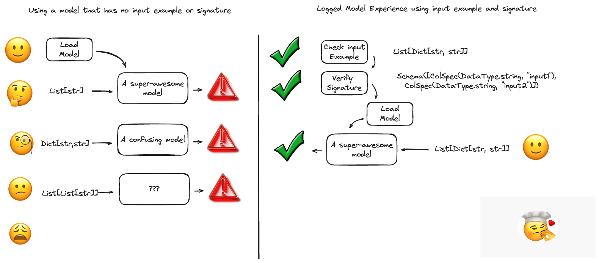

MLflow Model Signatures and Input Examples Guide
================================================

.. _intro-model-signature-input-example:

Introduction to Model Signatures and Input Examples
---------------------------------------------------

In MLflow, the concepts of *Model Signature* and *Model Input Example* are essential for effectively working with machine learning models. 
These components do more than just provide metadata; they establish crucial guidelines for model interaction, enhancing integration and 
usability within MLflow's ecosystem.

**Model Signature**
^^^^^^^^^^^^^^^^^^^
The :ref:`Model Signature <model-signature>` in MLflow is integral to the clear and accurate operation of models. It defines the expected 
format for model inputs and outputs, including any additional parameters needed for inference. This specification acts as a 
definitive guide, ensuring seamless model integration with MLflow's tools and external services.

**Model Input Example**
^^^^^^^^^^^^^^^^^^^^^^^
Complementing the Model Signature, the :ref:`Model Input Example <input-example>` gives a concrete instance of what valid model input 
looks like. This hands-on example is invaluable for developers, offering a clear understanding of the required data format and structure 
for effective model testing and real-world application.

Why are these important?
------------------------

Model signatures and input examples are foundational to robust ML workflows, offering a blueprint for model interactions that ensures consistency, 
accuracy, and ease of use. They act as a contract between the model and its users, providing a definitive guide to the expected data format, 
thus preventing miscommunication and errors that can arise from incorrect or unexpected inputs.

.. _model-signature:

Model Signature
---------------

In MLflow, a model signature precisely defines the schema for model inputs, outputs, and any additional parameters required for effective model 
operation. This definition serves as a uniform interface, guiding users in the appropriate and accurate use of their models. Model signatures are 
integral to the MLflow ecosystem, enabling both the MLflow Tracking UI and Model Registry UI to clearly display the model's required inputs, 
outputs, and parameters. Additionally, :ref:`MLflow model deployment tools <built-in-deployment>` utilize these signatures to ensure that 
the data used at inference aligns with the model's established specifications, thus maintaining the model's integrity and performance. For 
more insights into how these signatures enforce data accuracy, see the :ref:`Signature enforcement <signature-enforcement>` section.

Embedding a signature in your model is a straightforward process in MLflow. When using functions like :py:func:`sklearn.log_model() <mlflow.sklearn.log_model>` 
to log or save a model, simply include a :ref:`model input example <input-example>`. This action enables MLflow to **automatically infer the model's signature**. 
Detailed instructions on this process can be found in the :ref:`How to log models with signatures <how-to-log-models-with-signatures>` section. 
The inferred signatures, along with other essential model metadata, are stored in a JSON format within the :ref:`MLmodel file <pyfunc-model-config>` of 
your model artifacts. If there's a need to add a signature to a model that has already been logged or saved, the 
:py:func:`set_signature() <mlflow.models.set_signature>` API is available for this purpose. Consult the 
:ref:`How to set signatures on models <how-to-set-signatures-on-models>` section for a detailed guide on implementing this functionality.

Model Signature Components
^^^^^^^^^^^^^^^^^^^^^^^^^^

The structure of a model signature in MLflow is composed of three distinct schema types: **(1) inputs**, **(2) outputs**, and **(3) parameters (params)**. 
The **inputs** and **outputs** schemas specify the data structure that the model expects to receive and produce, respectively. These can be tailored to handle 
a variety of data formats, including columnar data and tensors, as well as Array and Object type inputs, catering to the diverse needs of different models.

**Parameters (params)**, on the other hand, refer to the additional, often optional, parameters that are crucial during the model's inference stage. 
These parameters provide added flexibility, allowing for fine-tuning and customization of the inference process.

.. note::
    The capability to handle Objects and Arrays in model signatures was introduced in **MLflow version 2.10.0** and onwards. In versions prior to 2.10.0, 
    column-based signatures were limited to scalar input types and certain conditional types specific to lists and dictionary inputs, with support primarily 
    for the `transformers <../../llms/transformers/index.html>`_ flavor. This enhancement in later versions significantly broadens the scope of data types and 
    structures that MLflow can seamlessly accommodate.

Signature Playground
^^^^^^^^^^^^^^^^^^^^

.. toctree::
    :maxdepth: 1
    :hidden:

    notebooks/signature_examples

In order to aid in understanding how data structures will be automatically inferred as a valid signature, as well as to provide extensive examples of 
valid signatures, we've created a notebook that you can view, showing different examples and their resulting inferred signatures. 
You can `view the notebook here <notebooks/signature_examples.html>`_. 

Alternatively, if you'd like to download the notebook locally and test it out with your own data structures, you can download it below.

.. raw:: html

    <a href="https://raw.githubusercontent.com/mlflow/mlflow/master/docs/source/model/notebooks/signature_examples.ipynb" class="notebook-download-btn">
        <i class="fas fa-download"></i>Download the Signature Playground Notebook</a> 

Required vs. Optional Input fields
^^^^^^^^^^^^^^^^^^^^^^^^^^^^^^^^^^

There are certain conditions that determine enforcement of signatures that are important to consider when defining your model signatures. One of the 
most notable is the concept of required vs. optional with regards to input data. 

Required fields are those that must be present in the input data in order for the model to be able to make a prediction. If a required field is missing, 
the signature enforcement validation will raise an exception stating that the required input field is missing. 

In order to configure a field as optional, you must pass in a value of `None` or `np.nan` for that field when using the :py:func:`mlflow.models.infer_signature` 
function. Alternatively, you can manually define the signature and set the `required` field to `false` for that field.

Model Signature Types
---------------------

MLflow supports two primary types of signatures: a column-based signature for tabular-based data, and a tensor-based signature for tensor data. 

Column-based Signatures
^^^^^^^^^^^^^^^^^^^^^^^
Column-based signatures are commonly utilized in traditional machine learning models that require tabular data inputs, such as a Pandas DataFrame. 
These signatures consist of a series of columns, each potentially having a name and a specified data type. The type of each column in both input 
and output corresponds to one of the :ref:`supported data types <supported-data-types-column>`, and columns can be optionally named. Additionally, 
columns in the input schema can be designated as ``optional``, indicating that their inclusion in the model's input is not mandatory and they can be 
left out if necessary (see :ref:`Optional Column <optional-column>` for more details).

.. _supported-data-types-column:

Supported Data Types
~~~~~~~~~~~~~~~~~~~~

Column-based signatures support data primitives defined within the :py:class:`MLflow DataType <mlflow.types.DataType>` specification:

* string
* integer :sup:`1`
* long
* float
* double
* boolean
* datetime

 +-----------------------------------------------+---------------------------------------------------------------------------+
 | Input (Python)                                | Inferred Signature                                                        |
 +-----------------------------------------------+---------------------------------------------------------------------------+
 | .. code-block:: python                        | .. code-block:: yaml                                                      |
 |                                               |                                                                           |
 |   from mlflow.models import infer_signature   |   signature:                                                              |
 |                                               |       input: '[                                                           |
 |    infer_signature(model_input={              |           {"name": "long_col", "type": "long",    "required": "true"},    |
 |        "long_col": 1,                         |           {"name": "str_col",  "type": "string",  "required": "true"},    |
 |        "str_col": "a",                        |           {"name": "bool_col", "type": "boolean", "required": "true"}     |
 |         "bool_col": True                      |       ]'                                                                  |
 |    })                                         |       output: null                                                        |
 |                                               |       params: null                                                        |
 |                                               |                                                                           |
 +-----------------------------------------------+---------------------------------------------------------------------------+

.. note::
    :sup:`1` Python often represents missing values in integer data as floats, causing type variability in integer columns and potential schema 
    enforcement errors in MLflow. To avoid such issues, particularly when using Python in MLflow for model serving and Spark deployments, 
    define integer columns with missing values as doubles (float64).

Column-based signature also support composite data types of these primitives.

- Array (list, numpy arrays)
- Spark ML vector (it inherits ``Array[double]`` type)
- Object (dictionary)

.. warning::

    * Support for Array and Object types was introduced in MLflow version **2.10.0**. These types will not be recognized in previous versions of MLflow.  If you are saving a model that uses these signature types, you should ensure that any other environment that attempts to load these models  has a version of MLflow installed that is at least 2.10.0.
    * Support for Spark ML vector type was introduced in MLflow version **2.15.0**, These type will not be recognized in previous versions of MLflow.

Additional examples for composite data types can be seen by viewing the `signature examples notebook <notebooks/signature_examples.html>`_.

 +-----------------------------------------------+-------------------------------------------------------------------------------------------------------+
 | Input (Python)                                | Inferred Signature                                                                                    |
 +-----------------------------------------------+-------------------------------------------------------------------------------------------------------+
 | .. code-block:: python                        | .. code-block:: yaml                                                                                  |
 |                                               |                                                                                                       |
 |   from mlflow.models import infer_signature   |   signature:                                                                                          |
 |                                               |       input: '[                                                                                       |
 |   infer_signature(model_input={               |            {"list_col": Array(string) (required)},                                                    |
 |       # Python list                           |            {"numpy_col": Array(Array(long)) (required)},                                              |
 |       "list_col": ["a", "b", "c"],            |            {"obj_col": {array_prop: Array(string) (required), long_prop: long (required)} (required)} |
 |       # Numpy array                           |       ]'                                                                                              |                                               
 |       "numpy_col": np.array([[1, 2], [3, 4]]),|       output: null                                                                                    |
 |       # Dictionary                            |       params: null                                                                                    |
 |       "obj_col": {                            |                                                                                                       |
 |           "long_prop": 1,                     |                                                                                                       |
 |            "array_prop": ["a", "b", "c"],     |                                                                                                       |
 |       },                                      |                                                                                                       |
 |    })                                         |                                                                                                       |
 +-----------------------------------------------+-------------------------------------------------------------------------------------------------------+

.. _optional-column:

Optional Column
~~~~~~~~~~~~~~~

Columns that contain `None` or `np.nan` values within the input data will be inferred as `optional` (i.e. `required=False`)

 +-----------------------------------------------+---------------------------------------------------------------------------+
 | Input (Python)                                | Inferred Signature                                                        |
 +-----------------------------------------------+---------------------------------------------------------------------------+
 | .. code-block:: python                        | .. code-block:: yaml                                                      |
 |                                               |                                                                           |
 |   from mlflow.models import infer_signature   |   signature:                                                              |
 |                                               |       input: '[                                                           |
 |   infer_signature(model_input=                |           {"name": "col", "type": "double", "required": false}            |
 |       pd.DataFrame({                          |       ]'                                                                  |
 |           "col": [1.0, 2.0, None]             |       output: null                                                        |
 |       })                                      |       params: null                                                        |
 |   )                                           |                                                                           |
 +-----------------------------------------------+---------------------------------------------------------------------------+

.. note::
    Nested arrays can contain an empty list, and it does not make the column `optional` as it represents an empty set (∅). In such case, 
    the schema will be inferred from the other elements of the list, assuming they have homogeneous types. If you want to make a column optional,
    pass `None` instead.

    +-----------------------------------------------+----------------------------------------------------------------------------------+
    | Input (Python)                                | Inferred Signature                                                               |
    +-----------------------------------------------+----------------------------------------------------------------------------------+
    | .. code-block:: python                        | .. code-block:: yaml                                                             |
    |                                               |                                                                                  |
    |    infer_signature(model_input={              |   signature:                                                                     |
    |        "list_with_empty": [["a", "b"], []],   |       input: '[                                                                  |
    |        "list_with_none": [["a", "b"], None],  |           {"name": "list_with_empty", "type": "Array(str)", "required": "true" },|
    |    })                                         |           {"name": "list_with_none" , "type": "Array(str)", "required": "false"},|
    |                                               |       ]'                                                                         |
    |                                               |       output: null                                                               |
    |                                               |       params: null                                                               |
    +-----------------------------------------------+----------------------------------------------------------------------------------+

Tensor-based Signatures
^^^^^^^^^^^^^^^^^^^^^^^

Tensor-based signatures are primarily employed in models that process tensor inputs, commonly found in deep learning applications involving images, 
audio data, and similar formats. These schemas consist of sequences of tensors, each potentially named and defined by a specific 
`numpy data type <https://numpy.org/devdocs/user/basics.types.html>`_. 

In a tensor-based signature, each input and output tensor is characterized by three attributes: a **dtype** (data type, aligning with 
`numpy data types <https://numpy.org/devdocs/user/basics.types.html>`_), a **shape**, and an optional **name**. It's important to note that 
tensor-based signatures do not accommodate optional inputs. The shape attribute often uses -1 for any dimension whose size may vary, 
commonly seen in batch processing.

Consider a classification model trained on the `MNIST dataset <http://yann.lecun.com/exdb/mnist/>`_. An example of its model signature would feature 
an input tensor representing an image as a 28 × 28 × 1 array of float32 numbers. The model's output might be a tensor signifying the probability 
for each of the 10 target classes. In such cases, the first dimension, representing the batch size, is typically set to -1, allowing the model 
to handle batches of varying sizes.

.. code-block:: yaml

  signature:
      inputs: '[{"name": "images", "type": "tensor", "tensor-spec": {"dtype": "uint8", "shape": [-1, 28, 28, 1]}}]'
      outputs: '[{"type": "tensor", "tensor-spec": {"shape": [-1, 10], "dtype": "float32"}}]'
      params: null

.. _supported-data-types-tensor:

Supported Data Types
~~~~~~~~~~~~~~~~~~~~

Tensor-based schemas support `numpy data types <https://numpy.org/devdocs/user/basics.types.html>`_.

 +-----------------------------------------------+---------------------------------------------------------------------------------------------+
 | Input (Python)                                | Inferred Signature                                                                          |
 +-----------------------------------------------+---------------------------------------------------------------------------------------------+
 | .. code-block:: python                        | .. code-block:: yaml                                                                        |
 |                                               |                                                                                             |
 |   from mlflow.models import infer_signature   |   signature:                                                                                |
 |                                               |       input: '[{"type": "tensor", "tensor-spec": {"dtype": "int64", "shape": [-1, 2, 3]}}]' |
 |   infer_signature(model_input=np.array([      |       output: None                                                                          |
 |       [[1, 2, 3], [4, 5, 6]],                 |       params: None                                                                          |
 |       [[7, 8, 9], [1, 2, 3]],                 |                                                                                             |
 |   ]))                                         |                                                                                             |
 +-----------------------------------------------+---------------------------------------------------------------------------------------------+

.. note::
    Tensor-based schemas do not support optional inputs. You can pass an array with `None` or `np.nan` values,
    but the schema doesn't flag them as optional.

.. _inference-params:

Model Signatures with Inference Params
^^^^^^^^^^^^^^^^^^^^^^^^^^^^^^^^^^^^^^

Inference parameters (or 'params') are additional settings passed to models during the inference stage. Common examples include parameters 
like ``temperature`` and ``max_length`` in Language Learning Models (LLMs). These params, not typically required during training, play a crucial role in 
tailoring the behavior of a model at the time of inference. This kind of configuration becomes increasingly important with foundational models, 
as the same model might need different parameter settings for various inference scenarios. 

MLflow's **2.6.0** release introduced the specification of a dictionary of inference params during model inference. This feature enhances the flexibility 
and control over the inference outcomes, enabling more nuanced model behavior adjustments.

To leverage params at inference time, they must be incorporated into the :ref:`Model Signature <model-signature>`. The schema for params is 
defined as a sequence of :py:class:`ParamSpec <mlflow.types.ParamSpec>` elements, each comprising:

* **name**: The identifier of the parameter, e.g., ``temperature``.
* **type**: The data type of the parameter, which must align with one of the :ref:`supported data types <supported-data-types-params>`.
* **default**: The default value for the parameter, ensuring a fallback option if a specific value isn't provided.
* **shape**: The shape of the parameter, typically ``None`` for scalar values and ``(-1,)`` for lists.

This feature marks a significant advancement in how MLflow handles model inference, offering a more dynamic and adaptable approach to model parameterization.

.. code-block:: yaml

    signature:
        inputs: '[{"name": "input", "type": "string"}]'
        outputs: '[{"name": "output", "type": "string"}]'
        params: '[
            {
                "name": "temperature", 
                "type": "float", 
                "default": 0.5, 
                "shape": null
            },
            {
                "name": "suppress_tokens", 
                "type": "integer", 
                "default": [101, 102],
                 "shape": [-1]
            }
        ]'

The inference parameters are supplied to the model in the form of a dictionary during the inference stage. Each parameter value is subject to 
validation to ensure it matches the type specified in the model's signature. The example below illustrates the process of defining parameters 
within a model signature and demonstrates their application in model inference.

.. code-block:: python

    import mlflow
    from mlflow.models import infer_signature

    class MyModel(mlflow.pyfunc.PythonModel):
        def predict(self, ctx, model_input, params):
            return list(params.values())

    params = {"temperature": 0.5, "suppress_tokens": [101, 102]}
    # params' default values are saved with ModelSignature
    signature = infer_signature(["input"], params=params)

    with mlflow.start_run():
        model_info = mlflow.pyfunc.log_model(
            python_model=MyModel(), artifact_path="my_model", signature=signature
        )

    loaded_model = mlflow.pyfunc.load_model(model_info.model_uri)

    # Not passing params -- predict with default values
    loaded_predict = loaded_model.predict(["input"])
    assert loaded_predict == [0.5, [101, 102]]

    # Passing some params -- override passed-in params
    loaded_predict = loaded_model.predict(["input"], params={"temperature": 0.1})
    assert loaded_predict == [0.1, [101, 102]]

    # Passing all params -- override all params
    loaded_predict = loaded_model.predict(
        ["input"], params={"temperature": 0.5, "suppress_tokens": [103]}
    )
    assert loaded_predict == [0.5, [103]]

.. _supported-data-types-params:

Supported Data Types for Params
~~~~~~~~~~~~~~~~~~~~~~~~~~~~~~~

Parameters in MLflow are defined to accept values of the :py:class:`MLflow DataType <mlflow.types.DataType>`, including a one-dimensional 
list of these data types. Currently, MLflow supports only 1D lists for parameters.

.. note::
    When validating param values, the values will be converted to python native types.
    For example, ``np.float32(0.1)`` will be converted to ``float(0.1)``.

.. _signature-enforcement:

Signature Enforcement
---------------------
MLflow's schema enforcement rigorously validates the provided inputs and parameters against the model's signature. It raises an exception 
if the inputs are incompatible and either issues a warning or raises an exception for incompatible parameters. This enforcement is applied 
prior to invoking the underlying model implementation and throughout the model inference process. Note, however, that this enforcement is 
specific to scenarios where :ref:`MLflow model deployment tools <built-in-deployment>` are used or when models are loaded as ``python_function``. 
It does not apply to models loaded in their native format, such as through :py:func:`mlflow.sklearn.load_model() <mlflow.sklearn.load_model>`.

.. figure:: ../_static/images/models/signature-enforcement.png
    :align: center
    :figwidth: 90%

Name Ordering Enforcement
^^^^^^^^^^^^^^^^^^^^^^^^^
In MLflow, input names are verified against the model signature. Missing required inputs trigger an exception, whereas missing optional inputs do 
not. Inputs not declared in the signature are disregarded. When the input schema in the signature specifies input names, matching is conducted by 
name, and inputs are reordered accordingly. If the schema lacks input names, matching is based on the order of inputs, with MLflow checking only 
the number of inputs provided.

Input Type Enforcement
^^^^^^^^^^^^^^^^^^^^^^
MLflow enforces input types as defined in the model's signature. For column-based signature models (such as those using DataFrame inputs), MLflow 
performs safe type conversions where necessary, allowing only lossless conversions. For example, converting int to long or int to double is 
permissible, but converting long to double is not. In cases where types cannot be made compatible, MLflow will raise an error.

For Pyspark DataFrame inputs, MLflow casts a sample of the PySpark DataFrame into a Pandas DataFrame. MLflow will only enforce the schema on a subset of the data rows.

For tensor-based signature models, type checking is more stringent. An exception is thrown if the input type does not align with the schema-specified type.

Params Type and Shape Enforcement
^^^^^^^^^^^^^^^^^^^^^^^^^^^^^^^^^
In MLflow, the types and shapes of parameters (params) are meticulously checked against the model's signature. During inference, each parameter's type 
and shape are validated to ensure they align with the specifications in the signature. Scalar values are expected to have a shape of ``None``, while list 
values should have a shape of ``(-1,)``. If a parameter's type or shape is found to be incompatible, MLflow raises an exception. Additionally, the parameter's 
value undergoes a validation check against its designated type in the signature. If the conversion to the specified type fails, an `MlflowException` is 
triggered. For a comprehensive list of valid params, refer to the :ref:`Model Inference Params <inference-params>` section. 

.. important::
    Models with signatures that receive undeclared params during inference will trigger a warning for each request, and any invalid params will be disregarded.

Handling Integers With Missing Values
^^^^^^^^^^^^^^^^^^^^^^^^^^^^^^^^^^^^^
In Python, integer data with missing values is often represented as floats. This leads to variability in the data types of integer columns, potentially 
causing schema enforcement errors during runtime, as integers and floats are not inherently compatible. For instance, if a column 'c' in your training data 
is entirely integers, it will be recognized as such. However, if a missing value is introduced in 'c', it will be represented as a float. If the model's 
signature expects 'c' to be an integer, MLflow will raise an error due to the inability to convert float to int. To mitigate this issue, especially since 
MLflow uses Python for model serving and Spark deployments, it's advisable to define integer columns with missing values as doubles (float64).

Handling Date and Timestamp
^^^^^^^^^^^^^^^^^^^^^^^^^^^
Python's datetime types come with built-in precision, such as ``datetime64[D]`` for day precision and ``datetime64[ns]`` for nanosecond precision. 
While this precision detail is disregarded in column-based model signatures, it is enforced in tensor-based signatures.

Handling Ragged Arrays
^^^^^^^^^^^^^^^^^^^^^^
Ragged arrays in numpy, characterized by a shape of (-1,) and a dtype of object, are automatically managed when using ``infer_signature``. This results 
in a signature like ``Tensor('object', (-1,))``. For a more detailed representation, a signature can be manually created to reflect the specific nature 
of a ragged array, such as ``Tensor('float64', (-1, -1, -1, 3))``. Enforcement is then applied as detailed in the signature, accommodating ragged input arrays.

.. _how-to-log-models-with-signatures:

How To Log Models With Signatures
---------------------------------
Including a signature with your model in MLflow is straightforward. Simply provide a :ref:`model input example <input-example>` when making a 
call to either the log_model or save_model functions, such as with :py:func:`sklearn.log_model() <mlflow.sklearn.log_model>`. MLflow will then 
automatically infer the model's signature based on this input example and the model's predicted output for the given example.

Alternatively, you can explicitly attach a signature object to your model. This is done by passing a :py:class:`signature object <mlflow.models.ModelSignature>` 
to your log_model or save_model function. You can manually create a model signature object or use the :py:func:`infer_signature <mlflow.models.infer_signature>` 
function to generate it from datasets with valid model inputs (for instance, a training dataset minus the target column), valid model outputs (such as 
predictions made on the training dataset), and valid model parameters (like a dictionary of parameters used for model inference, commonly seen in 
`Generation Configs for transformers <https://huggingface.co/docs/transformers/main_classes/text_generation#transformers.GenerationConfig>`_).

.. note::
    Model signatures play a crucial role in :ref:`MLflow model deployment tools <built-in-deployment>`, particularly for serving models in the Python 
    Function (PyFunc) flavor. Therefore, when attaching a signature to your log_model or save_model call, it's important to ensure that the signature 
    accurately reflects the inputs and outputs expected by the model's PyFunc representation. This consideration becomes especially significant if the
    model's input schema, when loaded as a PyFunc, differs from that of the dataset used for testing (an example of this scenario is with the 
    :ref:`pmdarima model flavor <pmdarima-flavor>`).

Column-based Signature Example
^^^^^^^^^^^^^^^^^^^^^^^^^^^^^^
The following example demonstrates how to store a model signature for a simple classifier trained
on the ``Iris dataset``:

.. code-block:: python

    import pandas as pd
    from sklearn import datasets
    from sklearn.ensemble import RandomForestClassifier
    import mlflow

    iris = datasets.load_iris()
    iris_train = pd.DataFrame(iris.data, columns=iris.feature_names)
    clf = RandomForestClassifier(max_depth=7, random_state=0)

    with mlflow.start_run():
        clf.fit(iris_train, iris.target)
        # Take the first row of the training dataset as the model input example.
        input_example = iris_train.iloc[[0]]
        # The signature is automatically inferred from the input example and its predicted output.
        mlflow.sklearn.log_model(clf, "iris_rf", input_example=input_example)

The same signature can be explicitly created and logged as follows:

.. code-block:: python

    from mlflow.models import ModelSignature, infer_signature
    from mlflow.types.schema import Schema, ColSpec

    # Option 1: Manually construct the signature object
    input_schema = Schema(
        [
            ColSpec("double", "sepal length (cm)"),
            ColSpec("double", "sepal width (cm)"),
            ColSpec("double", "petal length (cm)"),
            ColSpec("double", "petal width (cm)"),
        ]
    )
    output_schema = Schema([ColSpec("long")])
    signature = ModelSignature(inputs=input_schema, outputs=output_schema)

    # Option 2: Infer the signature
    signature = infer_signature(iris_train, clf.predict(iris_train))

    with mlflow.start_run():
        mlflow.sklearn.log_model(clf, "iris_rf", signature=signature)

Tensor-based Signature Example
^^^^^^^^^^^^^^^^^^^^^^^^^^^^^^
The following example demonstrates how to store a model signature for a simple classifier trained
on the ``MNIST dataset``:

.. code-block:: python

    import tensorflow as tf
    import mlflow

    mnist = tf.keras.datasets.mnist
    (x_train, y_train), (x_test, y_test) = mnist.load_data()
    x_train, x_test = x_train / 255.0, x_test / 255.0

    model = tf.keras.models.Sequential(
        [
            tf.keras.layers.Flatten(input_shape=(28, 28)),
            tf.keras.layers.Dense(128, activation="relu"),
            tf.keras.layers.Dropout(0.2),
            tf.keras.layers.Dense(10),
        ]
    )
    loss_fn = tf.keras.losses.SparseCategoricalCrossentropy(from_logits=True)
    model.compile(optimizer="adam", loss=loss_fn, metrics=["accuracy"])

    with mlflow.start_run():
        model.fit(x_train, y_train, epochs=5)
        # Take the first three training examples as the model input example.
        input_example = x_train[:3, :]
        mlflow.tensorflow.log_model(model, "mnist_cnn", input_example=input_example)

The same signature can be explicitly created and logged as follows:

.. code-block:: python

    import numpy as np
    from mlflow.models import ModelSignature, infer_signature
    from mlflow.types.schema import Schema, TensorSpec

    # Option 1: Manually construct the signature object
    input_schema = Schema(
        [
            TensorSpec(np.dtype(np.float64), (-1, 28, 28, 1)),
        ]
    )
    output_schema = Schema([TensorSpec(np.dtype(np.float32), (-1, 10))])
    signature = ModelSignature(inputs=input_schema, outputs=output_schema)

    # Option 2: Infer the signature
    signature = infer_signature(testX, model.predict(testX))

    with mlflow.start_run():
        mlflow.tensorflow.log_model(model, "mnist_cnn", signature=signature)

Signature with params Example
^^^^^^^^^^^^^^^^^^^^^^^^^^^^^
The following example demonstrates how to store a model signature with params
for a simple transformers model:

.. code-block:: python

    import mlflow
    from mlflow.models import infer_signature
    import transformers

    architecture = "mrm8488/t5-base-finetuned-common_gen"
    model = transformers.pipeline(
        task="text2text-generation",
        tokenizer=transformers.T5TokenizerFast.from_pretrained(architecture),
        model=transformers.T5ForConditionalGeneration.from_pretrained(architecture),
    )
    data = "pencil draw paper"

    params = {
        "top_k": 2,
        "num_beams": 5,
        "max_length": 30,
        "temperature": 0.62,
        "top_p": 0.85,
        "repetition_penalty": 1.15,
        "begin_suppress_tokens": [1, 2, 3],
    }

    # infer signature with params
    signature = infer_signature(
        data,
        mlflow.transformers.generate_signature_output(model, data),
        params,
    )

    # save model with signature
    mlflow.transformers.save_model(
        model,
        "text2text",
        signature=signature,
    )
    pyfunc_loaded = mlflow.pyfunc.load_model("text2text")

    # predict with params
    result = pyfunc_loaded.predict(data, params=params)

The same signature can be created explicitly as follows:

.. code-block:: python

    from mlflow.models import ModelSignature
    from mlflow.types.schema import ColSpec, ParamSchema, ParamSpec, Schema

    input_schema = Schema([ColSpec(type="string")])
    output_schema = Schema([ColSpec(type="string")])
    params_schema = ParamSchema(
        [
            ParamSpec("top_k", "long", 2),
            ParamSpec("num_beams", "long", 5),
            ParamSpec("max_length", "long", 30),
            ParamSpec("temperature", "double", 0.62),
            ParamSpec("top_p", "double", 0.85),
            ParamSpec("repetition_penalty", "double", 1.15),
            ParamSpec("begin_suppress_tokens", "long", [1, 2, 3], (-1,)),
        ]
    )
    signature = ModelSignature(
        inputs=input_schema, outputs=output_schema, params=params_schema
    )

.. _how-to-set-signatures-on-models:

How To Set Signatures on Models
-------------------------------
Models can be saved without model signatures or with incorrect ones. To add or update a signature for an existing logged model, 
use the :py:func:`mlflow.models.set_signature() <mlflow.models.set_signature>` API. Below are some examples demonstrating its usage.

Setting a Signature on a Logged Model
^^^^^^^^^^^^^^^^^^^^^^^^^^^^^^^^^^^^^
The following example demonstrates how to set a model signature on an already-logged sklearn model.
Suppose that you've logged a sklearn model without a signature like below:

.. code-block:: python

    import pandas as pd
    from sklearn import datasets
    from sklearn.ensemble import RandomForestClassifier
    import mlflow

    X, y = datasets.load_iris(return_X_y=True, as_frame=True)
    clf = RandomForestClassifier(max_depth=7, random_state=0)
    with mlflow.start_run() as run:
        clf.fit(X, y)
        mlflow.sklearn.log_model(clf, "iris_rf")

You can set a signature on the logged model as follows:

.. code-block:: python

    import pandas as pd
    from sklearn import datasets
    import mlflow
    from mlflow.models.model import get_model_info
    from mlflow.models import infer_signature, set_signature

    # load the logged model
    model_uri = f"runs:/{run.info.run_id}/iris_rf"
    model = mlflow.pyfunc.load_model(model_uri)

    # construct the model signature from test dataset
    X_test, _ = datasets.load_iris(return_X_y=True, as_frame=True)
    signature = infer_signature(X_test, model.predict(X_test))

    # set the signature for the logged model
    set_signature(model_uri, signature)

    # now when you load the model again, it will have the desired signature
    assert get_model_info(model_uri).signature == signature

Note that model signatures can also be set on model artifacts saved outside of MLflow Tracking. For instance, 
you can easily set a signature on a locally saved iris model by altering the model_uri
variable in the previous code snippet to point to the model's local directory.

.. _set-signature-on-mv:

Setting a Signature on a Registered Model
-----------------------------------------

As MLflow Model Registry artifacts are meant to be read-only, you cannot directly set a signature on
a model version or model artifacts represented by ``models:/`` URI schemes. Instead, you should first set
the signature on the source model artifacts and generate a new model version using the updated 
model artifacts. The following example illustrates how this can be done.

Supposed you have created the following model version without a signature like below:

.. code-block:: python

    from sklearn.ensemble import RandomForestClassifier
    import mlflow
    from mlflow.client import MlflowClient

    model_name = "add_signature_model"

    with mlflow.start_run() as run:
        mlflow.sklearn.log_model(RandomForestClassifier(), "sklearn-model")

    model_uri = f"runs:/{run.info.run_id}/sklearn-model"
    mlflow.register_model(model_uri=model_uri, name=model_name)

To set a signature on the model version, create a duplicate model version with the new signature
as follows:

.. code-block:: python

    from sklearn.ensemble import RandomForestClassifier
    import mlflow
    from mlflow.store.artifact.models_artifact_repo import ModelsArtifactRepository

    client = mlflow.client.MlflowClient()
    model_name = "add_signature_model"
    model_version = 1
    mv = client.get_model_version(name=model_name, version=model_version)

    # set a dummy signature on the model version source
    signature = infer_signature(np.array([1]))
    set_signature(mv.source, signature)

    # create a new model version with the updated source
    client.create_model_version(name=model_name, source=mv.source, run_id=mv.run_id)

Note that this process overwrites the model artifacts from the source run of model version 1
with a new model signature.

.. _input-example:

Model Input Example
-------------------
A model input example provides an instance of a valid model input. Input examples are stored with 
the model as separate artifacts and are referenced in the :ref:`MLmodel file <pyfunc-model-config>`.
To include an input example with your model, add it to the appropriate log_model call, e.g.
:py:func:`sklearn.log_model() <mlflow.sklearn.log_model>`. Input examples are also used to infer
model signatures in log_model calls when signatures aren't specified.

.. tip::
    Including an input example while logging a model offers dual benefits. Firstly, it aids in inferring the model's signature. 
    Secondly, and just as importantly, it **validates the model's requirements**. This input example is utilized to execute a prediction 
    using the model that is about to be logged, thereby enhancing the accuracy in identifying model requirement dependencies.
    It is **highly recommended** to always include an input example along with your models when you log them.

Since MLflow 2.16.0, when logging a model with an input example, there are two files saved into the model's artifacts directory:

- ``input_example.json``: The input example in JSON format.
- ``serving_input_example.json``: The input example in JSON format, with additional transformation to have compatible schema for querying a deployed model REST endpoint.

The following example demonstrates the difference between the two files:

.. code-block:: python

    import mlflow

    class MyModel(mlflow.pyfunc.PythonModel):
        def predict(self, context, model_input, params=None):
            return model_input

    with mlflow.start_run():
        model_info = mlflow.pyfunc.log_model(
            python_model=MyModel(),
            artifact_path="model",
            input_example={"question": "What is MLflow?"},
        )

Example files logged by MLflow:

.. list-table::
   :header-rows: 1
   :class: wrap-table

   * - File name
     - Content
     - Explanation
   * - input_example.json
     - 
        .. code-block:: json

            {
              "question": "What is MLflow?"
            }

     - The input example in its original format.
   * - serving_input_example.json
     - 
        .. code-block:: json

            {
              "inputs": {
                "question": "What is MLflow?"
              }
            }

     - JSON-serialized version of the input example with one of the predefined keys (``dataframe_split``, ``instances``, ``inputs`` or ``dataframe_records``) that mlflow scoring server requires when `querying a deployed model endpoint <../../deployment/deploy-model-locally.html#local-inference-server-spec>`_.

.. note::
    Prior to MLflow 2.16.0, dictionary input example was converted to Pandas DataFrame format when saving. In later versions, the input
    example is simply saved in its JSON serialized format. For pandas DataFrame, it is converted to dictionary format 
    with ``to_dict(orient='split')`` and saved into json format. ``example_no_conversion`` parameter for langchain, openai, pyfunc and
    transformers flavors is no longer used and safe to be removed, it will be dropped in a future release.

Similar to model signatures, model inputs can be column-based (i.e DataFrames), tensor-based
(i.e numpy.ndarrays) or json object (i.e python dictionary). We offer support for input_example 
with params by using tuple to combine model inputs and params. See examples below:

How To Log Model With Column-based Example
^^^^^^^^^^^^^^^^^^^^^^^^^^^^^^^^^^^^^^^^^^
For models accepting column-based inputs, an example can be a single record or a batch of records. The
sample input can be in the following formats:

* Pandas DataFrame

The given example will be serialized to json using the Pandas split-oriented
format. Bytes are base64-encoded. The following example demonstrates how you can log a column-based
input example with your model:

.. code-block:: python

    import pandas as pd

    input_example = pd.DataFrame(
        [
            {
                "sepal length (cm)": 5.1,
                "sepal width (cm)": 3.5,
                "petal length (cm)": 1.4,
                "petal width (cm)": 0.2,
            }
        ]
    )
    mlflow.sklearn.log_model(..., input_example=input_example)

How To Log Models With a Tensor-based Example
^^^^^^^^^^^^^^^^^^^^^^^^^^^^^^^^^^^^^^^^^^^^^
For models accepting tensor-based inputs, an example must be a batch of inputs. By default, the axis 0
is the batch axis unless specified otherwise in the model signature. The sample input can be passed in
as any of the following formats:

* numpy ndarray
* Python ``dict`` mapping a string to a numpy array
* Scipy ``csr_matrix`` (sparse matrix)
* Scipy ``csc_matrix`` (sparse matrix).

The following example demonstrates how you can log a tensor-based input example with your model:

.. code-block:: python

    # each input has shape (4, 4)
    input_example = np.array(
        [
            [[0, 0, 0, 0], [0, 134, 25, 56], [253, 242, 195, 6], [0, 93, 82, 82]],
            [[0, 23, 46, 0], [33, 13, 36, 166], [76, 75, 0, 255], [33, 44, 11, 82]],
        ],
        dtype=np.uint8,
    )
    mlflow.tensorflow.log_model(..., input_example=input_example)

How To Log Models Using a JSON Object Example
^^^^^^^^^^^^^^^^^^^^^^^^^^^^^^^^^^^^^^^^^^^^^
We support saving input example as it is if it's a json-serializable format. The input example can be
in the following formats:

* ``dict`` (of scalars, strings, or lists of scalar values)
* ``list``
* ``scalars``

The following example demonstrates how you can log a json object input example with your model:

.. code-block:: python

    input_example = {
        "messages": [
            {"role": "system", "content": "You are a helpful assistant."},
            {"role": "assistant", "content": "What would you like to ask?"},
            {"role": "user", "content": "Who owns MLflow?"},
        ]
    }
    mlflow.langchain.log_model(..., input_example=input_example)

How To Log Model With an Example that Contains Params
^^^^^^^^^^^^^^^^^^^^^^^^^^^^^^^^^^^^^^^^^^^^^^^^^^^^^

For models that require additional parameters during inference, you can include an input_example 
containing params when saving or logging the model. To achieve this, the sample input should be 
provided as a ``tuple``. The first element of the tuple is the input data example, and the
second element is a ``dict`` of params. A comprehensive list of valid params is documented in
:ref:`Model Inference Params <inference-params>` section.

* Python ``tuple``: (input_data, params)

The following example demonstrates how to log a model with an example containing params:

.. code-block:: python

    # input_example could be column-based or tensor-based example as shown above
    # params must be a valid dictionary of params
    input_data = "Hello, Dolly!"
    params = {"temperature": 0.5, "top_k": 1}
    input_example = (input_data, params)
    mlflow.transformers.log_model(..., input_example=input_example)

Model Serving Payload Example
-----------------------------
Once an MLflow model is deployed to a REST endpoint for inference, the request payload will be
JSON serialized and may have subtle difference from in-memory representation.
To validate your model works for inference, you can use the ``serving_input_example.json`` file.
It is automatically logged along with the model when an ``input_example`` is provided and contains
a json format of the given input example for querying a deployed model endpoint.

The following example demonstrates how to load the serving payload from a logged model:

.. code-block:: python

    import mlflow
    from mlflow.models.utils import load_serving_example

    input_example = {
        "messages": [
            {"role": "system", "content": "You are a helpful assistant."},
            {"role": "assistant", "content": "What would you like to ask?"},
            {"role": "user", "content": "Who owns MLflow?"},
        ]
    }
    model_info = mlflow.langchain.log_model(..., input_example=input_example)
    print(f"model_uri: {model_info.model_uri}")
    serving_example = load_serving_example(model_info.model_uri)
    print(f"serving_example: {serving_example}")

You can validate the input example works prior to serving:

.. code-block:: python

    from mlflow.models import validate_serving_input

    result = validate_serving_input(model_info.model_uri, serving_example)
    print(f"prediction result: {result}")

Serve the model locally

.. code-block:: bash

    mlflow models serve --model-uri "<YOUR_MODEL_URI>"

Validate model inference with the serving payload example

.. code-block:: bash

    curl http://127.0.0.1:5000/invocations -H 'Content-Type: application/json' -d 'YOUR_SERVING_EXAMPLE'
