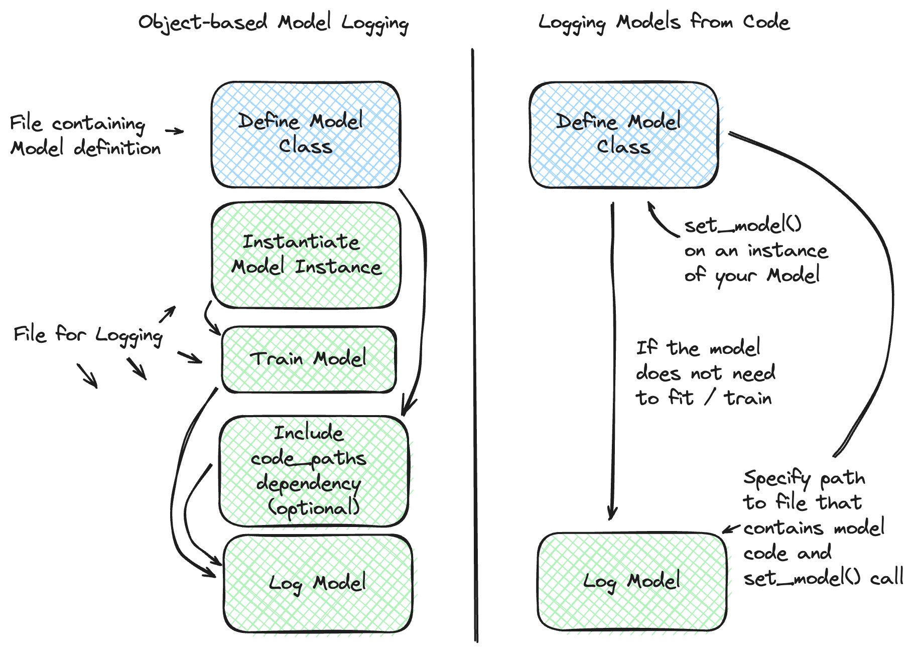
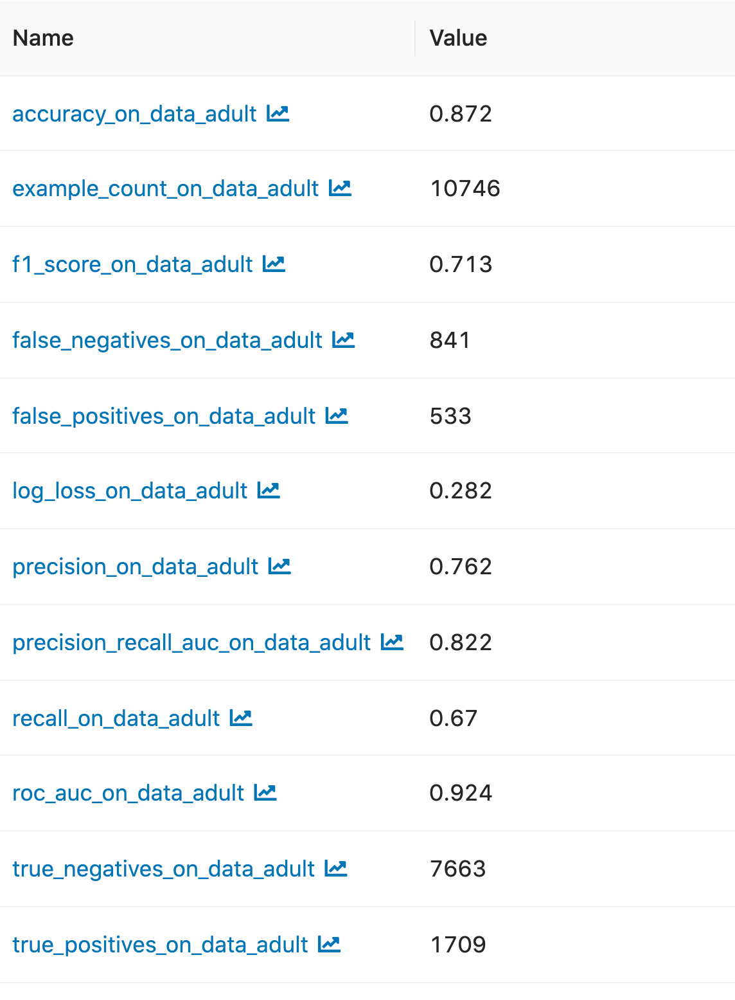
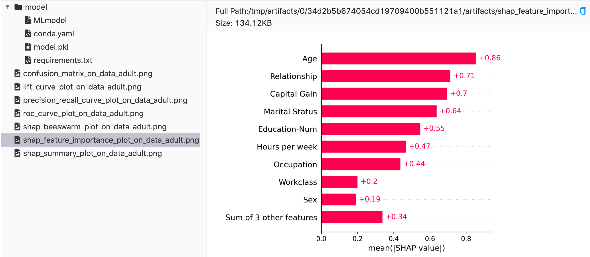
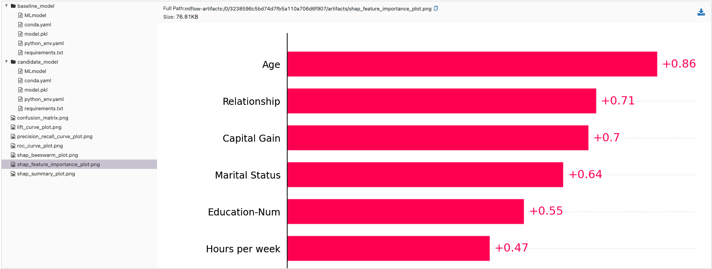

.. _models:

MLflow Models
=============

An MLflow Model is a standard format for packaging machine learning models that can be used in a
variety of downstream tools---for example, real-time serving through a REST API or batch inference
on Apache Spark. The format defines a convention that lets you save a model in different "flavors"
that can be understood by different downstream tools.

.. contents:: Table of Contents
  :local:
  :depth: 1

.. _model-storage-format:

Storage Format
--------------

Each MLflow Model is a directory containing arbitrary files, together with an ``MLmodel``
file in the root of the directory that can define multiple *flavors* that the model can be viewed
in.

The **model** aspect of the MLflow Model can either be a serialized object (e.g., a pickled ``scikit-learn`` model)
or a Python script (or notebook, if running in Databricks) that contains the model instance that has been defined 
with the :py:func:`mlflow.models.set_model` API. 

Flavors are the key concept that makes MLflow Models powerful: they are a convention that deployment
tools can use to understand the model, which makes it possible to write tools that work with models
from any ML library without having to integrate each tool with each library. MLflow defines
several "standard" flavors that all of its built-in deployment tools support, such as a "Python
function" flavor that describes how to run the model as a Python function. However, libraries can
also define and use other flavors. For example, MLflow's :py:mod:`mlflow.sklearn` library allows
loading models back as a scikit-learn ``Pipeline`` object for use in code that is aware of
scikit-learn, or as a generic Python function for use in tools that just need to apply the model
(for example, the ``mlflow deployments`` tool with the option ``-t sagemaker`` for deploying models
to Amazon SageMaker).

MLmodel file
^^^^^^^^^^^^

All of the flavors that a particular model supports are defined in its ``MLmodel`` file in YAML
format. For example, :py:mod:`mlflow.sklearn` outputs models as follows:

::

    # Directory written by mlflow.sklearn.save_model(model, "my_model")
    my_model/
    ├── MLmodel
    ├── model.pkl
    ├── conda.yaml
    ├── python_env.yaml
    └── requirements.txt

And its ``MLmodel`` file describes two flavors:

.. code-block:: yaml

    time_created: 2018-05-25T17:28:53.35

    flavors:
      sklearn:
        sklearn_version: 0.19.1
        pickled_model: model.pkl
      python_function:
        loader_module: mlflow.sklearn

Apart from a **flavors** field listing the model flavors, the MLmodel YAML format can contain
the following fields:

* ``time_created``: Date and time when the model was created, in UTC ISO 8601 format.
* ``run_id``: ID of the run that created the model, if the model was saved using :ref:`tracking`.
* ``signature``: :ref:`model signature <model-signature>` in JSON format.
* ``input_example``: reference to an artifact with :ref:`input example <input-example>`.
* ``databricks_runtime``: Databricks runtime version and type, if the model was trained in a Databricks notebook or job.
* ``mlflow_version``: The version of MLflow that was used to log the model.

Additional Logged Files
^^^^^^^^^^^^^^^^^^^^^^^
For environment recreation, we automatically log ``conda.yaml``, ``python_env.yaml``, and ``requirements.txt`` files whenever a model is logged.
These files can then be used to reinstall dependencies using ``conda`` or ``virtualenv`` with ``pip``. Please see 
:ref:`How MLflow Model Records Dependencies <how-mlflow-records-dependencies>` for more details about these files.

When logging a model, model metadata files (``MLmodel``, ``conda.yaml``, ``python_env.yaml``, ``requirements.txt``) are copied to a subdirectory named ``metadata``. For wheeled models, ``original_requirements.txt`` file is also copied.

.. note::
    When a model registered in the MLflow Model Registry is downloaded, a YAML file named
    `registered_model_meta` is added to the model directory on the downloader's side.
    This file contains the name and version of the model referenced in the MLflow Model Registry,
    and will be used for deployment and other purposes.

.. attention::

    If you log a model within Databricks, MLflow also creates a ``metadata`` subdirectory within
    the model directory. This subdirectory contains the lightweight copy of aforementioned
    metadata files for internal use.

.. toctree::
    :maxdepth: 1
    :hidden:

    model/dependencies

Managing Model Dependencies
---------------------------

An MLflow Model infers dependencies required for the model flavor and automatically logs them. However, it also allows
you to define extra dependencies or custom Python code, and offer a tool to validate them in a sandbox environment.
Please refer to `Managing Dependencies in MLflow Models <model/dependencies.html>`_ for more details.

.. _model-metadata:

Model Signatures And Input Examples
-----------------------------------

.. toctree::
    :maxdepth: 1
    :hidden:

    model/signatures

In MLflow, understanding the intricacies of model signatures and input examples is crucial for effective model management and deployment. 

- **Model Signature**: Defines the schema for model inputs, outputs, and additional inference parameters, promoting a standardized interface for model interaction.
- **Model Input Example**: Provides a concrete instance of valid model input, aiding in understanding and testing model requirements. Additionally, if an input example is provided when logging a model, a model signature will be automatically inferred and stored if not explicitly provided.
- **Model Serving Payload Example**: Provides a json payload example for querying a deployed model endpoint. If an input example is provided when logging a model, a serving paylod example is automatically generated from the input example and saved as ``serving_input_example.json``.

Our documentation delves into several key areas:

- **Supported Signature Types**: We cover the different data types that are supported, such as tabular data for traditional machine learning models and tensors for deep learning models.
- **Signature Enforcement**: Discusses how MLflow enforces schema compliance, ensuring that the provided inputs match the model's expectations.
- **Logging Models with Signatures**: Guides on how to incorporate signatures when logging models, enhancing clarity and reliability in model operations.

For a detailed exploration of these concepts, including examples and best practices, visit the `Model Signatures and Examples Guide <model/signatures.html>`_.
If you would like to see signature enforcement in action, see the `notebook tutorial on Model Signatures <model/notebooks/signature_examples.html>`_ to learn more.

.. _model-api:

Model API
---------

You can save and load MLflow Models in multiple ways. First, MLflow includes integrations with
several common libraries. For example, :py:mod:`mlflow.sklearn` contains
:py:func:`save_model <mlflow.sklearn.save_model>`, :py:func:`log_model <mlflow.sklearn.log_model>`,
and :py:func:`load_model <mlflow.sklearn.load_model>` functions for scikit-learn models. Second,
you can use the :py:class:`mlflow.models.Model` class to create and write models. This
class has four key functions:

* :py:func:`add_flavor <mlflow.models.Model.add_flavor>` to add a flavor to the model. Each flavor
  has a string name and a dictionary of key-value attributes, where the values can be any object
  that can be serialized to YAML.
* :py:func:`save <mlflow.models.Model.save>` to save the model to a local directory.
* :py:func:`log <mlflow.models.Model.log>` to log the model as an artifact in the
  current run using MLflow Tracking.
* :py:func:`load <mlflow.models.Model.load>` to load a model from a local directory or
  from an artifact in a previous run.

Models From Code
----------------

.. toctree::
    :maxdepth: 1
    :hidden:

    model/models-from-code

To **learn more about the Models From Code feature**, please visit `the deep dive guide <model/models-from-code.html>`_ for more in-depth explanation 
and to see additional examples.

.. note::
    The Models from Code feature is available in MLflow versions 2.12.2 and later. This feature is experimental and may change in future releases.

The Models from Code feature allows you to define and log models directly from a stand-alone python script. This feature is particularly useful when you want to 
log models that can be effectively stored as a code representation (models that do not need optimized weights through training) or applications 
that rely on external services (e.g., LangChain chains). Another benefit is that this approach entirely bypasses the use of the ``pickle`` or 
``cloudpickle`` modules within Python, which can carry security risks when loading untrusted models.

.. note::
    This feature is only supported for **LangChain** and **PythonModel** models.

In order to log a model from code, you can leverage the :py:func:`mlflow.models.set_model` API. This API allows you to define a model by specifying
an instance of the model class directly within the file where the model is defined. When logging such a model, a
file path is specified (instead of an object) that points to the Python file containing both the model class definition and the usage of the 
``set_model`` API applied on an instance of your custom model. 

The figure below provides a comparison of the standard model logging process and the Models from Code feature for models that are eligible to be 
saved using the Models from Code feature:

For example, defining a model in a separate file named ``my_model.py``:

.. code-block:: python

    import mlflow
    from mlflow.models import set_model

    class MyModel(mlflow.pyfunc.PythonModel):
        def predict(self, context, model_input):
            return model_input

    # Define the custom PythonModel instance that will be used for inference
    set_model(MyModel())

.. note::

    The Models from code feature does not support capturing import statements that are from external file references. If you have dependencies that 
    are not captured via a ``pip`` install, dependencies will need to be included and resolved via appropriate absolute path import references from 
    using the `code_paths feature <https://mlflow.org/docs/latest/model/dependencies.html#saving-extra-code-with-an-mlflow-model-manual-declaration>`_.
    For simplicity's sake, it is recommended to encapsulate all of your required local dependencies for a model defined from code within the same 
    python script file due to limitations around ``code_paths`` dependency pathing resolution. 

.. tip::

    When defining a model from code and using the :py:func:`mlflow.models.set_model` API, the code that is defined in the script that is being logged 
    will be executed internally to ensure that it is valid code. If you have connections to external services within your script (e.g. you are connecting
    to a GenAI service within LangChain), be aware that you will incur a connection request to that service when the model is being logged.

Then, logging the model from the file path in a different python script:

.. code-block:: python

    import mlflow

    model_path = "my_model.py"

    with mlflow.start_run():
        model_info = mlflow.pyfunc.log_model(
            python_model=model_path,  # Define the model as the path to the Python file
            artifact_path="my_model",
        )

    # Loading the model behaves exactly as if an instance of MyModel had been logged
    my_model = mlflow.pyfunc.load_model(model_info.model_uri)

.. warning::
    The :py:func:`mlflow.models.set_model` API is **not threadsafe**. Do not attempt to use this feature if you are logging models concurrently 
    from multiple threads. This fluent API utilizes a global active model state that has no consistency guarantees. If you are interested in threadsafe 
    logging APIs, please use the :py:class:`mlflow.client.MlflowClient` APIs for logging models. 

.. _models_built-in-model-flavors:

Built-In Model Flavors
----------------------

MLflow provides several standard flavors that might be useful in your applications. Specifically,
many of its deployment tools support these flavors, so you can export your own model in one of these
flavors to benefit from all these tools:

.. contents::
  :local:
  :depth: 1

.. _pyfunc-model-flavor:

Python Function (``python_function``)
^^^^^^^^^^^^^^^^^^^^^^^^^^^^^^^^^^^^^
The ``python_function`` model flavor serves as a default model interface for MLflow Python models.
Any MLflow Python model is expected to be loadable as a ``python_function`` model. This enables
other MLflow tools to work with any python model regardless of which persistence module or
framework was used to produce the model. This interoperability is very powerful because it allows
any Python model to be productionized in a variety of environments.

In addition, the ``python_function`` model flavor defines a generic filesystem :ref:`model format
<pyfunc-filesystem-format>` for Python models and provides utilities for saving and loading models
to and from this format. The format is self-contained in the sense that it includes all the
information necessary to load and use a model. Dependencies are stored either directly with the
model or referenced via conda environment. This model format allows other tools to integrate
their models with MLflow.

How To Save Model As Python Function
~~~~~~~~~~~~~~~~~~~~~~~~~~~~~~~~~~~~
Most ``python_function`` models are saved as part of other model flavors - for example, all mlflow
built-in flavors include the ``python_function`` flavor in the exported models. In addition, the
:py:mod:`mlflow.pyfunc` module defines functions for creating ``python_function`` models explicitly.
This module also includes utilities for creating custom Python models, which is a convenient way of
adding custom python code to ML models. For more information, see the :ref:`custom Python models
documentation <custom-python-models>`.

For information on how to store a custom model from a python script (models from code functionality), 
see the `guide to models from code <model/models-from-code.html>`_ for the recommended approaches.

How To Load And Score Python Function Models
~~~~~~~~~~~~~~~~~~~~~~~~~~~~~~~~~~~~~~~~~~~~

Loading Models
##############

You can load ``python_function`` models in Python by using the :py:func:`mlflow.pyfunc.load_model()` function. It is important 
to note that ``load_model`` assumes all dependencies are already available and *will not* perform any checks or installations 
of dependencies. For deployment options that handle dependencies, refer to the :ref:`model deployment section <built-in-deployment>`.

Scoring Models
##############

Once a model is loaded, it can be scored in two primary ways:

1. **Synchronous Scoring**
   The standard method for scoring is using the :py:func:`predict <mlflow.pyfunc.PyFuncModel.predict>` method, which supports various
   input types and returns a scalar or collection based on the input data. The method signature is::

        predict(data: Union[pandas.Series, pandas.DataFrame, numpy.ndarray, csc_matrix, csr_matrix, List[Any], Dict[str, Any], str],
                params: Optional[Dict[str, Any]] = None) → Union[pandas.Series, pandas.DataFrame, numpy.ndarray, list, str]

2. **Synchronous Streaming Scoring**

    .. note:: 
        ``predict_stream`` is a new interface that was added to MLflow in the 2.12.2 release. Previous versions of MLflow will not support this interface.
        In order to utilize ``predict_stream`` in a custom Python Function Model, you must implement the ``predict_stream`` method in your model class and 
        return a generator type.

    For models that support streaming data processing, :py:func:`predict_stream <mlflow.pyfunc.PyFuncModel.predict_stream>` 
    method is available. This method returns a ``generator``, which yields a stream of responses, allowing for efficient processing of 
    large datasets or continuous data streams. Note that the ``predict_stream`` method is not available for all model types. 
    The usage involves iterating over the generator to consume the responses::

        predict_stream(data: Any, params: Optional[Dict[str, Any]] = None) → GeneratorType

Demonstrating ``predict_stream()``
##################################

Below is an example demonstrating how to define, save, load, and use a streamable model with the `predict_stream()` method:

.. code-block:: python

    import mlflow
    import os

    # Define a custom model that supports streaming
    class StreamableModel(mlflow.pyfunc.PythonModel):
        def predict(self, context, model_input, params=None):
            # Regular predict method implementation (optional for this demo)
            return "regular-predict-output"

        def predict_stream(self, context, model_input, params=None):
            # Yielding elements one at a time
            for element in ["a", "b", "c", "d", "e"]:
                yield element

    # Save the model to a directory
    tmp_path = "/tmp/test_model"
    pyfunc_model_path = os.path.join(tmp_path, "pyfunc_model")
    python_model = StreamableModel()
    mlflow.pyfunc.save_model(path=pyfunc_model_path, python_model=python_model)

    # Load the model
    loaded_pyfunc_model = mlflow.pyfunc.load_model(model_uri=pyfunc_model_path)

    # Use predict_stream to get a generator
    stream_output = loaded_pyfunc_model.predict_stream("single-input")

    # Consuming the generator using next
    print(next(stream_output))  # Output: 'a'
    print(next(stream_output))  # Output: 'b'

    # Alternatively, consuming the generator using a for-loop
    for response in stream_output:
        print(response)  # This will print 'c', 'd', 'e'

Python Function Model Interfaces
~~~~~~~~~~~~~~~~~~~~~~~~~~~~~~~~

All PyFunc models will support `pandas.DataFrame` as an input. In addition to `pandas.DataFrame`,
DL PyFunc models will also support tensor inputs in the form of `numpy.ndarrays`. To verify
whether a model flavor supports tensor inputs, please check the flavor's documentation.

For models with a column-based schema, inputs are typically provided in the form of a `pandas.DataFrame`.
If a dictionary mapping column name to values is provided as input for schemas with named columns or if a
python `List` or a `numpy.ndarray` is provided as input for schemas with unnamed columns, MLflow will cast the
input to a DataFrame. Schema enforcement and casting with respect to the expected data types is performed against
the DataFrame.

For models with a tensor-based schema, inputs are typically provided in the form of a `numpy.ndarray` or a
dictionary mapping the tensor name to its np.ndarray value. Schema enforcement will check the provided input's
shape and type against the shape and type specified in the model's schema and throw an error if they do not match.

For models where no schema is defined, no changes to the model inputs and outputs are made. MLflow will
propagate any errors raised by the model if the model does not accept the provided input type.

The python environment that a PyFunc model is loaded into for prediction or inference may differ from the environment
in which it was trained. In the case of an environment mismatch, a warning message will be printed when calling
:py:func:`mlflow.pyfunc.load_model`. This warning statement will identify the packages that have a version mismatch
between those used during training and the current environment.  In order to get the full dependencies of the
environment in which the model was trained, you can call :py:func:`mlflow.pyfunc.get_model_dependencies`.
Furthermore, if you want to run model inference in the same environment used in model training, you can call
:py:func:`mlflow.pyfunc.spark_udf` with the `env_manager` argument set as "conda". This will generate the environment
from the `conda.yaml` file, ensuring that the python UDF will execute with the exact package versions that were used
during training.

Some PyFunc models may accept model load configuration, which controls how the model is loaded and predictions
computed. You can learn which configuration the model supports by inspecting the model's flavor metadata:

.. code-block:: python

    model_info = mlflow.models.get_model_info(model_uri)
    model_info.flavors[mlflow.pyfunc.FLAVOR_NAME][mlflow.pyfunc.MODEL_CONFIG]

Alternatively, you can load the PyFunc model and inspect the `model_config` property:

.. code-block:: python

    pyfunc_model = mlflow.pyfunc.load_model(model_uri)
    pyfunc_model.model_config

Model configuration can be changed at loading time by indicating `model_config` parameter in the 
:py:func:`mlflow.pyfunc.load_model` method:

.. code-block:: python

    pyfunc_model = mlflow.pyfunc.load_model(model_uri, model_config=dict(temperature=0.93))

When a model configuration value is changed, those values the configuration the model was saved with. Indicating an
invalid model configuration key for a model results in that configuration being ignored. A warning is displayed mentioning
the ignored entries.

.. note:: 
    
    **Model configuration vs parameters with default values in signatures:** Use model configuration when you need to provide
    model publishers for a way to change how the model is loaded into memory and how predictions are computed for all the
    samples. For instance, a key like `user_gpu`. Model consumers are not able to change those values at predict time. Use
    parameters with default values in the signature to provide a users the ability to change how predictions are computed on
    each data sample.

R Function (``crate``)
^^^^^^^^^^^^^^^^^^^^^^

The ``crate`` model flavor defines a generic model format for representing an arbitrary R prediction
function as an MLflow model using the ``crate`` function from the
`carrier <https://github.com/r-lib/carrier>`_ package. The prediction function is expected to take a dataframe as input and
produce a dataframe, a vector or a list with the predictions as output.

This flavor requires R to be installed in order to be used.

``crate`` usage
~~~~~~~~~~~~~~~

For a minimal crate model, an example configuration for the predict function is:

.. code-block:: r

    library(mlflow)
    library(carrier)
    # Load iris dataset
    data("iris")

    # Learn simple linear regression model
    model <- lm(Sepal.Width~Sepal.Length, data = iris)

    # Define a crate model
    # call package functions with an explicit :: namespace.
    crate_model <- crate(
      function(new_obs)  stats::predict(model, data.frame("Sepal.Length" = new_obs)),
      model = model
    )

    # log the model
    model_path <- mlflow_log_model(model = crate_model, artifact_path = "iris_prediction")

    # load the logged model and make a prediction
    model_uri <- paste0(mlflow_get_run()$artifact_uri, "/iris_prediction")
    mlflow_model <- mlflow_load_model(model_uri = model_uri,
                                      flavor = NULL,
                                      client = mlflow_client())

    prediction <- mlflow_predict(model = mlflow_model, data = 5)
    print(prediction)

H\ :sub:`2`\ O (``h2o``)
^^^^^^^^^^^^^^^^^^^^^^^^

The ``h2o`` model flavor enables logging and loading H2O models.

The :py:mod:`mlflow.h2o` module defines :py:func:`save_model() <mlflow.h2o.save_model>` and
:py:func:`log_model() <mlflow.h2o.log_model>` methods in python, and
`mlflow_save_model <R-api.html#mlflow-save-model-h2o>`__ and
`mlflow_log_model <R-api.html#mlflow-log-model>`__ in R for saving H2O models in MLflow Model
format.
These methods produce MLflow Models with the ``python_function`` flavor, allowing you to load them
as generic Python functions for inference via :py:func:`mlflow.pyfunc.load_model()`.
This loaded PyFunc model can be scored with only DataFrame input. When you load
MLflow Models with the ``h2o`` flavor using :py:func:`mlflow.pyfunc.load_model()`,
the `h2o.init() <http://docs.h2o.ai/h2o/latest-stable/h2o-py/docs/h2o.html#h2o.init>`_ method is
called. Therefore, the correct version of ``h2o(-py)`` must be installed in the loader's
environment. You can customize the arguments given to
`h2o.init() <http://docs.h2o.ai/h2o/latest-stable/h2o-py/docs/h2o.html#h2o.init>`_ by modifying the
``init`` entry of the persisted H2O model's YAML configuration file: ``model.h2o/h2o.yaml``.

Finally, you can use the :py:func:`mlflow.h2o.load_model()` method to load MLflow Models with the
``h2o`` flavor as H2O model objects.

For more information, see :py:mod:`mlflow.h2o`.

h2o pyfunc usage
~~~~~~~~~~~~~~~~~~~~~~~~~~~~

For a minimal h2o model, here is an example of the pyfunc predict() method in a classification scenario :

.. code-block:: python

    import mlflow
    import h2o

    h2o.init()
    from h2o.estimators.glm import H2OGeneralizedLinearEstimator

    # import the prostate data
    df = h2o.import_file(
        "http://s3.amazonaws.com/h2o-public-test-data/smalldata/prostate/prostate.csv.zip"
    )

    # convert the columns to factors
    df["CAPSULE"] = df["CAPSULE"].asfactor()
    df["RACE"] = df["RACE"].asfactor()
    df["DCAPS"] = df["DCAPS"].asfactor()
    df["DPROS"] = df["DPROS"].asfactor()

    # split the data
    train, test, valid = df.split_frame(ratios=[0.7, 0.15])

    # generate a GLM model
    glm_classifier = H2OGeneralizedLinearEstimator(
        family="binomial", lambda_=0, alpha=0.5, nfolds=5, compute_p_values=True
    )

    with mlflow.start_run():
        glm_classifier.train(
            y="CAPSULE", x=["AGE", "RACE", "VOL", "GLEASON"], training_frame=train
        )
        metrics = glm_classifier.model_performance()
        metrics_to_track = ["MSE", "RMSE", "r2", "logloss"]
        metrics_to_log = {
            key: value
            for key, value in metrics._metric_json.items()
            if key in metrics_to_track
        }
        params = glm_classifier.params
        mlflow.log_params(params)
        mlflow.log_metrics(metrics_to_log)
        model_info = mlflow.h2o.log_model(glm_classifier, artifact_path="h2o_model_info")

    # load h2o model and make a prediction
    h2o_pyfunc = mlflow.pyfunc.load_model(model_uri=model_info.model_uri)
    test_df = test.as_data_frame()
    predictions = h2o_pyfunc.predict(test_df)
    print(predictions)

    # it is also possible to load the model and predict using h2o methods on the h2o frame

    # h2o_model = mlflow.h2o.load_model(model_info.model_uri)
    # predictions = h2o_model.predict(test)

.. _tf-keras-example:

Keras (``keras``)
^^^^^^^^^^^^^^^^^

The ``keras`` model flavor enables logging and loading Keras models. It is available in both Python
and R clients. In R, you can save or log the model using
``mlflow_save_model`` and ``mlflow_log_model``.
These functions serialize Keras models as HDF5 files using the Keras library's built-in
model persistence functions. You can use
``mlflow_load_model`` function in R to load MLflow Models
with the ``keras`` flavor as `Keras Model objects <https://keras.io/models/about-keras-models/>`_.

Keras pyfunc usage
~~~~~~~~~~~~~~~~~~

For a minimal Sequential model, an example configuration for the pyfunc predict() method is:

.. code-block:: python

    import mlflow
    import numpy as np
    import pathlib
    import shutil
    from tensorflow import keras

    mlflow.tensorflow.autolog()

    X = np.array([-2, -1, 0, 1, 2, 1]).reshape(-1, 1)
    y = np.array([0, 0, 1, 1, 1, 0])
    model = keras.Sequential(
        [
            keras.Input(shape=(1,)),
            keras.layers.Dense(1, activation="sigmoid"),
        ]
    )
    model.compile(loss="binary_crossentropy", optimizer="adam", metrics=["accuracy"])
    model.fit(X, y, batch_size=3, epochs=5, validation_split=0.2)

    local_artifact_dir = "/tmp/mlflow/keras_model"
    pathlib.Path(local_artifact_dir).mkdir(parents=True, exist_ok=True)

    model_uri = f"runs:/{mlflow.last_active_run().info.run_id}/model"
    keras_pyfunc = mlflow.pyfunc.load_model(
        model_uri=model_uri, dst_path=local_artifact_dir
    )

    data = np.array([-4, 1, 0, 10, -2, 1]).reshape(-1, 1)
    predictions = keras_pyfunc.predict(data)

    shutil.rmtree(local_artifact_dir)

MLeap (``mleap``)
^^^^^^^^^^^^^^^^^

.. warning::

    The ``mleap`` model flavor is deprecated as of MLflow 2.6.0 and will be removed in a future release.

The ``mleap`` model flavor supports saving Spark models in MLflow format using the
`MLeap <https://combust.github.io/mleap-docs/>`_ persistence mechanism. MLeap is an inference-optimized
format and execution engine for Spark models that does not depend on
`SparkContext <https://spark.apache.org/docs/latest/api/python/pyspark.html#pyspark.SparkContext>`_
to evaluate inputs.

.. note::

    You can save Spark models in MLflow format with the ``mleap`` flavor by specifying the
    ``sample_input`` argument of the :py:func:`mlflow.spark.save_model()` or
    :py:func:`mlflow.spark.log_model()` method (recommended). For more details see :ref:`Spark MLlib <model-spark>`.

The :py:mod:`mlflow.mleap` module also
defines :py:func:`save_model() <mlflow.mleap.save_model>` and
:py:func:`log_model() <mlflow.mleap.log_model>` methods for saving MLeap models in MLflow format,
but these methods do not include the ``python_function`` flavor in the models they produce.
Similarly, ``mleap`` models can be saved in R with ``mlflow_save_model`` and loaded with ``mlflow_load_model``, with 
``mlflow_save_model`` requiring `sample_input` to be specified as a 
sample Spark dataframe containing input data to the model is required by MLeap for data schema
inference.

A companion module for loading MLflow Models with the MLeap flavor is available in the
``mlflow/java`` package.

For more information, see :py:mod:`mlflow.spark`, :py:mod:`mlflow.mleap`, and the
`MLeap documentation <https://combust.github.io/mleap-docs/>`_.

PyTorch (``pytorch``)
^^^^^^^^^^^^^^^^^^^^^

The ``pytorch`` model flavor enables logging and loading PyTorch models.

The :py:mod:`mlflow.pytorch` module defines utilities for saving and loading MLflow Models with the
``pytorch`` flavor. You can use the :py:func:`mlflow.pytorch.save_model()` and
:py:func:`mlflow.pytorch.log_model()` methods to save PyTorch models in MLflow format; both of these
functions use the `torch.save() <https://pytorch.org/docs/stable/torch.html#torch.save>`_ method to
serialize PyTorch models. Additionally, you can use the :py:func:`mlflow.pytorch.load_model()`
method to load MLflow Models with the ``pytorch`` flavor as PyTorch model objects. This loaded
PyFunc model can be scored with both DataFrame input and numpy array input. Finally, models
produced by :py:func:`mlflow.pytorch.save_model()` and :py:func:`mlflow.pytorch.log_model()` contain
the ``python_function`` flavor, allowing you to load them as generic Python functions for inference
via :py:func:`mlflow.pyfunc.load_model()`.

.. note::
    When using the PyTorch flavor, if a GPU is available at prediction time, the default GPU will be used to run
    inference. To disable this behavior, users can use the
    `MLFLOW_DEFAULT_PREDICTION_DEVICE <python_api/mlflow.environment_variables.html#mlflow.environment_variables.MLFLOW_DEFAULT_PREDICTION_DEVICE>`_
    or pass in a device with the `device` parameter for the `predict` function.

.. note::
    In case of multi gpu training, ensure to save the model only with global rank 0 gpu. This avoids
    logging multiple copies of the same model.

PyTorch pyfunc usage
~~~~~~~~~~~~~~~~~~~~

For a minimal PyTorch model, an example configuration for the pyfunc predict() method is:

.. code-block:: python

    import numpy as np
    import mlflow
    from mlflow.models import infer_signature
    import torch
    from torch import nn

    net = nn.Linear(6, 1)
    loss_function = nn.L1Loss()
    optimizer = torch.optim.Adam(net.parameters(), lr=1e-4)

    X = torch.randn(6)
    y = torch.randn(1)

    epochs = 5
    for epoch in range(epochs):
        optimizer.zero_grad()
        outputs = net(X)

        loss = loss_function(outputs, y)
        loss.backward()

        optimizer.step()

    with mlflow.start_run() as run:
        signature = infer_signature(X.numpy(), net(X).detach().numpy())
        model_info = mlflow.pytorch.log_model(net, "model", signature=signature)

    pytorch_pyfunc = mlflow.pyfunc.load_model(model_uri=model_info.model_uri)

    predictions = pytorch_pyfunc.predict(torch.randn(6).numpy())
    print(predictions)

For more information, see :py:mod:`mlflow.pytorch`.

Scikit-learn (``sklearn``)
^^^^^^^^^^^^^^^^^^^^^^^^^^

The ``sklearn`` model flavor provides an easy-to-use interface for saving and loading scikit-learn
models. The :py:mod:`mlflow.sklearn` module defines
:py:func:`save_model() <mlflow.sklearn.save_model>` and
:py:func:`log_model() <mlflow.sklearn.log_model>` functions that save scikit-learn models in
MLflow format, using either Python's pickle module (Pickle) or CloudPickle for model serialization.
These functions produce MLflow Models with the ``python_function`` flavor, allowing them to
be loaded as generic Python functions for inference via :py:func:`mlflow.pyfunc.load_model()`.
This loaded PyFunc model can only be scored with DataFrame input. Finally, you can use the
:py:func:`mlflow.sklearn.load_model()` method to load MLflow Models with the ``sklearn`` flavor as
scikit-learn model objects.

Scikit-learn pyfunc usage
~~~~~~~~~~~~~~~~~~~~~~~~~~~~

For a Scikit-learn LogisticRegression model, an example configuration for the pyfunc predict() method is:

.. code-block:: python

    import mlflow
    from mlflow.models import infer_signature
    import numpy as np
    from sklearn.linear_model import LogisticRegression

    with mlflow.start_run():
        X = np.array([-2, -1, 0, 1, 2, 1]).reshape(-1, 1)
        y = np.array([0, 0, 1, 1, 1, 0])
        lr = LogisticRegression()
        lr.fit(X, y)
        signature = infer_signature(X, lr.predict(X))

        model_info = mlflow.sklearn.log_model(
            sk_model=lr, artifact_path="model", signature=signature
        )

    sklearn_pyfunc = mlflow.pyfunc.load_model(model_uri=model_info.model_uri)

    data = np.array([-4, 1, 0, 10, -2, 1]).reshape(-1, 1)

    predictions = sklearn_pyfunc.predict(data)

For more information, see :py:mod:`mlflow.sklearn`.

.. _model-spark:

Spark MLlib (``spark``)
^^^^^^^^^^^^^^^^^^^^^^^

The ``spark`` model flavor enables exporting Spark MLlib models as MLflow Models.

The :py:mod:`mlflow.spark` module defines

* :py:func:`save_model() <mlflow.spark.save_model>` to save a Spark MLlib model to a DBFS path.
* :py:func:`log_model() <mlflow.spark.log_model>` to upload a Spark MLlib model to the tracking server.
* :py:func:`mlflow.spark.load_model()` to load MLflow Models with the ``spark`` flavor as Spark MLlib pipelines.

MLflow Models produced by these functions contain the ``python_function`` flavor,
allowing you to load them as generic Python functions via :py:func:`mlflow.pyfunc.load_model()`.
This loaded PyFunc model can only be scored with DataFrame input.
When a model with the ``spark`` flavor is loaded as a Python function via
:py:func:`mlflow.pyfunc.load_model()`, a new
`SparkContext <https://spark.apache.org/docs/latest/api/python/pyspark.html#pyspark.SparkContext>`_
is created for model inference; additionally, the function converts all Pandas DataFrame inputs to
Spark DataFrames before scoring. While this initialization overhead and format translation latency
is not ideal for high-performance use cases, it enables you to easily deploy any
`MLlib PipelineModel <http://spark.apache.org/docs/latest/api/python/pyspark.ml.html?highlight=
pipelinemodel#pyspark.ml.Pipeline>`_ to any production environment supported by MLflow
(SageMaker, AzureML, etc).

Spark MLlib pyfunc usage
~~~~~~~~~~~~~~~~~~~~~~~~

.. code-block:: python

    from pyspark.ml.classification import LogisticRegression
    from pyspark.ml.linalg import Vectors
    from pyspark.sql import SparkSession
    import mlflow

    # Prepare training data from a list of (label, features) tuples.
    spark = SparkSession.builder.appName("LogisticRegressionExample").getOrCreate()
    training = spark.createDataFrame(
        [
            (1.0, Vectors.dense([0.0, 1.1, 0.1])),
            (0.0, Vectors.dense([2.0, 1.0, -1.0])),
            (0.0, Vectors.dense([2.0, 1.3, 1.0])),
            (1.0, Vectors.dense([0.0, 1.2, -0.5])),
        ],
        ["label", "features"],
    )

    # Create and fit a LogisticRegression instance
    lr = LogisticRegression(maxIter=10, regParam=0.01)
    lr_model = lr.fit(training)

    # Serialize the Model
    with mlflow.start_run():
        model_info = mlflow.spark.log_model(lr_model, "spark-model")

    # Load saved model
    lr_model_saved = mlflow.pyfunc.load_model(model_info.model_uri)

    # Make predictions on test data.
    # The DataFrame used in the predict method must be a Pandas DataFrame
    test = spark.createDataFrame(
        [
            (1.0, Vectors.dense([-1.0, 1.5, 1.3])),
            (0.0, Vectors.dense([3.0, 2.0, -0.1])),
            (1.0, Vectors.dense([0.0, 2.2, -1.5])),
        ],
        ["label", "features"],
    ).toPandas()

    prediction = lr_model_saved.predict(test)

.. note::
    Note that when the ``sample_input`` parameter is provided to ``log_model()`` or 
    ``save_model()``, the Spark model is automatically saved as an ``mleap`` flavor
    by invoking :py:func:`mlflow.mleap.add_to_model()<mlflow.mleap.add_to_model>`.
    
    For example, the follow code block:

    .. code-block:: py 

        training_df = spark.createDataFrame([
            (0, "a b c d e spark", 1.0),
            (1, "b d", 0.0),
            (2, "spark f g h", 1.0),
            (3, "hadoop mapreduce", 0.0) ], ["id", "text", "label"])

        tokenizer = Tokenizer(inputCol="text", outputCol="words")
        hashingTF = HashingTF(inputCol=tokenizer.getOutputCol(), outputCol="features")
        lr = LogisticRegression(maxIter=10, regParam=0.001)
        pipeline = Pipeline(stages=[tokenizer, hashingTF, lr])
        model = pipeline.fit(training_df)
        
        mlflow.spark.log_model(model, "spark-model", sample_input=training_df)

    results in the following directory structure logged to the MLflow Experiment: 

    ::

        # Directory written by with the addition of mlflow.mleap.add_to_model(model, "spark-model", training_df)
        # Note the addition of the mleap directory 
        spark-model/
        ├── mleap
        ├── sparkml
        ├── MLmodel
        ├── conda.yaml
        ├── python_env.yaml
        └── requirements.txt

    For more information, see :py:func:`mlflow.mleap<mlflow.mleap>`.

For more information, see :py:mod:`mlflow.spark`.

TensorFlow (``tensorflow``)
^^^^^^^^^^^^^^^^^^^^^^^^^^^

The simple example below shows how to log params and metrics in mlflow for a custom training loop
using low-level TensorFlow API. See `tf-keras-example`_. for an example of mlflow and ``tf.keras`` models.

.. code-block:: python

    import numpy as np
    import tensorflow as tf

    import mlflow

    x = np.linspace(-4, 4, num=512)
    y = 3 * x + 10

    # estimate w and b where y = w * x + b
    learning_rate = 0.1
    x_train = tf.Variable(x, trainable=False, dtype=tf.float32)
    y_train = tf.Variable(y, trainable=False, dtype=tf.float32)

    # initial values
    w = tf.Variable(1.0)
    b = tf.Variable(1.0)

    with mlflow.start_run():
        mlflow.log_param("learning_rate", learning_rate)

        for i in range(1000):
            with tf.GradientTape(persistent=True) as tape:
                # calculate MSE = 0.5 * (y_predict - y_train)^2
                y_predict = w * x_train + b
                loss = 0.5 * tf.reduce_mean(tf.square(y_predict - y_train))
                mlflow.log_metric("loss", value=loss.numpy(), step=i)

            # Update the trainable variables
            # w = w - learning_rate * gradient of loss function w.r.t. w
            # b = b - learning_rate * gradient of loss function w.r.t. b
            w.assign_sub(learning_rate * tape.gradient(loss, w))
            b.assign_sub(learning_rate * tape.gradient(loss, b))

    print(f"W = {w.numpy():.2f}, b = {b.numpy():.2f}")

ONNX (``onnx``)
^^^^^^^^^^^^^^^^^^^^^^^^^^^
The ``onnx`` model flavor enables logging of `ONNX models <http://onnx.ai/>`_ in MLflow format via
the :py:func:`mlflow.onnx.save_model()` and :py:func:`mlflow.onnx.log_model()` methods. These
methods also add the ``python_function`` flavor to the MLflow Models that they produce, allowing the
models to be interpreted as generic Python functions for inference via
:py:func:`mlflow.pyfunc.load_model()`. This loaded PyFunc model can be scored with
both DataFrame input and numpy array input. The ``python_function`` representation of an MLflow
ONNX model uses the `ONNX Runtime execution engine <https://github.com/microsoft/onnxruntime>`_ for
evaluation. Finally, you can use the :py:func:`mlflow.onnx.load_model()` method to load MLflow
Models with the ``onnx`` flavor in native ONNX format.

For more information, see :py:mod:`mlflow.onnx` and `<http://onnx.ai/>`_.

.. warning::
    The default behavior for saving ONNX files is to use the ONNX save option ``save_as_external_data=True``
    in order to support model files that are **in excess of 2GB**. For edge deployments of small model files, this 
    may create issues. If you need to save a small model as a single file for such deployment considerations, 
    you can set the parameter ``save_as_external_data=False`` in either :py:func:`mlflow.onnx.save_model` or 
    :py:func:`mlflow.onnx.log_model` to force the serialization of the model as a small file. Note that if the 
    model is in excess of 2GB, **saving as a single file will not work**. 

ONNX pyfunc usage example
~~~~~~~~~~~~~~~~~~~~~~~~~

For an ONNX model, an example configuration that uses pytorch to train a dummy model,
converts it to ONNX, logs to mlflow and makes a prediction using pyfunc predict() method is:

.. code-block:: python

    import numpy as np
    import mlflow
    from mlflow.models import infer_signature
    import onnx
    import torch
    from torch import nn

    # define a torch model
    net = nn.Linear(6, 1)
    loss_function = nn.L1Loss()
    optimizer = torch.optim.Adam(net.parameters(), lr=1e-4)

    X = torch.randn(6)
    y = torch.randn(1)

    # run model training
    epochs = 5
    for epoch in range(epochs):
        optimizer.zero_grad()
        outputs = net(X)

        loss = loss_function(outputs, y)
        loss.backward()

        optimizer.step()

    # convert model to ONNX and load it
    torch.onnx.export(net, X, "model.onnx")
    onnx_model = onnx.load_model("model.onnx")

    # log the model into a mlflow run
    with mlflow.start_run():
        signature = infer_signature(X.numpy(), net(X).detach().numpy())
        model_info = mlflow.onnx.log_model(onnx_model, "model", signature=signature)

    # load the logged model and make a prediction
    onnx_pyfunc = mlflow.pyfunc.load_model(model_info.model_uri)

    predictions = onnx_pyfunc.predict(X.numpy())
    print(predictions)

MXNet Gluon (``gluon``)
^^^^^^^^^^^^^^^^^^^^^^^^^^^

.. warning::

    The ``gluon`` model flavor is deprecated and will be removed in a future release.

The ``gluon`` model flavor enables logging of `Gluon models
<https://mxnet.incubator.apache.org/api/python/docs/api/gluon/index.html>`_ in MLflow format via
the :py:func:`mlflow.gluon.save_model()` and :py:func:`mlflow.gluon.log_model()` methods. These
methods also add the ``python_function`` flavor to the MLflow Models that they produce, allowing the
models to be interpreted as generic Python functions for inference via
:py:func:`mlflow.pyfunc.load_model()`. This loaded PyFunc model can be scored with
both DataFrame input and numpy array input. You can also use the :py:func:`mlflow.gluon.load_model()`
method to load MLflow Models with the ``gluon`` flavor in native Gluon format.

Gluon pyfunc usage
~~~~~~~~~~~~~~~~~~~~~~~~~~~~

For a minimal gluon model, here is an example of the pyfunc predict() method with a logistic regression model :

.. code-block:: python

    import mlflow
    import mxnet as mx
    from mxnet import nd, autograd, gluon
    from mxnet.gluon import nn, Trainer
    from mxnet.gluon.data import DataLoader, ArrayDataset
    import numpy as np

    # this example requires a compatible version of numpy : numpy == 1.23.1
    # `pip uninstall numpy`  `python -m pip install numpy==1.23.1`

    def get_random_data(size, ctx):
        x = nd.normal(0, 1, shape=(size, 10), ctx=ctx)
        y = x.sum(axis=1) > 3
        return x, y

    # use cpu for this example, gpu could be used with ctx=gpu()
    ctx = mx.cpu()
    train_data_size = 1000
    val_data_size = 100
    batch_size = 10

    train_x, train_ground_truth_class = get_random_data(train_data_size, ctx)
    train_dataset = ArrayDataset(train_x, train_ground_truth_class)
    train_dataloader = DataLoader(
        train_dataset,
        batch_size=batch_size,
        shuffle=True,
    )

    val_x, val_ground_truth_class = get_random_data(val_data_size, ctx)
    val_dataset = ArrayDataset(val_x, val_ground_truth_class)
    val_dataloader = DataLoader(val_dataset, batch_size=batch_size, shuffle=True)

    net = nn.HybridSequential()

    with net.name_scope():
        net.add(nn.Dense(units=10, activation="relu"))  # input layer
        net.add(nn.Dense(units=10, activation="relu"))  # inner layer 1
        net.add(nn.Dense(units=10, activation="relu"))  # inner layer 2
        net.add(nn.Dense(units=1))  # output layer: must have only 1 neuron

    net.initialize(mx.init.Xavier())

    loss = gluon.loss.SigmoidBinaryCrossEntropyLoss()
    trainer = Trainer(
        params=net.collect_params(),
        optimizer="sgd",
        optimizer_params={"learning_rate": 0.1},
    )

    accuracy = mx.metric.Accuracy()
    f1 = mx.metric.F1()
    threshold = 0.5

    def train_model():
        cumulative_train_loss = 0

        for i, (data, label) in enumerate(train_dataloader):
            with autograd.record():
                # do forward pass on a batch of training data
                output = net(data)
                # calculate loss for the training data batch
                loss_result = loss(output, label)
            # calculate gradients
            loss_result.backward()
            # update parameters of the network
            trainer.step(batch_size)
            # sum losses of every batch
            cumulative_train_loss += nd.sum(loss_result).asscalar()

        return cumulative_train_loss

    def validate_model(threshold):
        cumulative_val_loss = 0

        for i, (val_data, val_ground_truth_class) in enumerate(val_dataloader):
            # do forward pass on a batch of validation data
            output = net(val_data)
            # calculate cumulative validation loss
            cumulative_val_loss += nd.sum(loss(output, val_ground_truth_class)).asscalar()
            # prediction as a sigmoid
            prediction = net(val_data).sigmoid()
            # converting neuron outputs to classes
            predicted_classes = mx.nd.ceil(prediction - threshold)
            # update validation accuracy
            accuracy.update(val_ground_truth_class, predicted_classes.reshape(-1))
            # calculate probabilities of belonging to different classes
            prediction = prediction.reshape(-1)
            probabilities = mx.nd.stack(1 - prediction, prediction, axis=1)

            f1.update(val_ground_truth_class, probabilities)

        return cumulative_val_loss

    # train model and get metrics
    cumulative_train_loss = train_model()
    cumulative_val_loss = validate_model(threshold)
    net.collect_params().initialize()
    metrics_to_log = {
        "training_loss": cumulative_train_loss,
        "val_loss": cumulative_val_loss,
        "f1": f1.get()[1],
        "accuracy": accuracy.get()[1],
    }
    params_to_log = {"learning_rate": trainer.learning_rate, "threshold": threshold}

    # the model needs to be hybridized and run forward at least once before export is called
    net.hybridize()
    net.forward(train_x)

    with mlflow.start_run():
        mlflow.log_params(params_to_log)
        mlflow.log_metrics(metrics_to_log)
        model_info = mlflow.gluon.log_model(net, "model")

    # load the model
    pytorch_pyfunc = mlflow.pyfunc.load_model(model_uri=model_info.model_uri)

    # make a prediction
    X = np.random.randn(10, 10)
    predictions = pytorch_pyfunc.predict(X)
    print(predictions)

For more information, see :py:mod:`mlflow.gluon`.

XGBoost (``xgboost``)
^^^^^^^^^^^^^^^^^^^^^^^^^^^
The ``xgboost`` model flavor enables logging of `XGBoost models
<https://xgboost.readthedocs.io/en/latest/python/python_api.html#xgboost.Booster>`_
in MLflow format via the :py:func:`mlflow.xgboost.save_model()` and :py:func:`mlflow.xgboost.log_model()` methods in python and `mlflow_save_model <R-api.html#mlflow-save-model-crate>`__ and `mlflow_log_model <R-api.html#mlflow-log-model>`__ in R respectively.
These methods also add the ``python_function`` flavor to the MLflow Models that they produce, allowing the
models to be interpreted as generic Python functions for inference via
:py:func:`mlflow.pyfunc.load_model()`. This loaded PyFunc model can only be scored with DataFrame input.
You can also use the :py:func:`mlflow.xgboost.load_model()`
method to load MLflow Models with the ``xgboost`` model flavor in native XGBoost format.

Note that the ``xgboost`` model flavor only supports an instance of `xgboost.Booster
<https://xgboost.readthedocs.io/en/latest/python/python_api.html#xgboost.Booster>`_,
not models that implement the `scikit-learn API
<https://xgboost.readthedocs.io/en/latest/python/python_api.html#module-xgboost.sklearn>`__.

``XGBoost`` pyfunc usage
~~~~~~~~~~~~~~~~~~~~~~~~

The example below

* Loads the IRIS dataset from ``scikit-learn``
* Trains an XGBoost Classifier
* Logs the model and params using ``mlflow``
* Loads the logged model and makes predictions

.. code-block:: python

    from sklearn.datasets import load_iris
    from sklearn.model_selection import train_test_split
    from xgboost import XGBClassifier
    import mlflow
    from mlflow.models import infer_signature

    data = load_iris()
    X_train, X_test, y_train, y_test = train_test_split(
        data["data"], data["target"], test_size=0.2
    )

    xgb_classifier = XGBClassifier(
        n_estimators=10,
        max_depth=3,
        learning_rate=1,
        objective="binary:logistic",
        random_state=123,
    )

    # log fitted model and XGBClassifier parameters
    with mlflow.start_run():
        xgb_classifier.fit(X_train, y_train)
        clf_params = xgb_classifier.get_xgb_params()
        mlflow.log_params(clf_params)
        signature = infer_signature(X_train, xgb_classifier.predict(X_train))
        model_info = mlflow.xgboost.log_model(
            xgb_classifier, "iris-classifier", signature=signature
        )

    # Load saved model and make predictions
    xgb_classifier_saved = mlflow.pyfunc.load_model(model_info.model_uri)
    y_pred = xgb_classifier_saved.predict(X_test)

For more information, see :py:mod:`mlflow.xgboost`.

LightGBM (``lightgbm``)
^^^^^^^^^^^^^^^^^^^^^^^^^^^
The ``lightgbm`` model flavor enables logging of `LightGBM models
<https://lightgbm.readthedocs.io/en/latest/pythonapi/lightgbm.Booster.html#lightgbm-booster>`_
in MLflow format via the :py:func:`mlflow.lightgbm.save_model()` and :py:func:`mlflow.lightgbm.log_model()` methods.
These methods also add the ``python_function`` flavor to the MLflow Models that they produce, allowing the
models to be interpreted as generic Python functions for inference via
:py:func:`mlflow.pyfunc.load_model()`. You can also use the :py:func:`mlflow.lightgbm.load_model()`
method to load MLflow Models with the ``lightgbm`` model flavor in native LightGBM format.

Note that the scikit-learn API for LightGBM is now supported. For more information, see :py:mod:`mlflow.lightgbm`.

``LightGBM`` pyfunc usage
~~~~~~~~~~~~~~~~~~~~~~~~~

The example below

* Loads the IRIS dataset from ``scikit-learn``
* Trains a LightGBM ``LGBMClassifier``
* Logs the model and feature importance's using ``mlflow``
* Loads the logged model and makes predictions

.. code-block:: python

    from lightgbm import LGBMClassifier
    from sklearn.datasets import load_iris
    from sklearn.model_selection import train_test_split
    import mlflow
    from mlflow.models import infer_signature

    data = load_iris()

    # Remove special characters from feature names to be able to use them as keys for mlflow metrics
    feature_names = [
        name.replace(" ", "_").replace("(", "").replace(")", "")
        for name in data["feature_names"]
    ]
    X_train, X_test, y_train, y_test = train_test_split(
        data["data"], data["target"], test_size=0.2
    )
    # create model instance
    lgb_classifier = LGBMClassifier(
        n_estimators=10,
        max_depth=3,
        learning_rate=1,
        objective="binary:logistic",
        random_state=123,
    )

    # Fit and save model and LGBMClassifier feature importances as mlflow metrics
    with mlflow.start_run():
        lgb_classifier.fit(X_train, y_train)
        feature_importances = dict(zip(feature_names, lgb_classifier.feature_importances_))
        feature_importance_metrics = {
            f"feature_importance_{feature_name}": imp_value
            for feature_name, imp_value in feature_importances.items()
        }
        mlflow.log_metrics(feature_importance_metrics)
        signature = infer_signature(X_train, lgb_classifier.predict(X_train))
        model_info = mlflow.lightgbm.log_model(
            lgb_classifier, "iris-classifier", signature=signature
        )

    # Load saved model and make predictions
    lgb_classifier_saved = mlflow.pyfunc.load_model(model_info.model_uri)
    y_pred = lgb_classifier_saved.predict(X_test)
    print(y_pred)

CatBoost (``catboost``)
^^^^^^^^^^^^^^^^^^^^^^^^^^^
The ``catboost`` model flavor enables logging of `CatBoost models
<https://catboost.ai/docs/concepts/python-reference_catboost.html>`_
in MLflow format via the :py:func:`mlflow.catboost.save_model()` and :py:func:`mlflow.catboost.log_model()` methods.
These methods also add the ``python_function`` flavor to the MLflow Models that they produce, allowing the
models to be interpreted as generic Python functions for inference via
:py:func:`mlflow.pyfunc.load_model()`. You can also use the :py:func:`mlflow.catboost.load_model()`
method to load MLflow Models with the ``catboost`` model flavor in native CatBoost format.

For more information, see :py:mod:`mlflow.catboost`.

``CatBoost`` pyfunc usage
~~~~~~~~~~~~~~~~~~~~~~~~~

For a CatBoost Classifier model, an example configuration for the pyfunc predict() method is:

.. code-block:: python

    import mlflow
    from mlflow.models import infer_signature
    from catboost import CatBoostClassifier
    from sklearn import datasets

    # prepare data
    X, y = datasets.load_wine(as_frame=False, return_X_y=True)

    # train the model
    model = CatBoostClassifier(
        iterations=5,
        loss_function="MultiClass",
        allow_writing_files=False,
    )
    model.fit(X, y)

    # create model signature
    predictions = model.predict(X)
    signature = infer_signature(X, predictions)

    # log the model into a mlflow run
    with mlflow.start_run():
        model_info = mlflow.catboost.log_model(model, "model", signature=signature)

    # load the logged model and make a prediction
    catboost_pyfunc = mlflow.pyfunc.load_model(model_uri=model_info.model_uri)
    print(catboost_pyfunc.predict(X[:5]))

Spacy(``spaCy``)
^^^^^^^^^^^^^^^^^^^^
The ``spaCy`` model flavor enables logging of `spaCy models <https://spacy.io/models>`_ in MLflow format via
the :py:func:`mlflow.spacy.save_model()` and :py:func:`mlflow.spacy.log_model()` methods. Additionally, these
methods add the ``python_function`` flavor to the MLflow Models that they produce, allowing the models to be
interpreted as generic Python functions for inference via :py:func:`mlflow.pyfunc.load_model()`.
This loaded PyFunc model can only be scored with DataFrame input. You can
also use the :py:func:`mlflow.spacy.load_model()` method to load MLflow Models with the ``spacy`` model flavor
in native spaCy format.

For more information, see :py:mod:`mlflow.spacy`.

``Spacy`` pyfunc usage
~~~~~~~~~~~~~~~~~~~~~~

The example below shows how to train a ``Spacy`` ``TextCategorizer`` model, log the model artifact and metrics to the
mlflow tracking server and then load the saved model to make predictions. For this example, we will be using the
``Polarity 2.0`` dataset available in the ``nltk`` package. This dataset consists of 10000 positive and 10000 negative
short movie reviews.

First we convert the texts and sentiment labels ("pos" or "neg") from NLTK native format to ``Spacy``'s ``DocBin`` format:

.. code-block:: python

    import pandas as pd
    import spacy
    from nltk.corpus import movie_reviews
    from spacy import Language
    from spacy.tokens import DocBin

    nltk.download("movie_reviews")

    def get_sentences(sentiment_type: str) -> pd.DataFrame:
        """Reconstruct the sentences from the word lists for each review record for a specific ``sentiment_type``
        as a pandas DataFrame with two columns: 'sentence' and 'sentiment'.
        """
        file_ids = movie_reviews.fileids(sentiment_type)
        sent_df = []
        for file_id in file_ids:
            sentence = " ".join(movie_reviews.words(file_id))
            sent_df.append({"sentence": sentence, "sentiment": sentiment_type})
        return pd.DataFrame(sent_df)

    def convert(data_df: pd.DataFrame, target_file: str):
        """Convert a DataFrame with 'sentence' and 'sentiment' columns to a
        spacy DocBin object and save it to 'target_file'.
        """
        nlp = spacy.blank("en")
        sentiment_labels = data_df.sentiment.unique()
        spacy_doc = DocBin()

        for _, row in data_df.iterrows():
            sent_tokens = nlp.make_doc(row["sentence"])
            # To train a Spacy TextCategorizer model, the label must be attached to the "cats" dictionary of the "Doc"
            # object, e.g. {"pos": 1.0, "neg": 0.0} for a "pos" label.
            for label in sentiment_labels:
                sent_tokens.cats[label] = 1.0 if label == row["sentiment"] else 0.0
            spacy_doc.add(sent_tokens)

        spacy_doc.to_disk(target_file)

    # Build a single DataFrame with both positive and negative reviews, one row per review
    review_data = [get_sentences(sentiment_type) for sentiment_type in ("pos", "neg")]
    review_data = pd.concat(review_data, axis=0)

    # Split the DataFrame into a train and a dev set
    train_df = review_data.groupby("sentiment", group_keys=False).apply(
        lambda x: x.sample(frac=0.7, random_state=100)
    )
    dev_df = review_data.loc[review_data.index.difference(train_df.index), :]

    # Save the train and dev data files to the current directory as "corpora.train" and "corpora.dev", respectively
    convert(train_df, "corpora.train")
    convert(dev_df, "corpora.dev")

To set up the training job, we first need to generate a configuration file as described in the `Spacy Documentation <https://spacy.io/usage/training#config>`_
For simplicity, we will only use a ``TextCategorizer`` in the pipeline.

.. code-block:: console

    python -m spacy init config --pipeline textcat --lang en mlflow-textcat.cfg

Change the default train and dev paths in the config file to the current directory:

.. code-block:: diff

      [paths]
    - train = null
    - dev = null
    + train = "."
    + dev = "."

In ``Spacy``, the training loop is defined internally in Spacy's code. Spacy provides a "logging" extension point where
we can use ``mlflow``. To do this,

* We have to define a function to write metrics / model input to ``mlfow``
* Register it as a logger in ``Spacy``'s component registry
* Change the default console logger in the ``Spacy``'s configuration file (``mlflow-textcat.cfg``)

.. code-block:: python

    from typing import IO, Callable, Tuple, Dict, Any, Optional
    import spacy
    from spacy import Language
    import mlflow

    @spacy.registry.loggers("mlflow_logger.v1")
    def mlflow_logger():
        """Returns a function, ``setup_logger`` that returns two functions:

        * ``log_step`` is called internally by Spacy for every evaluation step. We can log the intermediate train and
        validation scores to the mlflow tracking server here.
        * ``finalize``: is called internally by Spacy after training is complete. We can log the model artifact to the
        mlflow tracking server here.
        """

        def setup_logger(
            nlp: Language,
            stdout: IO = sys.stdout,
            stderr: IO = sys.stderr,
        ) -> Tuple[Callable, Callable]:
            def log_step(info: Optional[Dict[str, Any]]):
                if info:
                    step = info["step"]
                    score = info["score"]
                    metrics = {}

                    for pipe_name in nlp.pipe_names:
                        loss = info["losses"][pipe_name]
                        metrics[f"{pipe_name}_loss"] = loss
                        metrics[f"{pipe_name}_score"] = score
                    mlflow.log_metrics(metrics, step=step)

            def finalize():
                uri = mlflow.spacy.log_model(nlp, "mlflow_textcat_example")
                mlflow.end_run()

            return log_step, finalize

        return setup_logger

Check the `spacy-loggers library <https://pypi.org/project/spacy-loggers/>` _ for a more complete implementation.

Point to our mlflow logger in ``Spacy`` configuration file. For this example, we will lower the number of training steps
and eval frequency:

.. code-block:: diff

      [training.logger]
    - @loggers = "spacy.ConsoleLogger.v1"
    - dev = null
    + @loggers = "mlflow_logger.v1"

      [training]
    - max_steps = 20000
    - eval_frequency = 100
    + max_steps = 100
    + eval_frequency = 10

Train our model:

.. code-block:: python

    from spacy.cli.train import train as spacy_train

    spacy_train("mlflow-textcat.cfg")

To make predictions, we load the saved model from the last run:

.. code-block:: python

    from mlflow import MlflowClient

    # look up the last run info from mlflow
    client = MlflowClient()
    last_run = client.search_runs(experiment_ids=["0"], max_results=1)[0]

    # We need to append the spacy model directory name to the artifact uri
    spacy_model = mlflow.pyfunc.load_model(
        f"{last_run.info.artifact_uri}/mlflow_textcat_example"
    )
    predictions_in = dev_df.loc[:, ["sentence"]]
    predictions_out = spacy_model.predict(predictions_in).squeeze().tolist()
    predicted_labels = [
        "pos" if row["pos"] > row["neg"] else "neg" for row in predictions_out
    ]
    print(dev_df.assign(predicted_sentiment=predicted_labels))

Fastai(``fastai``)
^^^^^^^^^^^^^^^^^^^^^^
The ``fastai`` model flavor enables logging of `fastai Learner models <https://docs.fast.ai/learner.html>`_ in MLflow format via
the :py:func:`mlflow.fastai.save_model()` and :py:func:`mlflow.fastai.log_model()` methods. Additionally, these
methods add the ``python_function`` flavor to the MLflow Models that they produce, allowing the models to be
interpreted as generic Python functions for inference via :py:func:`mlflow.pyfunc.load_model()`. This loaded PyFunc model can
only be scored with DataFrame input. You can also use the :py:func:`mlflow.fastai.load_model()` method to
load MLflow Models with the ``fastai`` model flavor in native fastai format.

The interface for utilizing a ``fastai`` model loaded as a pyfunc type for generating predictions uses a
Pandas DataFrame argument.

This example runs the `fastai tabular tutorial <https://docs.fast.ai/tutorial.tabular.html>`_,
logs the experiments, saves the model in ``fastai`` format and loads the model to get predictions
using a ``fastai`` data loader:

.. code-block:: python

    from fastai.data.external import URLs, untar_data
    from fastai.tabular.core import Categorify, FillMissing, Normalize, TabularPandas
    from fastai.tabular.data import TabularDataLoaders
    from fastai.tabular.learner import tabular_learner
    from fastai.data.transforms import RandomSplitter
    from fastai.metrics import accuracy
    from fastcore.basics import range_of
    import pandas as pd
    import mlflow
    import mlflow.fastai

    def print_auto_logged_info(r):
        tags = {k: v for k, v in r.data.tags.items() if not k.startswith("mlflow.")}
        artifacts = [
            f.path for f in mlflow.MlflowClient().list_artifacts(r.info.run_id, "model")
        ]
        print(f"run_id: {r.info.run_id}")
        print(f"artifacts: {artifacts}")
        print(f"params: {r.data.params}")
        print(f"metrics: {r.data.metrics}")
        print(f"tags: {tags}")

    def main(epochs=5, learning_rate=0.01):
        path = untar_data(URLs.ADULT_SAMPLE)
        path.ls()

        df = pd.read_csv(path / "adult.csv")

        dls = TabularDataLoaders.from_csv(
            path / "adult.csv",
            path=path,
            y_names="salary",
            cat_names=[
                "workclass",
                "education",
                "marital-status",
                "occupation",
                "relationship",
                "race",
            ],
            cont_names=["age", "fnlwgt", "education-num"],
            procs=[Categorify, FillMissing, Normalize],
        )

        splits = RandomSplitter(valid_pct=0.2)(range_of(df))

        to = TabularPandas(
            df,
            procs=[Categorify, FillMissing, Normalize],
            cat_names=[
                "workclass",
                "education",
                "marital-status",
                "occupation",
                "relationship",
                "race",
            ],
            cont_names=["age", "fnlwgt", "education-num"],
            y_names="salary",
            splits=splits,
        )

        dls = to.dataloaders(bs=64)

        model = tabular_learner(dls, metrics=accuracy)

        mlflow.fastai.autolog()

        with mlflow.start_run() as run:
            model.fit(5, 0.01)
            mlflow.fastai.log_model(model, "model")

        print_auto_logged_info(mlflow.get_run(run_id=run.info.run_id))

        model_uri = f"runs:/{run.info.run_id}/model"
        loaded_model = mlflow.fastai.load_model(model_uri)

        test_df = df.copy()
        test_df.drop(["salary"], axis=1, inplace=True)
        dl = learn.dls.test_dl(test_df)

        predictions, _ = loaded_model.get_preds(dl=dl)
        px = pd.DataFrame(predictions).astype("float")
        px.head(5)

    main()

Output (``Pandas DataFrame``):

====== ========================== ==========================
Index  Probability of first class Probability of second class
====== ========================== ==========================
0	   0.545088	                  0.454912
1	   0.503172	                  0.496828
2	   0.962663	                  0.037337
3	   0.206107	                  0.793893
4	   0.807599	                  0.192401
====== ========================== ==========================

Alternatively, when using the ``python_function`` flavor, get predictions from a DataFrame.

.. code-block:: python

    from fastai.data.external import URLs, untar_data
    from fastai.tabular.core import Categorify, FillMissing, Normalize, TabularPandas
    from fastai.tabular.data import TabularDataLoaders
    from fastai.tabular.learner import tabular_learner
    from fastai.data.transforms import RandomSplitter
    from fastai.metrics import accuracy
    from fastcore.basics import range_of
    import pandas as pd
    import mlflow
    import mlflow.fastai

    model_uri = ...

    path = untar_data(URLs.ADULT_SAMPLE)
    df = pd.read_csv(path / "adult.csv")
    test_df = df.copy()
    test_df.drop(["salary"], axis=1, inplace=True)

    loaded_model = mlflow.pyfunc.load_model(model_uri)
    loaded_model.predict(test_df)

Output (``Pandas DataFrame``):

====== =======================================================
Index  Probability of first class, Probability of second class
====== =======================================================
0	   [0.5450878, 0.45491222]
1	   [0.50317234, 0.49682766]
2	   [0.9626626, 0.037337445]
3	   [0.20610662, 0.7938934]
4	   [0.8075987, 0.19240129]
====== =======================================================

For more information, see :py:mod:`mlflow.fastai`.

Statsmodels (``statsmodels``)
^^^^^^^^^^^^^^^^^^^^^^^^^^^^^^^^^
The ``statsmodels`` model flavor enables logging of `Statsmodels models
<https://www.statsmodels.org/stable/api.html>`_ in MLflow format via the :py:func:`mlflow.statsmodels.save_model()`
and :py:func:`mlflow.statsmodels.log_model()` methods.
These methods also add the ``python_function`` flavor to the MLflow Models that they produce, allowing the
models to be interpreted as generic Python functions for inference via
:py:func:`mlflow.pyfunc.load_model()`. This loaded PyFunc model can only be scored with DataFrame input.
You can also use the :py:func:`mlflow.statsmodels.load_model()`
method to load MLflow Models with the ``statsmodels`` model flavor in native statsmodels format.

As for now, automatic logging is restricted to parameters, metrics and models generated by a call to `fit`
on a ``statsmodels`` model.

Statsmodels pyfunc usage
~~~~~~~~~~~~~~~~~~~~~~~~~~~~
The following 2 examples illustrate usage of a basic regression model (OLS) and an ARIMA time series model 
from the following statsmodels apis : statsmodels.formula.api and statsmodels.tsa.api

For a minimal statsmodels regression model, here is an example of the pyfunc predict() method :

.. code-block:: python

    import mlflow
    import pandas as pd
    from sklearn.datasets import load_diabetes
    import statsmodels.formula.api as smf

    # load the diabetes dataset from sklearn
    diabetes = load_diabetes()

    # create X and y dataframes for the features and target
    X = pd.DataFrame(data=diabetes.data, columns=diabetes.feature_names)
    y = pd.DataFrame(data=diabetes.target, columns=["target"])

    # concatenate X and y dataframes
    df = pd.concat([X, y], axis=1)

    # create the linear regression model (ordinary least squares)
    model = smf.ols(
        formula="target ~ age + sex + bmi + bp + s1 + s2 + s3 + s4 + s5 + s6", data=df
    )

    mlflow.statsmodels.autolog(
        log_models=True,
        disable=False,
        exclusive=False,
        disable_for_unsupported_versions=False,
        silent=False,
        registered_model_name=None,
    )

    with mlflow.start_run():
        res = model.fit(method="pinv", use_t=True)
        model_info = mlflow.statsmodels.log_model(res, artifact_path="OLS_model")

    # load the pyfunc model
    statsmodels_pyfunc = mlflow.pyfunc.load_model(model_uri=model_info.model_uri)

    # generate predictions
    predictions = statsmodels_pyfunc.predict(X)
    print(predictions)

For a minimal time series ARIMA model, here is an example of the pyfunc predict() method :

.. code-block:: python

    import mlflow
    import numpy as np
    import pandas as pd
    from statsmodels.tsa.arima.model import ARIMA

    # create a time series dataset with seasonality
    np.random.seed(0)

    # generate a time index with a daily frequency
    dates = pd.date_range(start="2022-12-01", end="2023-12-01", freq="D")

    # generate the seasonal component (weekly)
    seasonality = np.sin(np.arange(len(dates)) * (2 * np.pi / 365.25) * 7)

    # generate the trend component
    trend = np.linspace(-5, 5, len(dates)) + 2 * np.sin(
        np.arange(len(dates)) * (2 * np.pi / 365.25) * 0.1
    )

    # generate the residual component
    residuals = np.random.normal(0, 1, len(dates))

    # generate the final time series by adding the components
    time_series = seasonality + trend + residuals

    # create a dataframe from the time series
    data = pd.DataFrame({"date": dates, "value": time_series})
    data.set_index("date", inplace=True)

    order = (1, 0, 0)
    # create the ARIMA model
    model = ARIMA(data, order=order)

    mlflow.statsmodels.autolog(
        log_models=True,
        disable=False,
        exclusive=False,
        disable_for_unsupported_versions=False,
        silent=False,
        registered_model_name=None,
    )

    with mlflow.start_run():
        res = model.fit()
        mlflow.log_params(
            {
                "order": order,
                "trend": model.trend,
                "seasonal_order": model.seasonal_order,
            }
        )
        mlflow.log_params(res.params)
        mlflow.log_metric("aic", res.aic)
        mlflow.log_metric("bic", res.bic)
        model_info = mlflow.statsmodels.log_model(res, artifact_path="ARIMA_model")

    # load the pyfunc model
    statsmodels_pyfunc = mlflow.pyfunc.load_model(model_uri=model_info.model_uri)

    # prediction dataframes for a TimeSeriesModel must have exactly one row and include columns called start and end
    start = pd.to_datetime("2024-01-01")
    end = pd.to_datetime("2024-01-07")

    # generate predictions
    prediction_data = pd.DataFrame({"start": start, "end": end}, index=[0])
    predictions = statsmodels_pyfunc.predict(prediction_data)
    print(predictions)

For more information, see :py:mod:`mlflow.statsmodels`.

Prophet (``prophet``)
^^^^^^^^^^^^^^^^^^^^^^^^^^^^^^^^^
The ``prophet`` model flavor enables logging of `Prophet models
<https://facebook.github.io/prophet/>`_ in MLflow format via the :py:func:`mlflow.prophet.save_model()`
and :py:func:`mlflow.prophet.log_model()` methods.
These methods also add the ``python_function`` flavor to the MLflow Models that they produce, allowing the
models to be interpreted as generic Python functions for inference via
:py:func:`mlflow.pyfunc.load_model()`. This loaded PyFunc model can only be scored with DataFrame input.
You can also use the :py:func:`mlflow.prophet.load_model()`
method to load MLflow Models with the ``prophet`` model flavor in native prophet format.

Prophet pyfunc usage
~~~~~~~~~~~~~~~~~~~~

This example uses a time series dataset from Prophet's GitHub repository, containing log number of daily views to
Peyton Manning’s Wikipedia page for several years. A sample of the dataset is as follows:

============= =================
ds            y
============= =================
2007-12-10    9.59076113897809
2007-12-11    8.51959031601596
2007-12-12    8.18367658262066
2007-12-13    8.07246736935477
============= =================

.. code-block:: python

    import numpy as np
    import pandas as pd
    from prophet import Prophet, serialize
    from prophet.diagnostics import cross_validation, performance_metrics

    import mlflow
    from mlflow.models import infer_signature

    # URL to the dataset
    SOURCE_DATA = "https://raw.githubusercontent.com/facebook/prophet/main/examples/example_wp_log_peyton_manning.csv"

    np.random.seed(12345)

    def extract_params(pr_model):
        params = {attr: getattr(pr_model, attr) for attr in serialize.SIMPLE_ATTRIBUTES}
        return {k: v for k, v in params.items() if isinstance(v, (int, float, str, bool))}

    # Load the training data
    train_df = pd.read_csv(SOURCE_DATA)

    # Create a "test" DataFrame with the "ds" column containing 10 days after the end date in train_df
    test_dates = pd.date_range(start="2016-01-21", end="2016-01-31", freq="D")
    test_df = pd.DataFrame({"ds": test_dates})

    # Initialize Prophet model with specific parameters
    prophet_model = Prophet(changepoint_prior_scale=0.5, uncertainty_samples=7)

    with mlflow.start_run():
        # Fit the model on the training data
        prophet_model.fit(train_df)

        # Extract and log model parameters
        params = extract_params(prophet_model)
        mlflow.log_params(params)

        # Perform cross-validation
        cv_results = cross_validation(
            prophet_model,
            initial="900 days",
            period="30 days",
            horizon="30 days",
            parallel="threads",
            disable_tqdm=True,
        )

        # Calculate and log performance metrics
        cv_metrics = performance_metrics(cv_results, metrics=["mse", "rmse", "mape"])
        average_metrics = cv_metrics.drop(columns=["horizon"]).mean(axis=0).to_dict()
        mlflow.log_metrics(average_metrics)

        # Generate predictions and infer model signature
        train = prophet_model.history

        # Log the Prophet model with MLflow
        model_info = mlflow.prophet.log_model(
            prophet_model,
            artifact_path="prophet_model",
            input_example=train[["ds"]].head(10),
        )

    # Load the saved model as a pyfunc
    prophet_model_saved = mlflow.pyfunc.load_model(model_info.model_uri)

    # Generate predictions for the test set
    predictions = prophet_model_saved.predict(test_df)

    # Truncate and display the forecast if needed
    forecast = predictions[["ds", "yhat"]]

    print(f"forecast:\n{forecast.head(5)}")

Output (``Pandas DataFrame``):

===== ========== =========== ============ ==========
Index ds          yhat        yhat_upper  yhat_lower
===== ========== =========== ============ ==========
0     2016-01-21  8.526513    8.827397    8.328563
1     2016-01-22  8.541355    9.434994    8.112758
2     2016-01-23  8.308332    8.633746    8.201323
3     2016-01-24  8.676326    9.534593    8.020874
4     2016-01-25  8.983457    9.430136    8.121798
===== ========== =========== ============ ==========

For more information, see :py:mod:`mlflow.prophet`.

.. _pmdarima-flavor:

Pmdarima (``pmdarima``)
^^^^^^^^^^^^^^^^^^^^^^^
The ``pmdarima`` model flavor enables logging of `pmdarima models <http://alkaline-ml.com/pmdarima/>`_ in MLflow
format via the :py:func:`mlflow.pmdarima.save_model()` and :py:func:`mlflow.pmdarima.log_model()` methods.
These methods also add the ``python_function`` flavor to the MLflow Models that they produce, allowing the
model to be interpreted as generic Python functions for inference via :py:func:`mlflow.pyfunc.load_model()`.
This loaded PyFunc model can only be scored with a DataFrame input.
You can also use the :py:func:`mlflow.pmdarima.load_model()` method to load MLflow Models with the ``pmdarima``
model flavor in native pmdarima formats.

The interface for utilizing a ``pmdarima`` model loaded as a ``pyfunc`` type for generating forecast predictions uses
a *single-row* ``Pandas DataFrame`` configuration argument. The following columns in this configuration
``Pandas DataFrame`` are supported:

* ``n_periods`` (required) - specifies the number of future periods to generate starting from the last datetime value
    of the training dataset, utilizing the frequency of the input training series when the model was trained.
    (for example, if the training data series elements represent one value per hour, in order to forecast 3 days of
    future data, set the column ``n_periods`` to ``72``.
* ``X`` (optional) - exogenous regressor values (*only supported in pmdarima version >= 1.8.0*) a 2D array of values for
    future time period events. For more information, read the underlying library
    `explanation <https://www.statsmodels.org/stable/endog_exog.html>`_.
* ``return_conf_int`` (optional) - a boolean (Default: ``False``) for whether to return confidence interval values.
    See above note.
* ``alpha`` (optional) - the significance value for calculating confidence intervals. (Default: ``0.05``)

An example configuration for the ``pyfunc`` predict of a ``pmdarima`` model is shown below, with a future period
prediction count of 100, a confidence interval calculation generation, no exogenous regressor elements, and a default
alpha of ``0.05``:

====== ========= ===============
Index  n_periods return_conf_int
====== ========= ===============
0      100       True
====== ========= ===============

.. warning::
    The ``Pandas DataFrame`` passed to a ``pmdarima`` ``pyfunc`` flavor must only contain 1 row.

.. note::
    When predicting a ``pmdarima`` flavor, the ``predict`` method's ``DataFrame`` configuration column
    ``return_conf_int``'s value controls the output format. When the column's value is set to ``False`` or ``None``
    (which is the default if this column is not supplied in the configuration ``DataFrame``), the schema of the
    returned ``Pandas DataFrame`` is a single column: ``["yhat"]``. When set to ``True``, the schema of the returned
    ``DataFrame`` is: ``["yhat", "yhat_lower", "yhat_upper"]`` with the respective lower (``yhat_lower``) and
    upper (``yhat_upper``) confidence intervals added to the forecast predictions (``yhat``).

Example usage of pmdarima artifact loaded as a pyfunc with confidence intervals calculated:

.. code-block:: python

    import pmdarima
    import mlflow
    import pandas as pd

    data = pmdarima.datasets.load_airpassengers()

    with mlflow.start_run():
        model = pmdarima.auto_arima(data, seasonal=True)
        mlflow.pmdarima.save_model(model, "/tmp/model.pmd")

    loaded_pyfunc = mlflow.pyfunc.load_model("/tmp/model.pmd")

    prediction_conf = pd.DataFrame(
        [{"n_periods": 4, "return_conf_int": True, "alpha": 0.1}]
    )

    predictions = loaded_pyfunc.predict(prediction_conf)

Output (``Pandas DataFrame``):

====== ========== ========== ==========
Index  yhat       yhat_lower yhat_upper
====== ========== ========== ==========
0      467.573731 423.30995  511.83751
1      490.494467 416.17449  564.81444
2      509.138684 420.56255  597.71117
3      492.554714 397.30634  587.80309
====== ========== ========== ==========

.. warning::
    Signature logging for ``pmdarima`` will not function correctly if ``return_conf_int`` is set to ``True`` from
    a non-pyfunc artifact. The output of the native ``ARIMA.predict()`` when returning confidence intervals is not
    a recognized signature type.

OpenAI (``openai``) (Experimental)
^^^^^^^^^^^^^^^^^^^^^^^^^^^^^^^^^^

The full guide, including tutorials and detailed documentation for using the ``openai`` flavor `can be viewed here <llms/openai/index.html>`_.

LangChain (``langchain``) (Experimental)
^^^^^^^^^^^^^^^^^^^^^^^^^^^^^^^^^^^^^^^^

The full guide, including tutorials and detailed documentation for using the `langchain flavor can be viewed here <llms/langchain/index.html>`_.

John Snow Labs (``johnsnowlabs``) (Experimental)
^^^^^^^^^^^^^^^^^^^^^^^^^^^^^^^^^^^^^^^^^^^^^^^^

.. attention::
    The ``johnsnowlabs`` flavor is in active development and is marked as Experimental. Public APIs may change and new features are
    subject to be added as additional functionality is brought to the flavor.

The ``johnsnowlabs`` model flavor gives you access to `20.000+ state-of-the-art enterprise NLP models in 200+ languages
<https://nlp.johnsnowlabs.com/models>`_ for medical, finance, legal and many more domains.

You can use :py:func:`mlflow.johnsnowlabs.log_model()` to log and export your model as
:py:class:`mlflow.pyfunc.PyFuncModel`.

This enables you to integrate `any John Snow Labs model <https://nlp.johnsnowlabs.com/models>`_
into the MLflow framework. You can easily deploy your models for inference with MLflows serve functionalities.
Models are interpreted as a generic Python function for inference via :py:func:`mlflow.pyfunc.load_model()`.
You can also use the :py:func:`mlflow.johnsnowlabs.load_model()` function to load a saved or logged MLflow
Model with the ``johnsnowlabs`` flavor from an stored artifact.

Features include: LLM's, Text Summarization, Question Answering, Named Entity Recognition, Relation
Extraction, Sentiment Analysis, Spell Checking, Image Classification, Automatic Speech Recognition and much more,
powered by the latest Transformer Architectures. The models are provided by `John Snow Labs
<https://www.johnsnowlabs.com/>`_ and requires a `John Snow Labs <https://www.johnsnowlabs.com/>`_
Enterprise NLP License. `You can reach out to us <https://www.johnsnowlabs.com/schedule-a-demo/>`_
for a research or industry license.

Example: Export a John Snow Labs to MLflow format

.. literalinclude:: ../../examples/johnsnowlabs/export.py
    :language: python

To deploy the John Snow Labs model as a container
~~~~~~~~~~~~~~~~~~~~~~~~~~~~~~~~~~~~~~~~~~~~~~~~~
1) Start the Docker Container

.. code-block:: bash

    docker run -p 5001:8080 -e JOHNSNOWLABS_LICENSE_JSON=your_json_string "mlflow-pyfunc"

2. Query server

.. code-block:: bash

    curl http://127.0.0.1:5001/invocations -H 'Content-Type: application/json' -d '{
      "dataframe_split": {
          "columns": ["text"],
          "data": [["I hate covid"], ["I love covid"]]
      }
    }'

To deploy the John Snow Labs model without a container
~~~~~~~~~~~~~~~~~~~~~~~~~~~~~~~~~~~~~~~~~~~~~~~~~~~~~~

1. Export env variable and start server

.. code-block:: bash

    export JOHNSNOWLABS_LICENSE_JSON=your_json_string
    mlflow models serve -m <model_uri>

2. Query server

.. code-block:: bash

    curl http://127.0.0.1:5000/invocations -H 'Content-Type: application/json' -d '{
      "dataframe_split": {
          "columns": ["text"],
          "data": [["I hate covid"], ["I love covid"]]
      }
    }'

Diviner (``diviner``)
^^^^^^^^^^^^^^^^^^^^^
The ``diviner`` model flavor enables logging of
`diviner models <https://databricks-diviner.readthedocs.io/en/latest/index.html>`_ in MLflow format via the
:py:func:`mlflow.diviner.save_model()` and :py:func:`mlflow.diviner.log_model()` methods. These methods also add the
``python_function`` flavor to the MLflow Models that they produce, allowing the model to be interpreted as generic
Python functions for inference via :py:func:`mlflow.pyfunc.load_model()`.
This loaded PyFunc model can only be scored with a DataFrame input.
You can also use the :py:func:`mlflow.diviner.load_model()` method to load MLflow Models with the ``diviner``
model flavor in native diviner formats.

Diviner Types
~~~~~~~~~~~~~
Diviner is a library that provides an orchestration framework for performing time series forecasting on groups of
related series. Forecasting in ``diviner`` is accomplished through wrapping popular open source libraries such as
`prophet <https://facebook.github.io/prophet/>`_ and `pmdarima <http://alkaline-ml.com/pmdarima/>`_. The ``diviner``
library offers a simplified set of APIs to simultaneously generate distinct time series forecasts for multiple data
groupings using a single input DataFrame and a unified high-level API.

Metrics and Parameters logging for Diviner
~~~~~~~~~~~~~~~~~~~~~~~~~~~~~~~~~~~~~~~~~~
Unlike other flavors that are supported in MLflow, Diviner has the concept of grouped models. As a collection of many
(perhaps thousands) of individual forecasting models, the burden to the tracking server to log individual metrics
and parameters for each of these models is significant. For this reason, metrics and parameters are exposed for
retrieval from Diviner's APIs as ``Pandas`` ``DataFrames``, rather than discrete primitive values.

To illustrate, let us assume we are forecasting hourly electricity consumption from major cities around the world.
A sample of our input data looks like this:

======= ========== =================== =======
country city       datetime            watts
======= ========== =================== =======
US      NewYork    2022-03-01 00:01:00 23568.9
US      NewYork    2022-03-01 00:02:00 22331.7
US      Boston     2022-03-01 00:01:00 14220.1
US      Boston     2022-03-01 00:02:00 14183.4
CA      Toronto    2022-03-01 00:01:00 18562.2
CA      Toronto    2022-03-01 00:02:00 17681.6
MX      MexicoCity 2022-03-01 00:01:00 19946.8
MX      MexicoCity 2022-03-01 00:02:00 19444.0
======= ========== =================== =======

If we were to ``fit`` a model on this data, supplying the grouping keys as:

.. code-block:: python

    grouping_keys = ["country", "city"]

We will have a model generated for each of the grouping keys that have been supplied:

.. code-block:: python

    [("US", "NewYork"), ("US", "Boston"), ("CA", "Toronto"), ("MX", "MexicoCity")]

With a model constructed for each of these, entering each of their metrics and parameters wouldn't be an issue for the
MLflow tracking server. What would become a problem, however, is if we modeled each major city on the planet and ran
this forecasting scenario every day. If we were to adhere to the conditions of the World Bank, that would mean just
over 10,000 models as of 2022. After a mere few weeks of running this forecasting every day we would have a very large
metrics table.

To eliminate this issue for large-scale forecasting, the metrics and parameters for ``diviner`` are extracted as a
grouping key indexed ``Pandas DataFrame``, as shown below for example (float values truncated for visibility):

===================== ======= ========== ========== ====== ====== ==== ===== =====
grouping_key_columns  country city       mse        rmse   mae    mape mdape smape
===================== ======= ========== ========== ====== ====== ==== ===== =====
"('country', 'city')" CA      Toronto    8276851.6  2801.7 2417.7 0.16 0.16  0.159
"('country', 'city')" MX      MexicoCity 3548872.4  1833.8 1584.5 0.15 0.16  0.159
"('country', 'city')" US      NewYork    3167846.4  1732.4 1498.2 0.15 0.16  0.158
"('country', 'city')" US      Boston     14082666.4 3653.2 3156.2 0.15 0.16  0.159
===================== ======= ========== ========== ====== ====== ==== ===== =====

There are two recommended means of logging the metrics and parameters from a ``diviner`` model :

* Writing the DataFrames to local storage and using :py:func:`mlflow.log_artifacts`

.. code-block:: python

    import os
    import mlflow
    import tempfile

    with tempfile.TemporaryDirectory() as tmpdir:
        params = model.extract_model_params()
        metrics = model.cross_validate_and_score(
            horizon="72 hours",
            period="240 hours",
            initial="480 hours",
            parallel="threads",
            rolling_window=0.1,
            monthly=False,
        )
        params.to_csv(f"{tmpdir}/params.csv", index=False, header=True)
        metrics.to_csv(f"{tmpdir}/metrics.csv", index=False, header=True)

        mlflow.log_artifacts(tmpdir, artifact_path="data")

* Writing directly as a JSON artifact using :py:func:`mlflow.log_dict`

.. note::
    The parameters extract from ``diviner`` models *may require* casting (or dropping of columns) if using the
    ``pd.DataFrame.to_dict()`` approach due to the inability of this method to serialize objects.

.. code-block:: python

    import mlflow

    params = model.extract_model_params()
    metrics = model.cross_validate_and_score(
        horizon="72 hours",
        period="240 hours",
        initial="480 hours",
        parallel="threads",
        rolling_window=0.1,
        monthly=False,
    )
    params["t_scale"] = params["t_scale"].astype(str)
    params["start"] = params["start"].astype(str)
    params = params.drop("stan_backend", axis=1)

    mlflow.log_dict(params.to_dict(), "params.json")
    mlflow.log_dict(metrics.to_dict(), "metrics.json")

Logging of the model artifact is shown in the ``pyfunc`` example below.

Diviner pyfunc usage
~~~~~~~~~~~~~~~~~~~~
The MLflow Diviner flavor includes an implementation of the ``pyfunc`` interface for Diviner models. To control
prediction behavior, you can specify configuration arguments in the first row of a Pandas DataFrame input.

As this configuration is dependent upon the underlying model type (i.e., the ``diviner.GroupedProphet.forecast()``
method has a different signature than does ``diviner.GroupedPmdarima.predict()``), the Diviner pyfunc implementation
attempts to coerce arguments to the types expected by the underlying model.

.. note::
    Diviner models support both "full group" and "partial group" forecasting. If a column named ``"groups"`` is present
    in the configuration ``DataFrame`` submitted to the ``pyfunc`` flavor, the grouping key values in the first row
    will be used to generate a subset of forecast predictions. This functionality removes the need to filter a subset
    from the full output of all groups forecasts if the results of only a few (or one) groups are needed.

For a ``GroupedPmdarima`` model, an example configuration for the ``pyfunc`` ``predict()`` method is:

.. code-block:: python

    import mlflow
    import pandas as pd
    from pmdarima.arima.auto import AutoARIMA
    from diviner import GroupedPmdarima

    with mlflow.start_run():
        base_model = AutoARIMA(out_of_sample_size=96, maxiter=200)
        model = GroupedPmdarima(model_template=base_model).fit(
            df=df,
            group_key_columns=["country", "city"],
            y_col="watts",
            datetime_col="datetime",
            silence_warnings=True,
        )

        mlflow.diviner.save_model(diviner_model=model, path="/tmp/diviner_model")

    diviner_pyfunc = mlflow.pyfunc.load_model(model_uri="/tmp/diviner_model")

    predict_conf = pd.DataFrame(
        {
            "n_periods": 120,
            "groups": [
                ("US", "NewYork"),
                ("CA", "Toronto"),
                ("MX", "MexicoCity"),
            ],  # NB: List of tuples required.
            "predict_col": "wattage_forecast",
            "alpha": 0.1,
            "return_conf_int": True,
            "on_error": "warn",
        },
        index=[0],
    )

    subset_forecasts = diviner_pyfunc.predict(predict_conf)

.. note::
    There are several instances in which a configuration ``DataFrame`` submitted to the ``pyfunc`` ``predict()`` method
    will cause an ``MlflowException`` to be raised:

        * If neither ``horizon`` or ``n_periods`` are provided.
        * The value of ``n_periods`` or ``horizon`` is not an integer.
        * If the model is of type ``GroupedProphet``, ``frequency`` as a string type must be provided.
        * If both ``horizon`` and ``n_periods`` are provided with different values.

Transformers (``transformers``) (Experimental)
^^^^^^^^^^^^^^^^^^^^^^^^^^^^^^^^^^^^^^^^^^^^^^

The full guide, including tutorials and detailed documentation for using the ``transformers`` flavor is available at `this location <llms/transformers/index.html>`_.

SentenceTransformers (``sentence_transformers``) (Experimental)
^^^^^^^^^^^^^^^^^^^^^^^^^^^^^^^^^^^^^^^^^^^^^^^^^^^^^^^^^^^^^^^

.. attention::
    The ``sentence_transformers`` flavor is in active development and is marked as Experimental. Public APIs may change and new
    features are subject to be added as additional functionality is brought to the flavor.

The ``sentence_transformers`` model flavor enables logging of
`sentence-transformers models <https://www.sbert.net/docs/pretrained_models.html>`_ in MLflow format via
the :py:func:`mlflow.sentence_transformers.save_model()` and :py:func:`mlflow.sentence_transformers.log_model()` functions.
Use of these functions also adds the ``python_function`` flavor to the MLflow Models that they produce, allowing the model to be
interpreted as a generic Python function for inference via :py:func:`mlflow.pyfunc.load_model()`.
You can also use the :py:func:`mlflow.sentence_transformers.load_model()` function to load a saved or logged MLflow
Model with the ``sentence_transformers`` flavor as a native ``sentence-transformers`` model.

Example:

.. literalinclude:: ../../examples/sentence_transformers/simple.py
    :language: python

Promptflow (``promptflow``) (Experimental)
^^^^^^^^^^^^^^^^^^^^^^^^^^^^^^^^^^^^^^^^^^^^^^^^^^^^^^^^^^^^^^^

.. attention::
    The ``promptflow`` flavor is in active development and is marked as Experimental. Public APIs may change and new
    features are subject to be added as additional functionality is brought to the flavor.

The ``promptflow`` model flavor is capable of packaging your flow in MLflow format via the :py:func:`mlflow.promptflow.save_model()`
and :py:func:`mlflow.promptflow.log_model()` functions. Currently, a ``flow.dag.yaml`` file is required to be
present in the flow's directory. These functions also add the ``python_function`` flavor to the MLflow Models,
allowing the models to be interpreted as generic Python functions for inference via
:py:func:`mlflow.pyfunc.load_model()`. You can also use the :py:func:`mlflow.promptflow.load_model()`
method to load MLflow Models with the ``promptflow`` model flavor in native promptflow format.

Please note that the ``signature`` in ``MLmodel`` file will NOT BE automatically inferred from the flow itself.
To save model with the signature, you can either pass the ``input_example`` or specify the input signature manually.

Example:

Reach the flow source at `example from the MLflow GitHub Repository.
<https://github.com/mlflow/mlflow/blob/master/examples/promptflow/basic>`_

.. literalinclude:: ../../examples/promptflow/train.py
    :language: python

.. _model-evaluation:

Model Evaluation
----------------
After building and training your MLflow Model, you can use the :py:func:`mlflow.evaluate()` API to
evaluate its performance on one or more datasets of your choosing. :py:func:`mlflow.evaluate()`
currently supports evaluation of MLflow Models with the
:ref:`python_function (pyfunc) model flavor <pyfunc-model-flavor>` for classification, regression, and numerous language modeling tasks (see :ref:`model-evaluation-llms`), computing a variety of
task-specific performance metrics, model performance plots, and
model explanations. Evaluation results are logged to :ref:`MLflow Tracking <tracking>`.

The following `example from the MLflow GitHub Repository
<https://github.com/mlflow/mlflow/blob/master/examples/evaluation/evaluate_on_binary_classifier.py>`_
uses :py:func:`mlflow.evaluate()` to evaluate the performance of a classifier
on the `UCI Adult Data Set <https://archive.ics.uci.edu/ml/datasets/adult>`_, logging a
comprehensive collection of MLflow Metrics and Artifacts that provide insight into model performance
and behavior:

.. code-block:: python

    import xgboost
    import shap
    import mlflow
    from mlflow.models import infer_signature
    from sklearn.model_selection import train_test_split

    # Load the UCI Adult Dataset
    X, y = shap.datasets.adult()

    # Split the data into training and test sets
    X_train, X_test, y_train, y_test = train_test_split(
        X, y, test_size=0.33, random_state=42
    )

    # Fit an XGBoost binary classifier on the training data split
    model = xgboost.XGBClassifier().fit(X_train, y_train)

    # Create a model signature
    signature = infer_signature(X_test, model.predict(X_test))

    # Build the Evaluation Dataset from the test set
    eval_data = X_test
    eval_data["label"] = y_test

    with mlflow.start_run() as run:
        # Log the baseline model to MLflow
        mlflow.sklearn.log_model(model, "model", signature=signature)
        model_uri = mlflow.get_artifact_uri("model")

        # Evaluate the logged model
        result = mlflow.evaluate(
            model_uri,
            eval_data,
            targets="label",
            model_type="classifier",
            evaluators=["default"],
        )

|eval_metrics_img| |eval_importance_img|

.. _model-evaluation-llms:

Evaluating with LLMs
^^^^^^^^^^^^^^^^^^^^
As of MLflow 2.4.0, :py:func:`mlflow.evaluate()` has built-in support for a variety of tasks with
LLMs, including text summarization, text classification, question answering, and text generation.
The following example uses :py:func:`mlflow.evaluate()` to evaluate a model that answers
questions about MLflow (note that you must have the ``OPENAI_API_TOKEN`` environment variable set
in your current system environment in order to run the example):

.. code-block:: python

    import os
    import pandas as pd

    import mlflow
    import openai

    # Create a question answering model using prompt engineering with OpenAI. Log the
    # prompt and the model to MLflow Tracking
    mlflow.start_run()
    system_prompt = (
        "Your job is to answer questions about MLflow. When you are asked a question about MLflow,"
        " respond to it. Make sure to include code examples. If the question is not related to"
        " MLflow, refuse to answer and say that the question is unrelated."
    )
    mlflow.log_param("system_prompt", system_prompt)
    logged_model = mlflow.openai.log_model(
        model="gpt-4o-mini",
        task=openai.chat.completions,
        artifact_path="model",
        messages=[
            {"role": "system", "content": system_prompt},
            {"role": "user", "content": "{question}"},
        ],
    )

    # Evaluate the model on some example questions
    questions = pd.DataFrame(
        {
            "question": [
                "How do you create a run with MLflow?",
                "How do you log a model with MLflow?",
                "What is the capital of France?",
            ]
        }
    )
    mlflow.evaluate(
        model=logged_model.model_uri,
        model_type="question-answering",
        data=questions,
    )

    # Load and inspect the evaluation results
    results: pd.DataFrame = mlflow.load_table(
        "eval_results_table.json", extra_columns=["run_id", "params.system_prompt"]
    )
    print("Evaluation results:")
    print(results)

MLflow also provides an Artifact View UI for comparing inputs and outputs across multiple models
built with LLMs. For example, after evaluating multiple prompts for question answering
(see the
`MLflow OpenAI question answering full example <https://github.com/mlflow/mlflow/tree/master/examples/llms/question_answering/question_answering.py>`_), you can navigate to the Artifact View to view the questions and compare the answers for
each model:

.. image:: _static/images/artifact-view-ui.png

|
|

For additional examples demonstrating the use of ``mlflow.evaluate()`` with LLMs, check out the
`MLflow LLMs example repository <https://github.com/mlflow/mlflow/tree/master/examples/llms>`_.

Evaluating with Extra Metrics
^^^^^^^^^^^^^^^^^^^^^^^^^^^^^^

If the default set of metrics is insufficient, you can supply ``extra_metrics`` and ``custom_artifacts``
to :py:func:`mlflow.evaluate()` to produce extra metrics and artifacts for the model(s) that you're evaluating.

To define an extra metric, you should define an ``eval_fn`` function that takes in ``predictions`` and ``targets`` as arguments 
and outputs a ``MetricValue`` object. ``predictions`` and ``targets`` are ``pandas.Series``
objects. If ``predictions`` or ``targets`` specified in ``mlflow.evaluate()`` is either ``numpy.array`` or ``List``,
they will be converted to ``pandas.Series``.

To use values from other metrics to compute your custom metric, include the name of the metric as an argument to ``eval_fn``.
This argument will contain a ``MetricValue`` object which contains the values calculated from the specified metric and can be used to compute your custom metric.

.. code-block:: python

    {
        "accuracy_score": MetricValue(
            scores=None, justifications=None, aggregate_results={"accuracy_score": 1.0}
        )
    }

The ``MetricValue`` class has three attributes:

* ``scores``: a list that contains per-row metrics.
* ``aggregate_results``: a dictionary that maps the aggregation method names to the corresponding aggregated values. This is intended to be used to aggregate ``scores``.
* ``justifications``: a list that contains per-row justifications of the values in ``scores``. This is optional, and is usually used with genai metrics.

The code block below demonstrates how to define a custom metric evaluation function:

.. code-block:: python

    from mlflow.metrics import MetricValue

    def my_metric_eval_fn(predictions, targets):
        scores = np.abs(predictions - targets)
        return MetricValue(
            scores=list(scores),
            aggregate_results={
                "mean": np.mean(scores),
                "variance": np.var(scores),
                "median": np.median(scores),
            },
        )

Once you have defined an ``eval_fn``, you then use ``make_metric()`` to wrap this ``eval_fn`` function into a metric.
In addition to ``eval_fn``, ``make_metric()`` requires an additional parameter , ``greater_is_better``, for optimization purposes. This parameter
indicates whether this is a metric we want to maximize or minimize.

.. code-block:: python

    from mlflow.metrics import make_metric

    mymetric = make_metric(eval_fn=my_metric_eval_fn, greater_is_better=False)

The extra metric allows you to either evaluate a model directly, or to evaluate an output dataframe. 

To evaluate the model directly, you will have to provide ``mlflow.evaluate()`` either a pyfunc model
instance, a URI referring to a pyfunc model, or a callable function that takes in the data as input 
and outputs the predictions.

.. code-block:: python

    def model(x):
        return x["inputs"]

    eval_dataset = pd.DataFrame(
        {
            "targets": [1.0, 2.0, 3.0, 4.0, 5.0, 6.0, 7.0, 8.0],
            "inputs": [1.0, 2.0, 3.0, 4.0, 5.0, 6.0, 7.0, 8.0],
        }
    )

    mlflow.evaluate(model, eval_dataset, targets="targets", extra_metrics=[mymetric])

To directly evaluate an output dataframe, you can **omit** the ``model`` parameter. However, you will need
 to set the ``predictions`` parameter in ``mlflow.evaluate()`` in order to evaluate an inference output dataframe. 

.. code-block:: python

    eval_dataset = pd.DataFrame(
        {
            "targets": [1.0, 2.0, 3.0, 4.0, 5.0, 6.0, 7.0, 8.0],
            "predictions": [1.0, 2.0, 3.0, 4.0, 5.0, 6.0, 7.0, 8.0],
        }
    )

    result = mlflow.evaluate(
        data=eval_dataset,
        predictions="predictions",
        targets="targets",
        extra_metrics=[mymetric],
    )

When your model has multiple outputs, the model must return a pandas DataFrame with multiple columns. You must
specify one column among the model output columns as the predictions column using the ``predictions`` parameter,
and other output columns of the model will be accessible from the ``eval_fn`` based on their column names. For example, if 
your model has two outputs ``retrieved_context`` and ``answer``, you can specify ``answer`` as the predictions
column, and ``retrieved_context`` column will be accessible as the ``context`` parameter from ``eval_fn`` via ``col_mapping``:

.. code-block:: python

    def eval_fn(predictions, targets, context):
        scores = (predictions == targets) + context
        return MetricValue(
            scores=list(scores),
            aggregate_results={"mean": np.mean(scores), "sum": np.sum(scores)},
        )

    mymetric = make_metric(eval_fn=eval_fn, greater_is_better=False, name="mymetric")

    def model(x):
        return pd.DataFrame({"retrieved_context": x["inputs"] + 1, "answer": x["inputs"]})

    eval_dataset = pd.DataFrame(
        {
            "targets": [1.0, 2.0, 3.0, 4.0, 5.0, 6.0, 7.0, 8.0],
            "inputs": [1.0, 2.0, 3.0, 4.0, 5.0, 6.0, 7.0, 8.0],
        }
    )

    config = {"col_mapping": {"context": "retrieved_context"}}

    result = mlflow.evaluate(
        model,
        eval_dataset,
        predictions="answer",
        targets="targets",
        extra_metrics=[mymetric],
        evaluator_config=config,
    )

However, you can also avoid using ``col_mapping`` if the parameter of ``eval_fn`` is the same as the output column name of the model. 

.. code-block:: python

    def eval_fn(predictions, targets, retrieved_context):
        scores = (predictions == targets) + retrieved_context
        return MetricValue(
            scores=list(scores),
            aggregate_results={"mean": np.mean(scores), "sum": np.sum(scores)},
        )

    mymetric = make_metric(eval_fn=eval_fn, greater_is_better=False, name="mymetric")

    def model(x):
        return pd.DataFrame({"retrieved_context": x["inputs"] + 1, "answer": x["inputs"]})

    eval_dataset = pd.DataFrame(
        {
            "targets": [1.0, 2.0, 3.0, 4.0, 5.0, 6.0, 7.0, 8.0],
            "inputs": [1.0, 2.0, 3.0, 4.0, 5.0, 6.0, 7.0, 8.0],
        }
    )

    result = mlflow.evaluate(
        model,
        eval_dataset,
        predictions="answer",
        targets="targets",
        extra_metrics=[mymetric],
    )

``col_mapping`` also allows you to pass additional parameters to the extra metric function, in this case passing a value ``k``.

.. code-block:: python

    def eval_fn(predictions, targets, k):
        scores = k * (predictions == targets)
        return MetricValue(scores=list(scores), aggregate_results={"mean": np.mean(scores)})

    weighted_mymetric = make_metric(eval_fn=eval_fn, greater_is_better=False)

    def model(x):
        return x["inputs"]

    eval_dataset = pd.DataFrame(
        {
            "targets": [1.0, 2.0, 3.0, 4.0, 5.0, 6.0, 7.0, 8.0],
            "inputs": [1.0, 2.0, 3.0, 4.0, 5.0, 6.0, 7.0, 8.0],
        }
    )

    config = {"col_mapping": {"k": 5}}
    mlflow.evaluate(
        model,
        eval_dataset,
        targets="targets",
        extra_metrics=[weighted_mymetric],
        evaluator_config=config,
    )

You can also add the name of other metrics as an argument to the extra metric function, which will pass in the ``MetricValue`` calculated for that metric.

.. code-block:: python

    def eval_fn(predictions, targets, retrieved_context):
        scores = (predictions == targets) + retrieved_context
        return MetricValue(
            scores=list(scores),
            aggregate_results={"mean": np.mean(scores), "sum": np.sum(scores)},
        )

    mymetric = make_metric(eval_fn=eval_fn, greater_is_better=False, name="mymetric")

    def eval_fn_2(predictions, targets, mymetric):
        scores = ["true" if score else "false" for score in mymetric.scores]
        return MetricValue(
            scores=list(scores),
        )

    mymetric2 = make_metric(eval_fn=eval_fn_2, greater_is_better=False, name="mymetric2")

    def model(x):
        return pd.DataFrame({"retrieved_context": x["inputs"] + 1, "answer": x["inputs"]})

    eval_dataset = pd.DataFrame(
        {
            "targets": [1.0, 2.0, 3.0, 4.0, 5.0, 6.0, 7.0, 8.0],
            "inputs": [1.0, 2.0, 3.0, 4.0, 5.0, 6.0, 7.0, 8.0],
        }
    )

    result = mlflow.evaluate(
        model,
        eval_dataset,
        predictions="answer",
        targets="targets",
        extra_metrics=[mymetric, mymetric2],
    )

The following `short example from the MLflow GitHub Repository
<https://github.com/mlflow/mlflow/blob/master/examples/evaluation/evaluate_with_custom_metrics.py>`_
uses :py:func:`mlflow.evaluate()` with an extra metric function to evaluate the performance of a regressor on the
`California Housing Dataset <https://www.dcc.fc.up.pt/~ltorgo/Regression/cal_housing.html>`_.

.. literalinclude:: ../../examples/evaluation/evaluate_with_custom_metrics.py
    :language: python

For a more comprehensive extra metrics usage example, refer to `this example from the MLflow GitHub Repository
<https://github.com/mlflow/mlflow/blob/master/examples/evaluation/evaluate_with_custom_metrics_comprehensive.py>`_.

Evaluating with a Function
^^^^^^^^^^^^^^^^^^^^^^^^^^
As of MLflow 2.8.0, :py:func:`mlflow.evaluate()` supports evaluating a python function without requiring 
logging the model to MLflow. This is useful when you don't want to log the model and just want to evaluate
it. The requirements for the function's input and output are the same as the requirements for a model's input and
output.

The following example uses :py:func:`mlflow.evaluate()` to evaluate a function:

.. literalinclude:: ../../examples/evaluation/evaluate_with_function.py
    :language: python

Evaluating with a Static Dataset
^^^^^^^^^^^^^^^^^^^^^^^^^^^^^^^^
As of MLflow 2.8.0, :py:func:`mlflow.evaluate()` supports evaluating a static dataset without specifying a model.
This is useful when you save the model output to a column in a Pandas DataFrame or an MLflow PandasDataset, and
want to evaluate the static dataset without re-running the model.

If you are using a Pandas DataFrame, you must specify the column name that contains the model output using the
top-level ``predictions`` parameter in :py:func:`mlflow.evaluate()`:

.. code-block:: python

    # Assume that the model output is saved to the pandas_df["model_output"] column
    mlflow.evaluate(data=pandas_df, predictions="model_output", ...)

If you are using an MLflow PandasDataset, you must specify the column name that contains the model output using
the ``predictions`` parameter in :py:func:`mlflow.data.from_pandas()`, and specify ``None`` for the
``predictions`` parameter in :py:func:`mlflow.evaluate()`:

.. code-block:: python

    # Assume that the model output is saved to the pandas_df["model_output"] column
    dataset = mlflow.data.from_pandas(pandas_df, predictions="model_output")
    mlflow.evaluate(data=pandas_df, predictions=None, ...)

When your model has multiple outputs, you must specify one column among the model output columns as the predictions
column. The other output columns of the model will be treated as "input" columns. For example, if your model
has two outputs named ``retrieved_context`` and ``answer``, you can specify ``answer`` as the predictions column. The 
``retrieved_context`` column will be treated as an "input" column when calculating the metrics.

The following example uses :py:func:`mlflow.evaluate()` to evaluate a static dataset:

.. literalinclude:: ../../examples/evaluation/evaluate_with_static_dataset.py
    :language: python

.. _model-validation:

Performing Model Validation
^^^^^^^^^^^^^^^^^^^^^^^^^^^

You can also use the :py:func:`mlflow.evaluate()` API to perform some checks on the metrics
generated during model evaluation to validate the quality of your model. By specifying a
``validation_thresholds`` dictionary mapping metric names to :py:class:`mlflow.models.MetricThreshold`
objects, you can specify value thresholds that your model's evaluation metrics must exceed as well
as absolute and relative gains your model must have in comparison to a specified
``baseline_model``. If your model fails to clear specified thresholds, :py:func:`mlflow.evaluate()`
will throw a ``ModelValidationFailedException`` detailing the validation failure.

.. code-block:: python

    import xgboost
    import shap
    from sklearn.model_selection import train_test_split
    from sklearn.dummy import DummyClassifier
    import mlflow
    from mlflow.models import infer_signature
    from mlflow.models import MetricThreshold

    # load UCI Adult Data Set; segment it into training and test sets
    X, y = shap.datasets.adult()
    X_train, X_test, y_train, y_test = train_test_split(
        X, y, test_size=0.33, random_state=42
    )

    # train a candidate XGBoost model
    candidate_model = xgboost.XGBClassifier().fit(X_train, y_train)

    # train a baseline dummy model
    baseline_model = DummyClassifier(strategy="uniform").fit(X_train, y_train)

    # create signature that is shared by the two models
    signature = infer_signature(X_test, y_test)

    # construct an evaluation dataset from the test set
    eval_data = X_test
    eval_data["label"] = y_test

    # Define criteria for model to be validated against
    thresholds = {
        "accuracy_score": MetricThreshold(
            threshold=0.8,  # accuracy should be >=0.8
            min_absolute_change=0.05,  # accuracy should be at least 0.05 greater than baseline model accuracy
            min_relative_change=0.05,  # accuracy should be at least 5 percent greater than baseline model accuracy
            greater_is_better=True,
        ),
    }

    with mlflow.start_run() as run:
        candidate_model_uri = mlflow.sklearn.log_model(
            candidate_model, "candidate_model", signature=signature
        ).model_uri
        baseline_model_uri = mlflow.sklearn.log_model(
            baseline_model, "baseline_model", signature=signature
        ).model_uri

        mlflow.evaluate(
            candidate_model_uri,
            eval_data,
            targets="label",
            model_type="classifier",
            validation_thresholds=thresholds,
            baseline_model=baseline_model_uri,
        )

Refer to :py:class:`mlflow.models.MetricThreshold` to see details on how the thresholds are specified
and checked. For a more comprehensive demonstration on how to use :py:func:`mlflow.evaluate()` to perform model validation, refer to
`the Model Validation example from the MLflow GitHub Repository
<https://github.com/mlflow/mlflow/blob/master/examples/evaluation/evaluate_with_model_validation.py>`_.

The logged output within the MLflow UI for the comprehensive example is shown below. Note the two model artifacts that have
been logged: 'baseline_model' and 'candidate_model' for comparison purposes in the example.

|eval_importance_compare_img|

.. note:: Limitations (when the default evaluator is used):

    - Model validation results are not included in the active MLflow run.
    - No metrics are logged nor artifacts produced for the baseline model in the active MLflow run.

Additional information about model evaluation behaviors and outputs is available in the
:py:func:`mlflow.evaluate()` API docs.

.. note:: There are plugins that support in-depth model validation with features that are not supported
    directly in MLflow. To learn more, see:

    - :ref:`giskard_plugin`
    - :ref:`trubrics_plugin`.

.. note:: Differences in the computation of Area under Curve Precision Recall score (metric name
    ``precision_recall_auc``) between multi and binary classifiers:

    Multiclass classifier models, when evaluated, utilize the standard scoring metric from sklearn:
    ``sklearn.metrics.roc_auc_score`` to calculate the area under the precision recall curve. This
    algorithm performs a linear interpolation calculation utilizing the trapezoidal rule to estimate
    the area under the precision recall curve. It is well-suited for use in evaluating multi-class
    classification models to provide a single numeric value of the quality of fit.

    Binary classifier models, on the other hand, use the ``sklearn.metrics.average_precision_score`` to
    avoid the shortcomings of the ``roc_auc_score`` implementation when applied to heavily
    imbalanced classes in binary classification. Usage of the ``roc_auc_score`` for imbalanced
    datasets can give a misleading result (optimistically better than the model's actual ability
    to accurately predict the minority class membership).

    For additional information on the topic of why different algorithms are employed for this, as
    well as links to the papers that informed the implementation of these metrics within the
    ``sklearn.metrics`` module, refer to
    `the documentation <https://scikit-learn.org/stable/modules/model_evaluation.html#precision-recall-f-measure-metrics>`_.

    For simplicity purposes, both methodologies evaluation metric results (whether for multi-class
    or binary classification) are unified in the single metric: ``precision_recall_auc``.

.. _giskard_plugin:

Model Validation with Giskard's plugin
^^^^^^^^^^^^^^^^^^^^^^^^^^^^^^^^^^^^^^
To extend the validation capabilities of MLflow and anticipate issues before they go to production, a plugin has been built by `Giskard <https://docs.giskard.ai/en/latest/integrations/mlflow/index.html>`__ allowing users to:

    - scan a model in order to detect hidden vulnerabilities such as
      `Performance bias <https://docs.giskard.ai/en/latest/getting-started/key_vulnerabilities/performance_bias/index.html>`_,
      `Unrobustness <https://docs.giskard.ai/en/latest/getting-started/key_vulnerabilities/robustness/index.html>`_,
      `Overconfidence <https://docs.giskard.ai/en/latest/getting-started/key_vulnerabilities/overconfidence/index.html>`_,
      `Underconfidence <https://docs.giskard.ai/en/latest/getting-started/key_vulnerabilities/underconfidence/index.html>`_,
      `Ethical bias <https://docs.giskard.ai/en/latest/getting-started/key_vulnerabilities/ethics/index.html>`_,
      `Data leakage <https://docs.giskard.ai/en/latest/getting-started/key_vulnerabilities/data_leakage/index.html>`_,
      `Stochasticity <https://docs.giskard.ai/en/latest/getting-started/key_vulnerabilities/stochasticity/index.html>`_,
      `Spurious correlation <https://docs.giskard.ai/en/latest/getting-started/key_vulnerabilities/spurious/index.html>`_, and others
    - explore samples in the data that highlight the vulnerabilities found
    - log the vulnerabilities as well-defined and quantified metrics
    - compare the metrics across different models

See the following plugin example notebooks for a demo:

    - `Tabular ML models <https://docs.giskard.ai/en/latest/integrations/mlflow/mlflow-tabular-example.html>`__
    - `Text ML models (LLMs) <https://docs.giskard.ai/en/latest/integrations/mlflow/mlflow-llm-example.html>`__

For more information on the plugin, see the `giskard-mlflow docs <https://docs.giskard.ai/en/latest/integrations/mlflow/index.html>`__.

.. _trubrics_plugin:

Model Validation with Trubrics' plugin
^^^^^^^^^^^^^^^^^^^^^^^^^^^^^^^^^^^^^^

To extend the validation capabilities of MLflow, a plugin has been built by `Trubrics <https://github.com/trubrics/trubrics-sdk>`_ allowing users:

    - to use a large number of out-of-the-box validations
    - to validate a run with any custom python functions
    - to view all validation results in a .json file, for diagnosis of why an MLflow run could have failed

See the `plugin example notebook <https://github.com/trubrics/trubrics-sdk/blob/main/examples/mlflow/mlflow-trubrics.ipynb>`_ for a demo.

For more information on the plugin, see the `trubrics-mlflow docs <https://trubrics.github.io/trubrics-sdk/mlflow/>`_.

Model Customization
-------------------

While MLflow's built-in model persistence utilities are convenient for packaging models from various
popular ML libraries in MLflow Model format, they do not cover every use case. For example, you may
want to use a model from an ML library that is not explicitly supported by MLflow's built-in
flavors. Alternatively, you may want to package custom inference code and data to create an
MLflow Model. Fortunately, MLflow provides two solutions that can be used to accomplish these
tasks: :ref:`custom-python-models` and :ref:`custom-flavors`.

.. contents:: In this section:
  :local:
  :depth: 2

.. _custom-python-models:

Custom Python Models
^^^^^^^^^^^^^^^^^^^^
The :py:mod:`mlflow.pyfunc` module provides :py:func:`save_model() <mlflow.pyfunc.save_model>` and
:py:func:`log_model() <mlflow.pyfunc.log_model>` utilities for creating MLflow Models with the
``python_function`` flavor that contain user-specified code and *artifact* (file) dependencies.
These artifact dependencies may include serialized models produced by any Python ML library.

Because these custom models contain the ``python_function`` flavor, they can be deployed
to any of MLflow's supported production environments, such as SageMaker, AzureML, or local
REST endpoints.

The following examples demonstrate how you can use the :py:mod:`mlflow.pyfunc` module to create
custom Python models. For additional information about model customization with MLflow's
``python_function`` utilities, see the
:ref:`python_function custom models documentation <pyfunc-create-custom>`.

Example: Creating a custom "add n" model
~~~~~~~~~~~~~~~~~~~~~~~~~~~~~~~~~~~~~~~~

This example defines a class for a custom model that adds a specified numeric value, ``n``, to all
columns of a Pandas DataFrame input. Then, it uses the :py:mod:`mlflow.pyfunc` APIs to save an
instance of this model with ``n = 5`` in MLflow Model format. Finally, it loads the model in
``python_function`` format and uses it to evaluate a sample input.

.. code-block:: python

    import mlflow.pyfunc

    # Define the model class
    class AddN(mlflow.pyfunc.PythonModel):
        def __init__(self, n):
            self.n = n

        def predict(self, context, model_input, params=None):
            return model_input.apply(lambda column: column + self.n)

    # Construct and save the model
    model_path = "add_n_model"
    add5_model = AddN(n=5)
    mlflow.pyfunc.save_model(path=model_path, python_model=add5_model)

    # Load the model in `python_function` format
    loaded_model = mlflow.pyfunc.load_model(model_path)

    # Evaluate the model
    import pandas as pd

    model_input = pd.DataFrame([range(10)])
    model_output = loaded_model.predict(model_input)
    assert model_output.equals(pd.DataFrame([range(5, 15)]))

Example: Saving an XGBoost model in MLflow format
~~~~~~~~~~~~~~~~~~~~~~~~~~~~~~~~~~~~~~~~~~~~~~~~~~

This example begins by training and saving a gradient boosted tree model using the XGBoost
library. Next, it defines a wrapper class around the XGBoost model that conforms to MLflow's
``python_function`` :ref:`inference API <pyfunc-inference-api>`. Then, it uses the wrapper class and
the saved XGBoost model to construct an MLflow Model that performs inference using the gradient
boosted tree. Finally, it loads the MLflow Model in ``python_function`` format and uses it to
evaluate test data.

.. code-block:: python

    # Load training and test datasets
    from sys import version_info
    import xgboost as xgb
    from sklearn import datasets
    from sklearn.model_selection import train_test_split

    PYTHON_VERSION = f"{version_info.major}.{version_info.minor}.{version_info.micro}"
    iris = datasets.load_iris()
    x = iris.data[:, 2:]
    y = iris.target
    x_train, x_test, y_train, _ = train_test_split(x, y, test_size=0.2, random_state=42)
    dtrain = xgb.DMatrix(x_train, label=y_train)

    # Train and save an XGBoost model
    xgb_model = xgb.train(params={"max_depth": 10}, dtrain=dtrain, num_boost_round=10)
    xgb_model_path = "xgb_model.pth"
    xgb_model.save_model(xgb_model_path)

    # Create an `artifacts` dictionary that assigns a unique name to the saved XGBoost model file.
    # This dictionary will be passed to `mlflow.pyfunc.save_model`, which will copy the model file
    # into the new MLflow Model's directory.
    artifacts = {"xgb_model": xgb_model_path}

    # Define the model class
    import mlflow.pyfunc

    class XGBWrapper(mlflow.pyfunc.PythonModel):
        def load_context(self, context):
            import xgboost as xgb

            self.xgb_model = xgb.Booster()
            self.xgb_model.load_model(context.artifacts["xgb_model"])

        def predict(self, context, model_input, params=None):
            input_matrix = xgb.DMatrix(model_input.values)
            return self.xgb_model.predict(input_matrix)

    # Create a Conda environment for the new MLflow Model that contains all necessary dependencies.
    import cloudpickle

    conda_env = {
        "channels": ["defaults"],
        "dependencies": [
            f"python={PYTHON_VERSION}",
            "pip",
            {
                "pip": [
                    f"mlflow=={mlflow.__version__}",
                    f"xgboost=={xgb.__version__}",
                    f"cloudpickle=={cloudpickle.__version__}",
                ],
            },
        ],
        "name": "xgb_env",
    }

    # Save the MLflow Model
    mlflow_pyfunc_model_path = "xgb_mlflow_pyfunc"
    mlflow.pyfunc.save_model(
        path=mlflow_pyfunc_model_path,
        python_model=XGBWrapper(),
        artifacts=artifacts,
        conda_env=conda_env,
    )

    # Load the model in `python_function` format
    loaded_model = mlflow.pyfunc.load_model(mlflow_pyfunc_model_path)

    # Evaluate the model
    import pandas as pd

    test_predictions = loaded_model.predict(pd.DataFrame(x_test))
    print(test_predictions)

Example: Logging a transformers model with hf:/ schema to avoid copying large files
~~~~~~~~~~~~~~~~~~~~~~~~~~~~~~~~~~~~~~~~~~~~~~~~~~~~~~~~~~~~~~~~~~~~~~~~~~~~~~~~~~~

This example shows how to use a special schema ``hf:/`` to log a transformers model from huggingface
hub directly. This is useful when the model is too large and especially when you want to serve the 
model directly, but it doesn't save extra space if you want to download and test the model locally.

.. code-block:: python

    import mlflow
    from mlflow.models import infer_signature
    import numpy as np
    import transformers

    # Define a custom PythonModel
    class QAModel(mlflow.pyfunc.PythonModel):
        def load_context(self, context):
            """
            This method initializes the tokenizer and language model
            using the specified snapshot location from model context.
            """
            snapshot_location = context.artifacts["bert-tiny-model"]
            # Initialize tokenizer and language model
            tokenizer = transformers.AutoTokenizer.from_pretrained(snapshot_location)
            model = transformers.BertForQuestionAnswering.from_pretrained(snapshot_location)
            self.pipeline = transformers.pipeline(
                task="question-answering", model=model, tokenizer=tokenizer
            )

        def predict(self, context, model_input, params=None):
            question = model_input["question"][0]
            if isinstance(question, np.ndarray):
                question = question.item()
            ctx = model_input["context"][0]
            if isinstance(ctx, np.ndarray):
                ctx = ctx.item()
            return self.pipeline(question=question, context=ctx)

    # Log the model
    data = {"question": "Who's house?", "context": "The house is owned by Run."}
    pyfunc_artifact_path = "question_answering_model"
    with mlflow.start_run() as run:
        model_info = mlflow.pyfunc.log_model(
            artifact_path=pyfunc_artifact_path,
            python_model=QAModel(),
            artifacts={"bert-tiny-model": "hf:/prajjwal1/bert-tiny"},
            input_example=data,
            signature=infer_signature(data, ["Run"]),
            extra_pip_requirements=["torch", "accelerate", "transformers", "numpy"],
        )

.. _custom-flavors:

Custom Flavors
^^^^^^^^^^^^^^
You can also create custom MLflow Models by writing a custom *flavor*.

As discussed in the :ref:`model-api` and :ref:`model-storage-format` sections, an MLflow Model
is defined by a directory of files that contains an ``MLmodel`` configuration file. This ``MLmodel``
file describes various model attributes, including the flavors in which the model can be
interpreted. The ``MLmodel`` file contains an entry for each flavor name; each entry is
a YAML-formatted collection of flavor-specific attributes.

To create a new flavor to support a custom model, you define the set of flavor-specific attributes
to include in the ``MLmodel`` configuration file, as well as the code that can interpret the
contents of the model directory and the flavor's attributes. A detailed example of constructing a
custom model flavor and its usage is shown below. New custom flavors not considered for official
inclusion into MLflow should be introduced as separate GitHub repositories with documentation
provided in the
`Community Model Flavors <community-model-flavors.html>`_
page.

Example: Creating a custom "sktime" flavor
~~~~~~~~~~~~~~~~~~~~~~~~~~~~~~~~~~~~~~~~~~

This example illustrates the creation of a custom flavor for
`sktime <https://github.com/sktime/sktime>`_ time series library. The library provides a unified
interface for multiple learning  tasks including time series forecasting. While the custom flavor in
this example is specific in terms of the ``sktime`` inference API and model serialization format,
its interface design is similar to many of the existing built-in flavors. Particularly, the
interface for utilizing the custom model loaded as a ``python_function`` flavor for generating
predictions uses a *single-row* ``Pandas DataFrame`` configuration argument to expose the paramters
of the ``sktime`` inference API. The complete code for this example is included in the
`flavor.py <https://github.com/mlflow/mlflow/tree/master/examples/sktime/flavor.py>`_ module of the
``sktime`` example directory.

Let's examine the custom flavor module in more detail. The first step is to import several modules
inluding ``sktime`` library, various MLflow utilities as well as the MLflow ``pyfunc`` module which
is required to add the ``pyfunc`` specification to the MLflow model configuration. Note also the
import of the ``flavor`` module itself. This will be passed to the
:py:func:`mlflow.models.Model.log()` method to log the model as an artifact to the current MLflow
run.

.. code-block:: python

    import logging
    import os
    import pickle

    import flavor
    import mlflow
    import numpy as np
    import pandas as pd
    import sktime
    import yaml
    from mlflow import pyfunc
    from mlflow.exceptions import MlflowException
    from mlflow.models import Model
    from mlflow.models.model import MLMODEL_FILE_NAME
    from mlflow.models.utils import _save_example
    from mlflow.protos.databricks_pb2 import INTERNAL_ERROR, INVALID_PARAMETER_VALUE
    from mlflow.tracking._model_registry import DEFAULT_AWAIT_MAX_SLEEP_SECONDS
    from mlflow.tracking.artifact_utils import _download_artifact_from_uri
    from mlflow.utils.environment import (
        _CONDA_ENV_FILE_NAME,
        _CONSTRAINTS_FILE_NAME,
        _PYTHON_ENV_FILE_NAME,
        _REQUIREMENTS_FILE_NAME,
        _mlflow_conda_env,
        _process_conda_env,
        _process_pip_requirements,
        _PythonEnv,
        _validate_env_arguments,
    )
    from mlflow.utils.file_utils import write_to
    from mlflow.utils.model_utils import (
        _add_code_from_conf_to_system_path,
        _get_flavor_configuration,
        _validate_and_copy_code_paths,
        _validate_and_prepare_target_save_path,
    )
    from mlflow.utils.requirements_utils import _get_pinned_requirement
    from sktime.utils.multiindex import flatten_multiindex

    _logger = logging.getLogger(__name__)

We continue by defining a set of important variables used throughout the code that follows.

The flavor name needs to be provided for every custom flavor and should reflect the name of the
library to be supported. It is saved as part of the flavor-specific attributes to the ``MLmodel``
configuration file. This example also defines some ``sktime`` specific variables. For illustration
purposes, only a subset of the available predict methods to be exposed via the
``_SktimeModelWrapper`` class is included when loading the model in its ``python_function`` flavor
(additional methods could be added in a similar fashion). Additionaly, the model serialization
formats, namely ``pickle`` (default) and ``cloudpickle``, are defined. Note that both serialization
modules require using the same python environment (version) in whatever environment this model is
used for inference to ensure that the model will load with the appropriate version of
pickle (cloudpickle).

.. code-block:: python

    FLAVOR_NAME = "sktime"

    SKTIME_PREDICT = "predict"
    SKTIME_PREDICT_INTERVAL = "predict_interval"
    SKTIME_PREDICT_QUANTILES = "predict_quantiles"
    SKTIME_PREDICT_VAR = "predict_var"
    SUPPORTED_SKTIME_PREDICT_METHODS = [
        SKTIME_PREDICT,
        SKTIME_PREDICT_INTERVAL,
        SKTIME_PREDICT_QUANTILES,
        SKTIME_PREDICT_VAR,
    ]

    SERIALIZATION_FORMAT_PICKLE = "pickle"
    SERIALIZATION_FORMAT_CLOUDPICKLE = "cloudpickle"
    SUPPORTED_SERIALIZATION_FORMATS = [
        SERIALIZATION_FORMAT_PICKLE,
        SERIALIZATION_FORMAT_CLOUDPICKLE,
    ]

Similar to the MLflow built-in flavors, a custom flavor logs the model in MLflow format via the
``save_model()`` and ``log_model()`` functions. In the ``save_model()`` function, the ``sktime``
model is saved to a specified output directory. Additionally, ``save_model()`` leverages the
:py:func:`mlflow.models.Model.add_flavor()` and :py:func:`mlflow.models.Model.save()` methods to
produce the ``MLmodel`` configuration containing the ``sktime`` and the ``python_function`` flavor.
The resulting configuration has several flavor-specific attributes, such as the flavor name and
``sktime_version``, which denotes the version of the ``sktime`` library that was used to train the
model. An example of the output directoy for the custom ``sktime`` model is shown below:

::

    # Directory written by flavor.save_model(model, "my_model")
    my_model/
    ├── MLmodel
    ├── conda.yaml
    ├── model.pkl
    ├── python_env.yaml
    └── requirements.txt

And its YAML-formatted ``MLmodel`` file describes the two flavors:

.. code-block:: yaml

    flavors:
      python_function:
        env:
          conda: conda.yaml
          virtualenv: python_env.yaml
        loader_module: flavor
        model_path: model.pkl
        python_version: 3.8.15
      sktime:
        code: null
        pickled_model: model.pkl
        serialization_format: pickle
        sktime_version: 0.16.0

The ``save_model()`` function also provides flexibility to add additional paramters which can be
added as flavor-specific attributes to the model configuration. In this example there is only one
flavor-specific parameter for specifying the model serialization format. All other paramters are
non-flavor specific (for a detailed description of these parameters take a look at
`mlflow.sklearn.save_model <https://mlflow.org/docs/latest/python_api/mlflow.sklearn.html#mlflow.sklearn.save_model>`_).
Note: When creating your own custom flavor, be sure rename the ``sktime_model`` parameter in both the
``save_model()`` and ``log_model()`` functions to reflect the name of your custom model flavor.

.. code-block:: python

    def save_model(
        sktime_model,
        path,
        conda_env=None,
        code_paths=None,
        mlflow_model=None,
        signature=None,
        input_example=None,
        pip_requirements=None,
        extra_pip_requirements=None,
        serialization_format=SERIALIZATION_FORMAT_PICKLE,
    ):
        _validate_env_arguments(conda_env, pip_requirements, extra_pip_requirements)

        if serialization_format not in SUPPORTED_SERIALIZATION_FORMATS:
            raise MlflowException(
                message=(
                    f"Unrecognized serialization format: {serialization_format}. "
                    "Please specify one of the following supported formats: "
                    "{SUPPORTED_SERIALIZATION_FORMATS}."
                ),
                error_code=INVALID_PARAMETER_VALUE,
            )

        _validate_and_prepare_target_save_path(path)
        code_dir_subpath = _validate_and_copy_code_paths(code_paths, path)

        if mlflow_model is None:
            mlflow_model = Model()
        if signature is not None:
            mlflow_model.signature = signature
        if input_example is not None:
            _save_example(mlflow_model, input_example, path)

        model_data_subpath = "model.pkl"
        model_data_path = os.path.join(path, model_data_subpath)
        _save_model(
            sktime_model, model_data_path, serialization_format=serialization_format
        )

        pyfunc.add_to_model(
            mlflow_model,
            loader_module="flavor",
            model_path=model_data_subpath,
            conda_env=_CONDA_ENV_FILE_NAME,
            python_env=_PYTHON_ENV_FILE_NAME,
            code=code_dir_subpath,
        )

        mlflow_model.add_flavor(
            FLAVOR_NAME,
            pickled_model=model_data_subpath,
            sktime_version=sktime.__version__,
            serialization_format=serialization_format,
            code=code_dir_subpath,
        )
        mlflow_model.save(os.path.join(path, MLMODEL_FILE_NAME))

        if conda_env is None:
            if pip_requirements is None:
                include_cloudpickle = (
                    serialization_format == SERIALIZATION_FORMAT_CLOUDPICKLE
                )
                default_reqs = get_default_pip_requirements(include_cloudpickle)
                inferred_reqs = mlflow.models.infer_pip_requirements(
                    path, FLAVOR_NAME, fallback=default_reqs
                )
                default_reqs = sorted(set(inferred_reqs).union(default_reqs))
            else:
                default_reqs = None
            conda_env, pip_requirements, pip_constraints = _process_pip_requirements(
                default_reqs, pip_requirements, extra_pip_requirements
            )
        else:
            conda_env, pip_requirements, pip_constraints = _process_conda_env(conda_env)

        with open(os.path.join(path, _CONDA_ENV_FILE_NAME), "w") as f:
            yaml.safe_dump(conda_env, stream=f, default_flow_style=False)

        if pip_constraints:
            write_to(os.path.join(path, _CONSTRAINTS_FILE_NAME), "\n".join(pip_constraints))

        write_to(os.path.join(path, _REQUIREMENTS_FILE_NAME), "\n".join(pip_requirements))

        _PythonEnv.current().to_yaml(os.path.join(path, _PYTHON_ENV_FILE_NAME))

    def _save_model(model, path, serialization_format):
        with open(path, "wb") as out:
            if serialization_format == SERIALIZATION_FORMAT_PICKLE:
                pickle.dump(model, out)
            else:
                import cloudpickle

                cloudpickle.dump(model, out)

The ``save_model()`` function also writes the model dependencies to a ``requirements.txt`` and
``conda.yaml`` file in the model output directory. For this purpose the set of ``pip`` dependecies
produced by this flavor need to be added to the ``get_default_pip_requirements()`` function. In this
example only the minimum required dependencies are provided. In practice, additional requirements needed for
preprocessing or post-processing steps could be included. Note that for any custom flavor, the
:py:func:`mlflow.models.infer_pip_requirements()` method in the ``save_model()`` function will
return the default requirements defined in ``get_default_pip_requirements()`` as package imports are
only inferred for built-in flavors.

.. code-block:: python

    def get_default_pip_requirements(include_cloudpickle=False):
        pip_deps = [_get_pinned_requirement("sktime")]
        if include_cloudpickle:
            pip_deps += [_get_pinned_requirement("cloudpickle")]

        return pip_deps

    def get_default_conda_env(include_cloudpickle=False):
        return _mlflow_conda_env(
            additional_pip_deps=get_default_pip_requirements(include_cloudpickle)
        )

Next, we add the ``log_model()`` function. This function is little more than a wrapper around the
:py:func:`mlflow.models.Model.log()` method to enable logging our custom model as an artifact to the
curren MLflow run. Any flavor-specific parameters (e.g. ``serialization_format``) introduced in the
``save_model()`` function also need to be added in the ``log_model()`` function. We also need to
pass the ``flavor`` module to the :py:func:`mlflow.models.Model.log()` method which internally calls
the ``save_model()`` function from above to persist the model.

.. code-block:: python

    def log_model(
        sktime_model,
        artifact_path,
        conda_env=None,
        code_paths=None,
        registered_model_name=None,
        signature=None,
        input_example=None,
        await_registration_for=DEFAULT_AWAIT_MAX_SLEEP_SECONDS,
        pip_requirements=None,
        extra_pip_requirements=None,
        serialization_format=SERIALIZATION_FORMAT_PICKLE,
        **kwargs,
    ):
        return Model.log(
            artifact_path=artifact_path,
            flavor=flavor,
            registered_model_name=registered_model_name,
            sktime_model=sktime_model,
            conda_env=conda_env,
            code_paths=code_paths,
            signature=signature,
            input_example=input_example,
            await_registration_for=await_registration_for,
            pip_requirements=pip_requirements,
            extra_pip_requirements=extra_pip_requirements,
            serialization_format=serialization_format,
            **kwargs,
        )

To interpret model directories produced by ``save_model()``, the custom flavor must also define a
``load_model()`` function. The ``load_model()`` function reads the ``MLmodel`` configuration from 
the specified model directory and uses the configuration attributes to load and return the
``sktime`` model from its serialized representation.

.. code-block:: python

    def load_model(model_uri, dst_path=None):
        local_model_path = _download_artifact_from_uri(
            artifact_uri=model_uri, output_path=dst_path
        )
        flavor_conf = _get_flavor_configuration(
            model_path=local_model_path, flavor_name=FLAVOR_NAME
        )
        _add_code_from_conf_to_system_path(local_model_path, flavor_conf)
        sktime_model_file_path = os.path.join(
            local_model_path, flavor_conf["pickled_model"]
        )
        serialization_format = flavor_conf.get(
            "serialization_format", SERIALIZATION_FORMAT_PICKLE
        )
        return _load_model(
            path=sktime_model_file_path, serialization_format=serialization_format
        )

    def _load_model(path, serialization_format):
        with open(path, "rb") as pickled_model:
            if serialization_format == SERIALIZATION_FORMAT_PICKLE:
                return pickle.load(pickled_model)
            elif serialization_format == SERIALIZATION_FORMAT_CLOUDPICKLE:
                import cloudpickle

                return cloudpickle.load(pickled_model)

The ``_load_pyfunc()`` function will be called by the :py:func:`mlflow.pyfunc.load_model()` method
to load the custom model flavor as a ``pyfunc`` type. The MLmodel flavor configuration is used to
pass any flavor-specific attributes to the ``_load_model()`` function (i.e., the path to the
``python_function`` flavor in the model directory and the model serialization format).

.. code-block:: python

    def _load_pyfunc(path):
        try:
            sktime_flavor_conf = _get_flavor_configuration(
                model_path=path, flavor_name=FLAVOR_NAME
            )
            serialization_format = sktime_flavor_conf.get(
                "serialization_format", SERIALIZATION_FORMAT_PICKLE
            )
        except MlflowException:
            _logger.warning(
                "Could not find sktime flavor configuration during model "
                "loading process. Assuming 'pickle' serialization format."
            )
            serialization_format = SERIALIZATION_FORMAT_PICKLE

        pyfunc_flavor_conf = _get_flavor_configuration(
            model_path=path, flavor_name=pyfunc.FLAVOR_NAME
        )
        path = os.path.join(path, pyfunc_flavor_conf["model_path"])

        return _SktimeModelWrapper(
            _load_model(path, serialization_format=serialization_format)
        )

The final step is to create the model wrapper class defining the ``python_function`` flavor. The
design of the wrapper class determines how the flavor's inference API is exposed when making
predictions using the ``python_function`` flavor. Just like the built-in flavors, the ``predict()``
method of the ``sktime`` wrapper class accepts a *single-row* ``Pandas DataFrame`` configuration
argument. For an example of how to construct this configuration DataFrame refer to the usage example
in the next section. A detailed description of the supported paramaters and input formats is
provided in the
`flavor.py <https://github.com/mlflow/mlflow/tree/master/examples/sktime/flavor.py>`_ module
docstrings.

.. code-block:: python

    class _SktimeModelWrapper:
        def __init__(self, sktime_model):
            self.sktime_model = sktime_model

        def predict(self, dataframe, params=None) -> pd.DataFrame:
            df_schema = dataframe.columns.values.tolist()

            if len(dataframe) > 1:
                raise MlflowException(
                    f"The provided prediction pd.DataFrame contains {len(dataframe)} rows. "
                    "Only 1 row should be supplied.",
                    error_code=INVALID_PARAMETER_VALUE,
                )

            # Convert the configuration dataframe into a dictionary to simplify the
            # extraction of parameters passed to the sktime predcition methods.
            attrs = dataframe.to_dict(orient="index").get(0)
            predict_method = attrs.get("predict_method")

            if not predict_method:
                raise MlflowException(
                    f"The provided prediction configuration pd.DataFrame columns ({df_schema}) do not "
                    "contain the required column `predict_method` for specifying the prediction method.",
                    error_code=INVALID_PARAMETER_VALUE,
                )

            if predict_method not in SUPPORTED_SKTIME_PREDICT_METHODS:
                raise MlflowException(
                    "Invalid `predict_method` value."
                    f"The supported prediction methods are {SUPPORTED_SKTIME_PREDICT_METHODS}",
                    error_code=INVALID_PARAMETER_VALUE,
                )

            # For inference parameters 'fh', 'X', 'coverage', 'alpha', and 'cov'
            # the respective sktime default value is used if the value was not
            # provided in the configuration dataframe.
            fh = attrs.get("fh", None)

            # Any model that is trained with exogenous regressor elements will need
            # to provide `X` entries as a numpy ndarray to the predict method.
            X = attrs.get("X", None)

            # When the model is served via REST API the exogenous regressor must be
            # provided as a list to the configuration DataFrame to be JSON serializable.
            # Below we convert the list back to ndarray type as required by sktime
            # predict methods.
            if isinstance(X, list):
                X = np.array(X)

            # For illustration purposes only a subset of the available sktime prediction
            # methods is exposed. Additional methods (e.g. predict_proba) could be added
            # in a similar fashion.
            if predict_method == SKTIME_PREDICT:
                predictions = self.sktime_model.predict(fh=fh, X=X)

            if predict_method == SKTIME_PREDICT_INTERVAL:
                coverage = attrs.get("coverage", 0.9)
                predictions = self.sktime_model.predict_interval(
                    fh=fh, X=X, coverage=coverage
                )

            if predict_method == SKTIME_PREDICT_QUANTILES:
                alpha = attrs.get("alpha", None)
                predictions = self.sktime_model.predict_quantiles(fh=fh, X=X, alpha=alpha)

            if predict_method == SKTIME_PREDICT_VAR:
                cov = attrs.get("cov", False)
                predictions = self.sktime_model.predict_var(fh=fh, X=X, cov=cov)

            # Methods predict_interval() and predict_quantiles() return a pandas
            # MultiIndex column structure. As MLflow signature inference does not
            # support MultiIndex column structure the columns must be flattened.
            if predict_method in [SKTIME_PREDICT_INTERVAL, SKTIME_PREDICT_QUANTILES]:
                predictions.columns = flatten_multiindex(predictions)

            return predictions

Example: Using the custom "sktime" flavor
~~~~~~~~~~~~~~~~~~~~~~~~~~~~~~~~~~~~~~~~~

This example trains a ``sktime`` NaiveForecaster model using the Longley dataset for forecasting
with exogenous variables. It shows a custom model type implementation that logs the training
hyper-parameters, evaluation metrics and the trained model as an artifact. The *single-row*
configuration DataFrame for this example defines an interval forecast with nominal coverage values
``[0.9,0.95]``, a future forecast horizon of four periods, and an exogenous regressor.

.. code-block:: python

    import json

    import flavor
    import pandas as pd
    from sktime.datasets import load_longley
    from sktime.forecasting.model_selection import temporal_train_test_split
    from sktime.forecasting.naive import NaiveForecaster
    from sktime.performance_metrics.forecasting import (
        mean_absolute_error,
        mean_absolute_percentage_error,
    )

    import mlflow

    ARTIFACT_PATH = "model"

    with mlflow.start_run() as run:
        y, X = load_longley()
        y_train, y_test, X_train, X_test = temporal_train_test_split(y, X)

        forecaster = NaiveForecaster()
        forecaster.fit(
            y_train,
            X=X_train,
        )

        # Extract parameters
        parameters = forecaster.get_params()

        # Evaluate model
        y_pred = forecaster.predict(fh=[1, 2, 3, 4], X=X_test)
        metrics = {
            "mae": mean_absolute_error(y_test, y_pred),
            "mape": mean_absolute_percentage_error(y_test, y_pred),
        }

        print(f"Parameters: \n{json.dumps(parameters, indent=2)}")
        print(f"Metrics: \n{json.dumps(metrics, indent=2)}")

        # Log parameters and metrics
        mlflow.log_params(parameters)
        mlflow.log_metrics(metrics)

        # Log model using custom model flavor with pickle serialization (default).
        flavor.log_model(
            sktime_model=forecaster,
            artifact_path=ARTIFACT_PATH,
            serialization_format="pickle",
        )
        model_uri = mlflow.get_artifact_uri(ARTIFACT_PATH)

    # Load model in native sktime flavor and pyfunc flavor
    loaded_model = flavor.load_model(model_uri=model_uri)
    loaded_pyfunc = flavor.pyfunc.load_model(model_uri=model_uri)

    # Convert test data to 2D numpy array so it can be passed to pyfunc predict using
    # a single-row Pandas DataFrame configuration argument
    X_test_array = X_test.to_numpy()

    # Create configuration DataFrame
    predict_conf = pd.DataFrame(
        [
            {
                "fh": [1, 2, 3, 4],
                "predict_method": "predict_interval",
                "coverage": [0.9, 0.95],
                "X": X_test_array,
            }
        ]
    )

    # Generate interval forecasts with native sktime flavor and pyfunc flavor
    print(
        f"\nNative sktime 'predict_interval':\n${loaded_model.predict_interval(fh=[1, 2, 3], X=X_test, coverage=[0.9, 0.95])}"
    )
    print(f"\nPyfunc 'predict_interval':\n${loaded_pyfunc.predict(predict_conf)}")

    # Print the run id wich is used for serving the model to a local REST API endpoint
    print(f"\nMLflow run id:\n{run.info.run_id}")

When opening the MLflow runs detail page the serialized model artifact  will show up, such as:

   .. figure:: _static/images/tracking_artifact_ui_custom_flavor.png

To serve the model to a local REST API endpoint run the following MLflow CLI command substituting
the run id printed during execution of the previous block (for more details refer to the
`Deploy MLflow models <https://mlflow.org/docs/latest/models.html#deploy-mlflow-models>`_ section):

.. code-block:: bash

    mlflow models serve -m runs:/<run_id>/model --env-manager local --host 127.0.0.1

An example of requesting a prediction from the served model is shown below. The exogenous regressor
needs to be provided as a list to be JSON serializable. The wrapper instance will convert the list
back to ``numpy ndarray`` type as required by ``sktime`` inference API.

.. code-block:: python

    import pandas as pd
    import requests

    from sktime.datasets import load_longley
    from sktime.forecasting.model_selection import temporal_train_test_split

    y, X = load_longley()
    y_train, y_test, X_train, X_test = temporal_train_test_split(y, X)

    # Define local host and endpoint url
    host = "127.0.0.1"
    url = f"http://{host}:5000/invocations"

    # Create configuration DataFrame
    X_test_list = X_test.to_numpy().tolist()
    predict_conf = pd.DataFrame(
        [
            {
                "fh": [1, 2, 3, 4],
                "predict_method": "predict_interval",
                "coverage": [0.9, 0.95],
                "X": X_test_list,
            }
        ]
    )

    # Create dictionary with pandas DataFrame in the split orientation
    json_data = {"dataframe_split": predict_conf.to_dict(orient="split")}

    # Score model
    response = requests.post(url, json=json_data)
    print(f"\nPyfunc 'predict_interval':\n${response.json()}")

.. _built-in-deployment:

Built-In Deployment Tools
-------------------------

This information is moved to `MLflow Deployment <deployment/index.html>`_ page.

Export a ``python_function`` model as an Apache Spark UDF
---------------------------------------------------------

You can output a ``python_function`` model as an Apache Spark UDF, which can be uploaded to a
Spark cluster and used to score the model.

.. rubric:: Example

.. code-block:: python

    from pyspark.sql.functions import struct
    from pyspark.sql import SparkSession

    spark = SparkSession.builder.getOrCreate()
    pyfunc_udf = mlflow.pyfunc.spark_udf(spark, "<path-to-model>")
    df = spark_df.withColumn("prediction", pyfunc_udf(struct([...])))

If a model contains a signature, the UDF can be called without specifying column name arguments.
In this case, the UDF will be called with column names from signature, so the evaluation
dataframe's column names must match the model signature's column names.

.. rubric:: Example

.. code-block:: python

    from pyspark.sql import SparkSession

    spark = SparkSession.builder.getOrCreate()
    pyfunc_udf = mlflow.pyfunc.spark_udf(spark, "<path-to-model-with-signature>")
    df = spark_df.withColumn("prediction", pyfunc_udf())

If a model contains a signature with tensor spec inputs,
you will need to pass a column of array type as a corresponding UDF argument.
The values in this column must be comprised of one-dimensional arrays. The
UDF will reshape the array values to the required shape with 'C' order
(i.e. read / write the elements using C-like index order) and cast the values
as the required tensor spec type. For example, assuming a model
requires input 'a' of shape (-1, 2, 3) and input 'b' of shape (-1, 4, 5). In order to
perform inference on this data, we need to prepare a Spark DataFrame with column 'a'
containing arrays of length 6 and column 'b' containing arrays of length 20. We can then
invoke the UDF like following example code:

.. rubric:: Example

.. code-block:: python

    from pyspark.sql import SparkSession

    spark = SparkSession.builder.getOrCreate()
    # Assuming the model requires input 'a' of shape (-1, 2, 3) and input 'b' of shape (-1, 4, 5)
    model_path = "<path-to-model-requiring-multidimensional-inputs>"
    pyfunc_udf = mlflow.pyfunc.spark_udf(spark, model_path)
    # The `spark_df` has column 'a' containing arrays of length 6 and
    # column 'b' containing arrays of length 20
    df = spark_df.withColumn("prediction", pyfunc_udf(struct("a", "b")))

The resulting UDF is based on Spark's Pandas UDF and is currently limited to producing either a single
value, an array of values, or a struct containing multiple field values
of the same type per observation. By default, we return the first
numeric column as a double. You can control what result is returned by supplying ``result_type``
argument. The following values are supported:

* ``'int'`` or IntegerType_: The leftmost integer that can fit in
  ``int32`` result is returned or an exception is raised if there are none.
* ``'long'`` or LongType_: The leftmost long integer that can fit in ``int64``
  result is returned or an exception is raised if there are none.
* ArrayType_ (IntegerType_ | LongType_): Return all integer columns that can fit
  into the requested size.
* ``'float'`` or FloatType_: The leftmost numeric result cast to
  ``float32`` is returned or an exception is raised if there are no numeric columns.
* ``'double'`` or DoubleType_: The leftmost numeric result cast to
  ``double`` is returned or an exception is raised if there are no numeric columns.
* ArrayType_ ( FloatType_ | DoubleType_ ): Return all numeric columns cast to the
  requested type. An exception is raised if there are no numeric columns.
* ``'string'`` or StringType_: Result is the leftmost column cast as string.
* ArrayType_ ( StringType_ ): Return all columns cast as string.
* ``'bool'`` or ``'boolean'`` or BooleanType_: The leftmost column cast to ``bool``
  is returned or an exception is raised if the values cannot be coerced.
* ``'field1 FIELD1_TYPE, field2 FIELD2_TYPE, ...'``: A struct type containing
  multiple fields separated by comma, each field type must be one of types
  listed above.

.. rubric:: Example

.. code-block:: python

    from pyspark.sql import SparkSession

    spark = SparkSession.builder.getOrCreate()
    # Suppose the PyFunc model `predict` method returns a dict like:
    # `{'prediction': 1-dim_array, 'probability': 2-dim_array}`
    # You can supply result_type to be a struct type containing
    # 2 fields 'prediction' and 'probability' like following.
    pyfunc_udf = mlflow.pyfunc.spark_udf(
        spark, "<path-to-model>", result_type="prediction float, probability: array<float>"
    )
    df = spark_df.withColumn("prediction", pyfunc_udf())

.. _IntegerType: https://spark.apache.org/docs/latest/api/python/reference/pyspark.sql/api/pyspark.sql.types.IntegerType.html#pyspark.sql.types.IntegerType
.. _LongType: https://spark.apache.org/docs/latest/api/python/reference/pyspark.sql/api/pyspark.sql.types.LongType.html#pyspark.sql.types.LongType
.. _FloatType: https://spark.apache.org/docs/latest/api/python/reference/pyspark.sql/api/pyspark.sql.types.FloatType.html#pyspark.sql.types.FloatType
.. _DoubleType: https://spark.apache.org/docs/latest/api/python/reference/pyspark.sql/api/pyspark.sql.types.DoubleType.html#pyspark.sql.types.DoubleType
.. _StringType: https://spark.apache.org/docs/latest/api/python/reference/pyspark.sql/api/pyspark.sql.types.StringType.html#pyspark.sql.types.StringType
.. _ArrayType: https://spark.apache.org/docs/latest/api/python/reference/pyspark.sql/api/pyspark.sql.types.ArrayType.html#pyspark.sql.types.ArrayType
.. _BooleanType: https://spark.apache.org/docs/latest/api/python/reference/pyspark.sql/api/pyspark.sql.types.BooleanType.html#pyspark.sql.types.BooleanType

.. rubric:: Example

.. code-block:: python

    from pyspark.sql.types import ArrayType, FloatType
    from pyspark.sql.functions import struct
    from pyspark.sql import SparkSession

    spark = SparkSession.builder.getOrCreate()
    pyfunc_udf = mlflow.pyfunc.spark_udf(
        spark, "path/to/model", result_type=ArrayType(FloatType())
    )
    # The prediction column will contain all the numeric columns returned by the model as floats
    df = spark_df.withColumn("prediction", pyfunc_udf(struct("name", "age")))

If you want to use conda to restore the python environment that was used to train the model,
set the `env_manager` argument when calling :py:func:`mlflow.pyfunc.spark_udf`.

.. rubric:: Example

.. code-block:: python

    from pyspark.sql.types import ArrayType, FloatType
    from pyspark.sql.functions import struct
    from pyspark.sql import SparkSession

    spark = SparkSession.builder.getOrCreate()
    pyfunc_udf = mlflow.pyfunc.spark_udf(
        spark,
        "path/to/model",
        result_type=ArrayType(FloatType()),
        env_manager="conda",  # Use conda to restore the environment used in training
    )
    df = spark_df.withColumn("prediction", pyfunc_udf(struct("name", "age")))

.. _deployment_plugin:

Deployment to Custom Targets
----------------------------
In addition to the built-in deployment tools, MLflow provides a pluggable
`mlflow.deployments Python API <python_api/mlflow.deployments.html#mlflow.deployments>`_ and
`mlflow deployments CLI <cli.html#mlflow-deployments>`_ for deploying
models to custom targets and environments. To deploy to a custom target, you must first install an
appropriate third-party Python plugin. See the list of known community-maintained plugins
`here <plugins.html#deployment-plugins>`_.

Commands
^^^^^^^^
The `mlflow deployments` CLI contains the following commands, which can also be invoked programmatically
using the `mlflow.deployments Python API <python_api/mlflow.deployments.html#mlflow.deployments>`_:

* `Create <cli.html#mlflow-deployments-create>`_: Deploy an MLflow model to a specified custom target
* `Delete <cli.html#mlflow-deployments-delete>`_: Delete a deployment
* `Update <cli.html#mlflow-deployments-update>`_: Update an existing deployment, for example to
  deploy a new model version or change the deployment's configuration (e.g. increase replica count)
* `List <cli.html#mlflow-deployments-list>`_: List IDs of all deployments
* `Get <cli.html#mlflow-deployments-get>`_: Print a detailed description of a particular deployment
* `Run Local <cli.html#mlflow-deployments-run-local>`_: Deploy the model locally for testing
* `Help <cli.html#mlflow-deployments-help>`_: Show the help string for the specified target

For more info, see:

.. code-block:: bash

    mlflow deployments --help
    mlflow deployments create --help
    mlflow deployments delete --help
    mlflow deployments update --help
    mlflow deployments list --help
    mlflow deployments get --help
    mlflow deployments run-local --help
    mlflow deployments help --help

Community Model Flavors
-----------------------

Go to the `Community Model Flavors <community-model-flavors.html>`_
page to get an overview of other useful MLflow flavors, which are developed and
maintained by the MLflow community.
