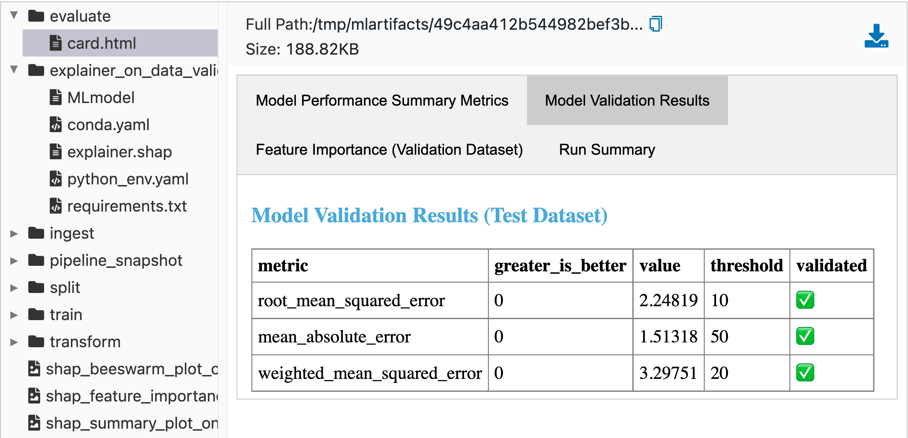

.. _pipelines:

===============================
MLflow Pipelines (experimental)
===============================

MLflow Pipelines is an opinionated framework for structuring MLOps workflows that simplifies and
standardizes machine learning application development and productionization. MLflow Pipelines
makes it easy for data scientists to follow best practices for creating production-ready ML
deliverables, allowing them to focus on developing excellent models. MLflow Pipelines also enables
ML engineers and DevOps teams to seamlessly deploy these models to production and incorporate them
into applications.

MLflow Pipelines provides production-quality :ref:`Pipeline Templates <pipeline-templates>` for
common ML problem types, such as regression & classification, and MLOps tasks, such as batch
scoring. Pipelines are structured as git repositories with YAML-based configuration files and
Python code, offering developers a declarative approach to ML application development that reduces
boilerplate.

MLflow Pipelines also implements a cache-aware executor for :ref:`Pipeline Steps
<steps-key-concept>`, ensuring that steps are only executed when associated :py:ref:`code or
configurations <pipeline-repositories-key-concept>` have changed. This enables data scientists,
ML engineers, and DevOps teams to iterate very quickly within their domains of expertise. MLflow
offers :ref:`APIs <pipelines-apis>` and a :ref:`CLI <cli>` for executing pipelines and inspecting
their results.

Installation
------------
MLflow Pipelines is available as an extension of the
`MLflow Python library <https://pypi.org/project/mlflow/>`_. You can install MLflow Pipelines
from PyPI as follows:

.. code-block:: sh

  pip install mlflow[pipelines]

.. note::
  You can install MLflow Pipelines from a Databricks Notebook by running
  ``%pip install mlflow[pipelines]`` or install MLflow Pipelines on a Databricks Cluster
  by following the instructions at
  https://docs.databricks.com/libraries/cluster-libraries.html#install-a-library-on-a-cluster.

  Note that `Databricks Runtime <https://docs.databricks.com/runtime/dbr.html>`_ version 11.0
  or greater is required in order to install MLflow Pipelines on Databricks.

Key Concepts
------------

.. _steps-key-concept:

Steps
~~~~~

Steps represent individual modeling or MLOps procedures, such as ingesting data,
fitting an estimator, evaluating a model against test data, or deploying a model for
real-time scoring. Steps accept a collection of well-defined inputs and produce
well-defined outputs according to user-defined configurations and code. MLflow Pipelines
intelligently caches step outputs, ensuring that steps are only executed if their
inputs, code, or configurations have changed, or if such changes have occurred in dependent steps.
Steps are composed to form :ref:`Pipelines <pipelines-key-concept>`.

.. code-block:: python
  :caption: Example Python code defining an estimator that is fit during the |train step|
            of the :ref:`MLflow Regression Pipeline <mlflow-regression-pipeline>`

  def estimator_fn():
    from sklearn.linear_model import SGDRegressor

    return SGDRegressor(random_state=42)

.. code-block:: yaml
  :caption: Example YAML configuration defining train / validation / test dataset split
            ratios for the |split step| of the :ref:`MLflow Regression Pipeline
            <mlflow-regression-pipeline>`.  This configuration demonstrates use of
            |Jinja2| templating syntax to define a dynamic value for the ``split_ratios``
            attribute that can be overriden by
            :ref:`Pipeline Profiles <profiles-key-concept>`.

  steps:
    split:
      # Train/validation/test split ratios
      split_ratios: {{SPLIT_RATIOS|default([0.75, 0.125, 0.125])}}

.. _pipelines-key-concept:

Pipelines
~~~~~~~~~

A Pipeline is a composition of :ref:`Steps <steps-key-concept>` used to solve an ML problem
or perform an MLOps task, such as developing an accurate regression model for data within a
particular domain or distributing a model to perform scalable batch inference. Pipelines
structure their code, configurations, and tests as git repositories with a standardized
directory hierarchy, as discussed in :ref:`Pipeline Repositories
<pipeline-repositories-key-concept>`. MLflow Pipelines includes predefined pipeline repositories
for common ML problems and MLOps tasks called :ref:`Pipeline Templates <pipeline-templates>`.
MLflow Pipelines also provides :py:class:`APIs <mlflow.pipelines.Pipeline>` and a :ref:`CLI <cli>`
for running pipelines and inspecting their results.

.. code-section::

    .. code-block:: python
      :caption: Example API and CLI workflows for running the :ref:`MLflow Regression Pipeline
                <mlflow-regression-pipeline>` and inspecting results. Note that pipelines
                must be run from within their corresponding git repositories.

      import os
      from mlflow.pipelines import Pipeline
      from mlflow.pyfunc import PyFuncModel

      os.chdir("~/mlp-regression-template")
      regression_pipeline = Pipeline(profile="local")
      # Run the full pipeline
      regression_pipeline.run()
      # Inspect the model training results
      regression_pipeline.inspect(step="train")
      # Load the trained model
      regression_model_pipeline: PyFuncModel = regression_pipeline.get_artifact("model")

    .. code-block:: sh

      git clone https://github.com/mlflow/mlp-regression-template
      cd mlp-regression-template
      # Run the full pipeline
      mlflow pipelines run --profile local
      # Inspect the model training results
      mlflow pipelines inspect --step train --profile local
      # Inspect the resulting model performance evaluations
      mlflow pipelines inspect --step evaluate --profile local

.. _pipeline-repositories-key-concept:

Pipeline Repositories
#####################

Pipelines are structured as git repositories with a standardized directory hierarchy. The following
example provides an overview of the pipeline repository structure.  It is adapted from the
|MLflow Regression Pipeline repository|.

::

  ├── pipeline.yaml
  ├── requirements.txt
  ├── steps
  │   ├── ingest.py
  │   ├── split.py
  │   ├── transform.py
  │   ├── train.py
  │   ├── custom_metrics.py
  ├── profiles
  │   ├── local.yaml
  │   ├── databricks.yaml
  ├── tests
  │   ├── ingest_test.py
  │   ├── ...
  │   ├── train_test.py
  │   ├── ...

The main components of the pipeline repository layout, which are common across all pipelines, are:

    - ``pipeline.yaml``: The main pipeline configuration file that declaratively defines the
      attributes and behavior of each pipeline step, such as the input dataset to use for training
      a model or the performance criteria for promoting a model to production. For reference,
      see the |pipeline.yaml| configuration file from the |MLflow Regression Pipeline repository|.

    - ``requirements.txt``: A `pip requirements file
      <https://pip.pypa.io/en/stable/reference/requirements-file-format>`_ specifying packages
      that must be installed in order to run the pipeline.

    - ``steps``: A directory containing Python code modules used by the pipeline steps. For example,
      the |MLflow Regression Pipeline repository| defines the estimator type and parameters to use
      when training a model in |steps/train.py| and defines custom metric computations in
      |steps/custom_metrics.py|.

    .. _profiles-directory:

    - ``profiles``: A directory containing :ref:`Profile <profiles-key-concept>` customizations for
      the configurations defined in ``pipeline.yaml``. For example, the
      |MLflow Regression Pipeline repository| defines a |local profile| that
      |customizes the dataset used for local model development| and |specifies a local MLflow
      Tracking store for logging model content|. The |MLflow Regression Pipeline repository| also
      defines a |databricks profile| for development on Databricks.

    - ``tests``: A directory containing Python test code for pipeline steps. For example, the
      |MLflow Regression Pipeline repository| implements tests for the transformer and the estimator
      defined in the respective ``steps/transform.py`` and ``steps/train.py`` modules.

.. code-block:: yaml
    :caption: Shown below is an example |pipeline.yaml| configuration file adapted from the
              |MLflow Regression Pipeline repository|. ``pipeline.yaml`` is the main
              configuration file for a pipeline containing aggregated configurations for
              all pipeline steps; :ref:`Profile <profiles-key-concept>`-based substitutions and
              overrides are supported using |Jinja2| templating syntax.

    template: "regression/v1"
    data:
      location: {{INGEST_DATA_LOCATION|default('https://nyc-tlc.s3.amazonaws.com/trip+data/yellow_tripdata_2022-01.parquet')}}
      format: {{INGEST_DATA_FORMAT|default('parquet')}}
    target_col: "fare_amount"
    steps:
      split:
        split_ratios: {{SPLIT_RATIOS|default([0.75, 0.125, 0.125])}}
      transform:
        transformer_method: steps.transform.transformer_fn
      train:
        estimator_method: steps.train.estimator_fn
      evaluate:
        validation_criteria:
          - metric: root_mean_squared_error
            threshold: 10
          - metric: weighted_mean_squared_error
            threshold: 20
      register:
        model_name: "taxi_fare_regressor"
    metrics:
      custom:
        - name: weighted_mean_squared_error
          function: weighted_mean_squared_error
          greater_is_better: False
      primary: "root_mean_squared_error"

.. _profiles-key-concept:

Profiles
~~~~~~~~

As you develop and iterate on pipelines, you will likely need to explore a variety of configuration
and code changes to arrive at an optimal solution. For example, in the context of model training,
it is often important to experiment with different datasets, feature transformations, and model
parameters. Pipeline Profiles offer a systematic approach for incrementally testing changes in
collaborative contexts, enabling multiple team members to collaborate on the same pipeline
steps while minimizing code and configuration conflicts. Profiles also make it very easy to
customize and run pipelines across different environments, such as development, staging, and
production workspaces.

A profile is a collection of customizations for the configurations defined in the pipeline's main
:ref:`pipeline.yaml <pipeline-repositories-key-concept>` file. Profiles are defined as YAML files
within the pipeline repository's :ref:`profiles directory <profiles-directory>`. When running a
pipeline or inspecting its results, the desired profile is specified as an API or CLI argument.

.. code-section::

    .. code-block:: python
      :caption: Example API and CLI workflows for running pipelines with different profile
                customizations

      import os
      from mlflow.pipelines import Pipeline

      os.chdir("~/mlp-regression-template")
      # Run the regression pipeline to train and evaluate the performance of an ElasticNet regressor
      regression_pipeline_local_elasticnet = Pipeline(profile="local-elasticnet")
      regression_pipeline_local_elasticnet.run()
      # Run the pipeline again to train and evaluate the performance of an SGD regressor
      regression_pipeline_local_sgd = Pipeline(profile="local-sgd")
      regression_pipeline_local_sgd.run()
      # After finding the best model type and updating the 'shared-workspace' profile accordingly,
      # run the pipeline again to retrain the best model in a workspace where teammates can view it
      regression_pipeline_shared = Pipeline(profile="shared-workspace")
      regression_pipeline_shared.run()

    .. code-block:: sh

      git clone https://github.com/mlflow/mlp-regression-template
      cd mlp-regression-template
      # Run the regression pipeline to train and evaluate the performance of an ElasticNet regressor
      mlflow pipelines run --profile local-elasticnet
      # Run the pipeline again to train and evaluate the performance of an SGD regressor
      mlflow pipelines run --profile local-sgd
      # After finding the best model type and updating the 'shared-workspace' profile accordingly,
      # run the pipeline again to retrain the best model in a workspace where teammates can view it
      mlflow pipelines run --profile shared-workspace

The following profile customizations are supported:

    - overrides
        - If the ``pipeline.yaml`` configuration file defines a |Jinja2|-templated attribute with
          a default value, a profile can override the value by mapping the attribute to a different
          value using YAML dictionary syntax. Note that override values may have arbitrarily nested
          types (e.g. lists, dictionaries, lists of dictionaries, ...).

          .. code-block:: yaml
            :caption: Example ``pipeline.yaml`` configuration file defining an overrideable
                      ``RMSE_THRESHOLD`` attribute for validating model performance with a
                      default value of ``10``

            steps:
              evaluate:
                validation_criteria:
                  - metric: root_mean_squared_error
                    # The maximum RMSE value on the test dataset that a model can have
                    # to be eligible for production deployment
                    threshold: {{RMSE_THRESHOLD|default(10)}}

          .. code-block:: yaml
            :caption: Example ``prod.yaml`` profile that overrides ``RMSE_THRESHOLD`` with
                      a custom value to more aggressively validate model quality for production

            RMSE_THRESHOLD: 5.2

    - substitutions
        - If the ``pipeline.yaml`` configuration file defines a |Jinja2|-templated attribute
          without a default value, a profile *must* map the attribute to a specific value using
          YAML dictionary syntax. Note that substitute values may have arbitrarily nested types
          (e.g. lists, dictionaries, lists of dictionaries, ...).

          .. code-block:: yaml
            :caption: Example ``pipeline.yaml`` configuration file defining a ``DATASET_INFO``
                      variable whose value must be specified by the selected pipeline profile

            data:
              # Specifies the dataset to use for model training
              {{DATASET_INFO}}

          .. code-block:: yaml
            :caption: Example ``dev.yaml`` profile that provides a value for ``DATASET_INFO``
                      corresponding to a small dataset for development purposes

            DATASET_INFO:
                location: ./data/taxi-small.parquet
                format: parquet

    - additions
        - If the ``pipeline.yaml`` configuration file does not define a particular attribute, a
          profile may define it instead. This capability is helpful for providing values of
          optional configurations that, if unspecified, a pipeline would otherwise ignore.

          .. code-block:: yaml
            :caption: Example ``local.yaml`` profile that specifies a
                      `sqlite <https://www.sqlite.org/index.html>`_-based
                      :ref:`MLflow Tracking <tracking>` store for local testing on a laptop

            experiment:
              tracking_uri: "sqlite:///metadata/mlflow/mlruns.db"
              name: "sklearn_regression_experiment"
              artifact_location: "./metadata/mlflow/mlartifacts"

    .. warning::
        If the ``pipeline.yaml`` configuration file defines an attribute that cannot be overridden
        or substituted (i.e. because its value is not specified using |Jinja2| templating syntax),
        a profile must not define it. Defining such an attribute in a profile produces an error.

Reproducible Runs
~~~~~~~~~~~~~~~~~~

|pipelines_tracking_artifacts_img| |pipelines_tracking_metrics_img|

.. |pipelines_tracking_metrics_img| image:: _static/images/tracking_metrics_ui_for_pipeline.png
   :width: 44%

MLflow Pipelines integrates with :ref:`MLflow Tracking <tracking>` to provide a comprehensive,
reproducible record of pipeline runs. For example, each complete execution of the
:ref:`MLflow Regression Pipeline <regression-pipeline-overview>` creates a new
:ref:`MLflow Run <tracking-concepts>` that records dataset profiles, the trained model, model
parameters, model performance metrics across training, validation, & test datasets, model
explanations, and more.

Additionally, because MLflow Pipelines are structured as git repositories, it is easy to track code
and configuration changes during development and collaboratively review them with team members.

Usage
-----

The general workflow for using MLflow Pipelines is as follows:

1. Clone a :ref:`Pipeline Template <pipeline-templates>` git repository corresponding to the ML
   problem that you want to solve or the MLOps task that you want to perform. View the template's
   README file for information about the :ref:`Pipeline Steps <steps-key-concept>` that it defines
   and the results that it produces.

    .. code-block:: sh
      :caption: An example of cloning the |MLflow Regression Pipeline repository|

      git clone https://github.com/mlflow/mlp-regression-template

    .. note::
      On Databricks, we recommend cloning the :ref:`Pipeline Template <pipeline-templates>` git
      repository using |Databricks Repos|.

      .. image:: _static/images/pipelines_databricks_repo_ui.png
        :width: 60%

2. Run the pipeline and inspect its results. When a pipeline run completes, MLflow Pipelines
   creates and displays an interactive **Step Card** with the results of the last executed
   :ref:`step <steps-key-concept>`.

    .. figure:: _static/images/pipelines_evaluate_step_card.png
      :scale: 25

      An example step card produced by running the **evaluate** step of the
      :ref:`MLflow Regression Pipeline <mlflow-regression-pipeline>`. The step card results
      indicate that the trained model passed all performance validations and is ready for
      registration with the :ref:`MLflow Model Registry <registry>`.

    |

    .. code-section::

        .. code-block:: python
          :caption: Example API and CLI workflows for running the :ref:`Regression Pipeline
                    <mlflow-regression-pipeline>` and inspecting results. Note that pipelines
                    must be run from within their corresponding git repositories.

          import os
          from mlflow.pipelines import Pipeline
          from mlflow.pyfunc import PyFuncModel

          os.chdir("~/mlp-regression-template")
          regression_pipeline = Pipeline(profile="local")
          # Run the full pipeline
          regression_pipeline.run()
          # Inspect the model training results
          regression_pipeline.inspect(step="train")
          # Load the trained model
          regression_model_pipeline: PyFuncModel = regression_pipeline.get_artifact("model")

        .. code-block:: sh

          git clone https://github.com/mlflow/mlp-regression-template
          cd mlp-regression-template
          # Run the full pipeline
          mlflow pipelines run --profile local
          # Inspect the model training results
          mlflow pipelines inspect --step train --profile local
          # Inspect the resulting model performance evaluations
          mlflow pipelines inspect --step evaluate --profile local

    .. note::
      Each :ref:`Pipeline Template <pipeline-templates>` also includes a |Databricks Notebook|
      and a |Jupyter Notebook| for running the pipeline and inspecting its results.

      Example pipeline run from the |Databricks Notebook| included in the
      |MLflow Regression Pipeline repository|:

      .. figure:: _static/images/pipelines_databricks_notebook_ui.png
        :scale: 25

3. Make changes to the code and configurations in the :ref:`Pipeline Repository
   <pipeline-repositories-key-concept>`. Code changes are made by modifying Python modules in the
   ``steps`` subdirectory. Configuration changes are made by editing the main ``pipeline.yaml``
   configuration file, as well as profile-specific configuration files in the ``profiles``
   subdirectory.

    .. note::
      When making changes to pipelines on Databricks, it is recommended that you either
      edit files on your local machine and use |dbx| to sync them to |Databricks Repos|,
      as demonstrated below, or |edit files in Databricks Repos| by opening separate browser
      tabs for each YAML file or Python code module that you wish to modify.

      .. code-block:: sh
        :caption: Example workflow for efficiently editing a pipeline on a local machine
                  and synchronizing changes to |Databricks Repos|

        # Install the Databricks CLI, which is used to remotely access your Databricks Workspace
        pip install databricks-cli
        # Configure remote access to your Databricks Workspace
        databricks configure
        # Install dbx, which is used to automatically sync changes to and from Databricks Repos
        pip install dbx
        # Clone the MLflow Regression Pipeline repository
        git clone https://github.com/mlflow/mlp-regression-template
        # Enter the MLflow Regression Pipeline repository directory and configure dbx within it
        cd mlp-regression-template
        dbx configure
        # Use dbx to enable syncing from the repository directory to Databricks Repos
        dbx sync repo -d mlp-regression-template
        # Iteratively make changes to files in the repository directory and observe that they
        # are automatically synced to Databricks Repos
        ...

4. Test changes by running the pipeline and observing the results it produces. MLflow Pipelines
   intelligently caches results from each :ref:`Pipeline Step <steps-key-concept>`, ensuring that
   steps are only executed if their inputs, code, or configurations have changed, or if such
   changes have occurred in dependent steps. Once you are satisfied with the results of
   your changes, commit them to a branch of the :ref:`Pipeline Repository
   <pipeline-repositories-key-concept>` in order to ensure reproducibility, and share or review the
   changes with your team.

    .. note::
      Before testing changes in a staging or production environment, it is recommended that you
      commit the changes to a branch of the
      :ref:`Pipeline Repository <pipeline-repositories-key-concept>` to ensure reproducibility.

    .. note::
      By default, MLflow Pipelines caches results from each :ref:`Pipeline Step
      <steps-key-concept>` within the ``.mlflow`` subdirectory of the home folder on the
      local filesystem. The ``MLFLOW_PIPELINES_EXECUTION_DIRECTORY`` environment variable can
      be used to specify an alternative location for caching results.

.. _pipeline-templates:

Pipeline Templates
------------------

MLflow Pipelines provides extensible templates that deliver predefined solutions for common
ML problems and MLOps tasks. Each template is a fully-functional pipeline that can be easily
modified to fit your use cases. MLflow Pipelines currently offers the following extensible templates
for developing end-to-end machine learning applications:

  - :ref:`MLflow Regression Pipeline <regression-pipeline-overview>`
      - The MLflow Regression Pipeline is designed for developing high-quality regression models.
        For more information, see the :ref:`Regression Pipeline overview
        <regression-pipeline-overview>`, the :ref:`Regression Pipeline API documentation
        <mlflow-regression-pipeline>`, and the `Regression Pipeline template repository
        <https://github.com/mlflow/mlp-regression-template>`_.

Additional pipelines for a variety of ML problems and MLOps tasks are under active development.

.. _regression-pipeline-overview:

Regression Pipeline
~~~~~~~~~~~~~~~~~~~

.. figure:: _static/images/regression_pipeline_dag.png
  :scale: 60

  A visual overview of the MLflow Regression Pipeline produced by the
  :py:func:`RegressionPipeline.inspect()
  <mlflow.pipelines.regression.v1.pipeline.RegressionPipeline.inspect>` API

.. automodule:: mlflow.pipelines.regression.v1.pipeline
  :noindex:

For more information, see the :ref:`Regression Pipeline overview <regression-pipeline-overview>`,
the :ref:`Regression Pipeline API documentation <mlflow-regression-pipeline>`, and the
`Regression Pipeline template repository <https://github.com/mlflow/mlp-regression-template>`_.

.. |MLflow Regression Pipeline repository| replace:: `MLflow Regression Pipeline repository <https://github.com/mlflow/mlp-regression-template>`__
.. |pipeline.yaml| replace:: `pipeline.yaml <https://github.com/mlflow/mlp-regression-template/blob/main/pipeline.yaml>`__
.. |train step| replace:: :ref:`train step <mlflow-regression-pipeline-train-step>`
.. |split step| replace:: :ref:`split step <mlflow-regression-pipeline-split-step>`
.. |Jinja2| replace:: `Jinja2 <https://jinja.palletsprojects.com>`__
.. |local profile| replace:: `profiles/local.yaml profile <https://github.com/mlflow/mlp-regression-template/blob/main/profiles/local.yaml>`__
.. |databricks profile| replace:: `profiles/databricks.yaml profile <https://github.com/mlflow/mlp-regression-template/blob/main/profiles/databricks.yaml>`__
.. |customizes the dataset used for local model development| replace:: `customizes the dataset used for local model development <https://github.com/mlflow/mlp-regression-template/blob/2751a606827259cac4508a97986fbdbc56de9ff2/profiles/local.yaml#L8>`__
.. |specifies a local MLflow Tracking store for logging model content| replace:: `specifies a local MLflow Tracking store for logging model content <https://github.com/mlflow/mlp-regression-template/blob/2751a606827259cac4508a97986fbdbc56de9ff2/profiles/local.yaml#L1-L4>`__
.. |Databricks Repos| replace:: `Databricks Repos <https://docs.databricks.com/repos/index.html>`__
.. |Databricks Notebook| replace:: `Databricks Notebook <https://github.com/mlflow/mlp-regression-template/blob/main/notebooks/databricks.py>`__
.. |Jupyter Notebook| replace:: `Jupyter Notebook <https://github.com/mlflow/mlp-regression-template/blob/main/notebooks/jupyter.ipynb>`__
.. |dbx| replace:: `dbx <https://docs.databricks.com/dev-tools/dbx.html>`__
.. |edit files in Databricks Repos| replace:: `edit files in Databricks Repos <https://docs.databricks.com/repos/work-with-notebooks-other-files.html#edit-a-file>`__
