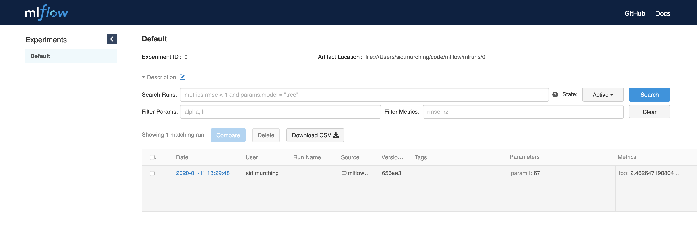

.. _quickstart:

Quickstart
==========

Install MLflow, instrument your code, and view results in a few minutes.
--------------------------------------------------------------------------------

As a data scientist, your explorations involve running your evolving training code many times. MLflow Tracking allows you to record important information your run, review and compare it with other runs, and share results with others. As an ML Engineer or MLOps professional, it allows you to compare, share, and deploy the best models produced by the team. 

.. image:: _static/images/quickstart_mlflow_tracking_overview.png
    :width: 800px
    :align: center

MLflow is available for Python, R, and Java, but this quickstart shows Python only. 

.. 
    This really feels like second-classing R & Java. Maybe I 
    can put at least a discussion of Java & R alternatives in the drilldown page. I mean, "installing dependencies in a Java project" is too broad, but I don't like the way this has a "well, it's really Python" feel

How do I install MLflow? 
------------------------

Install MLflow from PyPi using pip:

.. code-section::

    .. code-block:: shell

        pip install mlflow

For more options, see :ref:`quickstart_drilldown_install`. 

How do I add MLflow tracking to my Python code?
-----------------------------------------------

For many popular ML libraries, you make a single function call: ``mlflow.{library_module_name}.autolog()`` (for instance, ``mlflow.xgboost.autolog()``). MLflow will automatically log the parameters, metrics, and artifacts of your run. For instance, the following autologs a scikit-learn run:

.. code-section::

    .. code-block:: python

        import mlflow

        from sklearn.model_selection import train_test_split
        from sklearn.datasets import load_diabetes
        from sklearn.ensemble import RandomForestRegressor

        mlflow.sklearn.autolog()

        db = load_diabetes()
        X_train, X_test, y_train, y_test = train_test_split(db.data, db.target)

        # Create and train models.
        rf = RandomForestRegressor(n_estimators=100, max_depth=6, max_features=3)
        rf.fit(X_train, y_train)

        # Use the model to make predictions on the test dataset.
        predictions = rf.predict(X_test)

In addition, or if you are using a library for which ``autolog`` is not yet supported, you may use key-value pairs to track:

.. list-table::
   :widths: 10 10 80 
   :header-rows: 1

   * - Name
     - Used for
     - Function call
   * - Parameters
     - Constant values (for instance, configuration parameters)
     - ``mlflow.log_param``
   * - Metrics
     - Values updated during the run (for instance, accuracy)
     - ``mlflow.log_metric``
   * - Artifacts
     - Files produced by the run (for instance, model weights)
     - ``mlflow.log_artifacts``

This example demonstrates the use of these functions:

.. code-section::
    .. code-block:: python

        import os
        from random import random, randint
        from mlflow import log_metric, log_param, log_artifacts

        if __name__ == "__main__":
            # Log a parameter (key-value pair)
            log_param("config_value", randint(0, 100))

            # Log a metric; metrics can be updated throughout the run
            log_metric("accuracy", random() / 2.0)
            log_metric("accuracy", random() + 0.1)
            log_metric("accuracy", random() + 0.2)

            # Log an artifact (output file)
            if not os.path.exists("outputs"):
                os.makedirs("outputs")
            with open("outputs/test.txt", "w") as f:
                f.write("hello world!")
            log_artifacts("outputs")

- For more details on autolog, including a list of what libraries are supported, see :ref:`quickstart_drilldown_autolog`. 
- For additional functions such as `log_text` and `log_image` and see :ref:`quickstart_drilldown_tracking_api`.

How do I view my MLflow runs and experiments?
---------------------------------------------

Once you've run your code, you may view the results with MLflow's tracking UI. To start the UI, run:

.. code-section::

    .. code-block:: shell

        mlflow ui

And then navigate to http://localhost:5000 in your browser. You will see a page similar to:

.. 
    TODO: Add a screenshot of the UI

You are in the **Default** experiment, which now contains the tracking data for your run. An experiment is a collection of related runs. You can view the parameters, metrics, and artifacts of your run by clicking on the run name. 

For more details on the tracking UI, see :ref:`quickstart_drilldown_tracking_ui`.

How do I share my MLflow runs and experiments?
----------------------------------------------

.. 
    TODO: So this needs to change to be `set_tracking_uri`

By default, MLflow stores tracking data and artifacts in a ``./mlruns`` subdirectory of where you ran the code. You can change this behavior by setting the ``MLFLOW_TRACKING_URI`` environment variable to a different location. For instance, you can set it to a shared filesystem, a SQLAlchemy-compatible database, a tracking server, or a Databricks workspace.

..
    TODO: Explain what a tracking server is

You can run a tracking server on a network-accessible server by running:

.. code-section::

    .. code-block:: shell

        mlflow server

On your development machine, set the ``MLFLOW_TRACKING_URI`` environment variable to the URL of that server. For example, if your tracking server is listening on the default port of **5000** on the machine with IP address **192.168.0.1**, you can set the ``MLFLOW_TRACKING_URI`` environment variable to:

.. code-section::

    .. code-block:: shell

        export MLFLOW_TRACKING_URI=http://192.168.0.1:5000

Now, when you run your code, it will send tracking data to the tracking server. To view the results, run the tracking UI on your local machine and point it to the tracking server:

.. code-section::

    .. code-block:: shell

        mlflow ui --backend-store-uri http://192.168.0.1:5000

There are many options available for the tracking backend. For more details, see :ref:`quickstart_drilldown_tracking_backend`.

How do I use MLflow with a Databricks workspace?
------------------------------------------------

tk 

How do I store a model in MLflow?
---------------------------------

tk 

How do I run a model artifact from a specific MLflow run?
---------------------------------------------------------

tk

Next Steps
----------
.. 
    First, code:

- Example: MLflow tutorial
- MLflow example directory

.. 
    Next tool: either Models or Projects

- Storing models with MLflow tracking
- End-to-end tracking, collaboration, and deployment with MLflow Projects

.. 
    More top-down-y stuff

- Understanding MLflow's concepts, tools, and APIs 
- Why MLflow?
  

.. code-section::

    ---
    title: MLFlow tracking
    ---
    stateDiagram-v2
    direction LR
    Data --> Train
    Train --> Review
    Train --> Train
    Review --> Train
    Review --> Register
    Register --> Deploy
    Deploy --> Monitor

    Monitor --> Data 

    flowchart LR
    id4[(Datalake)]
    A[Data Prep] -->B[Train]
    B --> id1
    B --> B
    id1 --> C
    C[Review & Select]
    C --> id2
    C --> B
    id2 --> D[Deploy]
    D --> E[Monitor]
    E --> id4
    id4 --> A
    id1[(Tracking backend)]
    id2[(Model Registry)]
    
    
{>> Important things in original we don't want to lose:

- mlflow skinny and extras and why you might choose one or t'other
- Do we document / walkthrough virtualenvs or, e.g., conda or is that all assumed?
- What about R? 
- Mac python on install (relates to env answer)
- repo contains a big helpful directory of examples 
- WORKER_TIMEOUT issue 
- Project content: I don't think we want this in the QS, but it's all good stuff

<<}

.. _asdf:

## Tracking
Blah blah blah

Installing MLflow
-----------------

You install MLflow by running:

.. code-section::

    .. code-block:: shell

        # Install MLflow
        pip install mlflow

        # Install MLflow with extra ML libraries and 3rd-party tools
        pip install mlflow[extras]

        # Install a lightweight version of MLflow
        pip install mlflow-skinny

    .. code-block:: R

        install.packages("mlflow")

.. note::

    MLflow works on MacOS. If you run into issues with the default system Python on MacOS, try
    installing Python 3 through the `Homebrew <https://brew.sh/>`_ package manager using
    ``brew install python``. (In this case, installing MLflow is now ``pip3 install mlflow``).

.. note::

    To use certain MLflow modules and functionality (ML model persistence/inference,
    artifact storage options, etc), you may need to install extra libraries. For example, the
    ``mlflow.tensorflow`` module requires TensorFlow to be installed. See
    https://github.com/mlflow/mlflow/blob/master/EXTRA_DEPENDENCIES.rst for more details.

.. note::

    When using MLflow skinny, you may need to install additional dependencies if you wish to use
    certain MLflow modules and functionalities. For example, usage of SQL-based storage for
    MLflow Tracking (e.g. ``mlflow.set_tracking_uri("sqlite:///my.db")``) requires
    ``pip install mlflow-skinny sqlalchemy alembic sqlparse``. If using MLflow skinny for serving,
    a minimally functional installation would require ``pip install mlflow-skinny flask``.

At this point we recommend you follow the :doc:`tutorial<tutorials-and-examples/tutorial>` for a walk-through on how you
can leverage MLflow in your daily workflow.

Downloading the Quickstart
--------------------------
Download the quickstart code by cloning MLflow via ``git clone https://github.com/mlflow/mlflow``,
and cd into the ``examples`` subdirectory of the repository. We'll use this working directory for
running the ``quickstart``.

We avoid running directly from our clone of MLflow as doing so would cause the tutorial to
use MLflow from source, rather than your PyPi installation of MLflow.

Using the Tracking API
----------------------

The :doc:`MLflow Tracking API<tracking/>` lets you log metrics and artifacts (files) from your data
science code and see a history of your runs. You can try it out by writing a simple Python script
as follows (this example is also included in ``quickstart/mlflow_tracking.py``):

.. code-section::

    .. code-block:: python

        import os
        from random import random, randint
        from mlflow import log_metric, log_param, log_artifacts

        if __name__ == "__main__":
            # Log a parameter (key-value pair)
            log_param("param1", randint(0, 100))

            # Log a metric; metrics can be updated throughout the run
            log_metric("foo", random())
            log_metric("foo", random() + 1)
            log_metric("foo", random() + 2)

            # Log an artifact (output file)
            if not os.path.exists("outputs"):
                os.makedirs("outputs")
            with open("outputs/test.txt", "w") as f:
                f.write("hello world!")
            log_artifacts("outputs")

    .. code-block:: R

        library(mlflow)

        # Log a parameter (key-value pair)
        mlflow_log_param("param1", 5)

        # Log a metric; metrics can be updated throughout the run
        mlflow_log_metric("foo", 1)
        mlflow_log_metric("foo", 2)
        mlflow_log_metric("foo", 3)

        # Log an artifact (output file)
        writeLines("Hello world!", "output.txt")
        mlflow_log_artifact("output.txt")

Viewing the Tracking UI
-----------------------

By default, wherever you run your program, the tracking API writes data into files into a local
``./mlruns`` directory. You can then run MLflow's Tracking UI:

.. code-section::

    .. code-block:: shell

        mlflow ui

    .. code-block:: R

        mlflow_ui()

and view it at http://localhost:5000.

.. note::
    If you see message ``[CRITICAL] WORKER TIMEOUT`` in the MLflow UI or error logs, try using ``http://localhost:5000`` instead of ``http://127.0.0.1:5000``.

Running MLflow Projects
-----------------------

MLflow allows you to package code and its dependencies as a *project* that can be run in a
reproducible fashion on other data. Each project includes its code and a ``MLproject`` file that
defines its dependencies (for example, Python environment) as well as what commands can be run into the
project and what arguments they take.

You can easily run existing projects with the ``mlflow run`` command, which runs a project from
either a local directory or a GitHub URI:

.. code-block:: bash

    mlflow run sklearn_elasticnet_wine -P alpha=0.5

    mlflow run https://github.com/mlflow/mlflow-example.git -P alpha=5.0

There's a sample project in ``tutorial``, including a ``MLproject`` file that
specifies its dependencies. if you haven't configured a :ref:`tracking server <tracking_server>`,
projects log their Tracking API data in the local ``mlruns`` directory so you can see these
runs using ``mlflow ui``.

.. note::
    By default ``mlflow run`` installs all dependencies using `virtualenv <https://virtualenv.pypa.io/en/latest//>`_.
    To run a project without using ``virtualenv``, you can provide the ``--env-manager=local`` option to
    ``mlflow run``. In this case, you must ensure that the necessary dependencies are already installed
    in your Python environment.

For more information, see :doc:`projects`.

Saving and Serving Models
-------------------------

MLflow includes a generic ``MLmodel`` format for saving *models* from a variety of tools in diverse
*flavors*. For example, many models can be served as Python functions, so an ``MLmodel`` file can
declare how each model should be interpreted as a Python function in order to let various tools
serve it. MLflow also includes tools for running such models locally and exporting them to Docker
containers or commercial serving platforms.

To illustrate this functionality, the ``mlflow.sklearn`` package can log scikit-learn models as
MLflow artifacts and then load them again for serving. There is an example training application in
``sklearn_logistic_regression/train.py`` that you can run as follows:

.. code-block:: bash

    python sklearn_logistic_regression/train.py

When you run the example, it outputs an MLflow run ID for that experiment. If you look at
``mlflow ui``, you will also see that the run saved a ``model`` folder containing an ``MLmodel``
description file and a pickled scikit-learn model. You can pass the run ID and the path of the model
within the artifacts directory (here "model") to various tools. For example, MLflow includes a
simple REST server for python-based models:

.. code-block:: bash

    mlflow models serve -m runs:/<RUN_ID>/model

.. note::

    By default the server runs on port 5000. If that port is already in use, use the `--port` option to
    specify a different port. For example: ``mlflow models serve -m runs:/<RUN_ID>/model --port 1234``

Once you have started the server, you can pass it some sample data and see the
predictions.

The following example uses ``curl`` to send a JSON-serialized pandas DataFrame with the ``split``
orientation to the model server. For more information about the input data formats accepted by
the pyfunc model server, see the :ref:`MLflow deployment tools documentation <local_model_deployment>`.

.. code-block:: bash

    curl -d '{"dataframe_split": {"columns": ["x"], "data": [[1], [-1]]}}' -H 'Content-Type: application/json' -X POST localhost:5000/invocations

which returns::

    [1, 0]

For more information, see :doc:`models`.

.. _quickstart_logging_to_remote_server:

Logging to a Remote Tracking Server
-----------------------------------
In the examples above, MLflow logs data to the local filesystem of the machine it's running on.
To manage results centrally or share them across a team, you can configure MLflow to log to a remote
tracking server. To get access to a remote tracking server:

Launch a Tracking Server on a Remote Machine
~~~~~~~~~~~~~~~~~~~~~~~~~~~~~~~~~~~~~~~~~~~~
:ref:`Launch a tracking server <tracking_server>` on a remote machine.

You can then :ref:`log to the remote tracking server <logging_to_a_tracking_server>` by
setting the ``MLFLOW_TRACKING_URI`` environment variable to your server's URI, or
by adding the following to the start of your program:

  .. code-section::

    .. code-block:: python

        import mlflow

        mlflow.set_tracking_uri("http://YOUR-SERVER:4040")
        mlflow.set_experiment("my-experiment")

    .. code-block:: R

        library(mlflow)
        install_mlflow()
        mlflow_set_tracking_uri("http://YOUR-SERVER:4040")
        mlflow_set_experiment("/my-experiment")

Log to Databricks Community Edition
~~~~~~~~~~~~~~~~~~~~~~~~~~~~~~~~~~~

Alternatively, sign up for `Databricks Community Edition <https://databricks.com/try-databricks>`_,
a free service that includes a hosted tracking server. Note that
Community Edition is intended for quick experimentation rather than production use cases.
After signing up, run ``databricks configure`` to create a credentials file for MLflow, specifying
https://community.cloud.databricks.com as the host.

To log to the Community Edition server, set the ``MLFLOW_TRACKING_URI`` environment variable
to "databricks", or add the following to the start of your program:

  .. code-section::

    .. code-block:: python

        import mlflow

        mlflow.set_tracking_uri("databricks")
        # Note: on Databricks, the experiment name passed to set_experiment must be a valid path
        # in the workspace, like '/Users/<your-username>/my-experiment'. See
        # https://docs.databricks.com/user-guide/workspace.html for more info.
        mlflow.set_experiment("/my-experiment")

    .. code-block:: R

        library(mlflow)
        install_mlflow()
        mlflow_set_tracking_uri("databricks")
        # Note: on Databricks, the experiment name passed to mlflow_set_experiment must be a
        # valid path in the workspace, like '/Users/<your-username>/my-experiment'.  See
        # https://docs.databricks.com/user-guide/workspace.html for more info.
        mlflow_set_experiment("/my-experiment")
