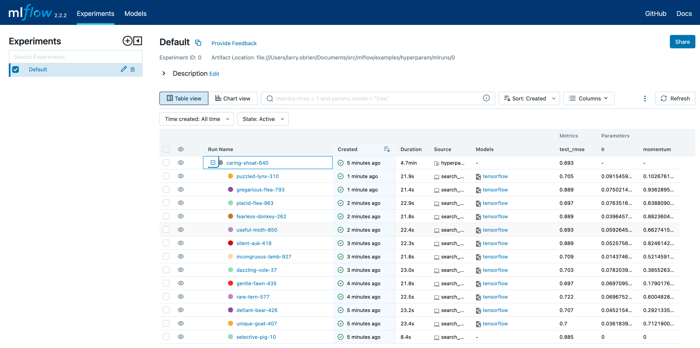
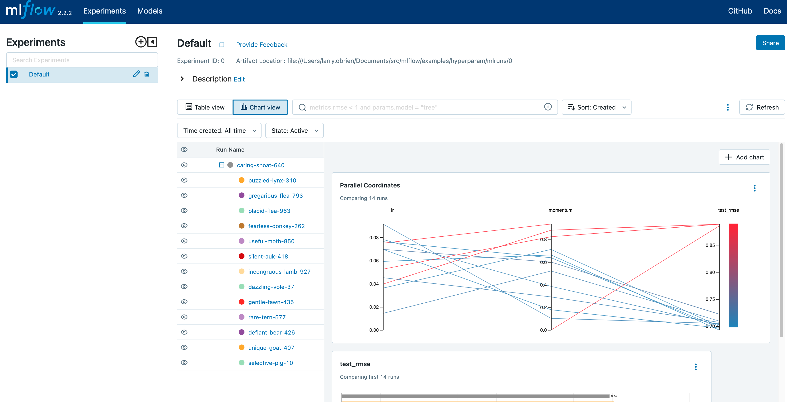
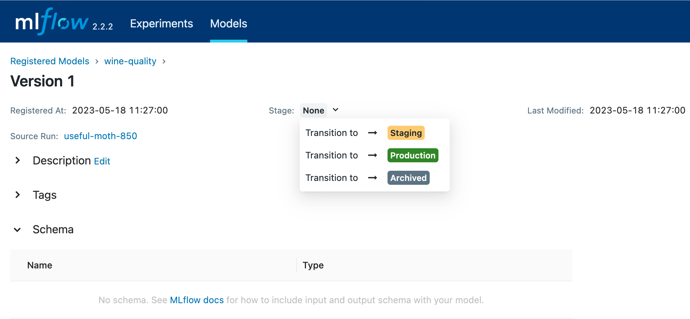

.. _quickstart-mlops:

Quickstart: Compare runs, choose a model, and deploy it to a REST API
======================================================================

In this quickstart, you will:

- Run a hyperparameter sweep on a training script
- Compare the results of the runs in the MLflow UI
- Choose the best run and register it as a model
- Deploy the model to a REST API
- Build a container image suitable for deployment to a cloud platform

As an ML Engineer or MLOps professional, you can use MLflow to compare, share, and deploy the best models produced by the team. In this quickstart, you will use the MLflow Tracking UI to compare the results of a hyperparameter sweep, choose the best run, and register it as a model. Then, you will deploy the model to a REST API. Finally, you will create a Docker container image suitable for deployment to a cloud platform.

.. image:: _static/images/quickstart/quickstart_tracking_overview.png
    :width: 800px
    :align: center
    :alt: Diagram showing Data Science and MLOps workflow with MLflow

Set up
------

- Install MLflow. See the :ref:`MLflow Data Scientist quickstart <quickstart>` for instructions
- Clone the `MLflow git repo <https://github.com/mlflow/mlflow>`_
- Run the tracking server: ``mlflow server``

Run a hyperparameter sweep
--------------------------

Switch to the ``examples/hyperparam/`` directory in the MLflow git repo. This example tries to optimize the RMSE metric of a Keras deep learning model on a wine quality dataset. It has two hyperparameters that it tries to optimize: ``learning-rate`` and ``momentum``.

This directory uses the :ref:`MLflow Projects format <projects>` and defines multiple entry points. You can review those by reading the **MLProject** file. The ``hyperopt`` entry point uses the `Hyperopt <https://github.com/hyperopt/hyperopt>`_ library to run a hyperparameter sweep over the ``train`` entry point. The ``hyperopt`` entry point sets different values of ``learning-rate`` and ``momentum`` and records the results in MLflow.

Run the hyperparameter sweep, setting the ``MLFLOW_TRACKING_URI`` environment variable to the URI of the MLflow tracking server:

.. code-block:: bash

  export MLFLOW_TRACKING_URI=http://localhost:5000
  mlflow run -e hyperopt .

The ``hyperopt`` entry point defaults to 12 runs of 32 epochs apiece and should take a few minutes to finish.

Compare the results
-------------------

Open the MLflow UI in your browser at the `MLFLOW_TRACKING_URI`. You should see a nested list of runs. In the default **Table view**, choose the **Columns** button and add the **Metrics | test_rmse** column and the **Parameters | lr** and **Parameters | momentum** column. To sort by RMSE ascending, click the **test_rmse** column header. The best run typically has an RMSE on the **test** dataset of ~0.70. You can see the parameters of the best run in the **Parameters** column.

Choose **Chart view**. Choose the **Parallel coordinates** graph and configure it to show the **lr** and **momentum** coordinates and the **test_rmse** metric. Each line in this graph represents a run and associates each hyperparameter evaluation run's parameters to the evaluated error metric for the run. 

The red graphs on this graph are runs that fared poorly. The lowest one is a baseline run with both **lr** and **momentum** set to 0.0. That baseline run has an RMSE of ~0.89. The other red lines show that high **momentum** can also lead to poor results with this problem and architecture. 

The graphs shading towards blue are runs that fared better. Hover your mouse over individual runs to see their details.

Register your best model
------------------------

Choose the best run and register it as a model. In the **Table view**, choose the best run. In the **Run Detail** page, open the **Artifacts** section and select the **Register Model** button. In the **Register Model** dialog, enter a name for the model, such as ``wine-quality``, and click **Register**.

Now, your model is available for deployment. You can see it in the **Models** page of the MLflow UI. Open the page for the model you just registered.

You can add a description for the model, add tags, and easily navigate back to the source run that generated this model. You can also transition the model to different stages. For example, you can transition the model to **Staging** to indicate that it is ready for testing. You can transition it to **Production** to indicate that it is ready for deployment.

Transition the model to **Staging** by choosing the **Stage** dropdown:

Serve the model locally
----------------------------

MLflow allows you to easily serve models produced by any run or model version. You can serve the model you just registered by running:

.. code-block:: bash

  mlflow models serve -m "models:/wine-quality/Staging" --port 5002

(Note that specifying the port as above will be necessary if you are running the tracking server on the same machine at the default port of **5000**.)

You could also have used a ``runs:/<run_id>`` URI to serve a model, or any supported URI described in :ref:`artifact-stores`. 

To test the model, you can send a request to the REST API using the ``curl`` command:

.. code-block:: bash

  curl -d '{"dataframe_split": { 
  "columns": ["fixed acidity","volatile acidity","citric acid","residual sugar","chlorides","free sulfur dioxide","total sulfur dioxide","density","pH","sulphates","alcohol"], 
  "data": [[7,0.27,0.36,20.7,0.045,45,170,1.001,3,0.45,8.8]]}}' \
  -H 'Content-Type: application/json' -X POST localhost:5002/invocations

Inferencing is done with a JSON `POST` request to the **invocations** path on **localhost** at the specified port. The ``columns`` key specifies the names of the columns in the input data. The ``data`` value is a list of lists, where each inner list is a row of data. For brevity, the above only requests one prediction of wine quality (on a scale of 3-8). The response is a JSON object with a **predictions** key that contains a list of predictions, one for each row of data. In this case, the response is:

.. code-block:: json

  {"predictions": [{"0": 5.310967445373535}]}

The schema for input and output is available in the MLflow UI in the **Artifacts | Model** description. The schema is available because the ``train.py`` script used the ``mlflow.infer_signature`` method and passed the result to the ``mlflow.log_model`` method. Passing the signature to the ``log_model`` method is highly recommended, as it provides clear error messages if the input request is malformed. 

Build a container image for your model
---------------------------------------

Most routes toward deployment will use a container to package your model, its dependencies, and relevant portions of the runtime environment. You can use MLflow to build a Docker image for your model.

.. code-block:: bash

  mlflow models build-docker --model-uri "models:/wine-quality/1" --name "qs_mlops"

This command builds a Docker image named ``qs_mlops`` that contains your model and its dependencies. The ``model-uri`` in this case specifies a version number (``/1``) rather than a lifecycle stage (``/staging``), but you can use whichever integrates best with your workflow. It will take several minutes to build the image. Once it completes, you can run the image to provide real-time inferencing locally, on-prem, on a bespoke Internet server, or cloud platform. You can run it locally with:

.. code-block:: bash

  docker run -p 5002:8080 qs_mlops

This `Docker run command <https://docs.docker.com/engine/reference/commandline/run/>`_ runs the image you just built and maps port **5002** on your local machine to port **8080** in the container. You can now send requests to the model using the same ``curl`` command as before:

.. code-block:: bash

  curl -d '{"dataframe_split": {"columns": ["fixed acidity","volatile acidity","citric acid","residual sugar","chlorides","free sulfur dioxide","total sulfur dioxide","density","pH","sulphates","alcohol"], "data": [[7,0.27,0.36,20.7,0.045,45,170,1.001,3,0.45,8.8]]}}' -H 'Content-Type: application/json' -X POST localhost:5002/invocations

Deploying to a cloud platform
-----------------------------

Virtually all cloud platforms allow you to deploy a Docker image. The process varies considerably, so you will have to consult your cloud provider's documentation for details.

In addition, some cloud providers have built-in support for MLflow. For instance:

- `Azure ML <https://https://learn.microsoft.com/azure/machine-learning/>`_
- `Databricks <https://www.databricks.com/product/managed-mlflow>`_
- `Amazon SageMaker <https://docs.aws.amazon.com/sagemaker/index.html>`_
- `Google Cloud <https://cloud.google.com/doc>`_

all support MLflow. Cloud platforms generally support multiple workflows for deployment: command-line, SDK-based, and Web-based. You can use MLflow in any of these workflows, although the details will vary between platforms and versions. Again, you will need to consult your cloud provider's documentation for details.

Next steps
-----------

This quickstart has shown you how to use MLflow to track experiments, package models, and deploy models. You may also wish to learn about:

- :ref:`quickstart`
- :ref:`MLflow tutorials and examples <tutorials-and-examples>`
- Use the MLflow Registry to store and share versioned models, see :ref:`registry`
- Use MLflow Projects for packaging your code in a reproducible and reusable way, see :ref:`projects`
- Use MLflow Recipes to create workflows for faster iterations and easier deployment, see :ref:`recipes`
- :ref:`MLflow concepts <concepts>`
- Tracking experiments and packaging models (see :ref:tracking:).