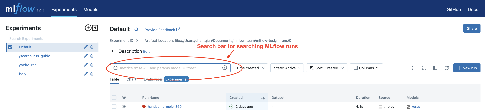
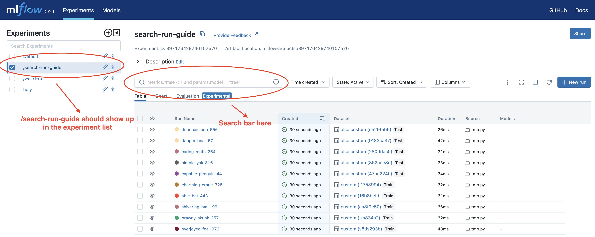

.. _search-runs:

Search Runs
===========

This guide will walk you through how to search your MLflow runs through MLflow UI and Python API.

Search Runs on MLflow UI
------------------------

MLflow UI provides a search bar to search your MLflow runs, which can be found in the experiment view, as shown
by the screenshot:

Creating a Few MLflow Runs before Start
^^^^^^^^^^^^^^^^^^^^^^^^^^^^^^^^^^^^^^^^

To better understand how to write queries to fetch MLflow runs, we provide a script to create a series of MLflow
runs so that you can run the example queries to see the actual effect. This step is optional, but we encourage
doing it if this is the first time you read this guide.

First let's start a local MLflow UI service by running:

.. code-block:: bash

  mlflow ui

Then paste the following code to a local pythnon file, e.g., ``~/create_testing_runs.py``, and execute it.

.. code-block:: python

  import mlflow
  import numpy as np

  mlflow.set_tracking_uri("http://127.0.0.1:5000")
  mlflow.set_experiment("/search-run-guide")

  accuracy = np.arange(0, 1, 0.1)
  loss = np.arange(1, 0, -0.1)
  log_scale_loss = np.log(loss)
  f1_score = np.arange(0, 1, 0.1)

  batch_size = [2] * 5 + [4] * 5
  learning_rate = [0.001, 0.01] * 5
  model = ["GPT-2", "GPT-3", "GPT-3.5", "GPT-4"] + [None] * 6

  mlflow_user = ["Monkey D Luffy"] * 3 + [None] * 7
  task = ["classification", "regression", "causal lm"] + [None] * 7
  environment = ["notebook"] * 5 + [None] * 5

  dataset_name = ["custom"] * 5 + ["also custom"] * 5
  dataset_digest = ["s8ds293b", "jks834s2"] + [None] * 8
  dataset_context = ["train"] * 5 + ["test"] * 5

  for i in range(10):
      with mlflow.start_run():
          mlflow.log_metrics(
              {
                  "loss": loss[i],
                  "accuracy": accuracy[i],
                  "log-scale-loss": log_scale_loss[i],
                  "f1 score": f1_score[i],
              }
          )

          mlflow.log_params(
              {
                  "batch_size": batch_size[i],
                  "learning rate": learning_rate[i],
                  "model": model[i],
              }
          )

          mlflow.set_tags(
              {
                  "task": task[i],
                  "environment": environment[i],
              }
          )

          dataset = mlflow.data.from_numpy(
              features=np.random.uniform(size=[20, 28, 28, 3]),
              targets=np.random.randint(0, 10, size=[20]),
              name=dataset_name[i],
              digest=dataset_digest[i],
          )
          mlflow.log_input(dataset, context=dataset_context[i])

The code above creates 10 MLflow runs with different metrics, params, tags and dataset information. After execution,
you should find all these runs under the experiment "/search-run-guide", as shown by the screenshot:

.. _search-runs-syntax:

Search Query Syntax
^^^^^^^^^^^^^^^^^^^

You need to write search queries to fetch your MLflow runs. The query must be a condition or a few conditions
concatenated by ``and``. At a high level, the syntax is similar to SQL WHERE clause without supporting ``or`` keyword.
For example, below is a query to search for all runs that have logged a ``loss`` metric smaller than ``1`` to
MLflow.

.. code-block:: sql

  metric.loss < 1

Briefly a search condition consists of 3 parts:

- An MLflow field on the left side, which can be some metric, param, tag, dataset or MLflow run metadata, e.g.,
  ``metric.loss`` or ``param.batch_size``.
- A comparator in the middle, we support 3 types of comparators:

  - Numeric comparators: ``=``, ``!=``, ``>``, ``>=``, ``<``, and ``<=``.
  - String comparators: ``=``, ``!=``, ``LIKE`` and ``ILIKE``. String comparators are case sensitive except ``ILIKE``
    which is case insensitive.
  - Set comparators: ``IN``, which only supports searching by dataset and run metadata, and is case sensitive.

- A reference value on the right side.

.. note::
  There is a caveat that using ``IN`` requires wrapping string with single quotes, e.g.,
  ``params."learning rate" IN ('0.001', '0.01')``. ``params."learning_rate" IN ("0.001", "0.01")`` will throw an error.

Handling Special Characters in MLflow Field
~~~~~~~~~~~~~~~~~~~~~~~~~~~~~~~~~~~~~~~~~~~~

It's common that your MLflow field contains special characters such as hyphen, space, period, and so on. In those
cases, you will need to wrap it by double quotes. The same rule applies when your field starts with numbers.
For example if you ever logged something by ``mlflow.log_metric("cross-entropy-loss", 0.15)``, then your query will be
similar to:

.. code-block:: sql

  metric."cross-entropy-loss" < 0.5

Now we have learned the syntax, let's dive into how to search runs by different categories of MLflow fields.

Search Query by Different MLflow Fields
^^^^^^^^^^^^^^^^^^^^^^^^^^^^^^^^^^^^^^^

In this section we will go over how to search by different categories of MLflow fields. For each category we provide
a few sample queries, if you have executed the run creation script we provided, these queries should fetch certain runs.

Searching By Metrics
~~~~~~~~~~~~~~~~~~~~

Searching by metrics requires you to write queries with key ``metrics.{metric_name}``, where ``metric_name`` are the metrics
you logged to MLflow through ``mlflow.log_metric`` or ``mlflow.log_metrics``. If you use autologging, you may need to look
up what metrics are logged by looking into a sample run. See below for sample queries.

.. code-block:: sql

    metrics.accuracy > 0.72
    metrics.loss <= 0.15
    metrics."log-scale-loss" <= 0
    metrics."f1 score" >= 0.5
    metrics.accuracy > 0.72 AND metrics.loss <= 0.15

Searching By Params
~~~~~~~~~~~~~~~~~~~~

Searching by params requires you to write queries with key ``params.{param_name}``, where ``param_name`` are the params
you logged to MLflow through ``mlflow.log_param`` or ``mlflow.log_params``. In additions, the value to be compared must be
a string, because MLflow params are logged in string format. See below for sample queries.

.. code-block:: sql

    params.batch_size = "2"
    params.model LIKE "GPT%"
    params.model LIKE "GPT%" AND params.batch_size = "2"

.. _mlflow_tags:

Searching By Tags
~~~~~~~~~~~~~~~~~

Searching by params requires you to write queries with key ``tags.{tag_name}``, where ``tag_name`` are the tags you logged
to MLflow through ``mlflow.set_tag``, ``mlflow.set_tags`` or the UI. In additions, system tags such as ``mlflow.user`` are
automatically logged, you can find the full list `here <https://mlflow.org/docs/latest/tracking/tracking-api.html#system-tags>`_.
and these tags' value cannot be customized. The value to be compared must be a string, because MLflow tags are logged in
string format. See below for sample queries.

.. code-block:: sql

    tags.task IN ('classification', 'regression')
    tags."environment" == "notebook"
    # Change this to match your user name.
    tags."mlflow.user" == "Monkey D Luffy"

Searching By Dataset Information
~~~~~~~~~~~~~~~~~~~~~~~~~~~~~~~~

Searching by params requires you to write queries with key ``datasets.{param_name}``, and there are 3 fields you can filter
by:

1. Dataset name ``datasets.name``, which is the dataset's name.
2. Dataset digest ``datasets.digest``, which is a unique identifier for the dataset.
3. Dataset context ``datasets.context``, which represents if the dataset is used for train, evaluation or test.

Please note that the value to compare must be string.

.. code-block:: sql

    datasets.name like "custom"
    datasets.digest IN ('s8ds293b', 'jks834s2')
    datasets.context == "train"

Searching By Run's Metadata
~~~~~~~~~~~~~~~~~~~~~~~~~~~

Searching by MLflow run's metadata requires you to write queries with key ``attributes.{attribute_name}``, where
``attribute_name`` must be one attribute contained in :py:class:`mlflow.entities.RunInfo`: ``run_id``, ``run_name``,
``status``, ``artifact_uri``, ``user_id``, ``start_time`` and ``end_time``. The ``run_id``, ``run_name``, ``status``,
``user_id`` and ``artifact_uri`` attributes have string values, while ``start_time`` and ``end_time`` are numeric.
Other fields in ``mlflow.entities.RunInfo`` are not searchable. See below for sample queries, and please note that
you need to customize the compared value to match your MLflow runs, as some metadata are automatically created.

.. code-block:: sql

    attributes.status = 'ACTIVE'
    attributes.user_id = 'user1'
    attributes.run_name = 'my-run'
    attributes.run_id = 'a1b2c3d4'
    attributes.run_id IN ('a1b2c3d4', 'e5f6g7h8')

    # Compared value for `start_time` and `end_time` are unix timestamp.
    attributes.start_time >= 1664067852747
    attributes.end_time < 1664067852747

Programmatically Searching Runs
--------------------------------

The MLflow UI supports searching runs contained within the current experiment. To search runs across
multiple experiments, use one of the client APIs.

Python
^^^^^^

Use the :py:func:`MlflowClient.search_runs() <mlflow.client.MlflowClient.search_runs>` or :py:func:`mlflow.search_runs` API to
search programmatically. You can specify the list of columns to order by
(for example, "metrics.rmse") in the ``order_by`` column. The column can contain an
optional ``DESC`` or ``ASC`` value; the default is ``ASC``. The default ordering is to sort by
``start_time DESC``, then ``run_id``.

The :py:func:`mlflow.search_runs` API can be used to search for runs within specific experiments which
can be identified by experiment IDs or experiment names, but not both at the same time.

.. warning:: Using both ``experiment_ids`` and ``experiment_names`` in the same call will result
    in error unless one of them is ``None`` or ``[]``

For example, if you'd like to identify the best `active` run from experiment ID 0 by accuracy, use:

.. code-block:: python

  from mlflow import MlflowClient
  from mlflow.entities import ViewType

  run = MlflowClient().search_runs(
      experiment_ids="0",
      filter_string="",
      run_view_type=ViewType.ACTIVE_ONLY,
      max_results=1,
      order_by=["metrics.accuracy DESC"],
  )[0]

To get all active runs from experiments IDs 3, 4, and 17 that used a CNN model
with 10 layers and had a prediction accuracy of 94.5% or higher, use:

.. code-block:: python

  from mlflow import MlflowClient
  from mlflow.entities import ViewType

  query = "params.model = 'CNN' and params.layers = '10' and metrics.`prediction accuracy` >= 0.945"
  runs = MlflowClient().search_runs(
      experiment_ids=["3", "4", "17"],
      filter_string=query,
      run_view_type=ViewType.ACTIVE_ONLY,
  )

To search all known experiments for any MLflow runs created using the Inception model architecture:

.. code-block:: python

  import mlflow
  from mlflow.entities import ViewType

  all_experiments = [exp.experiment_id for exp in mlflow.search_experiments()]
  runs = mlflow.search_runs(
      experiment_ids=all_experiments,
      filter_string="params.model = 'Inception'",
      run_view_type=ViewType.ALL,
  )

To get all runs from the experiment named "Social NLP Experiments", use:

.. code-block:: python

  import mlflow

  runs = mlflow.search_runs(experiment_names=["Social NLP Experiments"])

R
^^^^^^
The R API is similar to the Python API.

.. code-block:: r

  library(mlflow)
  mlflow_search_runs(
    filter = "metrics.rmse < 0.9 and tags.production = 'true'",
    experiment_ids = as.character(1:2),
    order_by = "params.lr DESC"
  )

Java
^^^^
The Java API is similar to Python API.

.. code-block:: java

  List<Long> experimentIds = Arrays.asList("1", "2", "4", "8");
  List<RunInfo> searchResult = client.searchRuns(experimentIds, "metrics.accuracy_score < 99.90");
