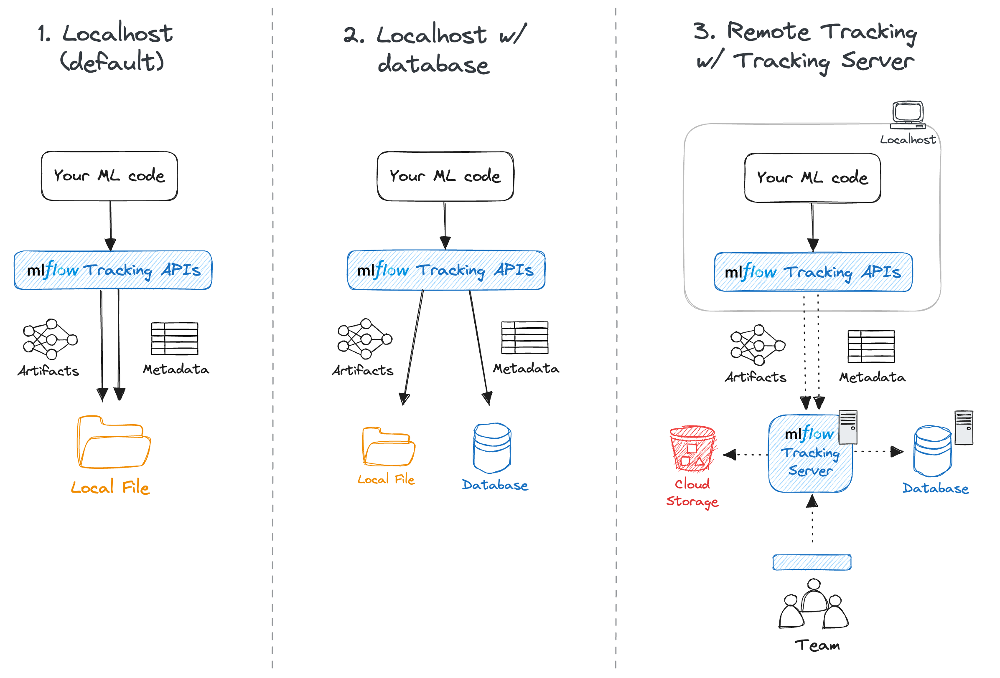

.. _tracking:

===============
MLflow Tracking
===============

The MLflow Tracking is an API and UI for logging parameters, code versions, metrics, and output files
when running your machine learning code and for later visualizing the results.
MLflow Tracking provides :ref:`Python <python-api>`, :ref:`REST <rest-api>`, :ref:`R <r-api>`, and :ref:`Java <java_api>` APIs.

.. figure:: _static/images/tracking/tracking-metrics-ui-temp.png
    :align: center
    :figwidth: 100%

    A screenshot of the MLflow Tracking UI, showing a plot of validation loss metrics during model training.

Quickstart
==========
If you haven't used MLflow Tracking before, we strongly recommend going through the following quickstart tutorial.

.. raw:: html

    <section>
        <article class="simple-grid">
            

                <a href="getting-started/intro-quickstart/index.html">
                    

                        MLflow Tracking Quickstart
                    

                    

                    A great place to start to learn the fundamentals of MLflow Tracking! Learn in 5 minutes how to log, register, and load a model for inference. 
                    

                </a>
            

        </article>
    </section>

Concepts
========

.. _runs:

Runs
----
MLflow Tracking is organized around the concept of **runs**, which are executions of some piece of
data science code, for example, a single ``python train.py`` execution. Each run records metadata
(various information about your run such as metrics, parameters, start and end times) and artifacts
(output files from the run such as model weights, images, etc).

Experiments
-----------
An experiment groups together runs for a specific task. You can create an experiment using the CLI, API, or UI.
The MLflow API and UI also let you create and search for experiments. See :ref:`Organizing Runs into Experiments <organizing_runs_in_experiments>`
for more details on how to organize your runs into experiments.

Tracing
-------
MLflow Tracing is an integrated part of the MLflow Tracking API that allows you to instrument your GenAI applications. Whether you're using the ``LangChain``
integration with MLflow Tracing, the Fluent APIs for tracing, or the lower-level Client APIs, MLflow tracking will record your trace data for future review, 
debugging, or analysis. See the `MLflow Tracing Guide <llms/tracing/index.html>`_ for more details.

.. _start-logging:

Tracking Runs
=============

.. toctree::
    :maxdepth: 1
    :hidden:

    tracking/tracking-api

`MLflow Tracking APIs <tracking/tracking-api.html>`_ provide a set of functions to track your runs. For example, you can call :py:func:`mlflow.start_run` to start a new run,
then call :ref:`Logging Functions <tracking_logging_functions>` such as :py:func:`mlflow.log_param` and :py:func:`mlflow.log_metric` to log a parameters and metrics respectively.
Please visit the `Tracking API documentation <tracking/tracking-api.html>`_ for more details about using these APIs.

.. code-block:: python

    import mlflow

    with mlflow.start_run():
        mlflow.log_param("lr", 0.001)
        # Your ml code
        ...
        mlflow.log_metric("val_loss", val_loss)

Alternatively, `Auto-logging <tracking/autolog.html>`_ offers the ultra-quick setup for starting MLflow tracking. This powerful feature allows you to log metrics, parameters, and models without the need for explicit log statements -
all you need to do is call :py:func:`mlflow.autolog` before your training code. Auto-logging supports popular libraries such as :ref:`Scikit-learn <autolog-sklearn>`, :ref:`XGBoost <autolog-xgboost>`, :ref:`PyTorch <autolog-pytorch>`, :ref:`Keras <autolog-keras>`, :ref:`Spark <autolog-spark>`, and more.
See :ref:`Automatic Logging Documentation <automatic-logging>` for supported libraries and how to use auto-logging APIs with each of them.

.. code-block:: python

    import mlflow

    mlflow.autolog()

    # Your training code...

.. note::
    By default, without any particular server/database configuration, MLflow Tracking logs data to the local `mlruns` directory. If you want to log your runs to a different location,
    such as a remote database and cloud storage, to share your results with your team, follow the instructions in the :ref:`Set up MLflow Tracking Environment <tracking-setup>` section.

Tracking Datasets
=================

.. toctree::
    :maxdepth: 1
    :hidden:

    tracking/data-api

MLflow offers the ability to track datasets that are associated with model training events. These metadata associated with the Dataset can be stored through the use of the :py:func:`mlflow.log_input` API. 
To learn more, please visit the `MLflow data documentation <tracking/data-api.html>`_ to see the features available in this API.

Explore Runs and Results
========================

.. _tracking_ui:

Tracking UI
-----------
The Tracking UI lets you visually explore your experiments and runs, as shown on top of this page.

* Experiment-based run listing and comparison (including run comparison across multiple experiments)
* Searching for runs by parameter or metric value
* Visualizing run metrics
* Downloading run results (artifacts and metadata)

If you log runs to a local ``mlruns`` directory, run the following command in the directory above it, then access `http://127.0.0.1:5000 <http://127.0.0.1:5000>`_ in your browser.

.. code-block:: bash

    mlflow ui --port 5000

Alternatively, the :ref:`MLflow Tracking Server <tracking_server>` serves the same UI and enables remote storage of run artifacts.
In that case, you can view the UI at ``http://<IP address of your MLflow tracking server>:5000`` from any machine that can connect to your tracking server.

.. _tracking_query_api:

Querying Runs Programmatically
------------------------------

You can also access all of the functions in the Tracking UI programmatically with :py:class:`MlflowClient <mlflow.client.MlflowClient>`.

For example, the following code snippet search for runs that has the best validation loss among all runs in the experiment.

.. code-block:: python

    client = mlflow.tracking.MlflowClient()
    experiment_id = "0"
    best_run = client.search_runs(
        experiment_id, order_by=["metrics.val_loss ASC"], max_results=1
    )[0]
    print(best_run.info)
    # {'run_id': '...', 'metrics': {'val_loss': 0.123}, ...}

.. _tracking-setup:

Set up the MLflow Tracking Environment
======================================

.. note::
    If you just want to log your experiment data and models to local files, you can skip this section.

MLflow Tracking supports many different scenarios for your development workflow. This section will guide you through how to set up the MLflow Tracking environment for your particular use case.
From a bird's-eye view, the MLflow Tracking environment consists of the following components.

Components
----------

`MLflow Tracking APIs <tracking/tracking-api.html>`_
~~~~~~~~~~~~~~~~~~~~~~~~~~~~~~~~~~~~~~~~~~~~~~~~~~~~

You can call MLflow Tracking APIs in your ML code to log runs and communicate with the MLflow Tracking Server if necessary.

`Backend Store <tracking/backend-stores.html>`_
~~~~~~~~~~~~~~~~~~~~~~~~~~~~~~~~~~~~~~~~~~~~~~~

.. toctree::
    :maxdepth: 1
    :hidden:

    tracking/backend-stores

The backend store persists various metadata for each :ref:`Run <runs>`, such as run ID, start and end times, parameters, metrics, etc.
MLflow supports two types of storage for the backend: **file-system-based** like local files and **database-based** like PostgreSQL.

.. _artifact-stores:

`Artifact Store <tracking/artifacts-stores.html>`_
~~~~~~~~~~~~~~~~~~~~~~~~~~~~~~~~~~~~~~~~~~~~~~~~~~

.. toctree::
    :maxdepth: 1
    :hidden:

    tracking/artifacts-stores

Artifact store persists (typicaly large) artifacts for each run, such as model weights (e.g. a pickled scikit-learn model),
images (e.g. PNGs), model and data files (e.g. `Parquet <https://parquet.apache.org/>`_ file). MLflow stores artifacts ina a
local file (`mlruns`) by default, but also supports different storage options such as Amazon S3 and Azure Blob Storage.

.. _tracking_server:

`MLflow Tracking Server <tracking/server.html>`_ (Optional)
~~~~~~~~~~~~~~~~~~~~~~~~~~~~~~~~~~~~~~~~~~~~~~~~~~~~~~~~~~~

.. toctree::
   :maxdepth: 1
   :hidden:

   tracking/server

MLflow Tracking Server is a stand-alone HTTP server that provides REST APIs for accessing backend and/or artifact store.
Tracking server also offers flexibility to configure what data to server, govern access control, versioning, and etc. Read
`MLflow Tracking Server documentation <tracking/server.html>`_ for more details.

.. _tracking_setup:

Common Setups
-------------

.. toctree::
    :maxdepth: 1
    :hidden:

    getting-started/intro-quickstart/index
    tracking/tutorials/local-database
    tracking/tutorials/remote-server

By configuring these components properly, you can create an MLflow Tracking environment suitable for your team's development workflow.
The following diagram and table show a few common setups for the MLflow Tracking environment.

.. list-table::
    :widths: 45 20 20 20
    :header-rows: 1
    :class: wrap-table

    * -
      - **1. Localhost (default)**
      - **2. Local Tracking with Local Database**
      - **3. Remote Tracking with** :ref:`MLflow Tracking Server <tracking_server>`

    * - **Scenario**
      - Solo development
      - Solo development
      - Team development

    * - **Use Case**
      - By default, MLflow records metadata and artifacts for each run to a local directory, ``mlruns``. This is the simplest way to get started with MLflow Tracking, without setting up any external server, database, and storage.
      - The MLflow client can interface with a SQLAlchemy-compatible database (e.g., SQLite, PostgreSQL, MySQL) for the `backend <tracking/backend-stores.html>`_. Saving metadata to a database allows you cleaner management of your experiment data while skipping the effort of setting up a server.
      - MLflow Tracking Server can be configured with an artifacts HTTP proxy, passing artifact requests through the tracking server to store and retrieve artifacts without having to interact with underlying object store services. This is particularly useful for team development scenarios where you want to store artifacts and experiment metadata in a shared location with proper access control.

    * - **Tutorial**
      - `QuickStart <getting-started/intro-quickstart/index.html>`_
      - `Tracking Experiments using a Local Database <tracking/tutorials/local-database.html>`_
      - `Remote Experiment Tracking with MLflow Tracking Server <tracking/tutorials/remote-server.html>`_

.. _other-tracking-setup:

Other Configuration with :ref:`MLflow Tracking Server <tracking_server>`
------------------------------------------------------------------------
MLflow Tracking Server provides customizability for other special use cases. Please follow `Remote Experiment Tracking with MLflow Tracking Server <tracking/tutorials/remote-server.html>`_ for
learning the basic setup and continue to the following materials for advanced configurations to meet your needs.

.. |local-server| raw:: html

        

            

                <h4>Using MLflow Tracking Server Locally</h4>
                
You can of course run MLflow Tracking Server locally. While this doesn't provide much additional benefit over directly using
                  the local files or database, might useful for testing your team development workflow locally or running your machine learning 
                  code on a container environment.

            

            
        

.. |artifact-only| raw:: html

        

            

              <h4>Running MLflow Tracking Server in Artifacts-only Mode</h4>
              
 MLflow Tracking Server has <code>--artifacts-only</code> option, which lets the server to serve (proxy) only artifacts
                and not metadata. This is particularly useful when you are in a large organization or training huge models, you might have high artifact
                 transfer volumes and want to split out the traffic for serving artifacts to not impact tracking functionality. Please read
                 <a href="tracking/server.html#optionally-using-a-tracking-server-instance-exclusively-for-artifact-handling">Optionally using a Tracking Server instance exclusively for artifact handling</a> for more details on how to use this mode.
              

            

            
        

.. |no-proxy| raw:: html

        

            

              <h4> Disable Artifact Proxying to Allow Direct Access to Artifacts</h4>
              
MLflow Tracking Server, by default, serves both artifacts and only metadata. However, in some cases, you may want
                to allow direct access to the remote artifacts storage to avoid the overhead of a proxy while preserving the functionality 
                of metadata tracking. This can be done by disabling artifact proxying by starting server with <code>--no-serve-artifacts</code> option.
                Refer to <a href="tracking/server.html#use-tracking-server-w-o-proxying-artifacts-access">Use Tracking Server without Proxying Artifacts Access</a> for how to set this up.

            

            
        

.. container:: tracking-responsive-tabs

    .. tabs::

        .. tab:: Local Tracking Server

            |local-server|

        .. tab:: Artifacts-only Mode

            |artifact-only|

        .. tab:: Direct Access to Artifacts

            |no-proxy|

FAQ
===

Can I launch multiple runs in parallel?
---------------------------------------
Yes, MLflow supports launching multiple runs in parallel e.g. multi processing / threading. See :ref:`Launching Multiple Runs in One Program <launching-multiple-runs>` for more details.

How can I organize many MLflow Runs neatly?
-------------------------------------------
MLflow provides a few ways to organize your runs:

* :ref:`Organize runs into experiments <organizing_runs_in_experiments>` - Experiments are logical containers for your runs. You can create an experiment using the CLI, API, or UI.
* :ref:`Create child runs <child_runs>` - You can create child runs under a single parent run to group them together. For example, you can create a child run for each fold in a cross-validation experiment.
* :ref:`Add tags to runs <add-tags-to-runs>` - You can associate arbitrary tags with each run, which allows you to filter and search runs based on tags.

Can I directly access remote storage without running the Tracking Server?
-------------------------------------------------------------------------

Yes, while it is best practice to have the MLflow Tracking Server as a proxy for artifacts access for team development workflows, you may not need that
if you are using it for personal projects or testing. You can achieve this by following the workaround below:

1. Set up artifacts configuration such as credentials and endpoints, just like you would for the MLflow Tracking Server. See :ref:`configure artifact storage <artifacts-store-supported-storages>` for more details.
2. Create an experiment with an explicit artifact location,

.. code-block:: python

    experiment_name = "your_experiment_name"
    mlflow.create_experiment(experiment_name, artifact_location="s3://your-bucket")
    mlflow.set_experiment(experiment_name)

Your runs under this experiment will log artifacts to the remote storage directly.

.. _tracking-with-model-registry:

How to integrate MLflow Tracking with :ref:`Model Registry <registry>`?
-----------------------------------------------------------------------
To use the Model Registry functionality with MLflow tracking, you **must use database backed store** such as PostgresQL and log a model using the ``log_model`` methods of the corresponding model flavors.
Once a model has been logged, you can add, modify, update, or delete the model in the Model Registry through the UI or the API. 
See `Backend Stores <tracking/backend-stores.html>`_ and :ref:`Common Setups <tracking_setup>` for how to configures backend store properly for your workflow.

How to include additional decription texts about the run?
---------------------------------------------------------
A system tag ``mlflow.note.content`` can be used to add descriptive note about this run. While the other :ref:`system tags <system_tags>` are set automatically,
this tag is **not set by default** and users can override it to include additional information about the run. The content will be displayed on the run's page under
the Notes section.
