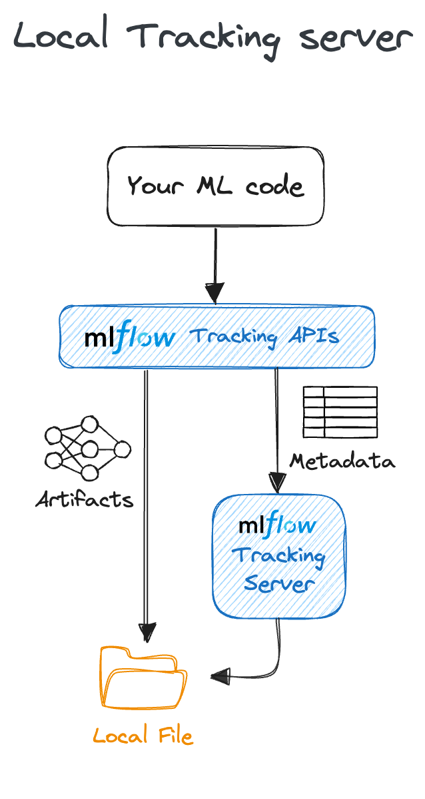
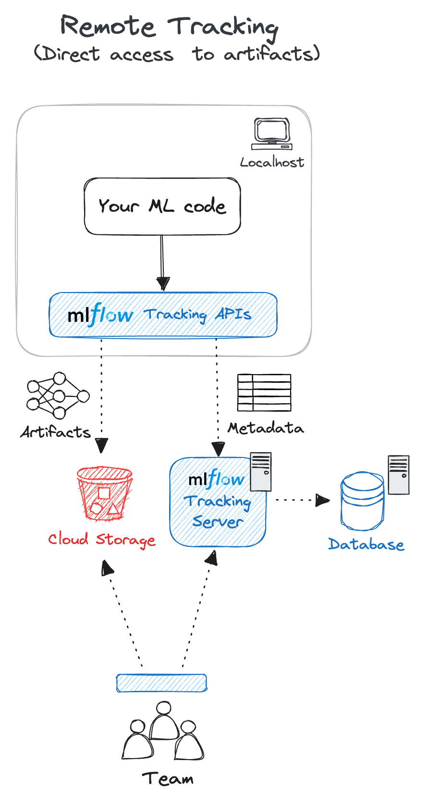
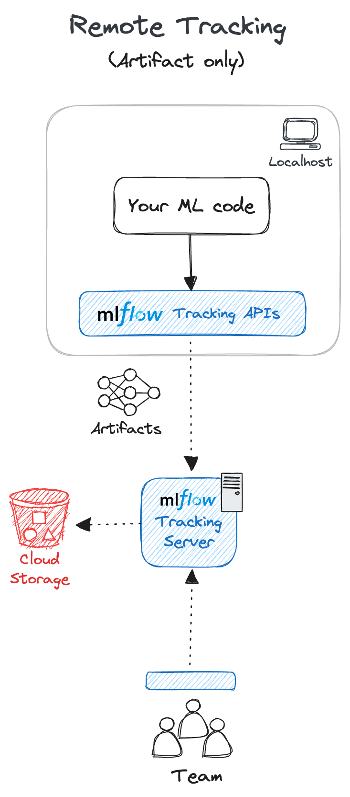

.. _tracking:

===============
MLflow Tracking
===============

The MLflow Tracking component is an API and UI for logging parameters, code versions, metrics, and output files
when running your machine learning code and for later visualizing the results.
MLflow Tracking allows you to log and query experiments using the :ref:`Python <python-api>`, :ref:`REST <rest-api>`, :ref:`R <r-api>`, and :ref:`Java <java_api>` APIs.

.. figure:: ../_static/images/tracking/tracking-metrics-ui-temp.png
    :align: center
    :figwidth: 900

    A screenshot of the MLflow Tracking UI, showing a plot of validation loss metrics during model training.

Quickstart
==========
If you haven't used MLflow Tracking before, we strongly recommend going through the following tutorial(s) to become familiar with the basic experiment tracking workflow.

.. raw:: html

    <section>
        <article class="simple-grid">
            

                <a href="../getting-started/intro-quickstart/index.html">
                    

                        MLflow Tracking Quickstart
                    

                    

                    A great place to start to learn the fundamentals of MLflow Tracking! Learn in 5 minutes how to log, register, and load a model for inference. 
                    

                </a>
            

            

                <a href="../getting-started/logging-first-model/index.html">
                    

                        Intro to MLflow Tutorial
                    

                    
                        Learn how to get started with the basics of MLflow in a step-by-step instructional tutorial that shows the critical 
                        path to logging your first model
                    
                </a>
            

        </article>
    </section>

Concepts
========

.. _runs:

Runs
----
MLflow Tracking is organized around the concept of *runs*, which are executions of some piece of
data science code, for example, a single ``python train.py`` execution. Each run records metadata
(various information about your run such as metrics, parameters, start and end times) and artifacts
(output files from the run such as model weights, images, etc).

Experiments
-----------
An experiment groups together runs for a specific task. You can create an experiment using the CLI, API, or UI.
The MLflow API and UI also let you create and search for experiments. See :ref:`Organizing Runs into Experiments <organizing_runs_in_experiments>`
for more details on how to organize your runs into experiments.

.. _start-logging:

Tracking Runs
=============

.. toctree::
    :maxdepth: 1
    :hidden:

    tracking-api

`MLflow Tracking APIs <tracking-api.html>`_ provide a set of functions to track your runs. The quickest way to start tracking is to use `Auto-logging <autolog.html>`, a powerful feature that allows you to log metrics, parameters, and models without the need for explicit log statements.
All you need to do is call :py:func:`mlflow.autolog` before your training code.

    .. code-block:: python

        import mlflow

        mlflow.autolog()

        # Your training code...

Auto-logging supports popular libraries such as :ref:`Scikit-learn <autolog-sklearn>`, :ref:`XGBoost <autolog-xgboost>`, :ref:`PyTorch <autolog-pytorch>`, :ref:`Keras <autolog-keras>`, :ref:`Spark <autolog-spark>`, and more.
See :ref:`Automatic Logging Documentation <automatic-logging>` for supported libraries and how to use auto-logging APIs with each of them.

Alternatively, when you want to customize your logging logic or handle models not supported by auto-logging, you can insert various :ref:`Logging Functions <tracking_logging_functions>` into your ML code.
Please visit the `Tracking API documentation <tracking-api.html>`_ for more details about using MLflow Tracking APIs to manually log your experiment data and models.

.. note::
    By default, without any particular server/database configuration, MLflow Tracking logs data to the local `mlruns` directory. If you want to log your runs to a different location,
    such as a remote database and cloud storage, to share your results with your team, follow the instructions in the :ref:`Set up MLflow Tracking Environment <tracking-setup>` section.

Explore Runs and Results
========================

.. _tracking_ui:

Tracking UI
-----------
The Tracking UI lets you visually explore your experiments and runs, with features including:

* Experiment-based run listing and comparison (including run comparison across multiple experiments)
* Searching for runs by parameter or metric value
* Visualizing run metrics
* Downloading run results (artifacts and metadata)

If you log runs to a local ``mlruns`` directory, run the following command in the directory above it, then access `http://127.0.0.1:5000 <http://127.0.0.1:5000>`_ in your browser.

.. code-block:: bash

    mlflow ui --port 5000

Alternatively, the :ref:`MLflow Tracking Server <tracking_server>` serves the same UI and enables remote storage of run artifacts.
In that case, you can view the UI at ``http://<IP address of your MLflow tracking server>:5000`` from any machine that can connect to your tracking server.

.. _tracking_query_api:

Querying Runs Programmatically
------------------------------

You can also access all of the functions in the Tracking UI programmatically with :py:class:`MlflowClient <mlflow.client.MlflowClient>`.

.. _tracking-setup:

Set up MLflow Tracking Environment
==================================

.. note::
    If you just want to log your experiment data and models to local files, you can skip this section.

MLflow Tracking supports many different scenarios for your development workflow. This section will guide you through how to set up the MLflow Tracking environment for your particular use case.
From a bird's-eye view, the MLflow Tracking environment consists of the following components.

Components
----------

`MLflow Tracking APIs <tracking-api.html>`_
~~~~~~~~~~~~~~~~~~~~~~~~~~~~~~~~~~~~~~~~~~~

You can call MLflow Tracking APIs in your ML code to log runs and communicate with the MLflow Tracking Server if necessary.

`Backend Store <backend-stores.html>`_
~~~~~~~~~~~~~~~~~~~~~~~~~~~~~~~~~~~~~~

.. toctree::
    :maxdepth: 1
    :hidden:

    backend-stores

The backend store persists various metadata for each :ref:`Run <runs>`, such as run ID, start and end times, parameters, metrics, etc.
MLflow supports two types of storage for the backend: **file-system-based** like local files and **database-based** like PostgreSQL.

.. _artifact-stores:

`Artifact Store <artifacts-stores.html>`_
~~~~~~~~~~~~~~~~~~~~~~~~~~~~~~~~~~~~~~~~~

.. toctree::
    :maxdepth: 1
    :hidden:

    artifacts-stores

Artifact store persists (typicaly large) arifacts for each run, such as model weights (e.g. a pickled scikit-learn model),
images (e.g. PNGs), model and data files (e.g. `Parquet <https://parquet.apache.org/>`_ file). MLflow stores artifacts ina a
local file (`mlruns`) by default, but also supports different storage options such as Amazon S3 and Azure Blob Storage.

.. _tracking_server:

`MLflow Tracking Server <server.html>`_ (Optional)
~~~~~~~~~~~~~~~~~~~~~~~~~~~~~~~~~~~~~~~~~~~~~~~~~~

.. toctree::
   :maxdepth: 1
   :hidden:

   server

MLflow Tracking Server is a stand-alone HTTP server that provides REST APIs for accessing backend and/or artifact store.
Tracking server also offers flexibility to configure what data to server, govern access control, versioning, and etc. Read
`MLflow Tracking Server documentation <server.html>`_ for more details.

.. _tracking_setup:

Common Setups
-------------

.. toctree::
    :maxdepth: 1
    :hidden:

    ../getting-started/intro-quickstart/index
    tutorials/local-database
    tutorials/remote-server

By configuring these components properly, you can create an MLflow Tracking environment suitable for your team's development workflow.
The following diagram and table show a few common setups for the MLflow Tracking environment.

.. figure:: ../_static/images/tracking/tracking-setup-overview.png
    :align: center
    :figwidth: 900

    Different ways to set up the MLflow environment for tracking your experiments.

.. list-table::
    :widths: 45 15 20 20
    :header-rows: 1

    * - Scenario
      - Use Case
      - Description
      - Tutorial

    * - **1. Localhost (default)**
      - Solo development
      - By default, MLflow records metadata and artifacts for each run to a local directory, ``mlruns``. This is the simplest way to get started with MLflow Tracking, without setting up any external server, database, and storage.
      - `QuickStart <../getting-started/intro-quickstart/index.html>`_

    * - **2. Local Tracking with Local Database**
      - Solo development
      - The MLflow client can interface with a SQLAlchemy-compatible database (e.g., SQLite, PostgreSQL, MySQL) for the `backend <backend-stores.html>`_. Saving metadata to a database allows you cleaner management of your experiment data while skipping the effort of setting up a server.
      - `Tracking Experiments with Local Database <tutorials/local-database.html>`_

    * - **3. Remote Tracking with** :ref:`MLflow Tracking Server <tracking_server>`
      - Team development
      - MLflow Tracking Server can be configured with an artifacts HTTP proxy, passing artifact requests through the tracking server to store and retrieve artifacts without having to interact with underlying object store services. This is particularly useful for team development scenarios where you want to store artifacts and experiment metadata in a shared location with proper access control.
      - `Remote Experiment Tracking with MLflow Tracking Server <tutorials/remote-server.html>`_

.. _other-tracking-setup:

Other Configuration with :ref:`MLflow Tracking Server <tracking_server>`
------------------------------------------------------------------------
MLflow Tracking Server provides customizability for other special use cases. Please follow `Remote Experiment Tracking with MLflow Tracking Server <tutorials/remote-server.html>`_ for
learning the basic setup and continue to the following materials for advanced configurations to meet your needs.

.. list-table::
    :widths: 30 50 20
    :header-rows: 1

    * - Scenario
      - Description
      - Diagram

    * - Run MLflow Tracking Server on localhost
      - This is mainly useful for testing your team development workflow locally or running your machine learning code on a container environment.
      - |image-local-server| 

    * - Bypass Tracking Server proxy for artifacts access
      - MLflow Tracking Server, by default, serves both artifacts and only metadata. However, in some cases, you may want to allow direct access to the remote artifacts storage to avoid the overhead of a proxy while preserving the functionality of metadata tracking. Refer to :ref:`Use Tracking Server without Proxying Artifacts Access <tracking-server-no-proxy>` for how to set this up.
      - |image-no-proxy|  

    * - Use MLflow Tracking Server exclusively as a proxy for artifacts
      - If you are in a large organization or training huge models, you might have high artifact transfer volumes. In such cases, you may want to split out the traffic for serving artifacts to not impact tracking functionality. You can achieve this by configuring the server with the ``--artifact-only`` mode, as described in :ref:`Use Tracking Server without Proxying Artifacts Access <tracking-server-no-proxy>`.
      - |image-artifact-only| 

FAQ
===

Can I launch multiple runs in parallel?
---------------------------------------
Yes, MLflow supports launching multiple runs in parallel. See :ref:`Launching Multiple Runs in One Program <launching-multiple-runs>` for more details.

How can I organize many MLflow Runs neatly?
-------------------------------------------
MLflow provides a few ways to organize your runs:

* :ref:`Organize runs into experiments <organizing_runs_in_experiments>` - Experiments are logical containers for your runs. You can create an experiment using the CLI, API, or UI.
* :ref:`Add tags to runs <add-tags-to-runs>` - You can associate arbitrary tags with each run, which allows you to filter and search runs based on tags.

Can I directly access remote storage without running the Tracking Server?
-------------------------------------------------------------------------

Yes, while it is best practice to have the MLflow Tracking Server as a proxy for artifacts access for team development workflows, you may not need that
if you are using it for personal projects or testing. You can achieve this by following the workaround below:

1. Set up artifacts configuration such as credentials and endpoints, just like you would for the MLflow Tracking Server. See :ref:`configure artifact storage <artifacts-store-supported-storages>` for more details.
2. Create an experiment with an explicit artifact location,

    .. code-block:: python

        experiment_name = "your_experiment_name"
        mlflow.create_experiment(experiment_name, artifact_location="s3://your-bucket")
        mlflow.set_experiment(experiment_name)

Your runs under this experiment will log artifacts to the remote storage directly.