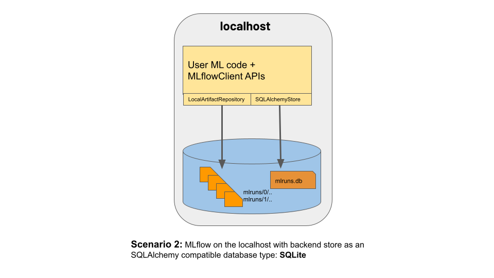

======================================
Connect MLflow Tracking to Data Stores
======================================

Where Runs Are Recorded
=======================

MLflow runs can be recorded to local files, to a SQLAlchemy-compatible database, or remotely
to a tracking server. By default, the MLflow Python API logs runs locally to files in an ``mlruns`` directory wherever you
ran your program. You can then run ``mlflow ui`` to see the logged runs.

To log runs remotely, set the ``MLFLOW_TRACKING_URI`` environment variable to a tracking server's URI or
call :py:func:`mlflow.set_tracking_uri`.

There are different kinds of remote tracking URIs:

- Local file path (specified as ``file:/my/local/dir``), where data is just directly stored locally.
- Database encoded as ``<dialect>+<driver>://<username>:<password>@<host>:<port>/<database>``. MLflow supports the dialects ``mysql``, ``mssql``, ``sqlite``, and ``postgresql``. For more details, see `SQLAlchemy database uri <https://docs.sqlalchemy.org/en/latest/core/engines.html#database-urls>`_.
- HTTP server (specified as ``https://my-server:5000``), which is a server hosting an :ref:`MLflow tracking server <tracking_server>`.
- Databricks workspace (specified as ``databricks`` or as ``databricks://<profileName>``, a `Databricks CLI profile <https://github.com/databricks/databricks-cli#installation>`_.
  Refer to Access the MLflow tracking server from outside Databricks `[AWS] <http://docs.databricks.com/applications/mlflow/access-hosted-tracking-server.html>`_
  `[Azure] <http://docs.microsoft.com/azure/databricks/applications/mlflow/access-hosted-tracking-server>`_, or :ref:`the quickstart <quickstart_tracking_server>` to
  easily get started with hosted MLflow on Databricks Community Edition.

TODO: Add some link to proxy server usage.

Example: Log Runs to a Local SQLite Database and store Artifacts in Amazon S3
=============================================================================

Many users also run MLflow on their local machines with a `SQLAlchemy-compatible <https://docs.sqlalchemy.org/en/14/core/engines.html#database-urls>`_ database: `SQLite <https://sqlite.org/docs.html>`_. In this case, artifacts
are stored under the local ``./mlruns`` directory, and MLflow entities are inserted in a SQLite database file ``mlruns.db``.

In this scenario, the MLflow client uses the following interfaces to record MLflow entities and artifacts:

 * An instance of a `LocalArtifactRepository` (to save artifacts)
 * An instance of an `SQLAlchemyStore` (to store MLflow entities to a SQLite file ``mlruns.db``)
