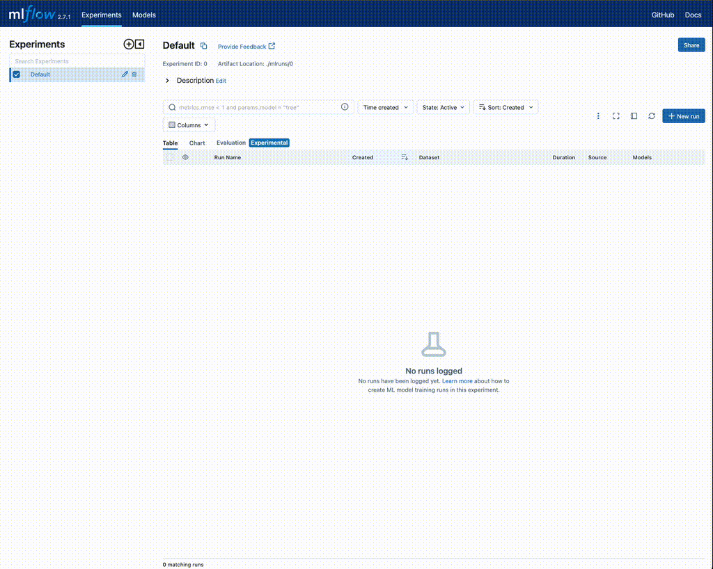
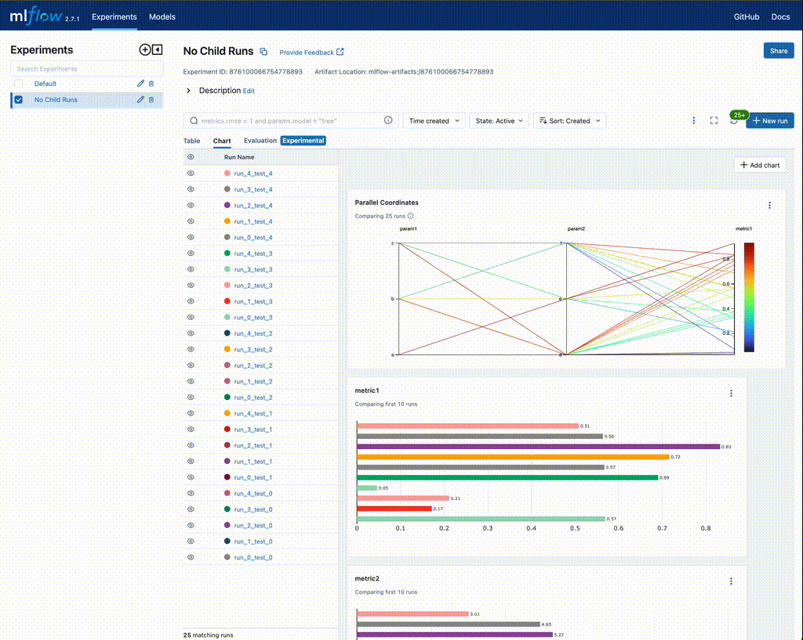
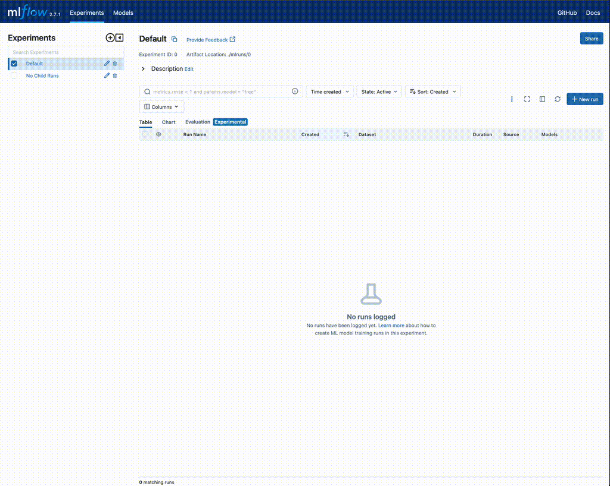
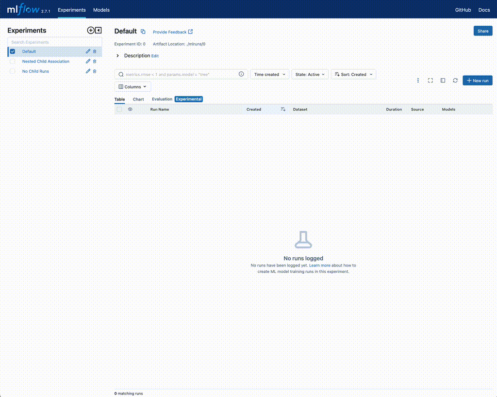

Understanding Parent and Child Runs in MLflow
=============================================

Introduction
------------
Machine learning projects often involve intricate relationships. These connections can emerge at
various stages, be it the project's conception, during data preprocessing, in the model's architecture,
or even during the model's tuning process. MLflow provides tools to efficiently capture and represent
these relationships.

Core Concepts of MLflow: Tags, Experiments, and Runs
----------------------------------------------------
In our foundational MLflow tutorial, we highlighted a fundamental relationship: the association
between **tags**, **experiments**, and **runs**. This association is crucial when dealing with
complex ML projects, such as forecasting models for individual products in a supermarket, as
presented in our example. The diagram below offers a visual representation:

.. figure:: ../../_static/images/tutorials/introductory/logging-first-model/tag-exp-run-relationship.svg
   :width: 90%
   :align: center
   :alt: Tags, experiments, and runs relationships

   A model grouping hierarchy

Key Aspects
^^^^^^^^^^^

- **Tags**: These are instrumental in defining business-level filtering keys. They aid in retrieving relevant experiments and their runs.
- **Experiments**: They set boundaries, both from a business perspective and data-wise. For instance, sales data for carrots wouldn't be used to predict sales of apples without prior validation.
- **Runs**: Each run captures a specific hypothesis or iteration of training, nestled within the context of the experiment.

The Real-world Challenge: Hyperparameter Tuning
-----------------------------------------------
While the above model suffices for introductory purposes, real-world scenarios introduce complexities. One such complexity arises when tuning models.

Model tuning is paramount. Methods range from grid search (though typically not recommended due to
inefficiencies) to random searches, and more advanced approaches like automated hyperparameter tuning.
The objective remains the same: to optimally traverse the model's parameter space.

Benefits of Hyperparameter Tuning
^^^^^^^^^^^^^^^^^^^^^^^^^^^^^^^^^

- **Loss Metric Relationship**: By analyzing the relationship between hyperparameters and optimization loss metrics, we can discern potentially irrelevant parameters.
- **Parameter Space Analysis**: Monitoring the range of tested values can indicate if we need to constrict or expand our search space.
- **Model Sensitivity Analysis**: Estimating how a model reacts to specific parameters can pinpoint potential feature set issues.

But here lies the challenge: How do we systematically store the extensive data produced during hyperparameter tuning?

.. figure:: ../../_static/images/guides/introductory/hyperparameter-tuning-with-child-runs/what-to-do-with-hyperparam-runs.svg
   :width: 90%
   :align: center
   :alt: Challenges with hyperparameter data storage

   The quandary of storing hyperparameter data

In the upcoming sections, we'll delve deeper, exploring MLflow's capabilities to address this
challenge, focusing on the concepts of Parent and Child Runs.

What are Parent and Child Runs?
-------------------------------

At its core, MLflow allows users to track experiments, which are essentially named groups of runs.
A "run" in this context refers to a single execution of a model training event, where you can log
parameters, metrics, tags, and artifacts associated with the training process.
The concept of Parent and Child Runs introduces a hierarchical structure to these runs.

Imagine a scenario where you're testing a deep learning model with different architectures. Each
architecture can be considered a parent run, and every iteration of hyperparameter tuning for that
architecture becomes a child run nested under its respective parent.

Benefits
--------

1. **Organizational Clarity**: By using Parent and Child Runs, you can easily group related runs together. For instance, if you're running a hyperparameter search using a Bayesian approach on a particular model architecture, every iteration can be logged as a child run, while the overarching Bayesian optimization process can be the parent run.

2. **Enhanced Traceability**: When working on large projects with a broad product hierarchy, child runs can represent individual products or variants, making it straightforward to trace back results, metrics, or artifacts to their specific run.

3. **Scalability**: As your experiments grow in number and complexity, having a nested structure ensures that your tracking remains scalable. It's much easier to navigate through a structured hierarchy than a flat list of hundreds or thousands of runs.

4. **Improved Collaboration**: For teams, this approach ensures that members can easily understand the structure and flow of experiments conducted by their peers, promoting collaboration and knowledge sharing.

Relationship between Experiments, Parent Runs, and Child Runs
-------------------------------------------------------------

- **Experiments**: Consider experiments as the topmost layer. They are named entities under which all related runs reside. For instance, an experiment named "Deep Learning Architectures" might contain runs related to various architectures you're testing.

- **Parent Runs**: Within an experiment, a parent run represents a significant segment or phase of your workflow. Taking the earlier example, each specific architecture (like CNN, RNN, or Transformer) can be a parent run.

- **Child Runs**: Nested within parent runs are child runs. These are iterations or variations within the scope of their parent. For a CNN parent run, different sets of hyperparameters or slight architectural tweaks can each be a child run.

Practical Example
-----------------
For this example, let's image that we're working through a fine-tuning exercise for a particular modeling solution.
We're going through the tuning phase of rough adjustments initially, attempting to determine which parameter ranges and
categorical selection values that we might want to consider for a full hyperparameter tuning run with a much higher
iteration count.

Naive Approach with no child runs
^^^^^^^^^^^^^^^^^^^^^^^^^^^^^^^^^

In this first phase, we will be trying relatively small batches of different combinations of parameters and
evaluating them within the MLflow UI to determine whether we should include or exempt certain values based on the
relatively performance amongst our iterative trials.

If we were to use each iteration as its own MLflow run, our code might look something like this:

.. code-section::

    .. code-block:: python

        import random
        import mlflow
        from functools import partial
        from itertools import starmap
        from more_itertools import consume

        # Define a function to log parameters and metrics
        def log_run(run_name, test_no):
            with mlflow.start_run(run_name=run_name):
                mlflow.log_param("param1", random.choice(["a", "b", "c"]))
                mlflow.log_param("param2", random.choice(["d", "e", "f"]))
                mlflow.log_metric("metric1", random.uniform(0, 1))
                mlflow.log_metric("metric2", abs(random.gauss(5, 2.5)))

        # Generate run names
        def generate_run_names(test_no, num_runs=5):
            return (f"run_{i}_test_{test_no}" for i in range(num_runs))

        # Execute tuning function
        def execute_tuning(test_no):
            # Partial application of the log_run function
            log_current_run = partial(log_run, test_no=test_no)
            # Generate run names and apply log_current_run function to each run name
            runs = starmap(
                log_current_run, ((run_name,) for run_name in generate_run_names(test_no))
            )
            # Consume the iterator to execute the runs
            consume(runs)

        # Set the tracking uri and experiment
        mlflow.set_tracking_uri("http://localhost:8080")
        mlflow.set_experiment("No Child Runs")

        # Execute 5 hyperparameter tuning runs
        consume(starmap(execute_tuning, ((x,) for x in range(5))))

After executing this, we can navigate to the MLflow UI to see the results of the iterations and compare each run's
error metrics to the parameters that were selected.

    Initial Hyperparameter tuning execution

What happens when we need to run this again with some slight modifications?

Our code might change in-place with the values being tested:

.. code-section::

    .. code-block:: python

        def log_run(run_name, test_no):
            with mlflow.start_run(run_name=run_name):
                mlflow.log_param("param1", random.choice(["a", "c"]))  # remove 'b'
                # remainder of code ...

When we execute this and navigate back to the UI, it is now significantly more difficult to determine
which run results are associated with a particular parameter grouping. For this example, it isn't
particularly problematic since the features are identical and the parameter search space is a subset of the
original hyperparameter test.

This may become a serious problem for analysis if we:

* Add terms to the original hyperparameter search space
* Modify the feature data (add or remove features)
* Change the underlying model architecture (test 1 is a Random Forest model, while test 2 is a Gradient Boosted Trees model)

Let's take a look at the UI and see if it is clear which iteration a particular run is a member of.

   Challenges with iterative tuning without child run encapsulation

It's not too hard to imagine how complicated this can become if there are thousands of runs in this experiment.

There is a solution for this, though. We can setup the exact same testing scenario with few small modifications to make it easy to find
related runs, declutter the UI, and greatly simplify the overall process of evaluating hyperparameter ranges and parameter inclusions
during the process of tuning. Only a few modification are needed:

* Use child runs by adding a nested ``start_run()`` context within a parent run's context.
* Add disambiguation information to the runs in the form of modifying the ``run_name`` of the parent run
* Add tag information to the parent and child runs to enable searching on keys that identify a family of runs

Adapting for Parent and Child Runs
^^^^^^^^^^^^^^^^^^^^^^^^^^^^^^^^^^
The code below demonstrates these modifications to our original hyperparameter tuning example.

.. code-section::

    .. code-block:: python

        import random
        import mlflow
        from functools import partial
        from itertools import starmap
        from more_itertools import consume

        # Define a function to log parameters and metrics and add tag
        # logging for search_runs functionality
        def log_run(run_name, test_no, param1_choices, param2_choices, tag_ident):
            with mlflow.start_run(run_name=run_name, nested=True):
                mlflow.log_param("param1", random.choice(param1_choices))
                mlflow.log_param("param2", random.choice(param2_choices))
                mlflow.log_metric("metric1", random.uniform(0, 1))
                mlflow.log_metric("metric2", abs(random.gauss(5, 2.5)))
                mlflow.set_tag("test_identifier", tag_ident)

        # Generate run names
        def generate_run_names(test_no, num_runs=5):
            return (f"run_{i}_test_{test_no}" for i in range(num_runs))

        # Execute tuning function, allowing for param overrides,
        # run_name disambiguation, and tagging support
        def execute_tuning(
            test_no,
            param1_choices=["a", "b", "c"],
            param2_choices=["d", "e", "f"],
            test_identifier="",
        ):
            ident = "default" if not test_identifier else test_identifier
            # Use a parent run to encapsulate the child runs
            with mlflow.start_run(run_name=f"parent_run_test_{ident}_{test_no}"):
                # Partial application of the log_run function
                log_current_run = partial(
                    log_run,
                    test_no=test_no,
                    param1_choices=param1_choices,
                    param2_choices=param2_choices,
                    tag_ident=ident,
                )
                mlflow.set_tag("test_identifier", ident)
                # Generate run names and apply log_current_run function to each run name
                runs = starmap(
                    log_current_run, ((run_name,) for run_name in generate_run_names(test_no))
                )
                # Consume the iterator to execute the runs
                consume(runs)

        # Set the tracking uri and experiment
        mlflow.set_tracking_uri("http://localhost:8080")
        mlflow.set_experiment("Nested Child Association")

        # Define custom parameters
        param_1_values = ["x", "y", "z"]
        param_2_values = ["u", "v", "w"]

        # Execute hyperparameter tuning runs with custom parameter choices
        consume(
            starmap(execute_tuning, ((x, param_1_values, param_2_values) for x in range(5)))
        )

We can view the results of executing this in the UI:

The real benefit of this nested architecture becomes much more apparent when we add additional runs
with different conditions of hyperparameter selection criteria.

.. code-section::

    .. code-block:: python

        # Execute modified hyperparameter tuning runs with custom parameter choices
        param_1_values = ["a", "b"]
        param_2_values = ["u", "v", "w"]
        ident = "params_test_2"
        consume(
            starmap(
                execute_tuning, ((x, param_1_values, param_2_values, ident) for x in range(5))
            )
        )

... and even more runs ...

.. code-section::

    .. code-block:: python

        param_1_values = ["b", "c"]
        param_2_values = ["d", "f"]
        ident = "params_test_3"
        consume(
            starmap(
                execute_tuning, ((x, param_1_values, param_2_values, ident) for x in range(5))
            )
        )

Once we execute these three tuning run tests, we can view the results in the UI:

   Encapsulating tests with child runs

In the above video, you can see that we purposefully avoided including the parent run in the run comparison.
This is due to the fact that no metrics or parameters were actually written to these parent runs; rather, they
were used purely for organizational purposes to limit the volume of runs visible within the UI.

In practice, it is best to store the best conditions found with a hyperparamter execution of child runs within
the parent's run data.

Challenge
---------

As an exercise, if you are interested, you may download the notebook with these two examples and modify the
code within in order to achieve this.

.. raw:: html

   <a href="https://raw.githubusercontent.com/mlflow/mlflow/master/docs/source/traditional-ml/hyperparameter-tuning-with-child-runs/notebooks/parent-child-runs.ipynb" class="notebook-download-btn">Download the notebook</a>

The notebook contains an example implementation of this, but it is
recommended to develop your own implementation that fulfills the following requirements:

* Record the lowest metric1 value amongst the children and the associated parameters with that child run in the parent run's information.
* Add the ability to specify an iteration count to the number of children created from the calling entry point.

The results in the UI for this challenge are shown below.

   Adding best child run data to parent run

Conclusion
----------

The usage of parent and child runs associations can greatly simplify iterative model development.
With repetitive and high-data-volume tasks such as hyperparameter tuning, encapsulating a training run's
parameter search space or feature engineering evaluation runs can help to ensure that you're comparing
exactly what you intend to compare, all with minimal effort.