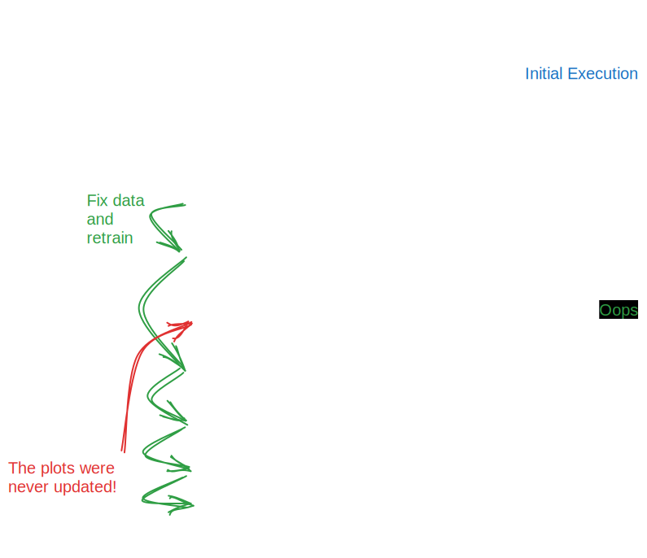

Leveraging Visualizations and MLflow for In-depth Model Analysis
================================================================

Introduction
------------

In any machine learning project, understanding the behavior, performance, and characteristics of the
developed models is important. Clear, informative visualizations play a crucial role in this understanding,
offering insights into the model's patterns, errors, and efficiency.

In this portion of the guide, we look at a notebook that is concerned with the generation and storage of
common and useful plots associated with a regression task.

We'll be looking at two primary means of logging plots along with our logged models:

- **Direct plot logging** via ``mlflow.log_figure()`` we will use an in-memory figure reference to a generated plot.
- **Logging a local plot file** via ``mlflow.log_artifact()`` to allow us to log a locally stored image to the run.

Role of Visualizations in Model Analysis
----------------------------------------

Visualizations act as a window into the intricate world of machine learning models. They enable the exploration of various aspects:

- **Understanding Data**: Initial visualizations allow for a deep dive into the data, revealing patterns, anomalies, and relationships that can inform the entire modeling process.
- **Model Evaluation**: Plots such as residual plots and prediction error plots help in diagnosing issues with the model and evaluating its performance.
- **Hyperparameter Tuning**: Visualization aids in understanding the impact of different hyperparameters on the model's performance, guiding the selection process.
- **Error Analysis**: They help in analyzing the types and patterns of errors made by the model, providing insight into possible improvements.

A Warning about Procedural Generation of Plots
^^^^^^^^^^^^^^^^^^^^^^^^^^^^^^^^^^^^^^^^^^^^^^
In the accompanying notebook to this subsection of this guide, you will observe plots being declared
within functions. This approach deviates from the typical examples seen in machine learning tutorials
and guides, so it's essential to clarify why this method is chosen for the provided examples.

**The Central Issue: Statefulness**

   Failing to execute all cells in order can lead to misleading plots

Notebooks inherently maintain a state across cells. While this feature can be beneficial, it poses
significant challenges for ensuring the reliability and accuracy of code and output, especially for visualizations.

**The Challenges of Out-of-Order Execution**

One of the most significant issues in notebook environments is the potential for out-of-order
execution. Cells can be run in any sequence, leading to a state where variables or outputs do not
reflect the latest code changes. This problem is particularly acute for visualizations. If a plot
is generated and then displayed in a separate cell, running the cells out of order can lead to
displaying outdated or incorrect visualizations.

**Ensuring Accurate Visualizations**

For visualizations to serve their purpose of conveying accurate, clear, and reliable information,
they must correspond to the current state of the data and model. Ensuring this correspondence in a
notebook environment requires careful management of cell execution order and state, which can be cumbersome and error-prone.

**Why Use Functions to Generate Plots**

To mitigate these challenges, the example code opts for declaring plots within functions. This approach offers several advantages:

- **Encapsulation**: By encapsulating the plot generation within a function, the code ensures that the plot is generated with the current state of the data every time the function is called. This encapsulation avoids the pitfalls of out-of-order cell execution affecting the plot's accuracy.
- **Flexibility and Reusability**: Functions provide the flexibility to generate plots with different parameters and data without duplicating code. This reusability enhances code maintainability and readability.
- **Integration with MLflow**: Functions seamlessly integrate with MLflow, allowing for plots to be logged alongside metrics, parameters, and models, ensuring that the visualizations correspond to the specific run and model state. This integration provides a reliable and consolidated view of the model, metrics, and plots in the MLflow UI, avoiding the disjointed view that can occur in notebooks.
- **Avoiding Display in Stdout**: The function-based approach avoids direct printing of plots to the notebook's stdout. Direct printing can clutter the notebook, increase the saved notebook's size, and lead to confusion with multiple plots displayed in the notebook. By logging plots directly in MLflow, the example code keeps the notebook clean, ensures plots correspond to the specific model run, and leverages MLflow's UI for viewing and comparing plots.

By encapsulating and scoping the generation of plots to within the training context (within ``mlflow.start_run()``), we can get all
of the flexibility, ease-of-use, and benefits of imperative iterative code development that notebooks bring without the risk of
logging stale, invalid, or inaccurate plots that do not reflect the actual state of the data or model which is logged.

Benefits of Integrating Visualizations with MLflow
--------------------------------------------------

Integrating visualizations with MLflow presents several substantial benefits:

- **Persistent Storage**: Storing visualizations alongside the model in MLflow ensures their availability for future reference, protecting against loss due to session termination or other issues.
- **Provenance**: It provides clear provenance for visualizations, ensuring that the insights they provide can always be traced back to the exact model version and dataset.
- **Consistency**: Ensures that the visualizations correspond to the correct version of the model, preventing confusion and errors.
- **Accessibility**: Makes visualizations easily accessible to all team members, enhancing collaboration and insight sharing.

Generating a Plot
-----------------

In the companion notebook to this section of the guide, there are samples of many regression-relevant plots.
Some, such as the correlation matrix plot, are relevant to the feature data set, while others, such as the coefficients plot, are relevant only after we have a trained model.

Whether we're using a trained model or not, the approach is similar for logging these image artifacts.

Defining a Plot
^^^^^^^^^^^^^^^

In the intricate world of data visualization, the structured and organized presentation of plots is
paramount. Below is an example of generating a box plot, which compares a continuous variable to a
categorical (ordinal) variable. The example utilizes a typical ``matplotlib`` implementation,
enhanced with ``seaborn`` for a refined visual appearance. This structure is fundamental for ensuring
clarity and legibility in our modeling code. By defining the plot generation as a separate,
callable function, we maintain a clean and organized codebase. This approach is essential,
especially in a notebook environment, to ensure that each training iteration has a specific and
unambiguous reference to the plot generation, directly linked to the exact state of the data used
in a training iteration. Such a method mitigates the risks associated with declaratively defined and
materialized plots, which, if not regenerated after data modification, can lead to inconsistencies
and errors in data representation.

.. code-section::

    .. code-block:: python

        def plot_box_weekend(df, style="seaborn", plot_size=(10, 8)):
            with plt.style.context(style=style):
                fig, ax = plt.subplots(figsize=plot_size)
                sns.boxplot(data=df, x="weekend", y="demand", ax=ax, color="lightgray")
                sns.stripplot(
                    data=df,
                    x="weekend",
                    y="demand",
                    ax=ax,
                    hue="weekend",
                    palette={0: "blue", 1: "green"},
                    alpha=0.15,
                    jitter=0.3,
                    size=5,
                )

                ax.set_title("Box Plot of Demand on Weekends vs. Weekdays", fontsize=14)
                ax.set_xlabel("Weekend (0: No, 1: Yes)", fontsize=12)
                ax.set_ylabel("Demand", fontsize=12)
                for i in ax.get_xticklabels() + ax.get_yticklabels():
                    i.set_fontsize(10)
                ax.legend_.remove()
                plt.tight_layout()
            plt.close(fig)
            return fig

Key Elements
++++++++++++

- **Title Application**: Including a title in the plot is not just a formality, it's a necessity for ensuring clarity and comprehensibility, especially within the MLflow UI. A well-crafted title provides a comprehensive overview, helping in immediate understanding and eliminating any ambiguity or confusion.
- **Override Default Sizing**: Adjusting default sizes for various elements like fonts and plot sizes is crucial for ensuring the legibility and visual appeal of the plot in the MLflow UI. It ensures that the plot remains readable and clear, irrespective of the viewing platform or screen size.
- **Axes Labeling**: Properly labeled axes are a pillar of understandable and self-sufficient plots. They offer clear information about the data dimensions, making the plot comprehensible without external references or explanations.
- **Figure Closure**: Closing the figure before returning it ensures a clean and uncluttered notebook environment. It prevents the inadvertent display of the plot within the notebook's standard output, avoiding confusion and maintaining the organization of the notebook.
- **Legend Removal**: Removing auto-generated legends from the plot enhances the visual clarity and readability. It prevents unnecessary clutter, making the plot more concise and to the point, ensuring that the focus remains on the vital data representations.

Defining a Plot to be Saved Locally
^^^^^^^^^^^^^^^^^^^^^^^^^^^^^^^^^^^

There are scenarios when saving a plot locally before logging to MLflow is more advantageous.
The example below illustrates the generation of a correlation matrix plot, saving the image when
called, as opposed to returning an in-memory reference. This approach, though different,
remains seamlessly compatible with MLflow, ensuring the same level of organization and access,
with additional flexibility in plot access and usage.

.. code-section::

    .. code-block:: python

        def plot_correlation_matrix_and_save(
            df, style="seaborn", plot_size=(10, 8), path="/tmp/corr_plot.png"
        ):
            with plt.style.context(style=style):
                fig, ax = plt.subplots(figsize=plot_size)

                # Calculate the correlation matrix
                corr = df.corr()

                # Generate a mask for the upper triangle
                mask = np.triu(np.ones_like(corr, dtype=bool))

                # Draw the heatmap with the mask and correct aspect ratio
                sns.heatmap(
                    corr,
                    mask=mask,
                    cmap="coolwarm",
                    vmax=0.3,
                    center=0,
                    square=True,
                    linewidths=0.5,
                    annot=True,
                    fmt=".2f",
                )

                ax.set_title("Feature Correlation Matrix", fontsize=14)
                plt.tight_layout()

            plt.close(fig)
            # convert to filesystem path spec for os compatibility
            save_path = pathlib.Path(path)
            fig.savefig(path)

Key Insights
++++++++++++

- **Heatmap for Correlation**: The use of a heatmap in this context provides a visually intuitive and effective representation of feature correlations. It allows for easy identification of relationships between different features, enhancing the understandability and analysis depth.
- **Title and Layout Adjustments**: Including a clear and descriptive title, along with layout adjustments, ensures clarity and a compact presentation, enhancing the plot's usability and interpretation ease.
- **Local Saving of Plot**: Saving the figure locally provides easy access and reference, ensuring it’s not tied to the notebook’s execution state. It offers flexibility in access and ensures that the plot remains available independently, contributing to more organized and efficient data analysis and model evaluation processes.

Logging plot images
^^^^^^^^^^^^^^^^^^^

In the below code snippet from the main notebook, we're executing our training and plot generations as a single atomic operation.
As mentioned before, this helps to ensure that regardless of the state of any other cell within the notebook, the plots that are
generated are going to refer to the state of the training data that was used to both train and evaluate the model.

For all of the plots apart from the correlation matrix, we're using the direct ``matplotlib`` ``Figure`` object reference for the plot when
we call ``mlflow.log_figure()``. For the correlation matrix, we're operating on a locally saved ``.png`` image file. This requires the usage of
the more generic artifact writer (it supports any file type) ``mlflow.log_artifact()``.

.. note:: For simplicity, if you have a large volume of plots that you would like to log to a model, using the directory-scoped ``mlflow.log_artifacts()``
    is recommended. This API will log all files in a given local directory path, without needing to explicitly name each one and make a large volume of
    ``log_artifact()`` calls. If using the directory-based ``log_artifacts()``, ensure that your local file names are relevant and expository enough to
    disambiguate the content of the plot within the MLflow UI. While ``log_artifact()`` permits you to rename the name of a given file when logging to MLflow,
    the batch processing ``log_artifacts()`` API does not (the file names will transfer over as-is).

.. code-section::

    .. code-block:: python

        mlflow.set_tracking_uri("http://127.0.0.1:8080")

        mlflow.set_experiment("Visualizations Demo")

        X = my_data.drop(columns=["demand", "date"])
        y = my_data["demand"]
        X_train, X_test, y_train, y_test = train_test_split(X, y, test_size=0.2, random_state=0)

        fig1 = plot_time_series_demand(my_data, window_size=28)
        fig2 = plot_box_weekend(my_data)
        fig3 = plot_scatter_demand_price(my_data)
        fig4 = plot_density_weekday_weekend(my_data)

        # Execute the correlation plot, saving the plot to a local temporary directory
        plot_correlation_matrix_and_save(my_data)

        # Define our Ridge model
        model = Ridge(alpha=1.0)

        # Train the model
        model.fit(X_train, y_train)

        # Make predictions
        y_pred = model.predict(X_test)

        # Calculate error metrics
        mse = mean_squared_error(y_test, y_pred)
        rmse = math.sqrt(mse)
        mae = mean_absolute_error(y_test, y_pred)
        r2 = r2_score(y_test, y_pred)
        msle = mean_squared_log_error(y_test, y_pred)
        medae = median_absolute_error(y_test, y_pred)

        # Generate prediction-dependent plots
        fig5 = plot_residuals(y_test, y_pred)
        fig6 = plot_coefficients(model, X_test.columns)
        fig7 = plot_prediction_error(y_test, y_pred)
        fig8 = plot_qq(y_test, y_pred)

        # Start an MLflow run for logging metrics, parameters, the model, and our figures
        with mlflow.start_run() as run:
            # Log the model
            mlflow.sklearn.log_model(
                sk_model=model, input_example=X_test, artifact_path="model"
            )

            # Log the metrics
            mlflow.log_metrics(
                {"mse": mse, "rmse": rmse, "mae": mae, "r2": r2, "msle": msle, "medae": medae}
            )

            # Log the hyperparameter
            mlflow.log_param("alpha", 1.0)

            # Log plots
            mlflow.log_figure(fig1, "time_series_demand.png")
            mlflow.log_figure(fig2, "box_weekend.png")
            mlflow.log_figure(fig3, "scatter_demand_price.png")
            mlflow.log_figure(fig4, "density_weekday_weekend.png")
            mlflow.log_figure(fig5, "residuals_plot.png")
            mlflow.log_figure(fig6, "coefficients_plot.png")
            mlflow.log_figure(fig7, "prediction_errors.png")
            mlflow.log_figure(fig8, "qq_plot.png")

            # Log the saved correlation matrix plot by referring to the local file system location
            mlflow.log_artifact("/tmp/corr_plot.png")

Viewing plots in the UI
-----------------------
If we head over to the MLflow UI after executing this training cell, we can see all of our plots that have been
defined within the artifact viewer pane. Whether the plots were logged with the ``log_figure()`` API or were
fetched from the local file system and logged via ``log_artifacts()``, we're able to see the run-relevant plots
associated with our data and our trained model, capturing the state at which the run was conducted.

.. figure:: ../../_static/images/guides/introductory/hyperparameter-tuning-with-child-runs/plots-in-ui.gif
   :width: 90%
   :align: center
   :alt: Viewing plots in the UI

   Viewing logged plots and figures in the MLflow UI

Challenge
^^^^^^^^^

Can you think of some additional plots that would be relevant for data validation, regression modeling, or
predictive quality in general?

If you're interested, get a copy of the notebook by clicking on the button below and follow along with the instructions.

.. raw:: html

   <a href="https://raw.githubusercontent.com/mlflow/mlflow/master/docs/source/traditional-ml/hyperparameter-tuning-with-child-runs/notebooks/logging-plots-in-mlflow.ipynb" class="notebook-download-btn">Download the notebook</a>

After downloading the notebook and opening it with Jupyter:

1. Implement a few more plots that are representative of the visualizations you would want to see when training (or retraining) a model like this.
2. Instead of returning the figures, save each plot to a common directory.
3. Ensure that all plot file names are unique and indicative of the plot contents.
4. Use the ``mlflow.log_artifacts()`` (not ``mlflow.log_artifact()``) to log the directory contents to the run.
5. Validate the rendering of the plots within the MLflow UI.

.. hint::
    The ``log_artifacts()`` API has an optional ``artifact_path`` argument that can be overridden from the default of ``None`` in to segregate these additional plots
    in their own directory within the MLflow artifact store (and the UI). This can be very beneficial if you're logging dozens of plots that have distinct categorical
    groupings among them, without the need for filling the UI display pane in the artifact viewer with a large amount of files in the main root directory.

In Conclusion
-------------
Visualizations are a critical part of building high-quality models. With its native integration to log
figures, plots, and images, MLflow makes it very simple to incorporate visualizations for not only the
data being used for training, but the results of a training event.

With simple, high-level APIs that can be scoped within the context where the model is being trained, inconsistencies
in state can be eliminated, ensuring that each plot reflects exactly the state of the data and the model at the time of training.
