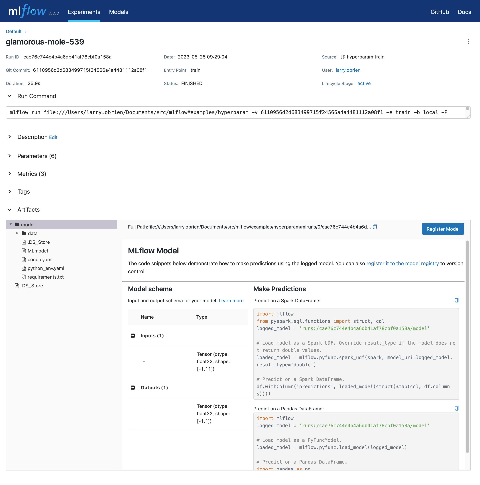
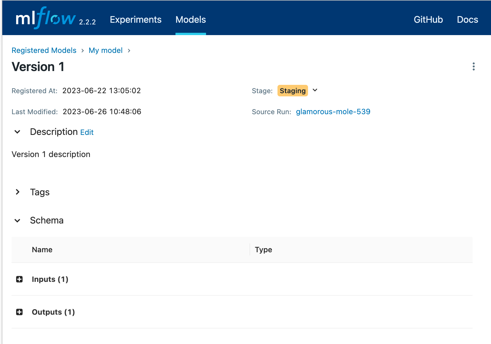

.. _tutorial-model-registry:

Track models and deployments wwith the MLflow Model Registry
============================================================

The **Models** tab of the Tracking UI displays models in the MLflow **Model Registry**. A registered model is one that you have selected as worthy of tracking as a versioned entity, generally because it is a candidate for deployment. The main page lists registered models and their versions registered most recently, marked for staging, and marked for production. 

You can search for models by name or tag using the search box. 

When you select a model, you open the details page. The details page allows you to edit a description of the model, add tags, and select specific versions.

When you select a specific model version, you will see a page with an editable description of the version carried over from the run that generated the model. You can also add and edit tags to the version. If the developer specified a schema for the model, this is also displayed.

You can use the **Stage** dropdown to transition a specific version of a model through the deployment lifecycle. The stages are:

* **None**: The model version is not ready for final validation. This is the default stage.
* **Staging**: Typically, this stage is used for final validation of a version whose production deployment is imminent.
* **Production**: The version that is deployed to production.
* **Archived**: The version is no longer in use.

