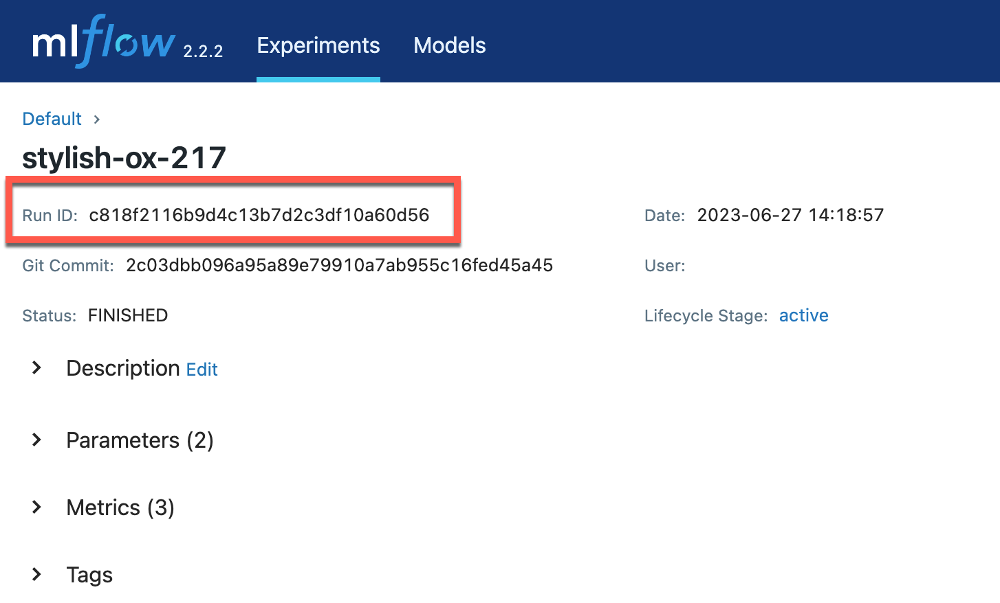

.. _tutorial-model-registry:

Track Models with the MLflow Model Registry
===========================================================

As an MLOps professional, you are responsible for the complex transaction of moving models into and out of production. Further, you will likely be the first person asked to provide information about a model's performance, lineage, and other metadata. The MLflow Model Registry is a centralized model store, set of APIs, and UI, to collaboratively manage the lifecycle of MLflow Models. 

.. important:: 

    This document assumes that:
    
    - You've installed MLflow in a Python environment and activated that environment. See :ref:`quickstart_installation` for more information.
    - You have an MLflow Tracking Server running and have logged at least one model on that server. The fastest way to do so is to complete the :ref:`quickstart`.

Register a model with the Model Registry
----------------------------------------

You can register a model with the Model Registry using the MLflow UI, the MLflow API, or the MLflow CLI. If you've completed the :ref:`quickstart` or :ref:`tutorial-tracking-ui`, you already have some experience with the MLflow UI and have even registered a model in the Model Registry.

Get your experiment's ``Run ID``
~~~~~~~~~~~~~~~~~~~~~~~~~~~~~~~~~~~~~~~~~~~~~~

The MLflow Model Registry works with the MLflow Tracking component. As a result, the Model Registry uses the same experiment ``Run ID`` to identify a model. Using the skills you learned in :ref:`tutorial-tracking-ui`, choose an experiment that you want to register and deploy. 

In the MLflow UI, the Run ID is prominently located in the upper left position of the run's details page:

You may also retrieve the Run ID using the MLflow API. For example, the following code snippet retrieves the Run ID for the run with the lowest ``val_rmse`` error:

.. code-block:: python

    import mlflow
    import os

    tracking_uri = os.environ.get("MLFLOW_TRACKING_URI") or "http://localhost:5000"
    mlflow.set_tracking_uri(tracking_uri)

    experiment_ids = [0] # 'Default' experiment
    order_pred = ["metrics.val_rmse asc"] # sort by lowest validation error
    runs_df = mlflow.search_runs(experiment_ids=experiment_ids, order_by=order_pred, max_results=10)
    run_id = runs_df.loc[0]["run_id"]
    print(f"Run run_id: {run_id} had lowest validation error: {runs_df.loc[0]['metrics.val_rmse']}")

Register the run's model in the Model Registry
~~~~~~~~~~~~~~~~~~~~~~~~~~~~~~~~~~~~~~~~~~~~~~

Once you have the Run ID, you can register the model in the Model Registry. 

In the MLflow UI, you can register a model by clicking the ``Register Model`` button in the upper right corner of the run's page. This is marked with the red **2** in the previous screenshot.

You may also register a model with the MLflow API's ``mlflow.register_model`` function. You must set the ``model_uri`` and ``name`` parameters. The ``model_uri`` parameter must be set to the **directory** of your experiment's model artifact. The ``name`` argument will be the name used in the Model Registry. You may also pass a dictionary of tags with the ``tags`` parameter. The function returns an object of type :py:class:`mlflow.entities.model_registry.ModelVersion` that contains the registered model's metadata. For example:

.. code-block:: python

    # ... `run_id` and `model_uri` as above
    model_uri = f"runs:/{run_id}/model"
    name = "Wine Quality"
    tags = {"run_id": run_id, "sem_ver": "0.1.0"}
    registered_model = mlflow.register_model(model_uri=model_uri, name=name, tags=tags)
    print(f"Name: {registered_model.name}, Version: {registered_model.version}")

Model lifecycle
----------------------------------

The MLflow Registry has a simple model lifecycle. A particular version of the model may be in one of the following states:

- ``None``: This version of the model has been registered with the Model Registry but hasn't been staged for deployment. If broad testing fails at this stage, the model should be archived.
- ``Staging``: The model version has been staged for deployment. This is typically a short-lived stage, as the version is quickly deployed or rejected.
- ``Production`` : The version deployed for use. 
- ``Archived``: This version of the model is no longer deployed. It is available for record-keeping, auditing, post-mortem analysis, and so forth.

.. image :: _static/images/tutorial-model-registry/registry-lifecycle.png
   :alt: Model lifecycle

It is possible to transition from any state to any other state (e.g., ``None`` directly to ``Production``) but the above diagram shows the intended flow: models are registered and then staged and then deployed. If a model is not moving towards deployment, it should be archived.

Model versions
~~~~~~~~~~~~~~~~~~~~~~~~~~

When you register a model with a given ``name``, the registry assigns a new version number to that model. This is an integer that increments by one when a model is registered. Just as with the lifecycle model, this is intentionally simple. Your organizational MLOps lifecycle, versioning scheme, approval process, and so forth will almost certainly be more complex.

**Tags** are a dictionary of key-value pairs that you can associate with a model version. Among other uses, you can use these to associate a specific run or model with aspects of your more complex lifecycle. In the sample above, for instance, the ``sem_ver`` tag is used to associate a semantic version with the model version. Determining the proper value for such a tag is up to you and your organization.

Transitioning between lifecycle states
~~~~~~~~~~~~~~~~~~~~~~~~~~~~~~~~~~~~~~~~~~~~~~

You can transition a model version from one state to another using the MLflow UI or the MLflow API. In the UI, click a model version to open the details page associated with the version. Select the **Stage** dropdown and choose the to-be-entered state. 

In the confirmation dialog, you'll see a checkbox that is selected. You generally only want to have one version at a time in the ``Staging`` or ``Production`` states. If you check this box, the registry will automatically transition any other versions in the to-be-entered state to the ``Archived`` state. This is the recommended behavior.

You may also transition a model version from one registry state to another using the MLflow API. The following code snippet transitions the model version with the given ``name`` and ``version`` to the ``Staging`` state:

.. code-block:: python

    from mlflow import MlflowClient 

    client = MlflowClient()
    client.transition_model_version_stage(
        name="Wine Quality", version=1, stage="Staging"
    )

This example uses the ``MlflowClient`` class, which performs REST calls to the MLflow server components. In general, functions in the ``mlflow`` module are higher level and more efficient. In this case, the function ``transition_model_version_stage`` is not yet available in the ``mlflow`` module, so the ``MLflowClient`` class is used.

Next step: Deployment
----------------------------------

Moving a model version to the ``Production`` state does not actually _do_ the deployment of the model. For that, see the "Deploy Models" section of the tk need a good reference here tk

