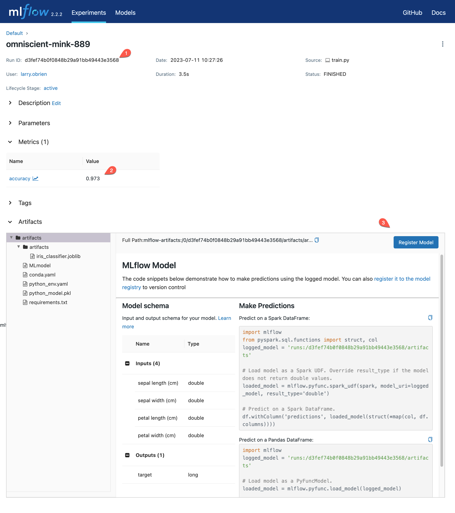

.. _tutorial_pyfunc:

Store and Load Custom Models Using `mlflow.pyfunc`
==================================================

When you save your Python project in MLflow with ``log_model``, the particularl "flavor" of MLflow you're using will store the model in the appropriate format. For instance, ``mlflow.keras.log_model`` will save your Keras model as an HDF5 file.

The most general and flexible flavor of the MLflow Model format is the **"pyfunc"** format. This "Python Function" format allows you to wrap a customized Python function for inferencing. Using pyfunc also allows you full customization of your model initialization, data preparation, inferencing, reporting, and so forth, all of which may be attractive even if you are using a more specific flavor of MLflow.

This tutorial will show how to save and load models in the pyfunc format. It will also show how to serve an MLflow model as a REST endpoint and how to deploy a model in a Docker container.

.. _setup:

Setup
-----

This tutorial assumes that you have installed and used the MLflow library for tracking and managing machine learning experiments. At the very least, you should have run an example that used ``log_model`` to save a model in the MLflow Model format. The :ref:`quickstart-mlops` is a good place to start. 

The final section of this tutorial will show how to deploy a model in a Docker container. To run the Docker commands, you will need to have Docker installed. If you do not have Docker installed, you can skip the final section of this tutorial.

- If you are not already running an MLflow Tracking Server, start one by running ``mlflow server`` in a terminal. This will start an MLflow Tracking Server on port 5000. (For customization, see :ref:`tutorial-tracking`.)

- Set the ``MLFLOW_TRACKING_URI`` environment variable to the URI of the server. 

.. important:: 
    You **must** set the ``MLFLOW_TRACKING_URI`` environment variable to the URI of the server. If MLflow sees that the tracking URI is not an HTTP or HTTPS URI, it will not allow you to save or load models.

Train a Model
-------------

For this tutorial, we will train a logistic regression model using scikit-learn. The task is to classify the species of an iris flower given the flower's measurements. 

Create a file called **train.py** and add the following code:

.. code-block:: python

    from mlflow.models import ModelSignature
    from sklearn.datasets import load_iris
    from sklearn.linear_model import LogisticRegression
    from sklearn.metrics import accuracy_score

    import pandas as pd
    import joblib as jl
    import numpy as np

    import mlflow

    from custom_code import iris_classes

    def build_and_train_model(X : pd.DataFrame, y : pd.Series) -> LogisticRegression:
        classifier = LogisticRegression(C=1.0, random_state=42).fit(X, y)
        return classifier

    def predict_and_track(classifier : LogisticRegression, X : pd.DataFrame, y : pd.Series) -> float:
        predictions = classifier.predict(X)
        score = accuracy_score(y, predictions)
        return score

    def initialize_and_train() -> (LogisticRegression, ModelSignature):
        X, y = load_iris(return_X_y=True, as_frame=True)
        classifier = build_and_train_model(X, y)
        score = predict_and_track(classifier, X, y)
        mlflow.log_metric("accuracy", score)
        signature = mlflow.models.infer_signature(X, y)
        return classifier, signature

        # Entry point
        if __name__ == "__main__":
            with mlflow.start_run() as run:
                classifier, signature = initialize_and_train()

Once you've created the file, run it with:

.. code-block:: bash

    python train.py

.. note:: You may receive a warning that the solver failed to converge. However, if you check the accuracy of ``predictions`` vs ``y``, you will see that the model is highly accurate.

The code:

1. Imports necessary modules from ``sklearn`` and ``mlflow``. 
2. Starts an MLflow run (``with mlflow.start_run() as run``)
3. Within ``initialize_and_train()``: loads the iris dataset 
4. Specifies and fits a ``LogisticRegression`` model (``build_and_train_model``)
5. Calculates the accuracy of the model and logs it to MLflow (``predict_and_track``)
6. Infers the signature of the model using :py:func:`mlflow.models.infer_signature` function and the input data and labels
7. Returns the model and the signature of the model

What it doesn't do is log the model! Because there is an sklearn flavor for MLflow, we could do so by adding a single line of code to main:

.. code-block:: python

    mlflow.sklearn.log_model(classifier, "model", signature=signature)

However, for the purposes of this tutorial, we'll create a custom model and log it using ``mlflow.pyfunc.log_model``. 

Create a Custom ``pyfunc`` Model
--------------------------------

To create a custom ``pyfunc`` model, you need to create a class that inherits from ``mlflow.pyfunc.PythonModel``. This class must implement two methods: ``load_context`` and ``predict``. The ``load_context`` method is called when the model is loaded. It takes a single argument, ``context`` and prepares the model for inferencing. The ``predict`` method is called when the model is used for inference. It takes two arguments: ``context`` and ``model_input``. The ``model_input`` argument is the input data for the model. The ``predict`` method returns the model's predictions.

Add the following code to **train.py**. Note that you must *add* the line ``run_id = store_pyfunc_model(classifier, signature)`` to the entry point.

.. code-block:: python

    class IrisClassifier(mlflow.pyfunc.PythonModel):
        def load_context(self, context : mlflow.pyfunc.PythonModelContext) -> None:
            self.classifier = jl.load(context.artifacts["classifier"])

        def predict(self, context : mlflow.pyfunc.PythonModelContext, model_input : pd.DataFrame) -> np.ndarray[int]:
            preds = self.classifier.predict(model_input)
            return iris_classes(preds)

    def store_pyfunc_model(classifier : LogisticRegression, signature : ModelSignature) -> str:
        # MLflow Tracking URI *must* be http or https for log_model
        assert(mlflow.get_tracking_uri().startswith("http"))

        classifier_filename = "iris_classifier.joblib"
        jl.dump(classifier, classifier_filename)
        artifacts = {
            "classifier": classifier_filename
        }

        model_info = mlflow.pyfunc.log_model(
            python_model=IrisClassifier(),
            artifacts=artifacts,
            artifact_path="artifacts",
            signature=signature,
            code_path= ["custom_code.py"]
        )
        print(f"Stored in mlruns/{model_info.run_id}")
        return model_info.run_id

    if __name__ == "__main__":
        with mlflow.start_run() as run:
            classifier, signature = initialize_and_train()
            run_id = store_pyfunc_model(classifier, signature)

Starting at the entry point, you can see that the code does not change the creation of ``classifier`` and ``signature``. These values are passed to ``store_pyfunc_model``. 

The first thing that ``store_pyfunc_model`` does is confirm that the MLflow Tracking Server is running on a URI that starts with ``http`` or ``https``, as discussed in :ref:`setup`.

The code then uses the ``joblib`` library to serialize the model to disk. Using serialization/deserialization to save and load the model and related files can make for clear and efficient code, but it is not required. You can store any type of file in the ``artifacts`` directory: JSON files, binary weight files, vector database files, and so forth. 

The ``artifacts`` dictionary is then created. Its ``classifier`` key is set to the name of the file containing the serialized model: ``"iris_classifier.joblib"``.

An instance of the ``IrisClassifier`` class is then instantiated. This class derives from :py:class:`mlflow.pyfunc.PythonModel`. As discussed at the beginning of this section, this class implements the ``load_context`` and ``predict`` methods. The ``IrisClassifier`` implementation of those methods will be discussed in the next section. 

After the ``IrisClassifier`` instance is created, the ``mlflow.pyfunc.log_model`` method is called. This method takes the following arguments:

- ``python_model``: The instance of the ``IrisClassifier`` class we just created.
- ``artifacts``: The dictionary containing the ``"classifier"`` key and the ``"iris_classifier.joblib"`` value.
- ``artifact_path``: The path to the artifacts directory within the root directory of the run within the artifacts repository of the MLflow Tracking Server.
- ``signature``: The signature of the model, as inferred in the ``initialize_and_train`` function.

For more optional arguments, see :py:func:`mlflow.pyfunc.log_model`'s API documentation.

The ``mlflow.pyfunc.log_model`` method returns a ``ModelInfo`` object. This object contains the ``run_id`` of the run that logged the model. This ``run_id`` is returned by the ``store_pyfunc_model`` function and is used in the next section.

Review and register the stored ``pyfunc`` model in the MLflow UI
----------------------------------------------------------------

Open a Web browser and go to the address at which you are running the MLflow Tracking Server (for instance, ``http://localhost:5000``). You should see your just-logged run. Click on the run to see the run's details. You should see something like:

Here, you can see the Run ID (1), the accuracy of the trained model (2), and the artifacts resulting from your call to ``log_model``. In addition to the **iris_classifier.joblib** you specified, there are all the files necessary to recreate the runtime environment (**conda.yaml**, **requirements.txt**, etc.) and the infrastructure for loading your custom model (**MLmodel** and **python_model.pkl**).

Load and run a stored model
------------------------------------------

To load and run the stored model, create a new Python file named ``infer.py``. Add the following code to the file:

.. code-block:: python

    import mlflow
    import pandas as pd
    import argparse

    def load_and_use(run_id : str) -> None:
        # MLflow Tracking URI *must* be http or https for load_model
        assert (mlflow.get_tracking_uri().startswith("http"))

        logged_model = f'runs:/{run_id}/artifacts'
        loaded_model = mlflow.pyfunc.load_model(logged_model)

        # Predict on a Pandas DataFrame.
        model_input = pd.DataFrame({'sepal length (cm)': [5.1, 5.9, 6.9],
                                'sepal width (cm)': [3.3, 3.0, 3.1],
                                'petal length (cm)': [1.7, 4.2, 5.4],
                                'petal width (cm)': [0.5, 1.5, 2.1]})
        preds = loaded_model.predict(model_input)
        print(f"Iris classifications: {preds}")

    if __name__ == "__main__":
        parser = argparse.ArgumentParser(description='Load an Iris Classifier Model and run it against a sample query')
        parser.add_argument('--runid', type=str, help='The MLflow runid (GUID) containing the logged model to be run')
        args = parser.parse_args()
        load_and_use(args.runid)

Run the program with the following command, replacing ``<RUNID>`` with the value of the Run ID from the previous section:

.. code-block:: bash

    python infer.py --runid <RUNID>

The output should be similar to the following:

.. code-block:: bash

    Iris classifications: [0 1 2]

The ``load_and_use`` function takes a ``run_id`` as an argument. The first thing it does is confirm that the MLflow Tracking Server is running on a URI that starts with ``http`` or ``https``, as discussed previously. Then, it constructs an MLflow ``runs`` URI that maps to the run that logged the model. This URI is passed to the ``mlflow.pyfunc.load_model`` method, which returns an instance of the ``IrisClassifier`` class. 

The ``IrisClassifer`` class was defined in the previous section. It extends the :py:class:`mlflow.pyfunc.PythonModel` class. It defines the two necessary functions:

The customized ``load_context`` implementation
~~~~~~~~~~~~~~~~~~~~~~~~~~~~~~~~~~~~~~~~~~~~~~

The ``load_context`` method is called when the model is loaded. It takes a single argument, ``context``, which is an instance of the :py:class:`mlflow.pyfunc.PythonModelContext` class. The most commonly used attribute of this class is ``artifacts``, which is a dictionary recreating the one passed to the ``mlflow.pyfunc.log_model`` method. 

In this case, the ``artifacts`` dictionary contains a single key, ``"classifier"``, which has the value of ``"iris_classifier.joblib"``. The ``load_context`` method uses the ``joblib`` library to load the model from the file: ``self.classifier = jl.load(context.artifacts["classifier"])``. The classifier is then stored in the ``self.classifier`` attribute of the ``IrisClassifier`` instance.

The customized ``predict`` implementation
~~~~~~~~~~~~~~~~~~~~~~~~~~~~~~~~~~~~~~~~~

The other method necessary in a customized ``PythonModel`` is ``predict()``. This function takes two arguments:

- ``context`` : The same ``PythonModelContext`` instance that was passed to ``load_context``.
- ``model_input`` : A pyfunc-compatible input to the model. In this case, it is a Pandas DataFrame.

In this case, the ``model_input`` is not validated or transformed, but is immediately passed to the ``predict`` method of the ``IrisClassifier`` model assigned to ``self.classifier`` in the ``load_context`` method. The results are then returned.

.. note:: 
    Notice that while the custom model's ``predict`` method takes both a ``context`` and a ``model_input`` parameter, the call to ``predict`` in **infer.py** only passes the ``model_input`` argument. The ``context`` parameter is set automatically by the base ``PythonModel`` implementation. 

Querying the customized model
~~~~~~~~~~~~~~~~~~~~~~~~~~~~~

Returning to **infer.py**, after the model is loaded, the ``load_and_use`` function creates a Pandas DataFrame containing three rows of data. The ``predict`` method of the loaded model is then called with the DataFrame as an argument. The results are printed to the console.

Use the CLI to run and query the customized model
~~~~~~~~~~~~~~~~~~~~~~~~~~~~~~~~~~~~~~~~~~~~~~~~~

Rather than the Python code in **infer.py**, you can instead use the MLflow CLI to run the customized model. Run the following command, replacing ``<RUNID>`` with the appropriate value:

.. code-block:: bash

    mlflow models serve -m runs:/<RUNID>/artifacts --port 5002

Note the use of the ``--port`` argument to avoid the model serving conflicting with the MLflow Tracking Server (likely running on port 5000). 

To query the model from the CLI, run the following command:

.. code-block:: bash

    curl -d '{"dataframe_split": { "columns": ["sepal length (cm)", "sepal width (cm)", "petal length (cm)", "petal width (cm)"], "data": [[5.1, 3.3, 1.7, 0.5], [5.9, 3.0, 4.2, 1.5], [6.9, 3.1, 5.4, 2.1]]}}' -H 'Content-Type: application/json' -X POST localhost:5002/invocations

The ``curl`` command POSTs a JSON payload to the model serving endpoint ``invocations/``. The payload contains a dictionary with a single key, ``"dataframe_split"``, which has a value of another dictionary. The inner dictionary contains two keys, ``"columns"`` and ``"data"``. Note that each inner array in ``data`` contains four values, corresponding to the four columns in ``columns``. This is a little different than the dictionary used in **infer.py**, where a dictionary used the four column names for the keys and each value was an array of length three.

Endpoints provided by the MLflow REST API
~~~~~~~~~~~~~~~~~~~~~~~~~~~~~~~~~~~~~~~~~

In addition to the ``/invocations`` endpoint, the MLflow REST API provides a number of other endpoints:

- ``/ping`` used for health check
- ``/health`` (same as /ping)
- ``/version`` used for getting the mlflow version

Using other code-files during inferencing
-----------------------------------------

So far, we haven't used custom code beyond the **train.py** file. Generally, your real-world system will have a number of dependencies on your own code files. The ``log_model`` function's ``code_path`` parameter can be used to store these files and make them available for loading in the Python environment.

Create a new file, **custom_code.py**, with the following contents:

.. code-block:: python

    from typing import Iterable

    flower_classes = ["setosa", "versicolor", "virginica"]

    def iris_classes(preds : Iterable[int]) -> list[str]:
        return [flower_classes[pred] for pred in preds]

Obviously, this is a trivial dependency, but it illustrates the point. The ``iris_classes`` function takes a single argument, ``preds``, which is an array of predictions. It returns the strings corresponding to the predictions.

Modify the **train.py** file to import the ``iris_classes`` function and use it in the ``log_model`` call. At the top of the file, add the following line:

.. code-block:: python

    from custom_code import iris_classes

In ``IrisClassifier``, modify the ``predict`` method. Replace the line ``return preds`` with:

.. code-block:: python

    return iris_classes(preds)

Finally, modify the ``log_model`` call to include the ``code_path`` parameter:

.. code-block:: python

    model_info = mlflow.pyfunc.log_model(
        python_model=IrisClassifier(),
        artifacts=artifacts,
        artifact_path="artifacts",
        signature=signature,
        code_path= ["custom_code.py"]
    )

The ``code_path`` parameter takes a list of files or directories. In this case, we only have a single file, but you can include as many as necessary. 

Run the training script again. Now, instead of the output being integers, it will be the strings corresponding to the flower classes (``['setosa', 'versicolor', 'virginica']``). 

Make note of the run id and open it in the MLflow UI. You'll see that the **artifacts** directory contains a subdirectory called **code** that holds the **custom_code.py** file. Any files or directories specified in the ``code_path`` parameter can be loaded at runtime by your custom model without additional work.

Optional: Deploy the model using Docker
--------------------------------------- 

Many cloud vendors such as Azure or AWS use Docker containers for serving models. MLflow can build a Docker image containing the model and a web server that can be deployed to a cloud vendor. Details vary between vendors, but they may want a Dockerfile that specifies how the docker image should be built or they may want a pre-built image.

To generate the Dockerfile without building an image, run the following command, replacing ``<RUNID>`` with the appropriate value:

.. code-block:: bash

    mlflow models generate-dockerfile -m runs:/<RUNID>/artifacts --env-manager conda --name iris

The ``--env-manager`` argument specifies the environment manager to use. In this case, it is ``conda``, but you can also specify ``virtualenv`` or ``local``.

Most of the time, you will want to build the image. If you have Docker installed and the Docker daemon running, you may either build the image from the Dockerfile or directly from MLflow with:

.. code-block:: bash

    mlflow models build-docker -m runs:/<RUNID>/artifacts --env-manager conda --name iris

This command builds the Docker image and gives it with the name ``iris``. This command will typically take several minutes to run. Once it is complete, you can run the image with:

.. code-block:: bash

    docker run -p 5002:8080 iris

.. important:: 
    The ``-p`` argument maps port 8080 in the Docker container to port 5002 on the host. This is necessary because the Docker container is running on a virtual machine and not on the host itself. The Docker image output will contain a message similar to the following:

    .. code-block:: bash

        [INFO] Listening at: http://127.0.0.1:8000 (25)

    Don't be misled by this! The MLflow Web Service is listening not at port 8000 but at port 8080. **That** is the port that must be mapped to the host.

Because you mapped the Docker container's port 8080 to the host's port 5002, you can query the model with the same ``curl`` command as before:

.. code-block:: bash

    curl -d '{"dataframe_split": { "columns": ["sepal length (cm)", "sepal width (cm)", "petal length (cm)", "petal width (cm)"], "data": [[5.1, 3.3, 1.7, 0.5], [5.9, 3.0, 4.2, 1.5], [6.9, 3.1, 5.4, 2.1]]}}' -H 'Content-Type: application/json' -X POST localhost:5002/invocations