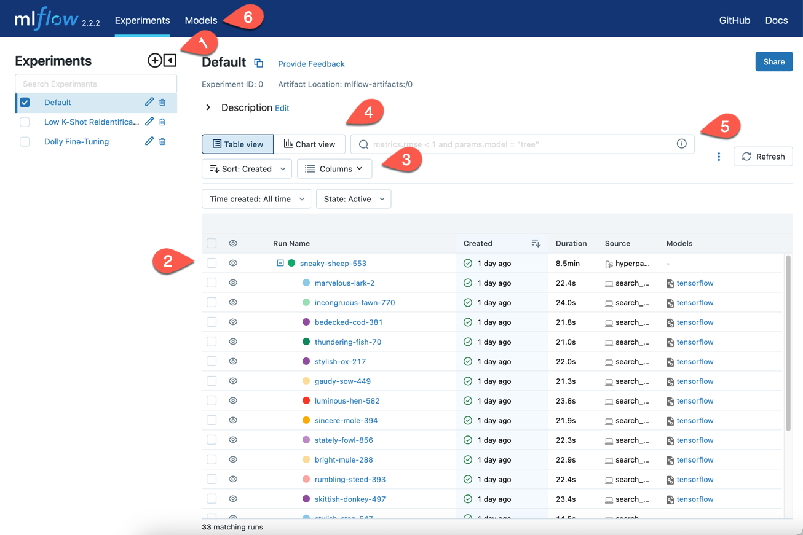
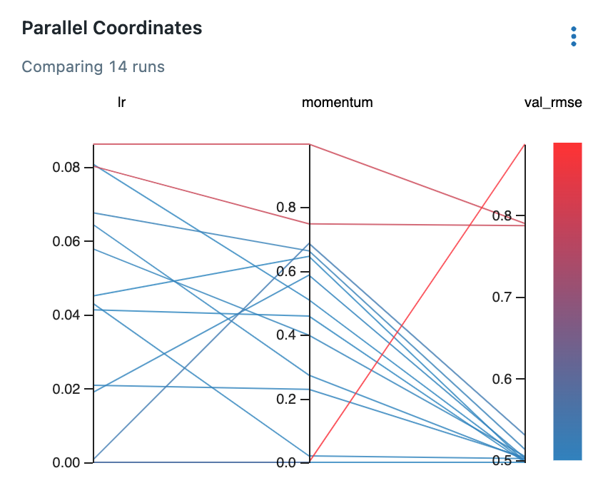
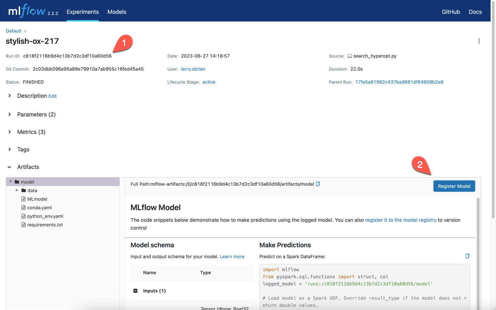

.. _tutorial-tracking-ui:

Compare and choose with the MLflow Tracking UI
==============================================

As a data scientist or MLOps professional, you need to be able to quickly filter and review a large number of runs to find the best model for your use case. The MLflow Tracking UI is a web application that visualizes the results of experiments and runs for which you used the MLflow Tracking API.

.. important:: 

   You should complete the :ref:`quickstart`, or even better, the :ref:`tutorial-tracking` before starting this how-to. This document assumes that you have several runs for which you've used the MLflow Tracking API to log parameters, metrics, and artifacts.

Running the Tracking UI
-----------------------

If you have an instance of the MLflow Tracking Server running, you can access the Tracking UI by browsing to its location (for instance, ``http://localhost:5000``).

You can also run the Tracking UI from the command-line with the ``mlflow ui`` command. It accepts many of the same arguments as the Tracking Server (``--port``, ``--host``, ``--backend-store-uri``, etc.). By default, ``mlflow ui`` will look for the ``MLFLOW_TRACKING_URI`` environment variable and use that as the backend store URI. If you do not set this environment variable and do not use the ``--backend-store-uri`` parameter, the Tracking UI will visualize the **mlruns/** subdirectory of the current working directory.

If you do not have an instance of the MLflow Tracking Server already running:

1. Navigate to the directory containing the ``mlruns/`` subdirectory you want to visualize. For instance, the Quickstarts and :ref:`tutorial-tracking` expect you to be in the **examples/hyperparam** subdirectory of the cloned MLflow repository.
2. Run ``mlflow ui``. Use the ``--port`` argument to change from listening on the default port of 5000. Use the same ``--backend-store-uri`` and ``--artifacts-destination`` {>> tk check <<} arguments you used when performing your experiments and using the Tracking API.
3. Open a browser and navigate to the URL on which you ran the Tracking UI server. For instance, if you used the default port, you would navigate to ``http://localhost:5000``.

The Tracking UI Main page
-------------------------

When you navigate to the Tracking UI, you will see a page similar to this:

Down the left-hand side of the browser, the UI lists the **Experiments** that are being tracked (1). Individual **Runs** are shown in the main body of the page (2). If you ran either the Quickstarts or the :ref:`tutorial-tracking`, you will see both the parent run, which was the full hyperparameter search, and the child runs, each with unigue parameters.

You can use the **Columns** dropdown (tk) to customize the columns displayed in the main results table. The search box (tk) allows you to rapidly filter the displayed runs. You can switch between a **Table view** and a **Chart view** summary of runs (tk). The **Models** tab (tk) displays the registered models that are tracked.

Customize the displayed columns
~~~~~~~~~~~~~~~~~~~~~~~~~~~~~~~~

The **hyperparam** example varied learning rate and momentum while trying to optimize Root Mean Square Error (RMSE) on the validation set. Select the **Columns** dropdown and put checkmarks on the following columns:

* Metrics | val_rmse
* Parameters | lr
* Parameters | momentum

Close the dropdown. You may have to horizontally scroll the runs table, but you can now see the chosen parameters and resulting metrics for each run. Usually, the best RMSE is slightly above ``0.49``. Note that the first run in the sweep has an ``lr`` of ``0``, so the model does not train beyond its random initialization; this usually results in an RMSE around ``0.89``.

You can sort on a column by clicking on the column-head. For instance, clicking on the ``val_rmse`` column-head is a quick way to find your best or worse run. Clicking again reverses the sort order.

Compare runs visually with the Chart view
~~~~~~~~~~~~~~~~~~~~~~~~~~~~~~~~~~~~~~~~~~

While you may have a good idea of the best run from the **Table view**, it is often useful to compare runs visually. Select the **Chart view** tab to switch to the chart view.

On this page, the main body is split between the table showing the runs in the experiment and a column which you can populate with various charts comparing runs. 

The **Parallel Coordinates** chart is particularly useful for insight into the results of varying parameters. If there is no **Parallel Coordinates** chart in the right-hand column, click the **Add chart** button to add one. Select **Configure chart**. In the **Params** list, select **lr** and **momentum**. In the **Metrics** list, select **val_rmse**. Click **Save changes**.

You'll see a figure similar to this:

The final column shows the root mean square error of the validation set, while the left-hand columns show the learning rate and momentum used in each of the runs. As you can see from the redder lines in the graph, when the learning rate is ``0`` (and therefore the model does not improve over its random initialization), the error is almost ``0.9``. With non-zero learning rates (``lr``), high ``momentum`` arguments lead to similar poor results. When the ``momentum`` is set to lower values, the results are better. 

As in the **Table view**, the search box allows you to filter the runs displayed. In the **Chart view** this is especially useful, as it allows you to quickly explore particular subsets of the runs without having to fire up a more heavyweight tool.

Filtering and searching in the MLflow Tracking UI
--------------------------------------------------

A machine lerning experiment inevitably generates a large number of runs. You are free to create as many experiments as desired, but often a single machine learning problem is best thought of as a single experiment. The deployed solution will be a matter of a long evolution of data and feature engineering, architecture selection, and parameters. Filtering the runs displayed quickly becomes important.

The runs in the **hyperparam** example diverge: the runs either generate metrics near ``0.9`` or near ``0.5``. You might want to explore only the better runs. In the search box, enter the following:

.. code-block:: sql

  metrics.val_rmse < 0.55

Select the **Refresh** button. Hover your mouse over various lines to see a popup showing run details. Select the run with the lowest RMSE. Click the run name in the popup box. This will open the run's detail page.

Search with SQL WHERE subset
~~~~~~~~~~~~~~~~~~~~~~~~~~~~~~~~~~~~~~~~~~~~~~

A search filter is one or more expressions joined by the ``AND`` keyword. The search syntax does not support ``OR``. Each expression has three parts: an identifier of the target entity (for instance, ``metrics.accuracy``), a comparator (for instance, ``>=`` for numeric values, ``LIKE`` for strings), and a constant. For example:

.. code-block:: sql

  metrics.accuracy >= 0.9 AND params.model_name LIKE 'RESNET%'

The target entities are:

* ``metrics``: A metric logged with ``mlflow.log_metric``.
* ``params``: A parameter logged with ``mlflow.log_param``.
* ``tags``: A tag logged with ``mlflow.set_tag``.
* ``attribute.run_id``: The ID of the run.
* ``attribute.run_name``, ``run name``: The name of the run.
* ``attribute.status``: The status of the run (``FINISHED``, ``FAILED``, ``RUNNING``, ``SCHEDULED``, ``KILLED``).
* ``attribute.artifact_uri``: The URI of the artifact store.
* ``attribute.user_id`` : The ID of the user who started the run.
* ``attribute.start_time``, ``attribute.end_time`` : The start or end time of the run. Units are seconds elapsed in the Unix epoch (January 1, 1970). For example, ``start_time >= 1688169600`` filters runs created before 2023-07-01.

For more, see :ref:`search-runs`.

Run visibility
~~~~~~~~~~~~~~~

If, instead of defining a complete filter, you want to select among a handful of runs, you can toggle the visibility of runs in the filtered list. You do so with the column marked with an eye icon. Selecting the eye icon at the top of the column will allow you to toggle the visibility of all runs in the filtered list. Selecting the eye icon for an individual run will toggle the visibility of that run.

Deleting runs
~~~~~~~~~~~~~~

You will have some runs that do not generate worthwhile results. Sometimes these will stem from code errors or other problems, but there are any number of reasons you may not want to keep a run.

To delete a run, select it in the list of runs and select "Delete." You will be prompted to confirm the deletion. {>> This action cannot be undone. tk Confused by this. The "State" dropdown has a "Deleted" option. <<}

You may also delete a run using the CLI command ``mlflow run delete --run-id <run_id>`` or the Python API ``mlflow.delete_run(run_id : str)->None``.

Run details page
-----------------------

Whenever you select a run in the **Table view** or **Chart view**, the run's **Detail page** opens. For a run from the **hyperparam** example, the page will look similar to this:

In particular, note the **Run ID** (1), which is the primary key for the run. The run's name(for instance, ``stylish-ox-217``) is not guaranteed to be unique and cannot be used to identify a run in a program or at the command-line.

The details page contains a large amount of information about the run, including the run's start time, duration, and status, the source code entry point, the Git commit hash of the code at the time of the run, and the run's parameters, metrics, and tags. The **Artifacts** section shows the artifacts logged by the run.

Register a model for possible deployment
----------------------------------------

From the details page of your most successful experiment, select the **Register Model** button (2). This will open a dialog box that allows you to register the current model with the MLflow Model Registry. Select **Create New Model**. Enter a name for the model, such as ``Wine Quality`` (which is what the **Hyperparam** example uses). Select **Register**. 

Note that the **Register Model** button has been replaced by a link to a registered version of the model.

Now that you have registered a model, select the **Models** tab on the top of the MLflow Tracking UI page. You will see a list of registered models, including the one you just registered. Select the model name to see the model's detail page.
