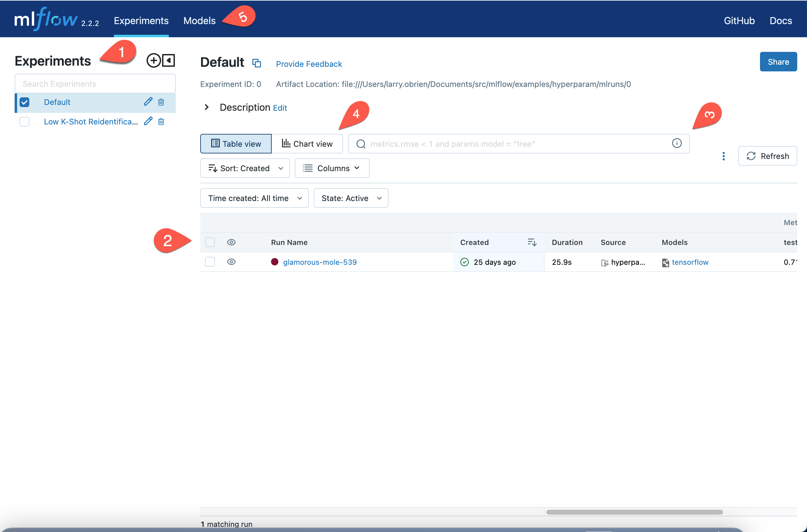

.. _tutorial-tracking-ui:

Compare and choose with the MLflow Tracking UI
==============================================

As a data scientist or MLOps professional, you need to be able to quickly filter and review a large number of runs to find the best model for your use case. The MLflow Tracking UI is a web application that visualizes the results of experiments and runs for which you used the MLflow Tracking API.

.. important:: 

   You should complete the :ref:`quickstart`, or even better, the :ref:`tutorial-tracking` before starting this how-to. This document assumes that you have several runs for which you've used the MLflow Tracking API to log parameters, metrics, and artifacts.

Running the Tracking UI
-----------------------

If you have an instance of the MLflow Tracking Server running, you can access the Tracking UI by browsing to its location (for instance, ``http://localhost:5000``).

You can also run the Tracking UI from the command-line with the ``mlflow ui`` command. It accepts many of the same arguments as the Tracking Server (``--port``, ``--host``, ``--backend-store-uri``, etc.). By default, ``mlflow ui`` will look for the ``MLFLOW_TRACKING_URI`` environment variable and use that as the backend store URI. If you do not set this environment variable and do not use the ``--backend-store-uri`` parameter, the Tracking UI will visualize the **mlruns/** subdirectory of the current working directory.

If you do not have an instance of the MLflow Tracking Server already running:

1. Navigate to the directory containing the ``mlruns/`` subdirectory you want to visualize. For instance, the Quickstarts and :ref:`tutorial-tracking` expect you to be in the **examples/hyperparam** subdirectory of the cloned MLflow repository.
2. Run ``mlflow ui``. Use the ``--port`` argument to change from listening on the default port of 5000. Use the same ``--backend-store-uri`` and ``--artifacts-destination`` {>> tk check <<} arguments you used when performing your experiments and using the Tracking API.
3. Open a browser and navigate to the URL on which you ran the Tracking UI server. For instance, if you used the default port, you would navigate to ``http://localhost:5000``.

The Tracking UI Main page
-------------------------

When you navigate to the Tracking UI, you will see a page similar to this:

Down the left-hand side of the browser, the UI lists the **Experiments** that are being tracked (1). Individual **Runs** are shown in the main body of the page (2). The search box allows you to rapidly filter the displayed runs (3). You can switch between a **Table view** and a **Chart view** summary of runs (4). The **Models** tab displays the registered models that are tracked (5).

The **Chart view** allows you to compare runs with visualizations of parameters used and metrics generated. The **Parallel Coordinates** chart is particularly useful for insight into the results of varying parameters. You may set the parameters and metrics visualized by selecting the vertical ellipsis and choosing the desired values from the drop-down menus.

For instance, in the following image, the final column shows the root mean square error of the validation set, while the left-hand columns show the learning rate and momentum used in the 14 runs. As you can see from the redder lines in the graph, when the learning rate is 0 (and therefore the model does not improve over its random initialization), the error is almost 0.9. With non-zero learning rates (``lr``), high ``momentum`` arguments lead to similar poor results. When the ``momentum`` is set to lower values, the results are better. 

.. image:: _static/images/ui-tutorial/parallel-coordinates.png
   :width: 100%

As in the **Table view**, the search box allows you to filter the runs displayed. In the **Chart view** this is especially useful, as it allows you to quickly explore particular subsets of the runs without having to fire up a more heavyweight tool.

Filtering and searching in the MLflow Tracking UI
--------------------------------------------------

A machine lerning experiment inevitably generates a large number of runs. You are free to create as many experiments as desired, but often a single machine learning problem is best thought of as a single experiment. The deployed solution will be a matter of a long evolution of data and feature engineering, architecture selection, and parameters. Filtering the runs displayed quickly becomes important.

Search with SQL WHERE subset
~~~~~~~~~~~~~~~~~~~~~~~~~~~~~~~~~~~~~~~~~~~~~~

A search filter is one or more expressions joined by the AND keyword. The search syntax does not support OR. Each expression has three parts: an identifier of the target entity (for instance, ``metrics.accuracy``), a comparator (for instance, ``>=`` for numeric values, ``LIKE`` for strings), and a constant. For example:

.. code-block:: sql

  metrics.accuracy >= 0.9 AND params.model_name LIKE 'RESNET%'

The target entities are:

* ``metrics``: A metric logged with ``mlflow.log_metric``.
* ``params``: A parameter logged with ``mlflow.log_param``.
* ``tags``: A tag logged with ``mlflow.set_tag``.
* ``attribute.run_id``: The ID of the run.
* ``attribute.run_name``, ``run name``: The name of the run.
* ``attribute.status``: The status of the run (``FINISHED``, ``FAILED``, ``RUNNING``, ``SCHEDULED``, ``KILLED``).
* ``attribute.artifact_uri``: The URI of the artifact store.
* ``attribute.user_id`` : The ID of the user who started the run.
* ``attribute.start_time``, ``attribute.end_time`` : The start or end time of the run. Units are seconds elapsed in the Unix epoch (January 1, 1970). For example, ``start_time >= 1688169600`` filters runs created before 2023-07-01.

For more, see :ref:`search-runs`.

Run visibility
~~~~~~~~~~~~~~~

If, instead of defining a complete filter, you want to select among a handful of runs, you can toggle the visibility of runs in the filtered list. You do so with the column marked with an eye icon. Selecting the eye icon at the top of the column will allow you to toggle the visibility of all runs in the filtered list. Selecting the eye icon for an individual run will toggle the visibility of that run.

Deleting runs
~~~~~~~~~~~~~~

You will have some runs that do not generate worthwhile results. Sometimes these will stem from code errors or other problems, but there are any number of reasons you may not want to keep a run.

To delete a run, select it in the list of runs and select "Delete." You will be prompted to confirm the deletion. {>> This action cannot be undone. tk Confused by this. The "State" dropdown has a "Deleted" option. <<}

You may also delete a run using the CLI command ``mlflow run delete --run-id <run_id>`` or the Python API ``mlflow.delete_run(run_id : str)->None``.

Sorting and selecting columns
~~~~~~~~~~~~~~~~~~~~~~~~~~~~~

Both the **Table view** and **Chart view** allow you to sort the displayed filtered list of runs by any column. Select the **Sort** dropdown and choose the desired column and sort direction. In the **Table view** you may also use the **Columns** dropdown to select which columns are displayed.

