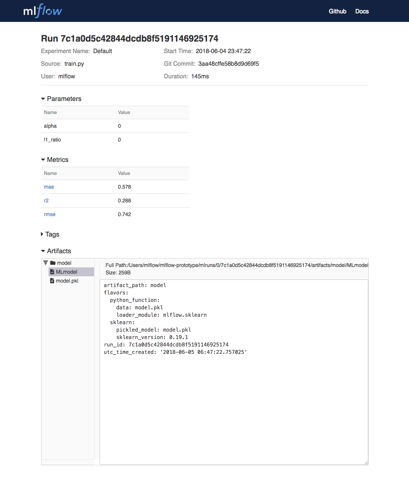

.. _tutorial:

Tutorial
========

What We're Building
-------------------

In this tutorial, we will showcase how a data scientist can use MLflow end to end to create a
linear regression model; how we can use MLflow to package the code
which trains this model in a reusable and reproducible model format; and finally how we can use
MLflow to create a simple HTTP server which will enable us to score predictions.

For this tutorial we will use a dataset where we attempt to predict the quality of wine based on
quantative features like the wine's "fixed acidity", "pH", "residual sugar", etc. The data-set
we are using for this tutorial is from UCI's `machine learning repository <http://archive.ics.uci.edu/ml/datasets/Wine+Quality>`_.
[Ref]_

What You'll Need
----------------
For this tutorial, we'll be using MLflow, ``conda``, and the tutorial code located at
``example/tutorial`` in the MLflow repository. To download the tutorial code run::

    git clone https://github.com/databricks/mlflow

Training the Model
------------------
The first thing we'll do is train a linear regression model which takes two hyperparameters:
alpha and l1_ratio.

The code which we will use is located at ``example/tutorial/train.py`` and is reproduced
below.

.. code:: python

    # Read the wine-quality csv file (make sure you're running this from the root of MLflow!)
    wine_path = os.path.join(os.path.dirname(os.path.abspath(__file__)), "wine-quality.csv")
    data = pd.read_csv(wine_path)

    # Split the data into training and test sets. (0.75, 0.25) split.
    train, test = train_test_split(data)

    # The predicted column is "quality" which is a scalar from [3, 9]
    train_x = train.drop(["quality"], axis=1)
    test_x = test.drop(["quality"], axis=1)
    train_y = train[["quality"]]
    test_y = test[["quality"]]

    alpha = float(sys.argv[1]) if len(sys.argv) > 1 else 0.5
    l1_ratio = float(sys.argv[2]) if len(sys.argv) > 2 else 0.5

    with mlflow.start_run():
        lr = ElasticNet(alpha=alpha, l1_ratio=l1_ratio, random_state=42)
        lr.fit(train_x, train_y)

        predicted_qualities = lr.predict(test_x)

        (rmse, mae, r2) = eval_metrics(test_y, predicted_qualities)

        print("Elasticnet model (alpha=%f, l1_ratio=%f):" % (alpha, l1_ratio))
        print("  RMSE: %s" % rmse)
        print("  MAE: %s" % mae)
        print("  R2: %s" % r2)

        mlflow.log_param("alpha", alpha)
        mlflow.log_param("l1_ratio", l1_ratio)
        mlflow.log_metric("rmse", rmse)
        mlflow.log_metric("r2", r2)
        mlflow.log_metric("mae", mae)

        mlflow.sklearn.log_model(lr, "model")

In this code, we use the familiar pandas, numpy, and sklearn APIs to create a simple machine learning
model. In addition, we also use the :doc:`MLflow tracking APIs<tracking/>` to log information about each
training run, like the hyperparameters ``alpha`` and ``l1_ratio`` we used to train the model and metrics like
the root mean square error which we will use to evaluate the model. In addition, we serialize the
model which we produced in a format that MLflow knows how to deploy.

To run this example execute::

    python example/tutorial/train.py

Try out some other values for alpha and l1_ratio by passing them as arguments to ``train.py``.::

    python example/tutorial/train.py <alpha> <l1_ratio>

After running this, MLflow has logged information about your experiment runs in the directory called
``mlruns``.

Comparing the Models
--------------------
Next we will use the MLflow UI to compare the models which we have produced. Run ``mlflow ui``
in the same current working directory as the one which contains the ``mlruns`` directory and
navigate your browser to http://localhost:5000.

On this page, we can see the metrics we can use to compare our models.

.. image:: _static/images/tutorial-compare.png

Using this page, we can see that the lower ``alpha`` is the better our model. We can also
use the search feature to quickly filter out many models. For example the query ``metrics.rmse < 0.8``
would return all the models with root mean squared error less than 0.8. For more complex manipulations,
we can download this table as a CSV and use our favorite data munging software to analyze it.

Packaging the Training Code
---------------------------
Now that we have our training code written, we would like to package it so that
other data scientists can easily reuse our model, or so that we can run the training remotely e.g. on
Databricks. To do this, we use the :doc:`projects` conventions to specify the
dependencies and entry points to our code. In the ``example/tutorial/MLproject`` file we specify
that our project has the dependencies located in the
`Conda environment file <https://conda.io/docs/user-guide/tasks/manage-environments.html#creating-an-environment-file-manually>`_
called ``conda.yaml`` and that our project has one entry point which takes two parameters:
alpha and l1_ratio.

.. code:: yaml

    # example/tutorial/MLproject

    name: tutorial

    conda_env: conda.yaml

    entry_points:
      main:
        parameters:
          alpha: float
          l1_ratio: {type: float, default: 0.1}
        command: "python train.py {alpha} {l1_ratio}"

.. code:: yaml

    # example/tutorial/conda.yaml

    name: tutorial
    channels:
      - defaults
    dependencies:
      - numpy=1.14.3
      - pandas=0.22.0
      - scikit-learn=0.19.1
      - pip:
        - mlflow

To run this project, we simply invoke ``mlflow run example/tutorial -P alpha=0.42``. After running
this command, MLflow will run your training code in a new conda environment with the dependencies
specified in ``conda.yaml``.

Projects can also be run directly from Github if the repository has a ``MLproject`` file in the
root. We've duplicated this tutorial to the https://github.com/databricks/mlflow-example repository
which can be run with ``mlflow run git@github.com:databricks/mlflow-example.git -P alpha=0.42``.

Serving the Model
-----------------
Now that we have packaged our model using the MLproject convention and have identified the best model,
it is time to deploy the model using :doc:`models`. An MLflow Model is a standard format for
packaging machine learning models that can be used in a variety of downstream tools — for example,
real-time serving through a REST API or batch inference on Apache Spark.

In our example training code, after training the linear regression model, we invoked a function
in MLflow which saved the model as an artifact within the run.

.. code::

    mlflow.sklearn.log_model(lr, "model")

To view this artifact, we can use the UI again. By clicking on a row in the listing of experiment
runs we'll see this page.

At the bottom, we can see that the call to ``mlflow.sklearn.log_model`` produced two files in
``/Users/mlflow/mlflow-prototype/mlruns/0/7c1a0d5c42844dcdb8f5191146925174/artifacts/model``.
The first file, ``MLmodel`` is a metadata file which tells MLflow how to load the model. The
second file, ``model.pkl`` is a serialized version of the linear regression model which we trained.

In our example, we'll demonstrate how we can use this MLmodel format with MLflow to deploy a local
REST server which can serve predictions.

To deploy the server run:

.. code::

    mlflow sklearn serve /Users/mlflow/mlflow-prototype/mlruns/0/7c1a0d5c42844dcdb8f5191146925174/artifacts/model -p 1234

.. note::

    The version of Python used to create the model must be the same as the one which is running
    ``mlflow sklearn``.
    If this is not the case, you may run into the error
    ``UnicodeDecodeError: 'ascii' codec can't decode byte 0x9f in position 1: ordinal not in range(128)``
    or ``raise ValueError, "unsupported pickle protocol: %d"``.

To serve a prediction run:

.. code::

    curl -X POST -H "Content-Type:application/json" --data '[{"fixed acidity": 6.2, "volatile acidity": 0.66, "citric acid": 0.48, "residual sugar": 1.2, "chlorides": 0.029, "free sulfur dioxide": 29, "total sulfur dioxide": 75, "density": 0.98, "pH": 3.33, "sulphates": 0.39, "alcohol": 12.8}]' http://127.0.0.1:1234/invocations

    # RESPONSE
    # {"predictions": [6.379428821398614]}

More Resources
--------------
Congratulations on finishing the tutorial! For more reading reference :doc:`tracking`, :doc:`projects`, :doc:`models`,
and more.

.. [Ref] P. Cortez, A. Cerdeira, F. Almeida, T. Matos and J. Reis. Modeling wine preferences by data mining from physicochemical properties. In Decision Support Systems, Elsevier, 47(4):547-553, 2009.
