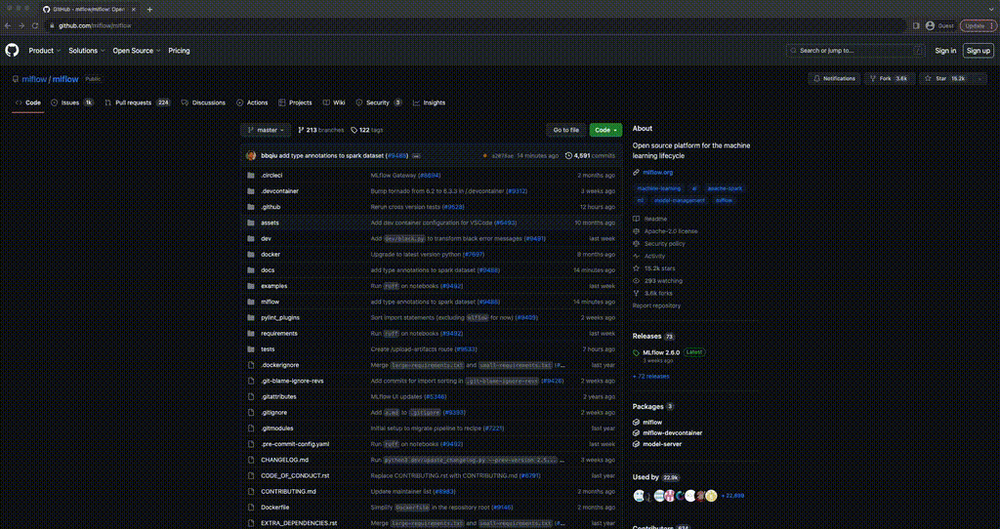

Creating Experiments
====================

In the previous section, we became familiar with the MLflow Client and its ``search_experiments`` API.
Before we get into creating experiments and adding metadata tags to them, let's take a brief look at the
MLflow UI.

In the first section of this tutorial, we started the MLflow UI from a command prompt, specifying the
host as ``127.0.0.1`` and the port as ``8090``.  Let's go to the UI and see what the Default Experiment looks like.

Viewing the MLflow UI
---------------------

In order to navigate to the MLflow UI server, we simply have to use a web browser and enter:

.. code-block:: text
    :caption: The MLflow UI url

        http://127.0.0.1:8090

Once navigating to the url, you will see the default experiment with no run data.

   The default MLflow UI

As you can see, there are no runs recorded and only the Default Experiment (with an ID of `0`) is present.
This won't be the case for long, as we're about to add a new Experiment.

Notes on Tags vs Experiments
----------------------------

While MLflow does provide a default experiment, it primarily serves as a 'catch-all' safety net for
runs initiated without a specified active experiment. However, it's not recommended for regular use.
Instead, creating unique experiments for specific collections of runs offers numerous advantages,
as we'll explore below.

**Benefits of Defining Unique Experiments:**

1. **Enhanced Organization**: Experiments allow you to group related runs, making it easier to track
and compare them. This is especially helpful when managing numerous runs, as in large-scale projects.

2. **Metadata Annotation**: Experiments can carry metadata that aids in organizing and associating
runs with larger projects.

Consider the scenario below: we're simulating participation in a large demand forecasting project.
This project involves building forecasting models for various departments in a chain of grocery
stores, each housing numerous products. Our focus here is the 'produce' department, which has several
distinct items, each requiring its own forecast model. Organizing these models becomes paramount
to ensure easy navigation and comparison.

**When Should You Define an Experiment?**

The guiding principle for creating an experiment is the consistency of the input data. If multiple
runs use the same input dataset (even if they utilize different portions of it), they logically belong
to the same experiment. For other hierarchical categorizations, using tags is advisable.

**Example**:

Consider the following structure:

- **Demand Forecasting Project**
    - **Produce Department**
        - Apples
        - Cherries
        - Carrots
    - **Dairy Department**
        - Milk
        - Cheese

Here, the `produce` and `dairy` departments are part of the same overarching project, but they rely
on distinct datasets and will likely produce different model metrics. Grouping the departments together
definitely doesn't make sense.

However, the temptation might arise to group all produce together. Grouping diverse items like apples,
cherries, and carrots under a single experiment could dilute the effectiveness of run comparisons
within that experiment. Thus, it's essential to demarcate clear boundaries for your experiments
to ensure meaningful insights.

To apply these boundaries effectively, as is shown in the figure below, tags should be employed.

.. figure:: ../../../_static/images/tutorials/introductory/logging-first-model/tag-exp-run-relationship.svg
   :width: 640px
   :align: center
   :alt: Tags, experiments, and runs relationships

   Effective grouping of modeling runs for a large project

Creating the Apples Experiment with Meaningful tags
---------------------------------------------------

.. code-section::
    .. code-block:: python
        :caption: Creating our first MLflow Experiment

        # Provide an Experiment description that will appear in the UI
        experiment_description = ("This is the grocery forecasting project. "
                          "This experiment contains the produce models for apples.")

        # Provide searchable tags that define characteristics of the Runs that
        # will be in this Experiment
        experiment_tags = {
            "project_name": "grocery-forecasting",
            "store_dept": "produce",
            "team": "stores-ml",
            "project_quarter": "Q3-2023",
            "mlflow.note.content": experiment_description
        }

        # Create the Experiment, providing a unique name
        produce_apples_experiment = client.create_experiment(
            name="Apple_Models",
            tags=experiment_tags
        )

Seeing our new Experiment in the UI
-----------------------------------
Now that we've used the client to create an Experiment, let's navigate to the UI to see it!

.. figure:: ../../../_static/images/tutorials/introductory/logging-first-model/first-experiment-ui.gif
   :width: 1024px
   :align: center
   :alt: View our new experiment in the UI

   The "Apple_Models" Experiment in the MLflow UI

Important components to be aware of in the UI
^^^^^^^^^^^^^^^^^^^^^^^^^^^^^^^^^^^^^^^^^^^^^
There are some important elements in the UI to be aware of at this point, before we start adding more exciting things like runs to
our new experiment. Note the annotated elements on the figure below. It will be useful to know that these bits of data are there later on.

.. figure:: ../../../_static/images/tutorials/introductory/logging-first-model/experiment-page-elements.svg
   :width: 1024px
   :align: center
   :alt: Important Data on the Experiment View Page

   Key elements of the Experiments view page

Searching based on tags
-----------------------

One of the more versatile uses of setting ``tags`` within Experiments is to enable searching for
related Experiments based on a common tag. The filtering capabilities within the ``search_experiments`` API
can be seen below, where we are searching for experiments whose custom ``project_name`` tag exactly matches
``grocery-forecasting``.

Note that the format that is used for the search filtering has some nuance to it. For named entities (for instance,
here, the ``tags`` term in the beginning of the filter string), keys can be directly used. However, to reference custom
tags that

.. code-section::
    .. code-block:: python
        :caption: Search for experiments that match one of our tags

        # Use search_experiments() to search on the project_name tag key

        apples_experiment = client.search_experiments(
            filter_string="tags.`project_name` = 'grocery-forecasting'"
        )

        print(vars(apples_experiment[0]))

.. code-block:: bash
    :caption: The metadata associated with a created Experiment

    <Experiment: artifact_location='mlflow-artifacts:/926031323154788454',
                 creation_time=1694018173427,
                 experiment_id='926031323154788454',
                 last_update_time=1694018173427,
                 lifecycle_stage='active',
                 name='Apple_Models',
                 tags={
                    'mlflow.note.content': 'This is the grocery forecasting project. This '
                            'experiment contains the produce models for apples.',
                    'project_name': 'grocery-forecasting',
                    'project_quarter': 'Q3-2023',
                    'team': 'stores-ml'}
    >

.. note::
    The returned results above are formatted for legibility. This return type is an ``Experiment`` object, not a ``dict``.

Running it
----------

.. figure:: ../../../_static/images/tutorials/introductory/logging-first-model/creating-experiment.gif
   :width: 1024px
   :align: center
   :alt: Creating a new Experiment

   Creating a new Experiment and searching based on an Experiment tag

In the next section, we'll begin to use this experiment to log training data to runs that are associated with this experiment, introducing
another aspect of both the MLflow APIs (the fluent API) and another part of the MLflow UI (the run information page).
