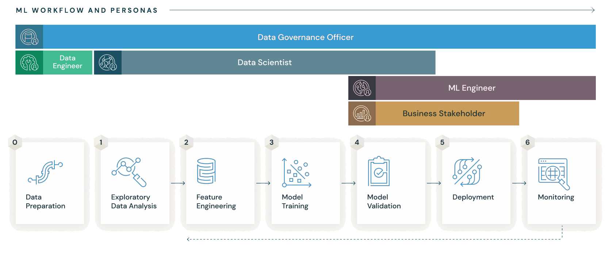

.. _what-is-mlflow:

What is MLflow?
===============

MLflow is a versatile, expandable, open-source platform for managing workflows and artifacts across the machine learning lifecycle. It has built-in integrations with many popular ML libraries, but can be used with any library, algorithm, or deployment tool. It is designed to be extensible, so you can write plugins to support new workflows, libraries, and tools.

MLflow has five components:

- :ref:`MLflow Tracking <tracking>`: An API for logging parameters, code versions, metrics, model environment dependencies, and model artifacts when running your machine learning code. MLflow Tracking has a UI for reviewing and comparing runs and their results. This image from the MLflow Tracking UI shows a chart linking metrics (learning rate and momentum) to a loss metric:

.. figure:: _static/images/what-is-mlflow/tracking-chart.png
    :width: 100%
    :alt: Screenshot of the MLflow Tracking Chart view, showing a number of runs and a comparison of their parameters and metrics.

- :ref:`MLflow Models <models>`: A model packaging format and suite of tools that let you easily deploy a trained model (from any ML library) for batch or real-time inference on platforms such as Docker, Apache Spark, Databricks, Azure ML and AWS SageMaker. This image shows MLflow Tracking UI's view of a run's detail and its MLflow model. You can see that the artifacts in the **model** directory include the model weights, files describing the model's environment and dependencies, and sample code for loading the model and inferencing with it:

.. figure:: _static/images/what-is-mlflow/model-details.png
    :width: 100%
    :alt: Screenshot of the MLflow Tracking run details page, showing the MLflow Model artifacts.

- :ref:`MLflow Model Registry <registry>`: A centralized model store, set of APIs, and UI focused on the approval, quality assurance, and deployment of an MLflow Model.

- :ref:`MLflow Projects <projects>`: A standard format for packaging reusable data science code that can be run with different parameters to train models, visualize data, or perform any other data science task.

- :ref:`MLflow Recipes <recipes>`: Predefined templates for developing high-quality models for a variety of common tasks, including classification and regression.

What is MLflow used for?
------------------------

MLflow is used to manage the machine learning lifecycle from initial model development through deployment and beyond to sunsetting. It combines:

- Tracking ML experiments to record and compare model parameters, evaluate performance, and manage artifacts (MLflow Tracking)
- Packaging ML code in a reusable, reproducible form in order to share with other data scientists or transfer to production (MLflow Projects)
- Packaging and deploying models from a variety of ML libraries to a variety of model serving and inference platforms (MLflow Models)
- Collaboratively managing a central model store, including model versioning, stage transitions, and annotations (MLflow Registry)
- Accelerating iterative development with templates and reusable scripts for a variety of common modeling tasks (MLflow Recipes)

Who uses MLflow?
----------------

MLflow is used by data scientists and by MLOps professionals. Data scientists use MLflow to track experiments, structure code, package models, and to review and select models for deployment. MLOps professionals use MLflow to securely deploy models to production and to monitor deployments for performance and accuracy. 

MLflow use cases
----------------

MLflow is used for a variety of machine learning use cases. Here are some examples:

- A team of data scientists uses MLflow Tracking to record parameters and metrics from their experiments on a single problem domain. They use the MLflow UI to compare results and guide their exploration of the solution space. They store the outputs of their runs as MLflow models. 

- An MLOps engineer uses the MLflow UI to compare the performance of different models and selects the best one for deployment. They register the model in the MLflow Registry to track this specific version's performance in production. 

- An MLOps engineer uses MLflow models to deploy a model to a production environment. They use MLflow Registry to track the model's performance and to compare it to other models in production.

- A data scientist beginning work with a new project structures their code as an MLflow Project so that they can easily share it with others and run it with different parameters.

Next steps:

- :ref:`Get started with MLflow in a matter of minutes<quickstart>`