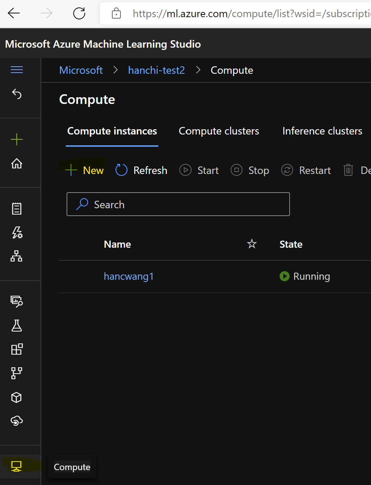

This is the environment setup instructions for the CLI v2 workshop

# Create an AzureML compute instance as your environment

Pick a test workspace of your choice, create a compute instance. It's recommended to create a new compute instance even if you already have one. This is to ensure your compute instance has all latest feature and have the same configuration as expected in this workshop.



# Authenticate your GitHub Account with SSH

Follow the AzureML official instructions [here](https://docs.microsoft.com/en-us/azure/machine-learning/concept-train-model-git-integration#authenticate-your-git-account-with-ssh) for the SSH setup. This is to make sure you can clone the code repo needed for this workshop.

# Clone the mlflow repository

Code of this worship is checked into a forked mlflow GH repo. After the git setup above, run below command to clone the repo

```
git clone https://github.com/luigiw/mlflow.git
```

# Create a conda environment

Conda environments create isolated Python environments for easy dependency management. We'll create a new conda environment using configuration provided by mlflow in this workshop.

Cd into the mlflow fastai example folder.

```
cd ./mlflow/examples/fastai
```

`conda.yaml` is the configuration file you use to create the new conda environment. `conda.yaml` specifies dependencies like `mlflow`, `fastai` and `azureml-mlflow` that are needed for this workshop. When you create the conda environment, you'll see each of the depending package installed.

Run this command to create the conda environment, name of the environment is `fasai-example`
```
conda env update --file ./conda.yaml
```

Activate the environment by,
```
conda activate fastai-example
```

# Install AzureML CLI extension v2

Compute instances have Azure CLI and AzureML v1 extension installed out of box. AzureML extention v2 is needed for this workshop. To remove the v1 extension and install the v2 extension run,

```
az extension remove -n azure-cli-ml && az extension add -n ml -y
```

You've now finished the environment setup for the CLI v2 workshop.
