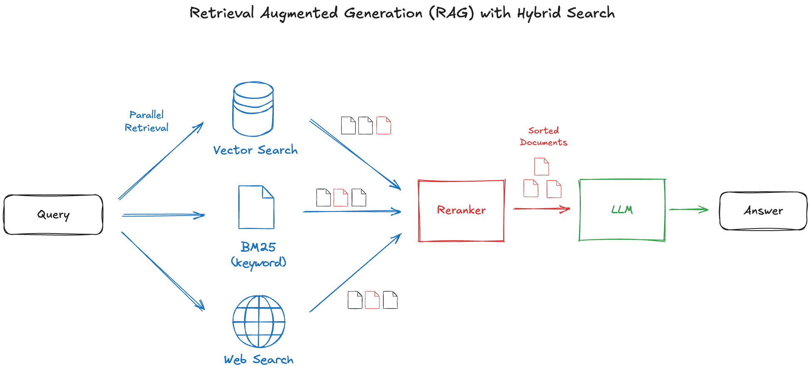
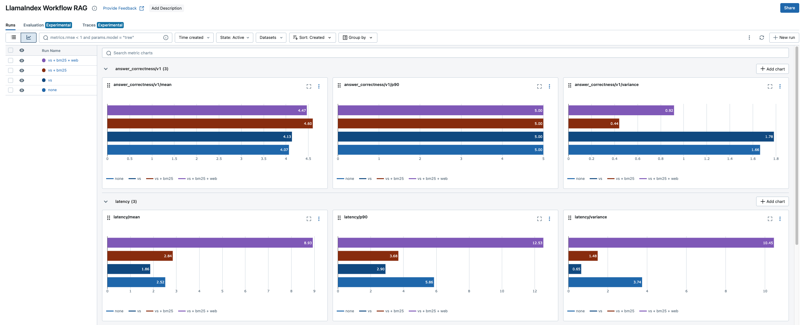

# MLflow LlamaIndex Workflow Example

This example demonstrates how to build and optimize a Retrieval-Augmented Generation (RAG) workflow using [LlamaIndex](https://www.llamaindex.ai/) integrated with [MLflow](https://mlflow.org/docs/latest/llms/llama-index/index.html). The example covers various retrieval strategies such as vector search, BM25, and web search, along with logging, model tracking, and performance evaluation in MLflow.





## Set Up

This repository contains a complete workflow definition, a hands-on notebook, and a sample dataset for running experiments. To clone it to your working environment, use the following command:

```shell
git clone https://github.com/mlflow/mlflow.git
```

After cloning the repository, set up the virtual environment by running:

```
cd mlflow/examples/llama_index/workflow
chmod +x install.sh
./install.sh
```

Once the installation is complete, start Jupyter Notebook within the Poetry environment using:

```
poetry run jupyter notebook
```
