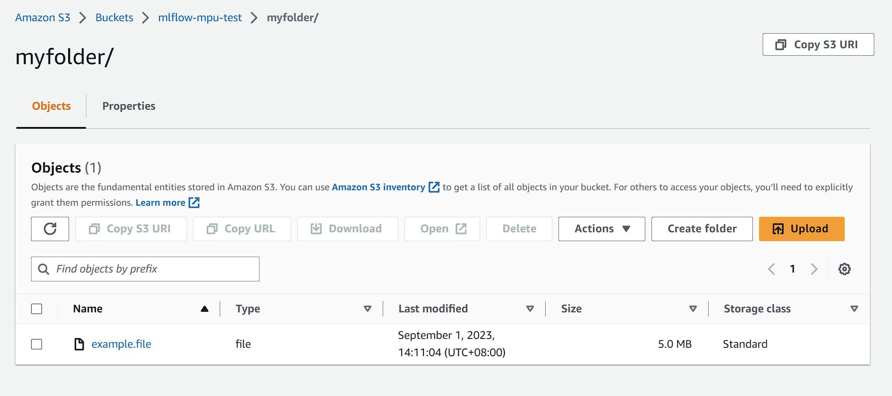

# MLflow Artifacts Multipart Upload REST API Example

This example shows how you can perform multipart upload to S3 via MLflow artifacts REST API.

1. Go to S3 and create a bucket `mlflow-mpu-test`
2. Set up your [AWS credentials](https://docs.aws.amazon.com/cli/latest/userguide/cli-configure-envvars.html)
    ```shell
    export AWS_ACCESS_KEY_ID=xxx
    export AWS_SECRET_ACCESS_KEY=xxx
    export AWS_DEFAULT_REGION=us-east-2
    ```
3. Launch mlflow server with
    ```shell
    mlflow ui --artifacts-destination s3://mlflow-mpu-test
    ```
4. Run the example
    ```shell
    python ./s3_rest_api.py \
      --artifact-path myfolder \
      --local-file ./example.file
    ```
5. Then you should see the file has been uploaded to S3
   
