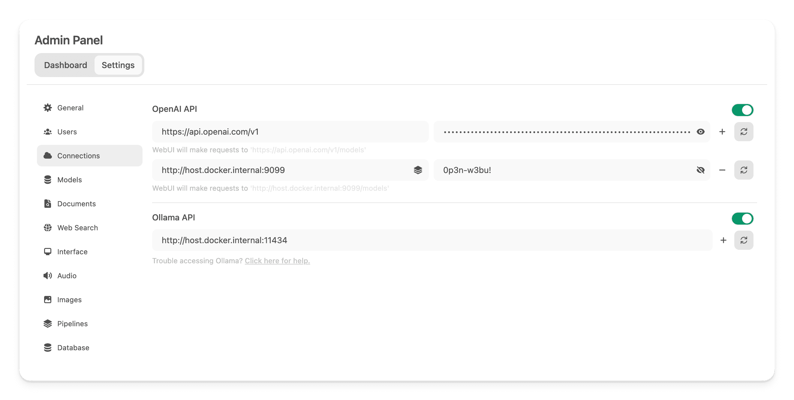
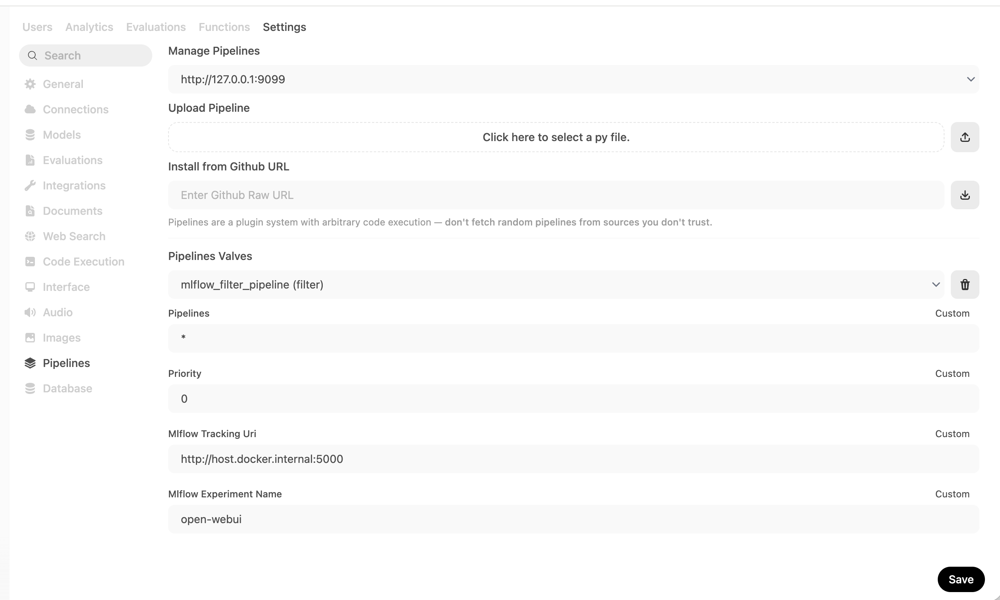
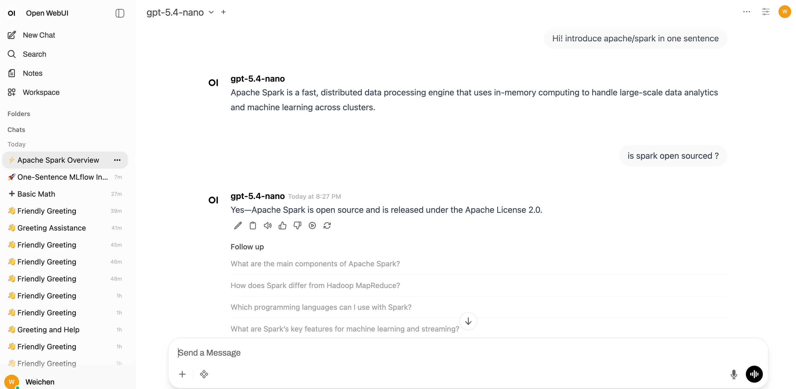
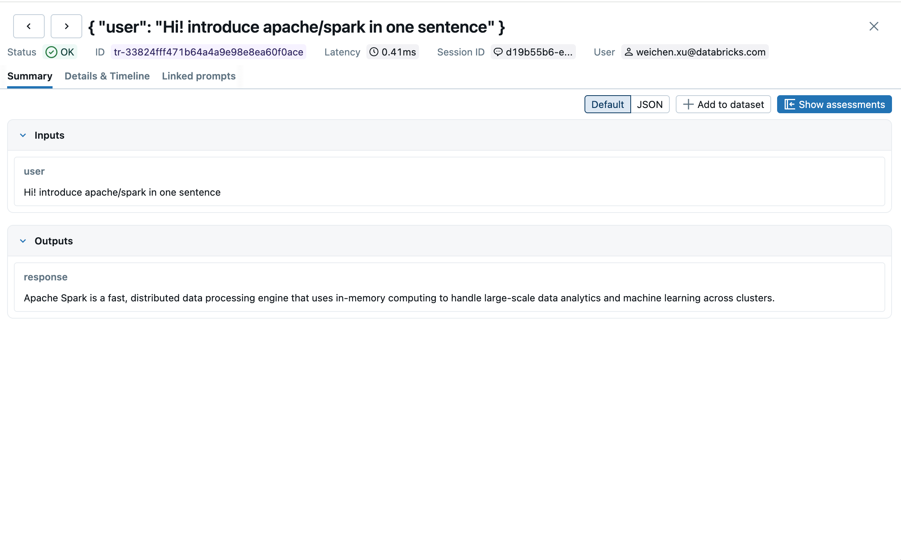
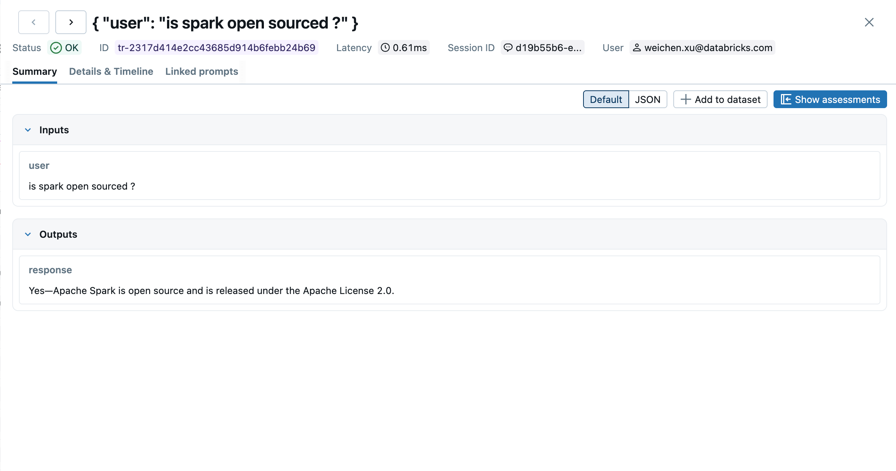
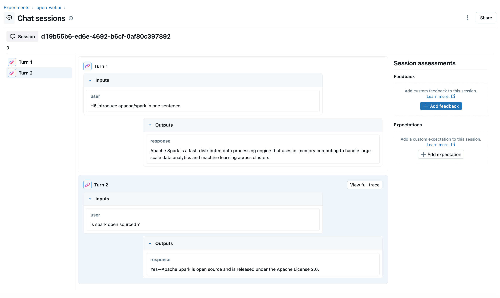

# MLflow Filter Pipeline for Open WebUI

A filter pipeline that integrates [MLflow](https://mlflow.org/) tracing with [Open WebUI](https://github.com/open-webui/open-webui), enabling observability for multi-turn chat sessions.

## What It Does

- **inlet**: Captures the last user message and session context before each request
- **outlet**: Logs a complete trace per turn — user input, assistant response, model name, and token usage — grouped under the same session in the MLflow UI

## Features

- **Multi-turn session grouping** — all turns of a conversation are linked via `mlflow.trace.session`, viewable with "Group by session" in the MLflow UI
- **Per-turn tracing** — each request/response pair is logged as a separate MLflow trace with latency and status
- **Token usage tracking** — input/output token counts are captured when provided by the backend, automatically aggregated at the trace level
- **User attribution** — traces are tagged with the authenticated user's email via `mlflow.trace.user`

## Requirements

- MLflow tracking server running and accessible
- `mlflow>=2.14.0`

## Configuration (Valves)

| Valve                    | Default                 | Description                |
| ------------------------ | ----------------------- | -------------------------- |
| `mlflow_tracking_uri`    | `http://localhost:5000` | MLflow tracking server URI |
| `mlflow_experiment_name` | `open-webui`            | Experiment name in MLflow  |
| `debug`                  | `false`                 | Enable debug logging       |

## Setup

### 1. Start the MLflow server

```bash
mlflow server --disable-security-middleware
```

### 2. Start Open WebUI

```bash
open-webui serve
```

### 3. Launch the pipeline service via Docker

Build a custom Docker image with MLflow installed:

```bash
# Create Dockerfile.mlflow
cat > Dockerfile.mlflow <<'EOF'
FROM ghcr.io/open-webui/pipelines:main
RUN pip install --no-cache-dir mlflow
EOF

# Build image
docker build -f Dockerfile.mlflow -t pipelines-mlflow .

# Launch container (replace host.docker.internal:5000 with your MLflow server address)
docker run -p 9099:9099 \
  --add-host=host.docker.internal:host-gateway \
  -v pipelines:/app/pipelines \
  --name pipelines \
  --restart always \
  -e MLFLOW_TRACKING_URI=http://host.docker.internal:5000/ \
  -e DEBUG_MODE=true \
  pipelines-mlflow
```

### 4. Connect Open WebUI to the pipeline server

In Open WebUI, go to **Admin Panel → Settings → Connections** and add a new OpenAI API connection pointing to the pipeline server:

- **URL:** `http://localhost:9099/`
- **Password:** `0p3n-w3bu!` (default credential)



### 5. Upload the pipeline in Open WebUI

Go to **Admin Panel → Settings → Pipelines**. Set the Pipelines listener address to `http://host.docker.internal:9099`, then upload `mlflow_filter_pipeline.py` using the file upload button. Then configure MLflow tracking URI and MLflow experiment name as follows:



### 6. Chat and observe traces

Start a conversation in Open WebUI:



Open the MLflow UI and enable **"Group by session"** to view full conversations as grouped traces.

**Single turn traces:**





**Full chat session grouped view:**


