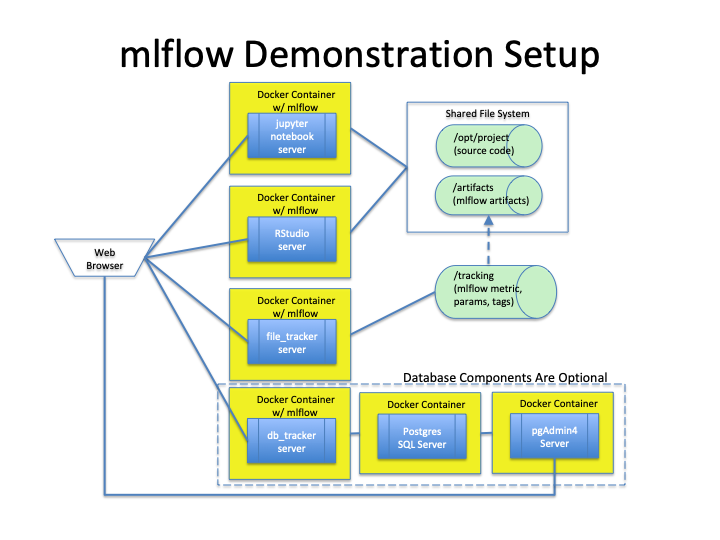

# mlflow Quickstart

## Quickstart Environment


## System Requirements
* [Docker](https://docs.docker.com/develop/)
* [Docker Compose](https://docs.docker.com/compose/overview/)

## Environment Setup

_Setup described in this section does not consider security requirements and is suitable only 
for demonstration purposes with non-sensitive data.  Changes are required for any production deployment_.

### Set up local storage
* Assumes the `mlflow` repo has been cloned to local storage. Note directory for the local repo, 
e.g., `/path/to/local_repo/mlflow`
* Create directory to hold mlflow server tracking data and artifacts, e.g., `/path/to/directory/for/tracking-artifacts`.  
Within this directory create these subdirectories
```
/path/to/directory/for/tracking-artifacts/tracking
/path/to/directory/for/tracking-artifacts/artifacts
```

### Setup required environment variables
* Change working directory to `examples/quickstart`
* Update contents of `./setup_environment_variables` to specify values for the required environment variables.
```
MLFLOW_VERSION
MLFLOW_VERSION_TO_INSTALL
MFLOW_EXAMPLE_DIRECTORY
MLFLOW_TRACKING_DIRECTORY
MLFLOW_TRACKER_URL
```
 
Specify version of mlflow package.  See example below.
```
###
# Set up environment variables to control building and
# running demonstration mlflow Docker containers
###

# mlflow version to install
export MLFLOW_VERSION=0.9.0

# mlflow example directory
export MLFLOW_EXAMPLE_DIRECTORY=/path/to/local_repo/mlflow/example

# directory to hold mlflow tracking and artifacts
export MLFLOW_TRACKING_DIRECTORY=/path/to/directory/for/tracking-artifacts

# mflow tracking server URL: file_tracker or db_tracker
# use MLFLOW_TRACKER_URL=http://file_tracker:5000 for file-based tracker server
# use MLFLOW_TRACKER_URL=http://db_tracker:5001 for Postgres SQL database tracker server
export MLFLOW_TRACKER_URL=http://db_tracker:5001

# install mlflow from pypi
export MLFLOW_VERSION_TO_INSTALL="mlflow==${MLFLOW_VERSION}"

```

### Build the required mlflow Docker images
* After updating `setup_environment_variables`, execute following command to set  
environment variables: `. ./setup_environment_variables`

* Run the following command to initially build the required Docker images.
```
bash ./build_images
```
Note:  On a MacbookPro with 16GB RAM, it takes 10 to 13 minutes for the initial 
build of the images.


## Optional:  Database for tracking data

### Local storage for database server

Create local directories for Postgres database storage
```
//path/to/directory/for/tracking-artifacts/postgres/postgres/data
//path/to/directory/for/tracking-artifacts/postgres/postgres/admin
```

### Postgres SQL database tracker components

Database Docker components:

[Postgres SQL Image](https://hub.docker.com/_/postgres)

[Web-based Postgres Administration Tool](https://hub.docker.com/r/dpage/pgadmin4) 

Perform only one of the following two tasks.

* To make use of the database tracker components, run the following command to pull 
PostgresSQL database related images from dockerhub.com
```
bash ./pull_images
```
Note:  This will take about one to two minutes to pull down the PostgresSQL images.

Add these lines to the end of `docker-compose.yml`
```
# container for postgres database server
  pgdb:

    image: postgres:10

    ports:
      - "5432:5432"

    environment:
      POSTGRES_PASSWORD: mlflow_pw
      POSTGRES_USER: mlflow_user
      POSTGRES_DB: mlflow_db

    volumes:
      - "${MLFLOW_TRACKING_DIRECTORY:-/tmp}/postgres/data:/var/lib/postgresql/data"


# container for postgres admin server
  pgadmin:

    image: dpage/pgadmin4

    ports:
      - "80:80"

    environment:
      PGADMIN_DEFAULT_EMAIL: "mlflow@gmail.com"
      PGADMIN_DEFAULT_PASSWORD: pgadmin4

    volumes:
      - "${MLFLOW_TRACKING_DIRECTORY:-/tmp}/postgres/pgadmin:/var/lib/pgadmin"


```

## Start demonstration containers
After building the Docker images, navigate to `./run_demo`.   Ensure the required
environment variables are defined by running `. ./setup_environment_variables`.

* To start the Docker containers for the demonstration environment:
```
docker-compose up --detach
```
* To stop the Docker containers:
```
docker-compose down
```

## Connecting to containers
Open a browser and enter the following URL for the respective service.
* Jupyter Notebook Python Container:  `http://0.0.0.0:8888`
* RStudio Container: `http://0.0.0.0:8787`
* mlflow file-based tracking server: `http://0.0.0.0:5000`
* mfllow PostgresSQL-based tracking server: `http://0.0.0.0:5001`
* Postgres SQL pgAdmin Server: `http://0.0.0.0:80`, login id: `mlflow@gmail.com`, password `pgadmin4`


