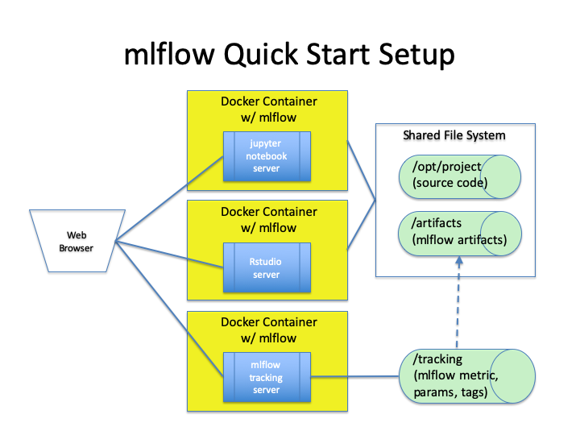

# mlflow Quickstart

With these Dockerfiles a user can quickly set up a Python or R environment with `mlflow`to support machine learning 
experimentation, demonstrations or testing. 

## Quickstart Environment


## System Requirements
* [Docker](https://docs.docker.com/develop/)
* [Docker Compose](https://docs.docker.com/compose/overview/)

## Environment Setup

### Set up local storage
* `git clone` `mlflow` repo to local storage.  Note directory for the local repo, 
e.g., `/fully/qualified/path/to/local/repo/mlflow`
* Create directory to hold mlflow tracking data and artifacts, e.g., `/fully/qualified/path/to/local/directory/tracking-artifacts`.  
Within this directory create `tracking` and `artifacts` subdirectories
```
/fully/qualified/path/to/local/directory/tracking-artifacts/tracking
/fully/qualified/path/to/local/directory/tracking-artifacts/artifacts
```

### Setup required environment variables
* Change working directory to `examples/quickstart`
* Update contents of `./setup_environment_variables` to specify values for these environment variables.
```
MLFLOW_VERSION
MFLOW_EXAMPLE_DIRECTORY
MLFLOW_TRACKING_DIRECTORY
```
 
Following is an illustrative example.
```
###
# Specify user specific values
###

# mlflow version to install
export MLFLOW_VERSION=0.9.1

# Directory containing machine learning source code.  Current instructions specify 
# the `examples/quickstart/sample_code`.  The user can specify any valid location containing 
# their source code for ML experiments.
export MLFLOW_EXAMPLE_DIRECTORY=/fully/qualified/path/to/local/repo/mlflow/examples/quickstart/sample_code

# directory to hold mlflow tracking and artifacts
export MLFLOW_TRACKING_DIRECTORY=/fully/qualified/path/to/local/directory/tracking-artifacts

#################################################################
#  For default setup, no changes are necessary in the following #
#################################################################

# mflow tracking server URI
export MLFLOW_TRACKING_URI=http://mlflow_tracker:5000

# backend store for mlflow tracking server within the container
export MLFLOW_BACKEND_STORE=/tracking

# pip install specification for mlflow
export MLFLOW_VERSION_TO_INSTALL="mlflow==${MLFLOW_VERSION}"
```

### Build the required mlflow Docker images
* After updating `setup_environment_variables`, execute following command to set  
environment variables: `. ./setup_environment_variables`. 

To confirm correct setting of environment variables, run `env | grep MLFLOW`, your output should be similar to this.
```
MLFLOW_VERSION_TO_INSTALL=mlflow==0.9.1
MLFLOW_BACKEND_STORE=/tracking
MLFLOW_VERSION=0.9.1
MLFLOW_EXAMPLE_DIRECTORY=/XXXXX/YYYYY/ZZZZZ/mlflow/examples
MLFLOW_TRACKING_URI=http://mlflow_tracker:5000
MLFLOW_TRACKING_DIRECTORY=/AAAAA/BBBBB/CCCCC/DDDDD/mlflow_server
```

* Run the following command to build the required Docker images.
```
bash ./build_images.sh
```
Note:  On a MacbookPro with 16GB RAM, it takes about 13 minutes to build the required Docker images.


## Running the mlflow platform containers
After building the Docker images, navigate to `examples/quickstart`.  

Ensure the required environment variables are defined by running `. ./setup_environment_variables`.

* Start the Docker containers:
```
docker-compose up --detach
```
* Confirm that the containers started successfully, run the following command while positioned in `examples/quickstart`.  
```
docker-compose ps
```

Your output should look similar to this
```
           Name                          Command               State           Ports
---------------------------------------------------------------------------------------------
quickstart_jpynb_1            /usr/bin/tini -- jupyter n ...   Up      0.0.0.0:8888->8888/tcp
quickstart_mlflow_tracker_1   /usr/bin/tini -- mlflow se ...   Up      0.0.0.0:5000->5000/tcp
quickstart_rstudio_1          /init                            Up      0.0.0.0:8787->8787/tcp
```

* Stop the Docker containers.  Navigate to `examples/quickstart` and run this command:
```
docker-compose down
```

## Connecting to containers
Open a browser and enter the following URL for the respective service.

|Service|URL|
|-------|---|
|Python Jupyter Notebook Server (jpynb)| `http://0.0.0.0:8888`|
|RStudio Server (rstudio)|`http://0.0.0.0:8787`|
|mlflow tracking server|`http://0.0.0.0:5000`|


## Code Samples

The following code samples are provided in `mlflow/examples/quicstart/sample_code`:

|Module|Purpose|
|------|-------|
|mlflow_demo1.ipynb|Demonstrates use of common mlflow api calls.|
|mlflow_demo2.ipynb|Demonstrates hyper-parameter optimization with mlflow recording results.|
|mlflow_demo_r.Rmd|R Markdown notebook illustrating use of mlflow api in a R program.|
|mlflow_tracking.py|Python program illustrating use of mlflow api calls.|

With the exception of `mlflow_tracking.py` program all others can be run using the respective web UI (Jupyter Notebook 
or RStudio).  To run `mlflow_tracking.py`, at the command prompt connect to the Python Jupyter Notebook container using
this command `docker exec -it quickstart_jpynb_1 /bin/bash`.  Once connected to the container
```
cd /opt/project
python mlflow_tracking.py
```

## Limitations

* _Setup described in this section does not consider security requirements and is suitable only 
for demonstration purposes with non-sensitive data_.
* Current design supports running containers on a single host.