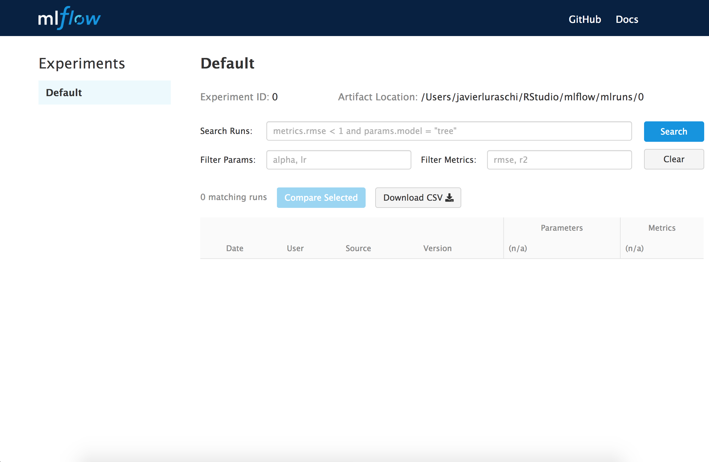
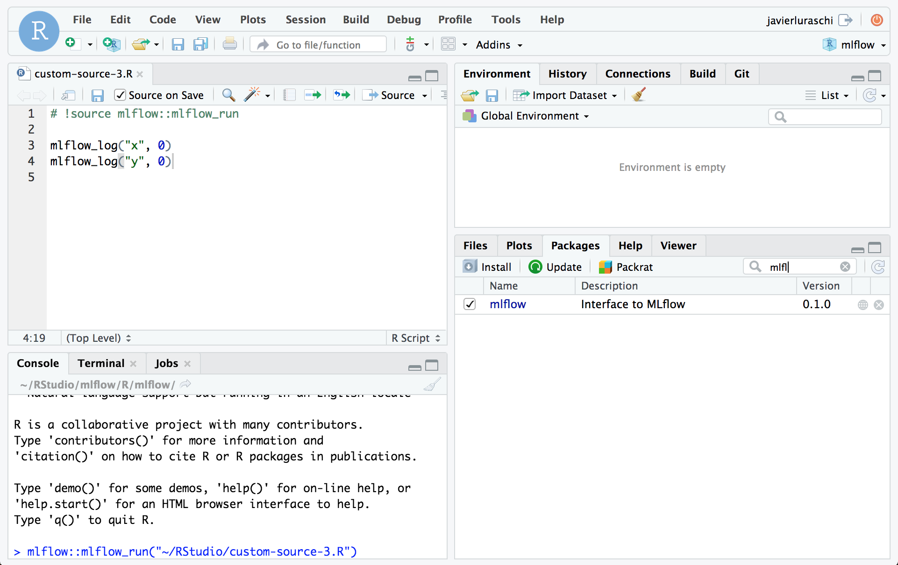

mlflow: R interface for MLflow
================

[](https://travis-ci.org/rstudio/mlflow)
[](https://cran.r-project.org/package=mlflow)
[](https://codecov.io/gh/rstudio/mlflow)

  - Install [MLflow](https://mlflow.org/) from R to track experiments
    locally.
  - Connect to MLflow servers to share experiments with others.
  - Use MLflow to export models that can be served locally and remotely.

## Installation

You can install **mlflow** from GitHub as follows:

``` r
devtools::install_github("rstudio/mlflow", subdir = "R/mlflow")
```

Then, install MLflow to manage models and experiments locally:

``` r
library(mlflow)
mlflow_install()
```

To upgrade to the latest version of mlflow, run the following command
and restart your r session:

``` r
devtools::install_github("rstudio/mlflow", subdir = "R/mlflow")
```

## Tracking

MLflow Tracking allows you to logging parameters, code versions,
metrics, and output files when running R code and for later visualizing
the results.

MLflow allows you to group runs under experiments, which can be useful
for comparing runs intended to tackle a particular task. You can create
and activate a new experiment locally using `mlflow` as follows:

``` r
library(mlflow)
mlflow_set_active_experiment("Test")
```

Then you can list your experiments directly from R,

``` r
mlflow_list_experiments()
```

    ##   experiment_id    name artifact_location
    ## 1             0 Default          mlruns/0

or using MLflows user interface by
running:

``` r
mlflow_ui()
```



You can also use a MLflow server to track and share experiments, see
[running a tracking
server](https://www.mlflow.org/docs/latest/tracking.html#running-a-tracking-server),
and then make use of this server by running:

``` r
mlflow_set_tracking_uri("http://tracking-server:5000")
```

Once the tracking url is defined, the experiments will be stored and
tracked in the specified server which others will also be able to
access.

## Projects

An MLflow Project is a format for packaging data science code in a
reusable and reproducible way.

MLflow projects can be [explicitly
created](https://www.mlflow.org/docs/latest/projects.html#specifying-projects)
or implicitly used by running `R` with `mlflow` from the terminal as
follows:

``` bash
mlflow run examples/R/simple --entry-point train.R
```

Notice that is equivalent to running from `examples/R/simple`,

``` bash
Rscript -e "mlflow::mlflow_source('train.R')"
```

and `train.R` performing training and logging as follows:

``` r
library(mlflow)

# read parameters
column <- mlflow_log_param("column", 1)

# log total rows
mlflow_log_metric("rows", nrow(iris))

# train model
model <- lm(Sepal.Width ~ iris[[column]], iris)

# log models intercept
mlflow_log_metric("intercept", model$coefficients[["(Intercept)"]])
```

### Parameters

You will often want to parameterize your scripts to support running and
tracking multiple experiments. Ypu can define parameters with type under
a `params_example.R` example as follows:

``` r
library(mlflow)

# define parameters
my_int <- mlflow_param("my_int", 1, "integer")
my_num <- mlflow_param("my_num", 1.0, "numeric")
my_str <- mlflow_param("my_str", "a", "string")

# log parameters
mlflow_log_param("param_int", my_int)
mlflow_log_param("param_num", my_num)
mlflow_log_param("param_str", my_str)
```

Then run `mlflow run` with custom parameters as
    follows

    mlflow run tests/testthat/examples/ --entry-point params_example.R -P my_int=10 -P my_num=20.0 -P my_str=XYZ

    === Created directory /var/folders/ks/wm_bx4cn70s6h0r5vgqpsldm0000gn/T/tmpi6d2_wzf for downloading remote URIs passed to arguments of type 'path' ===
    === Running command 'source /miniconda2/bin/activate mlflow-da39a3ee5e6b4b0d3255bfef95601890afd80709 && Rscript -e "mlflow::mlflow_source('params_example.R')" --args --my_int 10 --my_num 20.0 --my_str XYZ' in run with ID '191b489b2355450a8c3cc9bf96cb1aa3' === 
    === Run (ID '191b489b2355450a8c3cc9bf96cb1aa3') succeeded ===

Run results that we can view with `mlflow_ui()` or `mlflow_get_run()` as
follows:

``` r
mlflow_get_run("191b489b2355450a8c3cc9bf96cb1aa3")
```

    $info
                              run_uuid experiment_id  name source_type source_name
    1 191b489b2355450a8c3cc9bf96cb1aa3             0 Run 3     PROJECT examples
        user_id   status    start_time      end_time                           source_version
    1 user_name FINISHED 1535045372367 1535045380361 12871326fd3123f793b6afaa81b2d3c81493c84a
      entry_point_name                                        artifact_uri
    1 params_example.R mlruns/0/191b489b2355450a8c3cc9bf96cb1aa3/artifacts
    
    $data
      params.key params.value
    1  param_str          XYZ
    2     my_num         20.0
    3  param_int           10
    4  param_num           20
    5     my_str          XYZ
    6     my_int           10

## Models

An MLflow Model is a standard format for packaging machine learning
models that can be used in a variety of downstream tools—for example,
real-time serving through a REST API or batch inference on Apache Spark.
They provide a convention to save a model in different “flavors” that
can be understood by different downstream tools.

To save a model use `mlflow_save_model()`. For instance, you can add the
following lines to the previous `train.R` script:

``` r
# train model (...)

# save model
mlflow_save_model(function(df, model) {
  predict(model, df)
})
```

And trigger a run with that will also save your model as follows:

``` bash
mlflow run train.R
```

Each MLflow Model is simply a directory containing arbitrary files,
together with an MLmodel file in the root of the directory that can
define multiple flavors that the model can be viewed in.

The directory containing the model looks as follows:

``` r
dir("model")
```

    ## [1] "MLmodel"     "r_model.bin"

and the model definition `model/MLmodel` like:

``` r
cat(paste(readLines("model/MLmodel"), collapse = "\n"))
```

    ## time_created: 1.535526e+09
    ## flavors:
    ##   r_function:
    ##     version: 0.1.0
    ##     model: r_model.bin

Later on, the R model can be deployed which will perform predictions
using
    `mlflow_rfunc_predict()`:

``` r
mlflow_rfunc_predict("model", iris)
```

    ## Warning in mlflow_snapshot_warning(): Running without restoring the
    ## packages snapshot may not reload the model correctly. Consider running
    ## 'mlflow_restore_snapshot()' or setting the 'restore' parameter to 'TRUE'.

    ## 3.103334366486683.115711326079513.128088285672343.134276765468753.10952284628313.084768927097443.134276765468753.10952284628313.146653725061583.115711326079513.084768927097443.121899805875933.121899805875933.1528422048583.060015007911783.06620348770823.084768927097443.103334366486683.06620348770823.103334366486683.084768927097443.103334366486683.134276765468753.103334366486683.121899805875933.10952284628313.10952284628313.097145886690273.097145886690273.128088285672343.121899805875933.084768927097443.097145886690273.078580447301023.115711326079513.10952284628313.078580447301023.115711326079513.146653725061583.103334366486683.10952284628313.140465245265173.146653725061583.10952284628313.103334366486683.121899805875933.103334366486683.134276765468753.090957406893853.10952284628312.985753250354813.02288412913332.991941730151223.078580447301023.016695649336883.06620348770823.029072608929713.115711326079513.010507169540473.097145886690273.10952284628313.053826528115373.047638048318953.041449568522543.072391967504613.004318689744053.072391967504613.060015007911783.035261088726123.072391967504613.053826528115373.041449568522543.029072608929713.041449568522543.02288412913333.010507169540472.998130209947643.004318689744053.047638048318953.06620348770823.078580447301023.078580447301023.060015007911783.047638048318953.084768927097443.047638048318953.004318689744053.029072608929713.072391967504613.078580447301023.078580447301023.041449568522543.060015007911783.10952284628313.072391967504613.06620348770823.06620348770823.035261088726123.103334366486683.06620348770823.029072608929713.060015007911782.979564770558393.029072608929713.016695649336882.948622371576323.115711326079512.967187810965573.004318689744052.973376290761983.016695649336883.02288412913332.998130209947643.06620348770823.060015007911783.02288412913333.016695649336882.942433891779912.942433891779913.047638048318952.991941730151223.072391967504612.942433891779913.029072608929713.004318689744052.973376290761983.035261088726123.041449568522543.02288412913332.973376290761982.960999331169152.930056932187083.02288412913333.029072608929713.041449568522542.942433891779913.029072608929713.02288412913333.047638048318952.991941730151223.004318689744052.991941730151223.060015007911782.998130209947643.004318689744053.004318689744053.029072608929713.016695649336883.035261088726123.05382652811537

    ##        1        2        3        4        5        6        7        8 
    ## 3.103334 3.115711 3.128088 3.134277 3.109523 3.084769 3.134277 3.109523 
    ##        9       10       11       12       13       14       15       16 
    ## 3.146654 3.115711 3.084769 3.121900 3.121900 3.152842 3.060015 3.066203 
    ##       17       18       19       20       21       22       23       24 
    ## 3.084769 3.103334 3.066203 3.103334 3.084769 3.103334 3.134277 3.103334 
    ##       25       26       27       28       29       30       31       32 
    ## 3.121900 3.109523 3.109523 3.097146 3.097146 3.128088 3.121900 3.084769 
    ##       33       34       35       36       37       38       39       40 
    ## 3.097146 3.078580 3.115711 3.109523 3.078580 3.115711 3.146654 3.103334 
    ##       41       42       43       44       45       46       47       48 
    ## 3.109523 3.140465 3.146654 3.109523 3.103334 3.121900 3.103334 3.134277 
    ##       49       50       51       52       53       54       55       56 
    ## 3.090957 3.109523 2.985753 3.022884 2.991942 3.078580 3.016696 3.066203 
    ##       57       58       59       60       61       62       63       64 
    ## 3.029073 3.115711 3.010507 3.097146 3.109523 3.053827 3.047638 3.041450 
    ##       65       66       67       68       69       70       71       72 
    ## 3.072392 3.004319 3.072392 3.060015 3.035261 3.072392 3.053827 3.041450 
    ##       73       74       75       76       77       78       79       80 
    ## 3.029073 3.041450 3.022884 3.010507 2.998130 3.004319 3.047638 3.066203 
    ##       81       82       83       84       85       86       87       88 
    ## 3.078580 3.078580 3.060015 3.047638 3.084769 3.047638 3.004319 3.029073 
    ##       89       90       91       92       93       94       95       96 
    ## 3.072392 3.078580 3.078580 3.041450 3.060015 3.109523 3.072392 3.066203 
    ##       97       98       99      100      101      102      103      104 
    ## 3.066203 3.035261 3.103334 3.066203 3.029073 3.060015 2.979565 3.029073 
    ##      105      106      107      108      109      110      111      112 
    ## 3.016696 2.948622 3.115711 2.967188 3.004319 2.973376 3.016696 3.022884 
    ##      113      114      115      116      117      118      119      120 
    ## 2.998130 3.066203 3.060015 3.022884 3.016696 2.942434 2.942434 3.047638 
    ##      121      122      123      124      125      126      127      128 
    ## 2.991942 3.072392 2.942434 3.029073 3.004319 2.973376 3.035261 3.041450 
    ##      129      130      131      132      133      134      135      136 
    ## 3.022884 2.973376 2.960999 2.930057 3.022884 3.029073 3.041450 2.942434 
    ##      137      138      139      140      141      142      143      144 
    ## 3.029073 3.022884 3.047638 2.991942 3.004319 2.991942 3.060015 2.998130 
    ##      145      146      147      148      149      150 
    ## 3.004319 3.004319 3.029073 3.016696 3.035261 3.053827

## Deployment

MLflow provides tools for deployment on a local machine and several
production environments. You can use these tools to easily apply your
models in a production environment.

You can serve a model by running,

``` bash
mlflow rfunc serve model
```

which is equivalent to
running,

``` bash
Rscript -e "mlflow_rfunc_serve('model')"
```


You can also run:

``` bash
mlflow rfunc predict model data.json
```

which is equivalent to running,

``` bash
Rscript -e "mlflow_rfunc_predict('model', 'data.json')"
```

## Dependencies

When running a project, `mlflow_snapshot()` is automatically called to
generate a `r-dependencies.txt` file which contains a list of required
packages and versions.

However, restoring dependencies is not automatic since it’s usually an
expensive operation. To restore dependencies run:

``` r
mlflow_restore_snapshot()
```

Notice that the `MLFLOW_SNAPSHOT_CACHE` environment variable can be set
to a cache directory to improve the time required to restore
dependencies.

## RStudio

To enable fast iteration while tracking with MLflow improvements over a
model, [RStudio 1.2.897](https://dailies.rstudio.com/) an be configured
to automatically trigger `mlflow_run()` when sourced. This is enabled by
including a `# !source mlflow::mlflow_run` comment at the top of the R
script as
follows:



## Contributing

In order to contribute, follow the [MLflow contribution
guidelines](../../CONTRIBUTING.rst). After performing python changes,
you can make them available in R by running:

``` r
reticulate::conda_install("r-mlflow", "../../.", pip = TRUE)
```

Please also follow the recommendations from the [Advanced R - Style
Guide](http://adv-r.had.co.nz/Style.html) regarding naming and styling,
run `lintr::lint_package()` to find styling issues.
