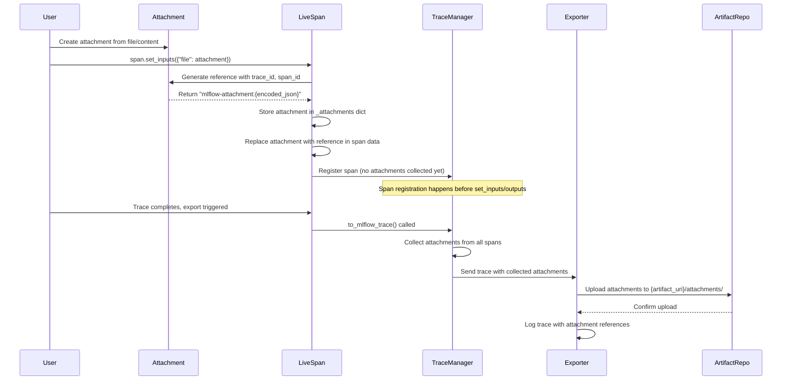

# MLflow Tracing Attachments

Attach files to trace spans and store them efficiently.

## Quick Start

```python
from mlflow.tracing.attachments import Attachment
import mlflow

# Create attachment
attachment = Attachment.from_file("image.png")

# Add to trace
with mlflow.start_span("my_span") as span:
    span.set_inputs({"image": attachment})
```

## How It Works



## Key Features

- **Reference-based**: Files are replaced with lightweight references in span data
- **Centralized storage**: All attachments collected at trace level for efficient export
- **Automatic upload**: Files uploaded to artifact repository during trace export
- **Error resilient**: Traces succeed even if attachment uploads fail

## Storage Location

Attachments are stored at: `{artifact_uri}/attachments/{attachment_id}`
